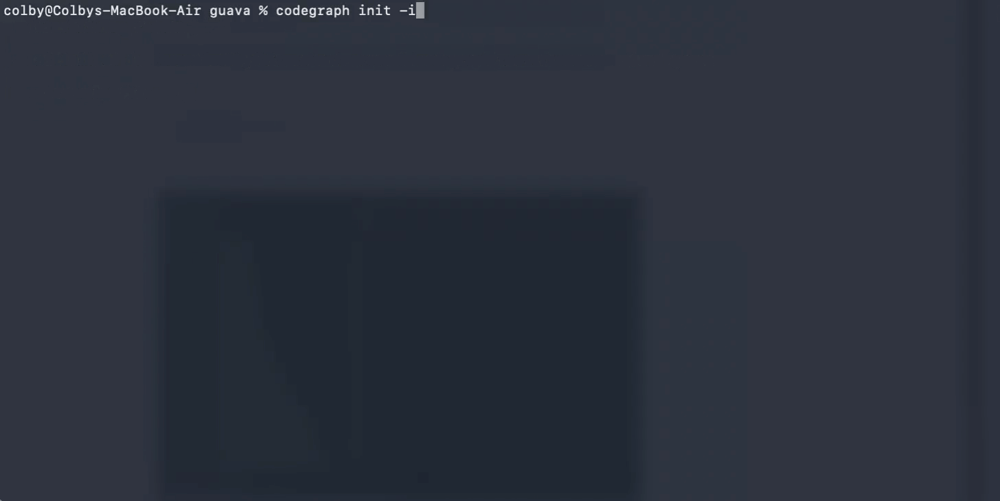

원본: [github.com/colbymchenry/codegraph](https://github.com/colbymchenry/codegraph)

형식: GitHub 리포지토리 README를 바탕으로 핵심 질문과 답변을 인터뷰 스타일로 재구성함.

---

Claude Code가 코드베이스를 탐색할 때, Explore 에이전트를 spawn해서 grep, glob, Read로 파일을 스캔합니다. 매 툴 콜마다 토큰이 소모되죠.

CodeGraph는 그 에이전트에게 **미리 인덱싱된 지식 그래프**를 줍니다. 심볼 관계, 콜 그래프, 코드 구조를 담은 그래프를 즉시 쿼리하는 거죠.

## Q1. CodeGraph가 뭔가요?

코딩 에이전트(Claude Code, Cursor, Codex CLI, OpenCode, Hermes Agent)에 **semantic code intelligence**를 제공하는 도구예요.

한 줄 요약: **~35% cheaper · ~70% fewer tool calls · 100% local**

설치 한 번이면 됩니다:

```bash
npx @colbymchenry/codegraph
```

Node.js 없어도 됩니다. OS에 맞는 빌드를 자동으로 받아요.

## Q2. 왜 필요한가요?

Claude Code가 코드베이스를 탐색할 때의 흐름을 보세요:

**CodeGraph 없으면:**
1. `find` → 디렉토리 구조 파악
2. `grep` → 키워드 검색
3. `Read` → 파일 내용 확인
4. 위 과정을 **Explore 서브에이전트**가 반복
5. 정답을 찾기까지 **수십 번의 툴 콜**

**CodeGraph 있으면:**
1. `codegraph_context` → 관련 영역 매핑
2. `codegraph_explore` → 관련 소스 한 번에 가져오기
3. **파일 읽기 제로**로 답변 완료

인덱스가 있으니 에이전트가 탐색하는 대신 **직접 질문해서 답을 얻는** 구조예요.

## Q3. 벤치마크 수치가 어떻게 되나요?

7개 실제 오픈소스 코드베이스, 7개 언어로 Claude Opus 4.7 (headless) 기준 테스트 결과입니다. 각 조건당 4회 실행의 중앙값:

| 코드베이스 | 언어 | 비용 | 토큰 | 시간 | 툴 콜 |
|---|---|---|---|---|---|
| **VS Code** | TS · ~10k 파일 | 35% ↓ | 73% ↓ | 41% ↓ | 72% ↓ |
| **Excalidraw** | TS · ~600 | 47% ↓ | 73% ↓ | 60% ↓ | 86% ↓ |
| **Django** | Python · ~2.7k | 34% ↓ | 64% ↓ | 59% ↓ | 81% ↓ |
| **Tokio** | Rust · ~700 | 52% ↓ | 81% ↓ | 63% ↓ | 89% ↓ |
| **OkHttp** | Java · ~640 | 17% ↓ | 41% ↓ | 36% ↓ | 64% ↓ |
| **Gin** | Go · ~150 | 22% ↓ | 23% ↓ | 34% ↓ | 19% ↓ |
| **Alamofire** | Swift · ~100 | 38% ↓ | 59% ↓ | 51% ↓ | 77% ↓ |

**평균: 35% cheaper · 59% fewer tokens · 49% faster · 70% fewer tool calls**

코드베이스가 클수록 차이가 벌어져요. VS Code(10k 파일)에서는 툴 콜이 23개 → 7개로. Tokio에서는 $1.04 → $0.50로 절반 이하.

작은 프로젝트(Gin, ~150파일)에서는 네이티브 검색이 이미 저렴해서 차이가 좁아집니다.

## Q4. 어떻게 작동하나요?



1. `codegraph init` — 프로젝트를 인덱싱해서 `.codegraph/`에 SQLite 데이터베이스 생성
2. MCP 서버로 코딩 에이전트에 연결 — 에이전트가 `codegraph_context`, `codegraph_explore` 등의 툴을 사용
3. 파일 와처가 OS 네이티브 이벤트(FSEvents/inotify/ReadDirectoryChangesW)로 변경을 감지해서 자동 동기화

핵심은 **인덱스가 있으면 에이전트가 직접 답한다**는 거예요. 탐색 에이전트를 spawn하지 않고, 그래프를 쿼리해서 바로 답을 내요.

## Q5. 어떤 언어와 프레임워크를 지원하나요?

**19개 언어:** TypeScript, JavaScript, Python, Go, Rust, Java, C#, PHP, Ruby, C, C++, Swift, Kotlin, Dart, Lua, Luau, Svelte, Liquid, Pascal/Delphi

**14개 웹 프레임워크 라우팅 인식:** Django, Flask, FastAPI, Express, NestJS, Laravel, Drupal, Rails, Spring, Gin, Axum, ASP.NET, Vapor, React Router/SvelteKit

라우팅 파일을 감지해서 URL 패턴과 핸들러를 연결하는 `route` 노드를 만들어요. 특정 뷰/컨트롤러의 caller를 조회하면 해당 URL 패턴까지 나옵니다.

## Q6. 로컬에서만 돌아가나요?

네, **100% 로컬**이에요. 데이터가 머신 밖으로 나가지 않습니다. API 키도 외부 서비스도 필요 없어요. SQLite 데이터베이스만 사용합니다.

## 정리

CodeGraph의 핵심 인사이트는 단순합니다: **에이전트가 탐색에 쓰는 토큰을 인덱스로 대체하면, 그 토큰을 실제 추론에 쓸 수 있다.**

VS Code 같은 큰 코드베이스에서 토큰 73% 절감은 곧 **더 많은 컨텍스트 윈도우를 실제 사고에 쓸 수 있다**는 뜻이에요. 툴 콜 86% 감소는 에이전트가 덜 헤매고 더 빨리 정답에 도달한다는 의미고요.

그리고 인덱스가 100% 로컬이니까, 프라이빗 리포에서도 아무 제약 없이 쓸 수 있습니다.

## 한 줄 결론

코딩 에이전트에게 코드 지식 그래프를 올려주니, 토큰은 절반 이하로 줄고 속도는 두 배 가까이 빨라졌다.
