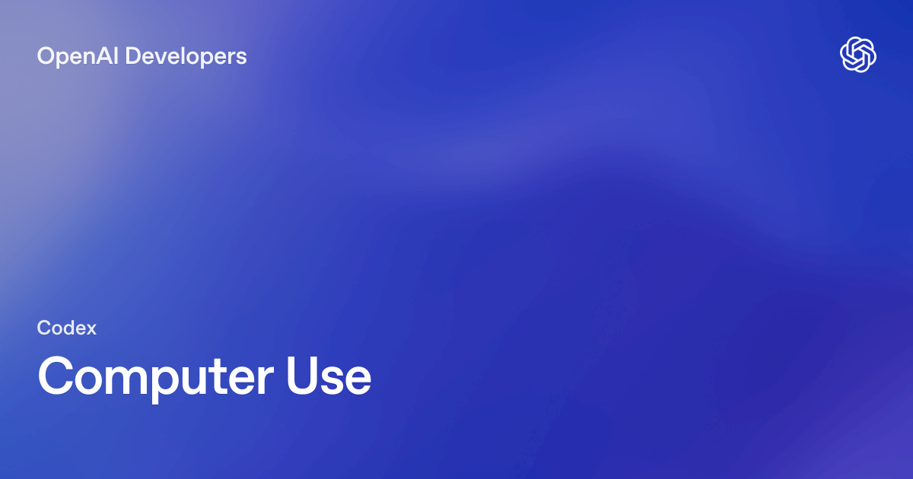
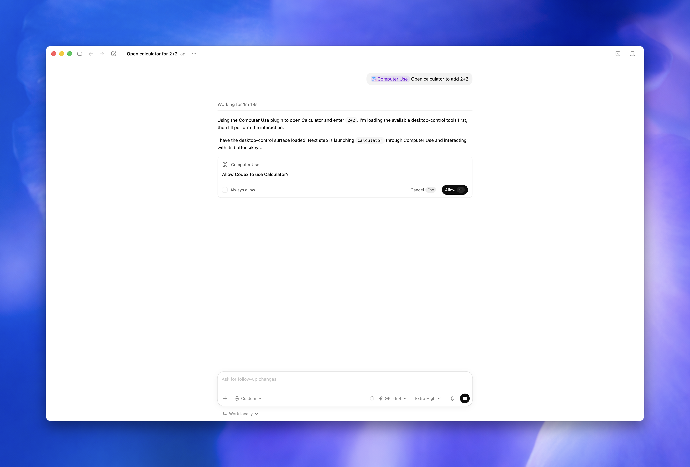

> 원문: [Computer Use – Codex app](https://developers.openai.com/codex/app/computer-use)



## 핵심 요약

OpenAI가 Codex 앱에 **Computer Use** 기능을 출시했다. Codex가 macOS 데스크톱 앱의 화면을 **보고, 클릭하고, 타이핑**할 수 있게 되었다. 명령줄이나 구조화된 API로 접근할 수 없는 GUI 작업을 AI 에이전트가 직접 수행하는 기능이다.

- **대상:** macOS 전용 (EEA, 영국, 스위스는 런치 미지원)
- **필요 권한:** 화면 녹화(Screen Recording) + 접근성(Accessibility)
- **설정:** Codex 설정에서 Computer Use 플러그인 설치 → macOS 권한 부여

## 설정 방법

### 1. 플러그인 설치

Codex 설정(Settings) → Computer Use 섹션 → **Install** 클릭

### 2. macOS 권한 부여

설치 시 macOS가 두 가지 권한을 요청한다:

| 권한 | 용도 |
|------|------|
| **Screen Recording** | Codex가 타겟 앱의 화면을 볼 수 있음 |
| **Accessibility** | Codex가 클릭, 타이핑, 네비게이션을 수행할 수 있음 |

> ⚠️ 권한을 거부한 경우: 시스템 설정 > 개인정보 보호 및 보안 > 화면 녹화 / 접근성에서 Codex 앱을 수동으로 추가

### 3. 앱 승인

Codex가 컴퓨터 조작 시 **사용할 앱마다 권한을 요청**한다:

- **매번 물어보기** (기본): 작업 시마다 승인 필요
- **항상 허용**: 해당 앱에 대해 자동 승인 (설정에서 관리)
- 설정 > Computer Use에서 "Always allow" 목록을 관리할 수 있다


*Codex가 데스크톱 앱을 조작하기 전 사용자에게 권한을 요청하는 다이얼로그*

## 언제 사용하면 좋을까

Computer Use는 **명령줄이나 구조화된 통합으로 해결할 수 없는 GUI 작업**에 적합하다.

### ✅ 추천 사용 사례

| 상황 | 예시 |
|------|------|
| **데스크톱 앱 테스트** | "내가 만든 macOS 앱의 온보딩 버그를 재현해봐" |
| **웹 브라우저 작업** | "@Chrome을 열고 체크아웃 페이지가 정상인지 확인해줘" |
| **GUI 버그 재현** | "이 버그는 그래픽 인터페이스에서만 발생해" |
| **앱 설정 변경** | 클릭으로만 접근 가능한 설정 UI |
| **플러그인 없는 데이터 소스** | API/MCP 서버가 없는 앱의 데이터 확인 |
| **다중 앱 워크플로우** | 앱 A에서 데이터 복사 → 앱 B에 붙여넣기 |
| **백그라운드 작업** | 작업 중인 동안 Codex가 별도 앱에서 작업 수행 |

### ❌ 적합하지 않은 경우

- **웹 개발 중인 로컬 앱**: [Codex 내장 브라우저](https://developers.openai.com/codex/app/browser)를 먼저 사용
- **구조화된 통합이 가능한 앱**: 전용 플러그인이나 MCP 서버를 우선 사용
- **터미널 앱이나 Codex 자체**: 보안 정책 우회 방지

## 사용 방법

프롬프트에서 `@Computer Use` 또는 `@AppName`을 언급하거나, computer use 사용을 명시한다.

**프롬프트 예시:**

```
Open the app with computer use, reproduce the onboarding bug, 
and fix the smallest code path that causes it. 
After each change, run the same UI flow again.
```

```
Open @Chrome and verify the checkout page still works 
after the latest changes.
```

**핵심 팁:**
- 정확한 앱 이름, 창, 또는 흐름을 명시할수록 정확하다
- 한 번에 하나의 명확한 타겟 앱/흐름을 지정하라
- MCP 서버나 플러그인이 있는 앱이라면 그것을 먼저 사용하라

## 보안 가이드라인

Computer Use는 **프로젝트 워크스페이스 밖의 앱/시스템 상태**에 영향을 줄 수 있으므로 주의가 필요하다.

### 해야 할 것

- ✅ **작업을 좁게 설정**: 한 번에 하나의 명확한 타겟 앱 지정
- ✅ **권한 프롬프트 검토**: 앱 승인 전 반드시 내용 확인
- ✅ **Always allow는 신뢰하는 앱에만**: 민감한 앱은 매번 승인
- ✅ **직접 모니터링**: 민감한 흐름 실행 시 반드시 옆에 있기
- ✅ **잘못된 창 조작 시 즉시 취소**

### 하지 말아야 할 것

- ❌ **민감한 앱 열어두기**: 작업에 불필요한 금융/보안 앱은 닫기
- ❌ **비밀번호/보안 설정 자동화**: 반드시 사용자가 직접 승인
- ❌ **Codex 작업 중 동시 브라우저 사용**: 동일 브라우저의 로그인 세션이 공유됨
- ❌ **무제한 권한 부여**: 항상 허용은 최소한의 앱에만

### 제한 사항

- **터미널 앱 및 Codex 자체는 자동화 불가** (보안 정책 우회 방지)
- **관리자 인증 불가**: 시스템 보안/개인정보 권한 프롬프트는 자동 승인 안 됨
- **파일 편집/셸 명령은 기존 Codex 샌드박스 규칙 적용**
- 데스크톱 앱의 변경사항은 디스크에 저장되고 프로젝트에서 추적되어야 리뷰 패널에 반영

## Claude Computer Use와의 비교

| 항목 | OpenAI Codex Computer Use | Anthropic Claude Computer Use |
|------|--------------------------|-------------------------------|
| **플랫폼** | macOS 전용 (Codex 앱) | API 기반 (다양한 클라이언트) |
| **지역 제한** | EEA, 영국, 스위즈 제외 | 제한 없음 |
| **설정 방식** | 앱 내 플러그인 설치 | API 호출 + 컴퓨터 사용 툴 |
| **권한** | macOS Screen Recording + Accessibility | API 키 + 클라이언트 설정 |
| **앱 승인** | Codex 내 "Always allow" 목록 | 클라이언트별 설정 |
| **보안 모델** | 샌드박스 + 앱별 승인 | 커스텀 보안 정책 |
| **접근성** | 개발자 도구 내장 | API 직접 호출 |
| **가격** | Codex 구독 포함 | API 사용량 기반 ($5/$25 MTok) |

### 핵심 차이

OpenAI의 접근은 **개발자 워크플로우에 통합**된 형태다. Claude는 **API로 직접 제어**하는 형태로 더 범용적이지만 설정이 복잡하다. Codex는 설치 → 권한 → 사용의 단순한 흐름으로 개발자 친화적이다.

## 실무 시사점

### 초등 AI 교육 관점

Computer Use는 학생들에게 **"AI가 어떻게 컴퓨터를 조작하는지"**를 시각적으로 보여주는 훌륭한 교육 도구가 될 수 있다:

- 코드 작성 → 실행 → 화면 확인 → 수정의 전체 루프를 시각적으로 체험
- "AI가 내 컴퓨터를 조작할 수 있다면, 어떻게 안전하게 사용해야 할까?" 디지털 리터러시 교육
- GUI 버그 재현, 앱 테스트 자동화 등 실무적 활용 체험

### 업무 자동화 관점

- **UI 기반 레거시 앱 자동화**: API가 없는 오래된 업무 소프트웨어 조작
- **크로스 앱 워크플로우**: 여러 앱 간 데이터 이동/변환 자동화
- **QA 자동화**: 데스크톱 앱의 UI 테스트 자동화

### 한계와 주의점

- 아직 **macOS 전용**으로 Windows/Linux 지원 필요
- **지역 제한** (유럽 등)이 존재
- 민감한 작업에서는 **반드시 사람이 모니터링**해야 함
- 브라우저 사용 시 **로그인 세션 공유**에 주의

## FAQ

### Computer Use는 Windows에서도 사용할 수 있나요?
현재 macOS 전용입니다. Windows/Linux 지원은 추후 예정입니다.

### 이미 MCP 서버나 플러그인이 있는 앱도 Computer Use를 사용해야 하나요?
아닙니다. 구조화된 통합(플러그인/MCP)이 가능하면 그것을 먼저 사용하세요. Computer Use는 시각적 검증이나 구조화된 접근이 불가능한 경우에 사용합니다.

### Codex가 내 브라우저에서 로그인한 세션에 접근할 수 있나요?
네, Codex가 브라우저를 사용하면 기존 로그인 상태가 유지됩니다. 웹사이트의 승인된 클릭과 폼 제출은 사용자 본인의 행동으로 처리됩니다. 보안을 위해 다른 브라우저를 사용하는 것을 권장합니다.

### 비용은 어떻게 되나요?
Computer Use는 Codex 앱 구독에 포함되어 있습니다. 별도의 API 비용은 발생하지 않습니다.
