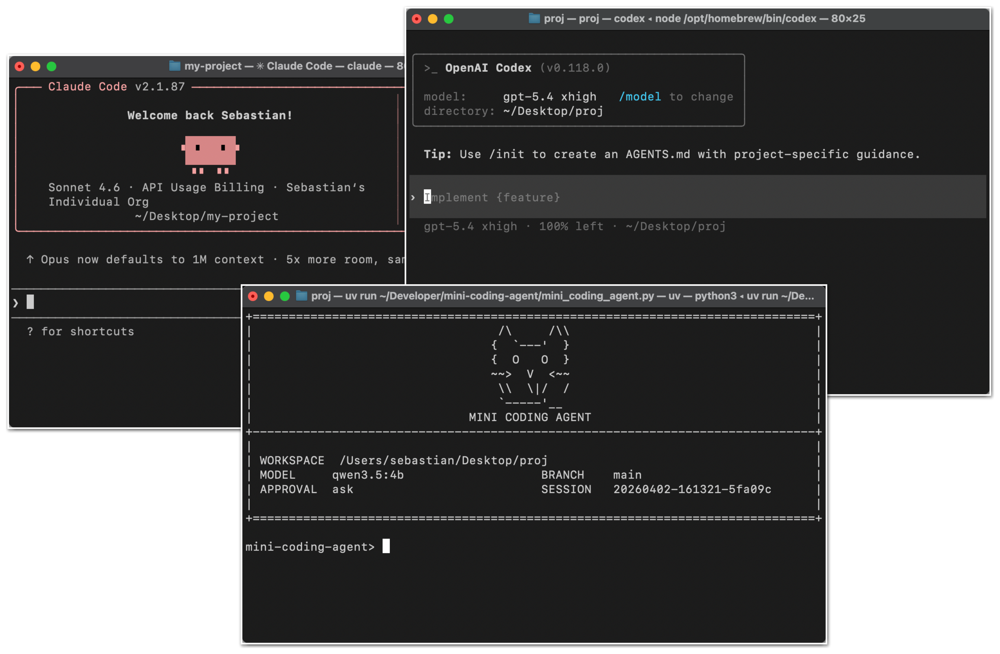
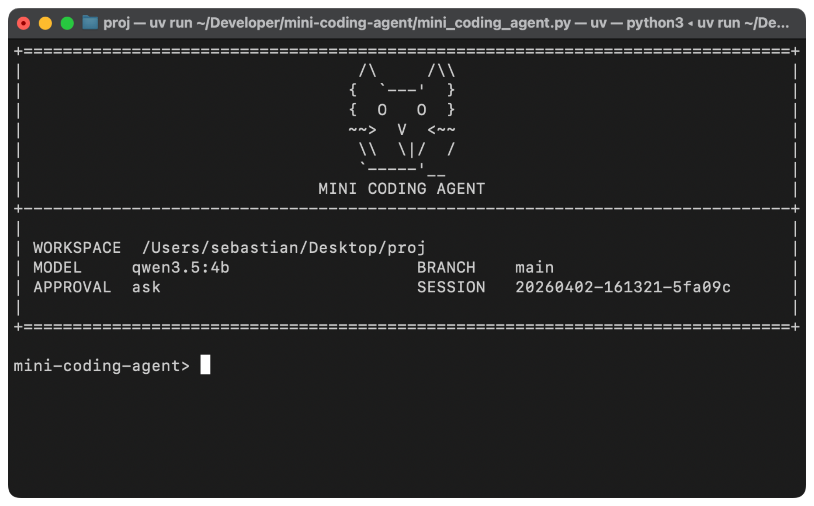
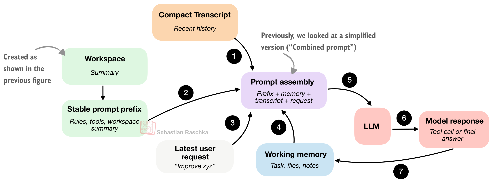
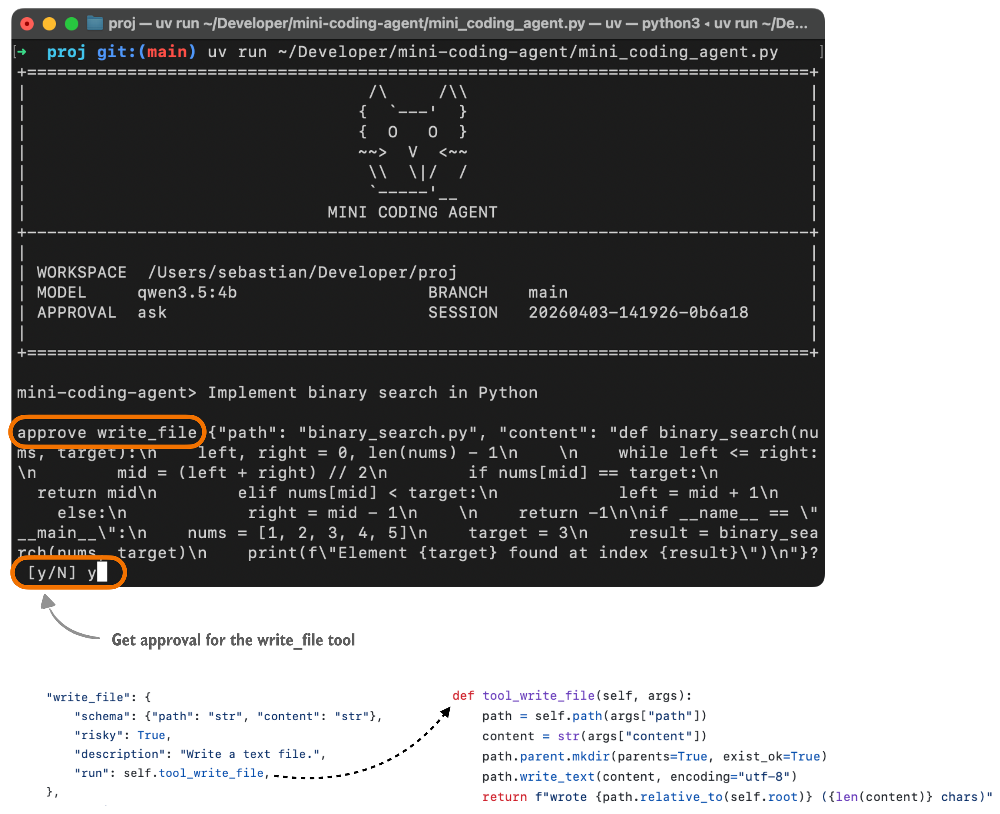
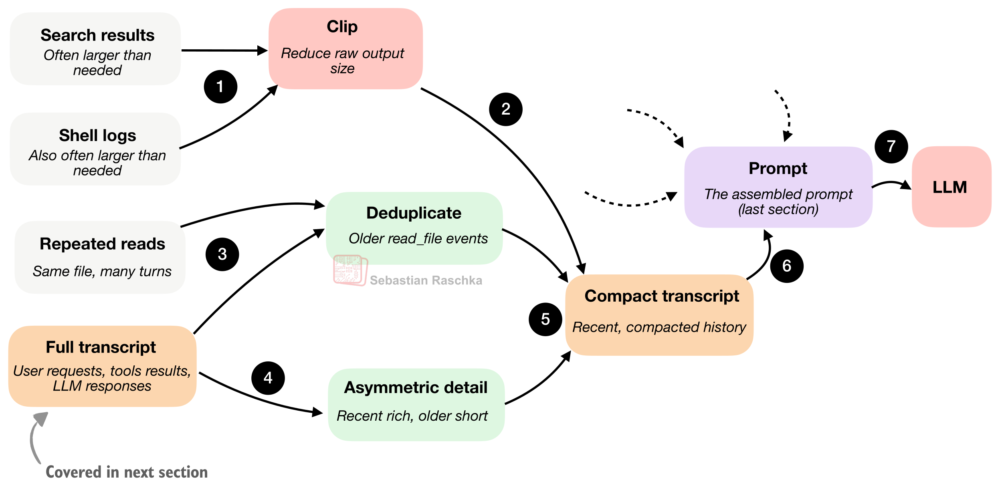
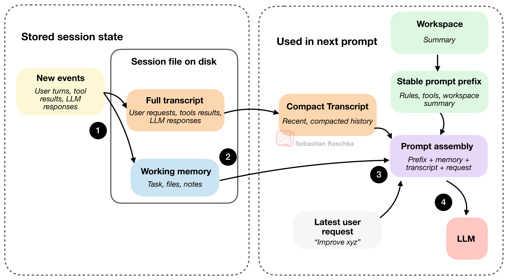
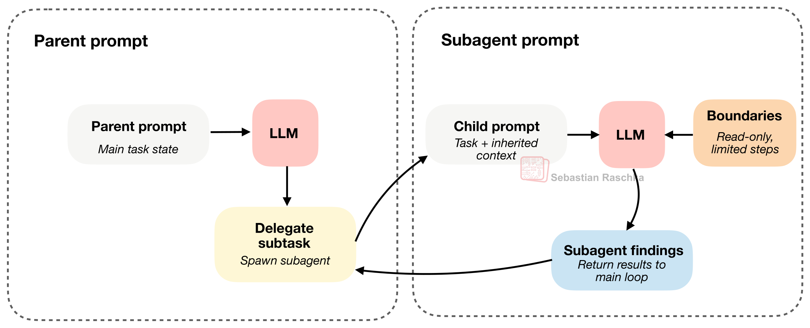
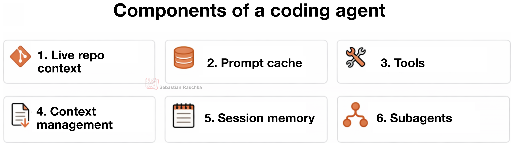

이 글은 Sebastian Raschka의 원문 **Components of A Coding Agent**를 바탕으로, 코딩 에이전트와 하네스의 핵심 구조를 이해하기 쉽게 정리한 글입니다. 특히 옵시디언에 저장한 원문 노트를 기준으로 그림과 핵심 문장을 다시 맞췄습니다.

원문 링크:
- https://magazine.sebastianraschka.com/p/components-of-a-coding-agent

# Components of A Coding Agent - by Sebastian Raschka, PhD

[Source](https://magazine.sebastianraschka.com/p/components-of-a-coding-agent "Components of A Coding Agent - by Sebastian Raschka, PhD")

In this article, I want to cover the overall design of coding agents and agent harnesses: what they are, how they work, and how the different pieces fit together in practice. Readers of my _Build a Large Language Model (From Scratch)_ and _Build a Large Reasoning Model (From Scratch)_ books often ask about agents, so I thought it would be useful to write a reference I can point to.

More generally, agents have become an important topic because much of the recent progress in practical LLM systems is not just about better models, but about how we use them. In many real-world applications, the surrounding system, such as tool use, context management, and memory, plays as much of a role as the model itself. This also helps explain why systems like Claude Code or Codex can feel significantly more capable than the same models used in a plain chat interface.

In this article, I lay out six of the main building blocks of a coding agent.

You are probably familiar with Claude Code or the Codex CLI, but just to set the stage, they are essentially agentic coding tools that wrap an LLM in an application layer, a so-called agentic harness, to be more convenient and better-performing for coding tasks.


_Figure 1: Claude Code CLI, Codex CLI, and my Mini Coding Agent._

Coding agents are engineered for software work where the notable parts are not only the model choice but the surrounding system, including repo context, tool design, prompt-cache stability, memory, and long-session continuity.

That distinction matters because when we talk about the coding capabilities of LLMs, people often collapse the model, the reasoning behavior, and the agent product into one thing. But before getting into the coding agent specifics, let me briefly provide a bit more context on the difference between the broader concepts, the LLMs, reasoning models, and agents.

An LLM is the core next-token model. A reasoning model is still an LLM, but usually one that was trained and/or prompted to spend more inference-time compute on intermediate reasoning, verification, or search over candidate answers.

An agent is a layer on top, which can be understood as a control loop around the model. Typically, given a goal, the agent layer (or harness) decides what to inspect next, which tools to call, how to update its state, and when to stop, etc.

Roughly, we can think about the relationship as this: the LLM is the engine, a reasoning model is a beefed-up engine (more powerful, but more expensive to use), and an agent harness helps us the model. The analogy is not perfect, because we can also use conventional and reasoning LLMs as standalone models (in a chat UI or Python session), but I hope it conveys the main point.


_Figure 2: The relationship between conventional LLM, reasoning LLM (or reasoning model), and an LLM wrapped in an agent harness._

In other words, the agent is the system that repeatedly calls the model inside an environment.

So, in short, we can summarize it like this:

- _LLM:_ the raw model
- _Reasoning model_: an LLM optimized to output intermediate reasoning traces and to verify itself more
- _Agent:_ a loop that uses a model plus tools, memory, and environment feedback
- _Agent harness:_ the software scaffold around an agent that manages context, tool use, prompts, state, and control flow
- _Coding harness:_ a special case of an agent harness; i.e., a task-specific harness for software engineering that manages code context, tools, execution, and iterative feedback

As listed above, in the context of agents and coding tools, we also have the two popular terms _agent harness_ and (agentic) _coding harness_. A coding harness is the software scaffold around a model that helps it write and edit code effectively. And an agent harness is a bit broader and not specific to coding (e.g., think of OpenClaw). Codex and Claude Code can be considered coding harnesses.

Anyways, A better LLM provides a better foundation for a reasoning model (which involves additional training), and a harness gets more out of this reasoning model.

Sure, LLMs and reasoning models are also capable of solving coding tasks by themselves (without a harness), but coding work is only partly about next-token generation. A lot of it is about repo navigation, search, function lookup, diff application, test execution, error inspection, and keeping all the relevant information in context.


_Figure 3. A coding harness combines three layers: the model family, an agent loop, and runtime supports._

The takeaway here is that a good coding harness can make a reasoning and a non-reasoning model feel much stronger than it does in a plain chat box, because it helps with context management and more.

Since, in my view, the vanilla versions of LLMs nowadays have very similar capabilities (e.g., the vanilla versions of GPT-5.4, Opus 4.6, and GLM-5 or so), the harness can often be the distinguishing factor that makes one LLM work better than another.


_Figure 4: Main harness features of a coding agent / coding harness._


_Figure 5: Minimal but fully working, from-scratch Mini Coding Agent (implemented in pure Python)_

Below are six main components of coding agents:

```
##############################
#### Six Agent Components ####
##############################
# 1) Live Repo Context -> WorkspaceContext
# 2) Prompt Shape And Cache Reuse -> build_prefix, memory_text, prompt
# 3) Structured Tools, Validation, And Permissions -> build_tools, run_tool, validate_tool, approve, parse, path, tool_*
# 4) Context Reduction And Output Management -> clip, history_text
# 5) Transcripts, Memory, And Resumption -> SessionStore, record, note_tool, ask, reset
# 6) Delegation And Bounded Subagents -> tool_delegate
```

## 1) Live Repo Context

This is maybe the most obvious component, but it is also one of the most important ones.

When a user says "fix the tests" or "implement xyz," the model should know whether it is inside a Git repo, what branch it is on, which project documents might contain instructions, and so on.


_Figure 6: The agent harness first builds a small workspace summary that gets combined with the user request for additional project context._

The takeaway is that the coding agent collects info ("stable facts" as a workspace summary) upfront before doing any work, so that it's is not starting from zero, without context, on every prompt.

## 2) Prompt Shape And Cache Reuse

Once the agent has a repo view, the next question is how to feed that information to the model. In practice, it would be relatively wasteful to combine and re-process the workspace summary on every user query.

Coding sessions are repetitive, and the agent rules usually stay the same. The tool descriptions usually stay the same, too. The main changes are usually the latest user request, the recent transcript, and maybe the short-term memory.


_Figure 7: The agent harness builds a stable prompt prefix, adds the changing session state, and then feeds that combined prompt to the model._

The "Stable prompt prefix" usually contains the general instructions, tool descriptions, and the workspace summary. A smart runtime tries to reuse that part and only update the changing components each turn.

## 3) Structured Tools, Validation, And Permissions

Tool access and tool use are where it starts to feel less like chat and more like an agent.

Instead of letting the model improvise arbitrary syntax, the harness usually provides a pre-defined list of allowed and named tools with clear inputs and clear boundaries.


_Figure 8: The model emits a structured action, the harness validates it, optionally asks for approval, executes it, and feeds the bounded result back into the loop._


_Figure 9: Illustration of a tool call approval request in the Mini Coding Agent._

When the model asks to do something, the runtime can stop and run programmatic checks:
- "Is this a known tool?"
- "Are the arguments valid?"
- "Does this need user approval?"
- "Is the requested path even inside the workspace?"

Only after those checks pass does anything actually run.

## 4) Context Reduction And Output Management

Context bloat is not a unique problem of coding agents but an issue for LLMs in general. Coding agents are even more susceptible because of repeated file reads, lengthy tool outputs, logs, etc.


_Figure 10: Large outputs are clipped, older reads are deduplicated, and the transcript is compressed before it goes back into the prompt._

A minimal harness uses at least two compaction strategies:
1. **Clipping**: shortens long document snippets, large tool outputs, memory notes, and transcript entries
2. **Transcript reduction**: turns the full session history into a smaller promptable summary

A key trick: keep recent events richer, compress older events more aggressively, and deduplicate older file reads.

> A lot of apparent "model quality" is really context quality.

## 5) Transcripts, Memory, And Resumption

A coding agent separates state into (at least) two layers:
- **Working memory**: the small, distilled state the agent keeps explicitly
- **Full transcript**: all the user requests, tool outputs, and LLM responses


_Figure 11: New events get appended to a full transcript and summarized in a working memory._

The compact transcript is for **prompt reconstruction** — giving the model a compressed view of recent history. The working memory is for **task continuity** — keeping a small summary of what matters across turns.

## 6) Delegation And Bounded Subagents

Delegation allows parallelizing certain work into subtasks via subagents. The main agent may need a side answer — which file defines a symbol, what a config says, or why a test is failing.


_Figure 12: The subagent inherits enough context to be useful, but it runs inside tighter boundaries than the main agent._

The trick: the subagent inherits enough context to be useful, but also has it constrained (for example, read-only and restricted in recursion depth).

## Summary


_Figure 13: Six main features of a coding harness._

If you are interested in seeing these implemented in clean, minimalist Python code: [Mini Coding Agent](https://github.com/rasbt/mini-coding-agent).

## OpenClaw Comparison

OpenClaw is more like a local, general agent platform that can also code, rather than being a specialized coding assistant. Overlaps include:
- Prompt and instruction files in the workspace (AGENTS.md, SOUL.md, TOOLS.md)
- JSONL session files with transcript compaction
- Helper sessions and subagents

Coding agents are optimized for a person working in a repository. OpenClaw is more optimized for running many long-lived local agents across chats, channels, and workspaces.