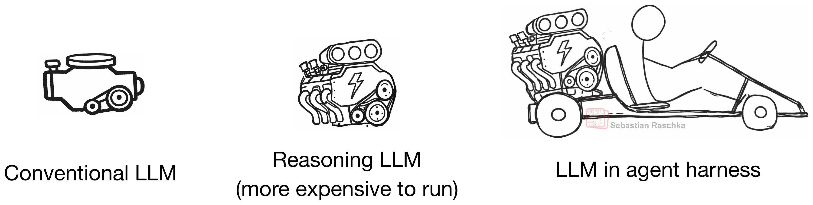
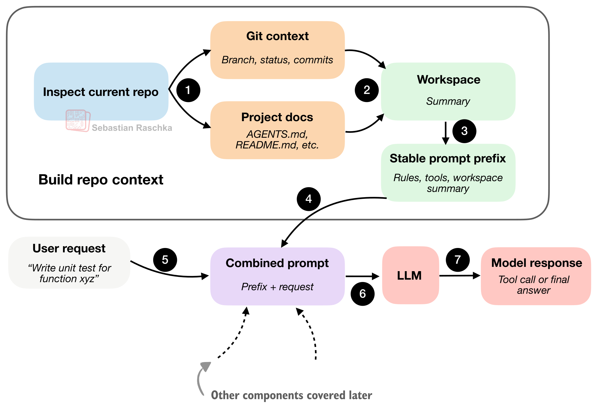
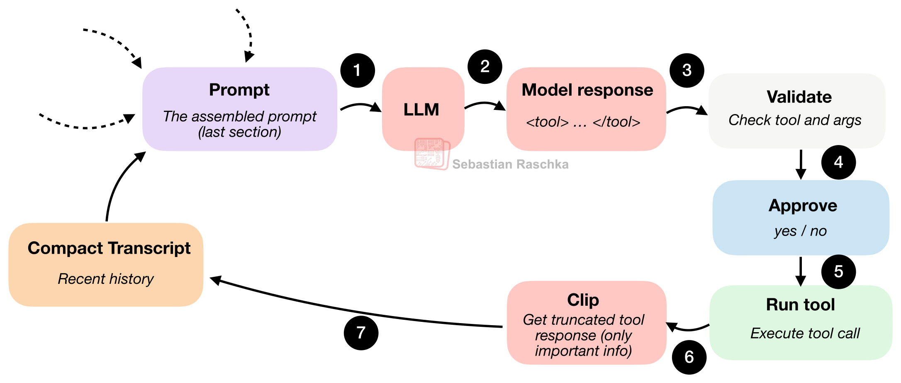
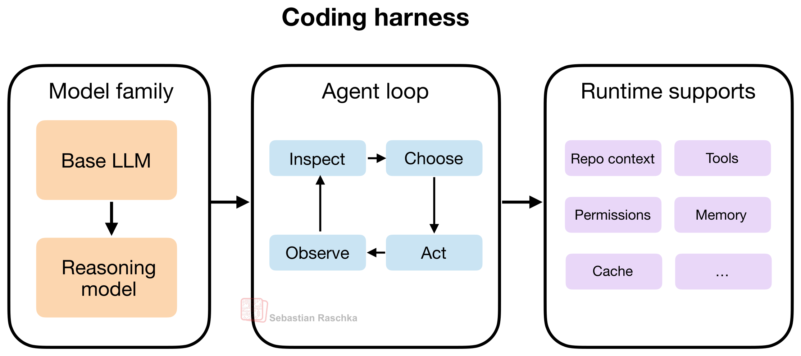

최근 읽은 글 중에서, 코딩 에이전트를 가장 명확하게 설명한 글 하나를 꼽으라면 저는 Sebastian Raschka의 **_Components of A Coding Agent_**를 고를 것 같습니다.

원문 링크:
- https://magazine.sebastianraschka.com/p/components-of-a-coding-agent

이 글이 좋은 이유는 단순히 “에이전트가 중요하다”는 이야기를 반복하지 않고, **코딩 에이전트가 실제로 어떤 부품들로 이루어져 있는지**를 꽤 구체적으로 설명하기 때문입니다. 특히 Claude Code, Codex, OpenClaw 같은 도구를 이미 써본 분들이라면, 왜 어떤 도구는 유난히 더 똑똑하게 느껴지는지 감이 잡히게 됩니다.

한 줄 요약부터 해보면 이렇습니다.

> **코딩 에이전트의 성능은 모델 자체보다, 그 모델을 감싸는 하네스(harness) 설계에 더 크게 좌우될 수 있습니다.**

## 왜 이 글이 중요한가

요즘 많은 사람이 Claude Code, Codex, Cursor, Continue 같은 도구를 쓰면서 “이 모델은 코딩을 잘한다”, “저 모델은 별로다”라고 말합니다. 그런데 Raschka의 글은 한발 물러서서 이런 질문을 던집니다.

- 정말 모델 차이일까?
- 아니면 **하네스 차이**일까?
- 우리가 “모델 성능”이라고 느끼는 것 중 상당수가 사실 **컨텍스트 관리, 도구 사용, 메모리 구조**의 차이는 아닐까?

이 질문은 꽤 중요합니다. 왜냐하면 실제 코딩 작업은 단순한 다음 토큰 예측이 아니라,

- 저장소 구조 파악
- 관련 파일 탐색
- 함수/심볼 검색
- diff 적용
- 테스트 실행
- 오류 로그 해석
- 긴 세션 동안 맥락 유지

같은 작업들의 조합이기 때문입니다. 즉, **코딩은 모델 하나만 잘한다고 되는 일이 아니라, 주변 시스템 전체가 잘 설계되어야 하는 작업**이라는 거죠.

## LLM, Reasoning Model, Agent, Harness를 구분해야 한다

글에서 가장 먼저 짚는 포인트는 개념 구분입니다.

### 1. LLM
가장 기본이 되는 next-token 모델입니다. 엔진에 가깝습니다.

### 2. Reasoning Model
여전히 LLM이지만, 중간 추론 과정이나 검증을 더 잘 수행하도록 학습되거나 유도된 모델입니다. 더 강한 엔진에 가깝지만, 비용도 더 듭니다.

### 3. Agent
모델 위에 올라가는 제어 루프입니다. 목표가 주어졌을 때,

- 무엇을 먼저 볼지
- 어떤 도구를 쓸지
- 상태를 어떻게 갱신할지
- 언제 멈출지

를 결정하는 층입니다.

### 4. Harness
여기서 핵심입니다. 하네스는 모델과 에이전트를 실제로 쓸 수 있게 만드는 **소프트웨어 스캐폴드**입니다.

원문 표현을 빌리면,

> **A coding harness is the software scaffold around a model that helps it write and edit code effectively.**

즉, 모델을 그냥 채팅창에 넣는 것이 아니라, **도구, 프롬프트, 상태, 권한, 메모리, 세션, 실행 환경**까지 감싸서 코딩 작업을 잘하게 만드는 소프트웨어 층이 하네스입니다.

## 핵심 주장: 하네스가 모델보다 더 중요할 수 있다

이 글에서 가장 인상적인 주장은 바로 이 부분입니다.

저자는 요즘의 바닐라 LLM들은 생각보다 능력이 비슷하며, 실제 체감 성능 차이는 **하네스가 만드는 경우가 많다**고 봅니다. 저도 이 부분에는 꽤 공감합니다.

왜냐하면 사용자가 체감하는 코딩 능력은 보통 이런 요소에서 갈리기 때문입니다.

- 필요한 파일을 얼마나 빨리 찾는가
- 긴 로그를 어떻게 압축하는가
- 도구 사용이 얼마나 안정적인가
- 이전 맥락을 얼마나 자연스럽게 이어가는가
- 실수했을 때 복구 흐름이 잘 설계되어 있는가

즉, **좋은 코딩 에이전트는 좋은 모델 + 좋은 하네스의 조합**입니다. 모델만 좋아도 안 되고, 하네스만 좋아도 한계가 있습니다. 하지만 실제 사용자 경험에서는 하네스가 생각보다 훨씬 큰 비중을 차지합니다.

## 코딩 에이전트의 6가지 핵심 구성요소

Raschka는 코딩 에이전트를 이루는 핵심 컴포넌트를 6가지로 정리합니다.

### 1. Live Repo Context
에이전트는 일을 시작하기 전에, 현재 저장소와 작업 환경을 먼저 이해해야 합니다.

예를 들면 이런 것들입니다.

- 현재 Git 브랜치
- 변경 중인 파일
- 프로젝트 구조
- README, AGENTS.md 같은 지침 파일
- 테스트 실행 방법
- 저장소 루트 위치

이걸 먼저 모아야 “테스트 고쳐줘”, “기능 추가해줘” 같은 요청을 제대로 해석할 수 있습니다. 결국 좋은 에이전트는 **매번 0에서 시작하지 않고, 워크스페이스 요약을 먼저 구축**합니다.

### 2. Prompt Shape and Cache Reuse
코딩 세션에서는 매번 같은 정보가 반복됩니다.

- 일반 지시사항
- 도구 설명
- 워크스페이스 요약
- 시스템 프롬프트

반대로 자주 바뀌는 건 보통 이쪽입니다.

- 최신 사용자 요청
- 최근 대화 기록
- 단기 메모리

그래서 좋은 하네스는 전체 프롬프트를 매 턴마다 새로 조립하지 않고, **안정적인 접두사(stable prefix)**를 캐싱하고 재사용합니다. 이건 비용 절감뿐 아니라, 일관성과 응답 품질에도 영향을 줍니다.

### 3. Structured Tools, Validation, and Permissions
채팅형 모델은 명령을 “추천”할 수 있지만, 에이전트는 실제로 도구를 “실행”합니다. 여기서 하네스가 꼭 필요합니다.

좋은 하네스는 도구를 구조화합니다.

- 허용된 도구 목록
- 명확한 입력 스키마
- 경로 제한
- 사용자 승인 여부
- 실행 전 검증

즉, 모델이 아무 명령이나 내뱉는 것이 아니라, **하네스가 이해할 수 있는 형식으로 행동을 제안하고**, 그 행동을 검증한 뒤 실행합니다.

이 구조 덕분에 안전성도 올라가고, 신뢰성도 올라갑니다.

### 4. Context Reduction and Output Management
이 부분은 생각보다 정말 중요합니다.

코딩 에이전트는 대화형 챗봇보다 컨텍스트가 훨씬 빨리 부풀어 오릅니다.

- 파일 읽기 반복
- 테스트 로그
- 긴 명령 출력
- 이전 도구 결과 누적

이걸 그대로 다 넣으면 컨텍스트가 금방 터집니다. 그래서 좋은 하네스는 아래 전략을 씁니다.

- **클리핑**: 긴 출력 잘라내기
- **중복 제거**: 같은 파일/로그 반복 방지
- **요약**: 오래된 기록 압축
- **최신성 우선**: 최근 정보는 풍부하게, 오래된 정보는 더 공격적으로 압축

원문의 표현을 빌리면, **겉보기 모델 품질의 상당 부분은 사실 컨텍스트 품질**입니다.

### 5. Transcripts, Memory, and Resumption
좋은 에이전트는 상태를 최소 두 층으로 나눕니다.

#### Full Transcript
- 전체 대화 기록
- 도구 출력
- 사용자 요청
- 모델 응답
- 세션 재개용 영구 로그

#### Working Memory
- 현재 작업의 핵심 요약
- 중요한 파일
- 최근 메모
- 이어서 일하기 위한 소형 상태

이 둘은 비슷해 보이지만 역할이 다릅니다.

- transcript는 **전체 기록**을 보존하는 역할
- working memory는 **현재 일의 연속성**을 유지하는 역할

이 구분이 없으면, 에이전트는 매번 다 기억하려다가 무거워지고, 결국 중요한 정보를 제대로 못 챙깁니다.

### 6. Delegation and Bounded Subagents
복잡한 작업에서는 한 루프가 모든 걸 다 하려 하면 금방 산만해집니다. 그래서 서브에이전트가 필요합니다.

예를 들면 메인 에이전트가 작업 중일 때,

- 특정 심볼이 정의된 파일 찾기
- 설정 파일 조사
- 테스트 실패 원인 파악
- 레퍼런스 검색

같은 사이드 태스크를 별도 서브에이전트에 위임할 수 있습니다.

하지만 여기서 핵심은 “그냥 분리”가 아닙니다. **충분한 컨텍스트는 상속하되, 권한과 범위는 더 좁혀야 한다**는 점입니다.

이 균형이 중요합니다.

- 너무 제한하면 서브에이전트가 쓸모없고
- 너무 풀어주면 중복 작업, 파일 충돌, 재귀 폭증이 생깁니다

## 이 글을 읽고 더 선명해진 점

개인적으로 이 글을 읽고 더 분명해진 건, **코딩 에이전트는 “좋은 모델”의 문제가 아니라 “좋은 운영체제”의 문제에 가깝다**는 점입니다.

즉, 모델은 엔진이고, 하네스는 그 엔진을 실제 도로 위에서 달리게 만드는 차체와 제어장치입니다. 사용자 입장에서는 엔진보다 **차가 어떻게 움직이는지**가 더 크게 체감될 수 있습니다.

그래서 앞으로 코딩 에이전트를 볼 때는 이렇게 봐야 합니다.

- 어떤 모델을 쓰는가?
- 어떤 도구를 연결했는가?
- 프롬프트는 어떻게 안정화했는가?
- 긴 세션 컨텍스트는 어떻게 압축하는가?
- 메모리는 어떻게 저장하는가?
- 서브에이전트는 어떻게 제한하는가?

이 질문들이 곧 성능 질문이 됩니다.

## OpenClaw와 비교해 보면

원문에서도 OpenClaw를 비교 대상으로 잠깐 언급합니다. 이 비교가 꽤 적절합니다.

- **Claude Code / Codex**: 저장소 작업에 특화된 코딩 하네스
- **OpenClaw**: 코딩도 가능하지만, 더 넓은 범용 로컬 에이전트 플랫폼

공통점도 있습니다.

- 워크스페이스 지침 파일 사용
- 세션 기록 저장
- 트랜스크립트 압축
- 서브에이전트/헬퍼 세션 분리

하지만 초점은 다릅니다. 코딩 하네스는 **repo-centric**, OpenClaw는 **workspace/chat/channel-centric**에 더 가깝습니다.

이 차이를 이해하면 도구 선택도 더 쉬워집니다.

## 마무리

Sebastian Raschka의 이 글은 단순한 에이전트 소개 글이 아니라, **코딩 에이전트를 구성하는 실제 설계 원리**를 설명하는 꽤 좋은 참고 자료입니다.

특히 아래 질문에 관심 있는 분들에게 추천할 만합니다.

- 왜 Claude Code나 Codex가 일반 챗보다 더 강력하게 느껴질까?
- 코딩 에이전트는 정확히 어떤 구조로 돌아갈까?
- 좋은 하네스는 무엇을 신경 써야 할까?
- 모델보다 시스템 설계가 더 중요하다는 말은 무슨 뜻일까?

한 문장으로 정리하면 이렇습니다.

> **좋은 코딩 에이전트는 좋은 모델 위에, 좋은 하네스를 올린 결과물이다.**

## FAQ

### Q1. 이 글의 핵심 주장은 무엇인가요?
코딩 에이전트의 성능은 모델 자체보다, 모델을 감싸는 하네스의 설계에 크게 좌우된다는 점입니다.

### Q2. 하네스는 정확히 무엇인가요?
프롬프트, 도구, 권한, 세션, 메모리, 실행 흐름을 관리해서 모델이 실제 코딩 작업을 잘 수행하게 만드는 소프트웨어 층입니다.

### Q3. 왜 컨텍스트 관리가 중요한가요?
코딩 에이전트는 파일 읽기, 로그, 테스트 결과 등으로 컨텍스트가 매우 빠르게 커지기 때문에, 압축·중복 제거·최신성 우선 전략이 필수입니다.

### Q4. 서브에이전트는 왜 중요한가요?
메인 작업과 별개인 사이드 태스크를 분리해서 병렬로 처리할 수 있기 때문입니다. 다만 충분한 컨텍스트와 제한된 권한의 균형이 중요합니다.

### Q5. OpenClaw와 Claude Code는 같은 종류인가요?
비슷한 점은 있지만 초점이 다릅니다. Claude Code는 코딩 하네스에 가깝고, OpenClaw는 코딩도 가능한 범용 로컬 에이전트 플랫폼에 더 가깝습니다.
