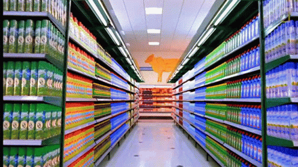
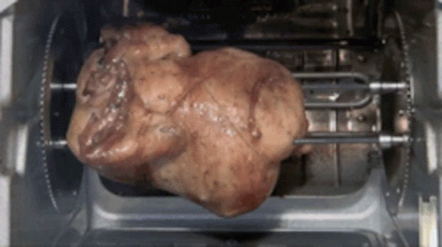
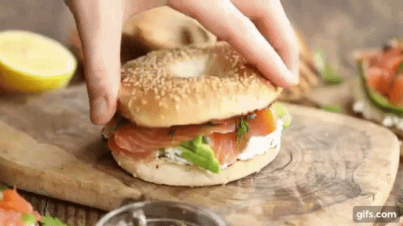

코스트코 회원권 가격은 계속 오름. 근데 막상 들어가면 뭘 사야 할지 모르게 됨.

많이 사면 이득일 것 같음. 근데 냉장고부터 생각해야 함. 특히 **1인 가구**, **맞벌이 가구**는 더 그럼. 집에서 해먹고 싶긴 함. 근데 매일 장보고, 다듬고, 조리하고, 치우는 건 또 다른 일임.

그래서 다들 어느 순간 밀키트에 눈이 감. 손은 덜 가고, 외식비는 줄이고 싶어서임.

근데 여기서 또 문제가 생김.

시판 밀키트는 편하긴 함. 근데 한 번 먹고 끝나는 경우가 많음. 가격도 싸지 않음. 결국 편의점 도시락과 외식 사이 어딘가의 가격대를 계속 내게 됨. 자주 사 먹기엔 애매함.

여기서 방향을 한 번 틀어야 함.

코스트코에서 뭘 사야 하냐는 질문을, **필수템 5개가 뭐냐**로 보면 답이 흐려짐. 근데 **집에서 만드는 밀키트 재료를 뭘 사야 하냐**로 바꾸면 갑자기 답이 보이기 시작함.

즉, 바로 먹는 완성품만 찾으면 안 됨. **한 번 사서 2~3끼로 쪼개 쓰기 좋고, 조리 난이도는 낮고, 실패 확률은 낮은 재료**를 골라야 함.

이 기준으로 보면 코스트코는 꽤 쓸 만함.

아래부터는 그 기준으로 정리한 집밥용 밀키트 레시피 5개임. 거창한 요리 아님. **퇴근하고도 만들 수 있는 수준**, **주말에 한 번 사두면 반복해서 써먹기 좋은 수준**으로 맞췄음.

---

## 레시피 1. 로티세리 치킨 랩

코스트코에서 제일 먼저 담을 만한 건 여전히 로티세리 치킨임. 이유는 단순함. 이미 익어 있음. 손질이 거의 안 듦. 그리고 첫날 한 번 먹고 끝나는 게 아니라 그다음 끼니로 넘기기가 쉬움.

문제는 보통 여기서 생김. 그냥 치킨으로만 먹으면 하루짜리로 끝남. 그러면 코스트코식 대용량 소비의 장점이 절반만 살아남음.

그래서 바로 랩으로 넘기면 됨.

### 재료
- 로티세리 치킨 적당량
- 또띠아 또는 랩 2장
- 샐러드 채소 한 줌
- 마요네즈 1큰술
- 홀그레인 머스터드 1작은술
- 후추 약간
- 치즈 한 장 있으면 더 좋음

### 만드는 법
1. 로티세리 치킨 살을 발라 한 끼 분량만큼 찢어 둠.
2. 마요네즈와 머스터드를 섞고 후추를 조금 넣음.
3. 또띠아 위에 소스를 얇게 바르고 채소, 치킨, 치즈를 올림.
4. 돌돌 말아서 팬에 앞뒤로 1분씩만 굽거나, 그냥 바로 먹어도 됨.

### 이 레시피가 좋은 이유
- 조리 시간이 짧음
- 남은 치킨 처리에 제일 좋음
- 도시락으로 넘기기도 쉬움

### 남은 재료 처리
남은 치킨은 다음날 볶음밥이나 샐러드볼로 넘기면 됨. 여기서부터 밀키트처럼 돌아가기 시작함.

---

## 레시피 2. 훈제연어 베이글 샌드위치

집에서 브런치 느낌 내고 싶을 때 제일 간단한 쪽이 이거임. 훈제연어는 손질이 거의 필요 없고, 베이글만 있으면 분위기가 금방 남.

문제는 훈제연어를 사놓고 막상 어떻게 먹어야 할지 몰라서 냉장고에 넣어두는 경우가 많다는 점임. 그래서 제일 쉬운 조합으로 바로 묶어두는 게 좋음. **베이글 + 크림치즈 + 훈제연어**임.

### 재료
- 훈제연어 4~5장
- 베이글 1개
- 크림치즈 2큰술
- 양파 조금 또는 샐러드 채소 약간
- 후추 약간
- 레몬즙 있으면 몇 방울

### 만드는 법
1. 베이글을 반으로 갈라 토스터나 팬에 살짝 굽음.
2. 크림치즈를 넉넉하게 바름.
3. 훈제연어를 올리고 얇게 썬 양파나 채소를 얹음.
4. 후추 조금, 레몬즙 몇 방울 떨어뜨리면 끝임.

### 이 레시피가 좋은 이유
- 조리라고 할 것도 없을 정도로 간단함
- 아침, 브런치, 가벼운 저녁으로 다 가능함
- 손님 왔을 때도 바로 꺼낼 수 있음

### 남은 재료 처리
훈제연어가 애매하게 남으면 샐러드에 올리면 됨. 베이글이 남으면 다음날 샌드위치 빵처럼 쓰면 됨.

---

## 레시피 3. 냉동 블루베리 요거트 스무디

코스트코 냉동 블루베리는 왜 계속 사게 되냐면 화려하지 않아서임. 근데 매일 쓰기 좋음. 이게 핵심임.

생과일은 사두고 버리기 쉬움. 특히 1인 가구는 더 그럼. 문제는 몸에 좋은 걸 먹고 싶은 마음보다, 상하기 전에 먹어야 한다는 압박이 더 커진다는 점임.

그래서 냉동 블루베리는 스무디로 가는 게 제일 편함.

### 재료
- 냉동 블루베리 한 컵
- 우유 또는 두유 200ml
- 바나나 반 개
- 꿀 1작은술
- 얼음 조금

### 만드는 법
1. 블렌더에 냉동 블루베리, 우유, 바나나, 꿀을 넣음.
2. 농도가 너무 진하면 우유를 조금 더 넣음.
3. 20초에서 30초 정도 갈면 끝임.

### 이 레시피가 좋은 이유
- 아침 한 끼 대용으로 빠름
- 냉동과일이라 버릴 게 적음
- 단맛 조절이 쉬움

### 남은 재료 처리
냉동 블루베리는 그대로 요거트 토핑으로도 넘어감. 팬케이크, 오트밀, 그래놀라에도 붙음. 한 번 사두면 생각보다 빨리 사라짐.

---

## 레시피 4. 치킨 샐러드볼

로티세리 치킨을 사면 사실 여기까지 같이 생각해야 함. 첫날은 치킨으로 먹고, 둘째 날은 랩으로 먹고, 셋째 날은 샐러드볼로 넘기는 식임.

문제는 샐러드가 잘못하면 너무 부실해진다는 점임. 그냥 채소에 치킨만 올리면 밥이 아니라 사이드가 됨. 그래서 **탄수화물이나 지방 한 조각**은 같이 넣어줘야 함. 삶은 달걀, 아보카도, 빵 조각, 옥수수 중 하나만 들어가도 훨씬 나아짐.

### 재료
- 로티세리 치킨 적당량
- 샐러드 채소 두 줌
- 삶은 달걀 1개 또는 아보카도 반 개
- 옥수수 조금 또는 빵 조각 조금
- 발사믹 드레싱 또는 오리엔탈 드레싱
- 후추 약간

### 만드는 법
1. 큰 볼에 채소를 먼저 넣음.
2. 치킨을 찢어 올리고 삶은 달걀이나 아보카도를 같이 올림.
3. 옥수수나 빵 조각을 조금 넣어서 포만감을 보강함.
4. 드레싱은 먹기 직전에 뿌림.

### 이 레시피가 좋은 이유
- 남은 치킨 처리용으로 가장 안정적임
- 다이어트식처럼 보이지만 생각보다 든든함
- 냉장고에 애매하게 남은 재료 털기 좋음

### 남은 재료 처리
샐러드채소가 남으면 다음날 훈제연어 샐러드로 넘기면 됨. 이게 코스트코식 집밥의 핵심임. 하나를 사고 하나의 메뉴만 만드는 게 아니라, 두세 메뉴로 돌려야 함.

---

## 레시피 5. 블루베리 그릭요거트 컵

그릭요거트는 건강식 이미지가 강함. 근데 진짜 장점은 거기에 있지 않음. **아침을 거르기 쉬운 사람에게 제일 만만한 밀키트 재료**라는 점임.

문제는 요거트만 먹으면 금방 배고프다는 거임. 그래서 블루베리, 그래놀라, 견과류 같은 걸 같이 묶어야 함. 그래야 간식이 아니라 한 끼처럼 됨.

### 재료
- 그릭요거트 1컵
- 냉동 블루베리 반 컵
- 그래놀라 2큰술
- 견과류 조금
- 꿀 1작은술

### 만드는 법
1. 그릭요거트를 컵이나 볼에 담음.
2. 냉동 블루베리를 실온에 잠깐 두거나 바로 올림.
3. 그래놀라와 견과류를 올리고 꿀을 조금 뿌림.
4. 그냥 섞어 먹으면 끝임.

### 이 레시피가 좋은 이유
- 칼과 불이 필요 없음
- 아침 식사, 간식, 야식까지 다 가능함
- 냉동 블루베리와 궁합이 좋음

### 남은 재료 처리
그릭요거트는 베이글 스프레드처럼 써도 되고, 스무디에 넣어도 됨. 한 품목이 두세 군데 붙기 시작하면 그때부터 회원권이 덜 아깝게 느껴짐.

---

## 결국 코스트코에서 뭘 사야 하냐고 물으면

답은 필수템 이름을 외우는 데 있지 않음.

**집에서 어떤 형태로 먹을지를 먼저 정해야 함.**

- 퇴근 후 10분 안에 먹을 수 있어야 하는가
- 아침 대용으로도 써야 하는가
- 한 번 사서 두세 끼로 넘길 수 있어야 하는가
- 냉장고에서 썩지 않고 냉동이나 소분이 가능한가

이 네 가지를 먼저 보면 고르는 기준이 확 달라짐.

그래서 이번 글에서 사실상 추천한 코스트코 필수템은 이것들임.

- 로티세리 치킨
- 훈제연어
- 냉동 블루베리
- 그릭요거트
- 베이글 또는 또띠아 같은 연결 재료

이 다섯 개가 좋은 이유는 비슷함. 그냥 한 번 먹고 끝나는 재료가 아니라, **집에서 만드는 밀키트의 베이스가 되기 때문임.**

시판 밀키트는 편함. 근데 비쌈. 코스트코는 싸 보임. 근데 잘못 사면 낭비가 큼. 그래서 그 중간 지점을 찾아야 함.

그게 바로 **코스트코에서 사서 집에서 완성하는 밀키트 방식**임.

이렇게 접근하면 회원권 값이 덜 아깝게 느껴짐. 많이 사서 이득 보는 게 아니라, **반복해서 해먹을 수 있는 구조를 사는 것**에 가까워짐.

---

## 자주 묻는 질문

### Q1. 1인 가구도 코스트코에서 재료 사서 밀키트처럼 돌릴 수 있나
가능함. 다만 대용량을 그대로 두면 실패함. 처음부터 소분, 냉동, 다음 메뉴까지 같이 생각하고 사야 함.

### Q2. 맞벌이 가구는 어떤 품목부터 사는 게 좋나
로티세리 치킨처럼 이미 익은 단백질부터 시작하는 게 가장 쉬움. 여기에 샐러드채소, 또띠아, 베이글 같은 연결 재료를 붙이면 메뉴가 빨리 늘어남.

### Q3. 코스트코에서 아무거나 대용량으로 사면 결국 이득 아닌가
아님. 끝까지 못 먹으면 제일 비싼 쇼핑이 됨. 대용량은 싸서 좋은 게 아니라, 끝까지 돌려 먹을 수 있을 때만 좋은 것임.

### Q4. 시판 밀키트보다 정말 나은가
무조건 싸다고 보긴 어려움. 근데 반복해서 활용할 수 있다는 점에서 차이가 큼. 한 번 먹고 끝나는 제품보다 재료 단위로 사는 쪽이 누적 비용을 낮추기 쉬움.

---

## 참고한 자료

- 코스트코 코리아 회원가입 안내 페이지
- 코스트코 코리아 커클랜드 시그니춰 냉동 블루베리 상품 페이지
- 코스트코 코리아 동원산업 훈제연어 슬라이스 상품 페이지
- 코스트코 코리아 코우카키스 블루베리 그릭요거트 상품 페이지
- 최근 코스트코 장바구니 후기 및 추천 글 다수 (인기 품목 반복 언급 확인용)
