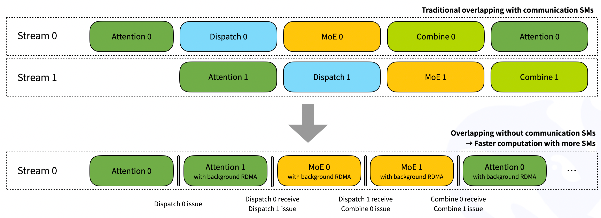

1\. DeepSeek가 **DeepEP**라는 라이브러리를 오픈소스로 풀었음.

2\. 이게 뭐 하는 건지 설명하려면 **CUDA** 이야기부터 해야 함.

3\. CUDA는 NVIDIA GPU에서 돌아가는 코드를 짜는 언어임. C/C++ 비슷한 문법으로 GPU를 직접 다룸.

4\. 왜 굳이 CUDA로 짜냐. GPU는 코어가 수천 개임. 일반 CPU 코드로는 그걸 동시에 못 굴림.

5\. PyTorch 같은 프레임워크도 속을 까보면 결국 CUDA 커널을 부르는 거임. 행렬곱, 어텐션, 정규화 다 CUDA 커널임.

6\. 모델이 작으면 GPU 한 장으로 끝남. 근데 요즘 LLM은 그게 안 됨.

7\. 수백 GB짜리 모델은 GPU 한 장 메모리에 안 들어감. 여러 장에 쪼개서 올려야 함.

8\. 쪼개면 GPU 사이에 데이터를 주고받아야 함. 그게 **GPU 통신**임.

9\. 한 서버 안에서는 **NVLink**, 서버 사이에서는 **InfiniBand RDMA**로 주고받음.

10\. 비유하면 NVLink는 시내 전화, RDMA는 시외 전화임. 둘 다 빠르지만 NVLink가 훨씬 빠름.

11\. 이 통신도 결국 CUDA 커널이 처리함. **좋은 통신 커널 = 빠른 학습/추론**으로 직결됨.

12\. 자, 이제 본론. **MoE(Mixture of Experts)** 이야기임.

13\. MoE는 모델의 일부 전문가(expert)만 활성화하는 구조임. 토큰마다 어떤 전문가로 보낼지 라우팅됨.

14\. 문제는 그 라우팅이 모든 GPU 사이에서 일어난다는 점임. 8개 GPU면 8 to 8 통신, 64개면 64 to 64 통신.

15\. 이게 곧 all-to-all dispatch임. 토큰 보내고 → 전문가가 처리 → 다시 모음(combine).

16\. MoE 모델 크기가 커질수록 이 통신이 진짜 병목임. 연산이 아니라 통신이 발목 잡음.

17\. DeepSeek가 자체 모델 학습하면서 이 부분을 직접 최적화했고, 그걸 그대로 오픈소스로 푼 게 DeepEP임.

18\. DeepEP의 정체를 한 줄로 정리하면 **MoE 전용 GPU 통신 커널 모음**임. CUDA로 직접 짠 dispatch/combine 커널들.

19\. 두 가지 커널로 분리됨. **Normal Kernel**과 **Low-Latency Kernel**.

20\. Normal Kernel은 **학습/프리필** 단계용. 한 번에 큰 배치(4096 토큰)를 다룸. NVLink와 RDMA 대역폭을 동시에 굴림.

21\. 노드 안 통신은 NVLink, 노드 사이 통신은 RDMA. DeepEP는 두 대역폭을 비대칭으로 같이 굴림.

22\. H800 + CX7 400Gb/s 환경에서 노드 안 8EP 기준 **153 GB/s NVLink**, 노드 사이 32EP 기준 **58 GB/s RDMA**가 나옴.

23\. 2025년 4월 텐센트 최적화 패치가 들어가면서 최대 30% 성능 향상이 추가됐음.

24\. Low-Latency Kernel은 **추론 디코딩** 단계용. 작은 배치(128 토큰), 짧은 응답시간이 목표.

25\. 디코딩에선 NVLink 안 씀. **순수 RDMA**만 씀. 이유는 NVLink 셋업 오버헤드가 디코딩 한 토큰 시간보다 큼.

26\. 8EP 기준 **dispatch 77μs, combine 114μs**. 256EP까지 늘려도 dispatch 194μs, combine 360μs로 잡힘.

27\. 진짜 흥미로운 건 **훅 기반 통신-연산 오버래핑**임. SM(GPU 코어)을 점유하지 않고 통신을 백그라운드로 돌림.

28\. 어텐션/Dispatch/MoE/Combine 4단계를 두 개의 마이크로배치로 인터리빙하면서 GPU가 노는 시간을 거의 0으로 만듦.

29\. 그 결과 **CUDA Graph 호환**까지 됨. 추론 서빙에서 가장 중요한 기능 중 하나임.

30\. 또 하나, DeepEP는 **FP8 dispatch**를 지원함. BF16으로 combine해서 정확도는 유지하면서 통신량을 절반으로 줄임.

31\. DeepSeek-V3에서 쓴 **그룹 제한 게이팅 알고리즘**도 그대로 들어가있음. 자기네 모델 학습용 코드를 그대로 푼 거임.

32\. 지원 하드웨어는 Ampere(SM80), Hopper(SM90). H800 기준 테스트. CUDA 11/12, PyTorch 2.1+, Python 3.8+.

33\. 네트워크는 InfiniBand CX7 400Gb/s가 권장이고, RoCE도 이론상 호환.

34\. 의존성에 **NVSHMEM**이 있음. 노드 사이 통신을 위한 NVIDIA의 SHMEM 라이브러리임.

35\. NVSHMEM 설치가 pip 한 줄이 아니라 별도 빌드 가이드를 따라가야 하는 게 진입장벽임.

36\. 라이선스는 **MIT**. NVSHMEM 참조 부분(ibgda_device.cuh, nvshmem.patch)만 NVSHMEM SLA 적용.

37\. 사용 패턴은 단순함. `Buffer` 객체 만들고, `dispatch()` 호출하고, MoE 연산 돌리고, `combine()`으로 모음.

38\. 저레이턴시 모드는 별도 플래그(`low_latency_mode=True`)로 분기됨. 백그라운드 hook이 추가됨.

39\. 여기서 진짜 의미를 읽어야 함.

40\. 첫째, MoE 학습은 이제 **통신 최적화 없이는 불가능**한 영역임.

41\. 단순 PyTorch DDP나 DeepSpeed로는 더 이상 수백 GPU 규모 MoE를 효율적으로 못 굴림. 전용 커널이 필요함.

42\. 둘째, DeepSeek가 모델만 풀던 시점에서 **인프라 라이브러리까지 푸는 단계**로 넘어왔음.

43\. 자기네 모델 학습 비용을 낮추는 동시에, 다른 팀들이 비슷한 MoE 모델을 만들 때 자기네 표준을 쓰게 만드는 효과임.

44\. 셋째, **AMD ROCm 포크**(MORI-EP)가 이미 등장했음. UCCL이라는 이기종 GPU/NIC 지원 포크도 있음.

45\. NVIDIA 락인 우려를 누군가는 풀고 있다는 신호임.

46\. 한국에서 MoE 학습하는 팀이라면 지금 봐야 할 라이브러리 1순위임. 특히 H100/H200 클러스터 가진 곳.

47\. 추론 서빙하는 팀이라면 Low-Latency Kernel만 따로 봐도 가치 있음. 디코딩 레이턴시 줄이는 가장 빠른 길임.

48\. 단점은 명확함. NVSHMEM 의존성, H800 외 검증 부족, 일반 데이터센터 이더넷에선 RoCE 동작 검증 필요.

49\. 하지만 코드 자체가 CUDA 58.9%, Python 20.3%로 짜여있어서 직접 읽고 수정 가능함.

50\. 모델만 푸는 시대는 끝났음. **인프라 커널까지 푸는 시대**임.

---

**원문**: [deepseek-ai/DeepEP — GitHub](https://github.com/deepseek-ai/DeepEP)
