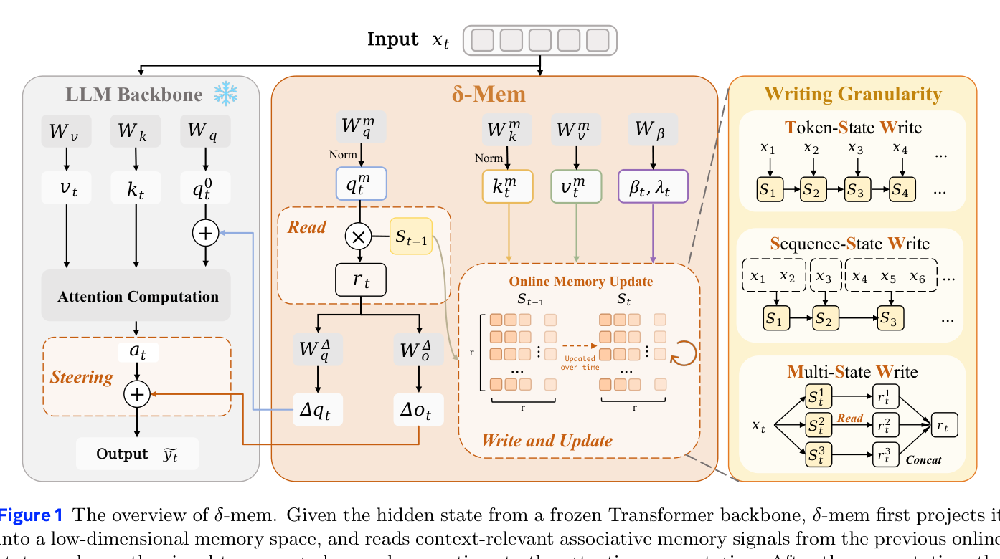
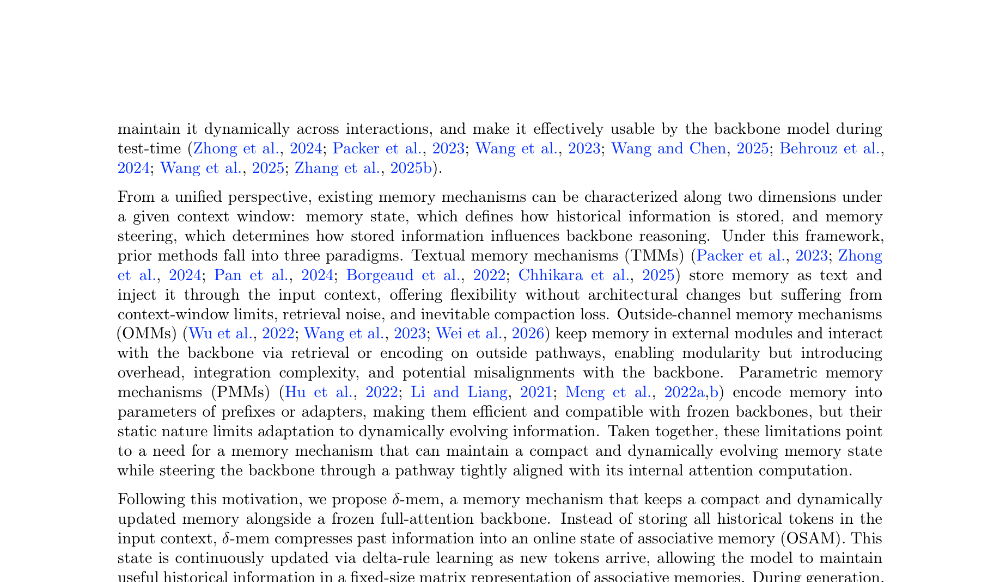
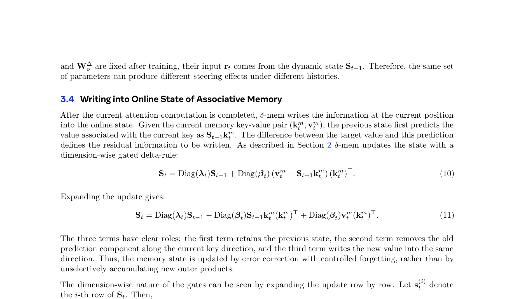
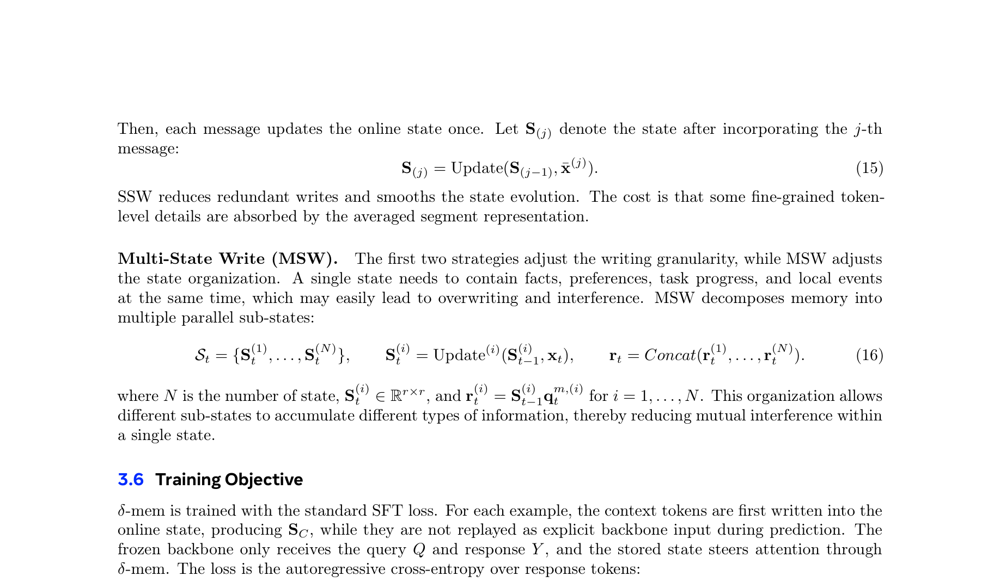

## δ-mem이 뭔가요?

LLM이 장기 대화나 에이전트 시스템에서 과거 정보를 활용하려면, 단순히 컨텍스트 윈도우를 늘리는 것만으로는 부족합니다. 비용은 quadratically 증가하고, 실제로는 긴 컨텍스트에서 모델이 정보를 제대로 활용하지 못하는 "context rot" 현상이 발생합니다.

δ-mem은 **동결된(full-attention) 백본에 compact online state of associative memory(OSAM)**를 추가하는 경량 메커니즘입니다. 핵심은 8×8 크기의 상태 행렬 하나만으로 과거 정보를 압축·저장·활용한다는 거예요.



## 어떻게 동작하나요?

δ-mem의 동작은 세 단계로 나뉩니다.

### 1. Read — 메모리에서 연관 신호 읽기

현재 입력의 hidden state를 저차원 메모리 공간으로 투영합니다. 쿼리 벡터가 이전 상태 행렬 S를 조회해서, 현재 입력과 관련된 과거 정보를 추출합니다.

### 2. Steer — attention에 low-rank correction 적용

추출한 메모리 readout을 백본의 attention 계산에 low-rank correction으로 주입합니다. 백본 파라미터는 건드리지 않으면서, attention의 query와 output에 작은 보정만 추가하는 거죠.

### 3. Write — delta-rule learning으로 상태 업데이트

delta-rule learning으로 상태 행렬을 업데이트합니다. 핵심 아이디어는 **잘 학습된 연관은 업데이트가 거의 0이 되고, 예측이 틀린 부분만 보정**된다는 거예요:

```
S_t = λ_t · S_{t-1} + β_t · (v_t - S_{t-1} · k_t) · k_t^T
```

여기서 λ_t는 보존 게이트, β_t는 쓰기 게이트입니다. 차원마다 독립적으로 조절해서, 일부 차원은 이전 메모리를 유지하고 다른 차원은 새 정보를 적극적으로 씁니다.



## 기존 메모리 방식과 뭐가 다른가요?

| 패러다임 | 예시 | 장점 | 단점 |
|----------|------|------|------|
| **Textual (TMM)** | Mem0, RAG | 유연, 구조 변경 없음 | 컨텍스트 윈도우 제한, 검색 노이즈 |
| **Outside-channel (OMM)** | FAISS, 외부 벡터 DB | 모듈성 | 오버헤드, 백본과 정렬 어려움 |
| **Parametric (PMM)** | LoRA, Prefix | 효율적 | 정적, 동적 정보 적응 불가 |
| **δ-mem** | 본 논문 | 컴팩트, 동적, attention 직접 결합 | 백본별 튜닝 필요 |

δ-mem은 TMM의 유연성, OMM의 모듈성, PMM의 효율성을 결합하면서 각각의 단점을 피합니다. 특히 **attention 계산에 직접 참여**한다는 게 핵심 차이입니다.

## 성능이 얼마나 좋아지나요?



고작 **8×8 상태 행렬**로 이런 결과를 냈습니다:

| 벤치마크 | 동결 백본 대비 | 최강 기존 방식 대비 |
|----------|--------------|-------------------|
| **평균** | 1.10× | 1.15× |
| **MemoryAgentBench** | 1.31× | — |
| **LoCoMo** | 1.20× | — |
| **TTL subtask** | 26.14 → 50.50 (근 2배) | — |

메모리 의존적 벤치마크에서 특히 큰 향상을 보입니다. 반면 일반 능력 벤치마크(IFEval, GPQA-Diamond)는 거의 보존됩니다.



## 8×8이면 너무 작은 거 아닌가요?

놀랍게도 그게 아닙니다. 논문에서는 상태 크기를 변화시키며 실험했는데, 8×8이 이미 대부분의 벤치마크에서 충분한 성능을 보였습니다. 더 큰 상태(16×16, 32×32)는 약간의 추가 이득만 있었습니다.

이유는 **delta-rule learning의 특성** 때문이에요. 잘 학습된 key-value 연관은 상태에 안정적으로 저장되고, 새로운 정보만 차별적으로 업데이트됩니다. 그래서 작은 행렬로도 충분한 정보를 유지할 수 있습니다.

## 실용적으로 어떤 의미가 있나요?

### 에이전트 시스템에 바로 적용 가능

OpenClaw, Claude Code 같은 코딩 에이전트는 대화가 길어질수록 메모리 관리가 병목입니다. δ-mem 같은 접근을 백본 레벨에 적용하면:

- **외부 RAG 파이프라인 없이** 메모리 활용 가능
- **백본을 동결**한 채로 메모리만 훈련 가능
- **컨텍스트 윈도우를 늘리지 않고** 과거 정보 활용

### 한계점

- 백본별로 메모리 projection을 튜닝해야 함
- 대규모 에이전트 벤치마크(1M+ 토큰)에서는 여전히 성능 급락
- 다양한 백본 아키텍처(MoE 등)에서의 검증이 필요

## 핵심 인사이트

> **효과적인 메모리는 명시적 컨텍스트 확장이나 무거운 외부 검색 없이, attention 계산에 직접 결합된 compact online state로 실현될 수 있다.**

8×8 행렬 하나가 billion-parameter 모델의 메모리 성능을 31%나 끌어올렸다는 건, LLM 메모리의 병목이 "정보 저장 용량"이 아니라 **"저장된 정보를 attention에 효과적으로 연결하는 방식"**에 있음을 시사합니다.

---

**논문**: [δ-mem: Efficient Online Memory for Large Language Models](https://arxiv.org/abs/2605.12357)
**저자**: Jingdi Lei, Di Zhang, Junxian Li, Weida Wang, Kaixuan Fan, Xiang Liu, Qihan Liu, Xiaoteng Ma, Baian Chen, Soujanya Poria
**소속**: NTU, Fudan, Mind Lab, SJTU, CUHK, HKUST
