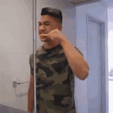
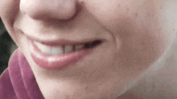

스케일링은 사실 돈 이야기임. 1년에 딱 한 번, 건강보험이 뒷주머니에서 4만 원 정도를 꺼내주는 구조인데 대부분 이걸 모르고 지나감.

1. 먼저 숫자부터. **만 19세 이상**이면 건강보험 가입자든 피부양자든 치석제거 급여 대상이 됨. 나이 기준이 생각보다 낮음.

2. 급여 주기는 **매년 1월 1일부터 12월 31일까지, 연 1회**. 회계연도도 아니고 개인 생일 기준도 아님. 그냥 달력임.

3. 본인부담금은 치과의원 기준 대략 **1만 5천 원에서 1만 8천 원 선**. 2026년 평일 초진 기준 동네 치과의원에서 **18,600원**이라는 숫자가 자주 나옴.

4. 치과병원(2차 의료기관)으로 가면 조금 오름. **25,000원 내외**. 1차냐 2차냐에 따라 본인부담률이 다르기 때문임.

5. 비보험으로 받으면? 지역마다 다른데 서울·경기권에서 **8만~12만 원**, 지방 중소도시에서 **4만~7만 원** 선. 같은 시술인데 가격 차이가 꽤 큼.

6. 이유는 단순함. 보험 적용되면 수가가 전국 동일하게 고정됨. 비보험이면 병원이 알아서 책정함. 그래서 비보험일 때만 지역 차이가 튀어나옴.

7. 역사적으로 보면 이 혜택은 **2013년 7월**에 시작됐음. 그때는 만 20세 이상이 기준이었음.

8. **2017년 7월**에 기준이 만 19세로 한 살 내려옴. 성인 초입 대학생들을 끌어오려는 정책적 판단이었음.

9. 연 1회 초과분은 비급여임. 두 번째 받으면 그냥 일반가로 쳐서 **5~6만 원**을 그대로 냄. 이게 함정 중 하나.

10. 근데 치주질환 환자는 얘기가 달라짐. **치주 치료의 일부**로 시행하는 전악 치석제거는 연 1회 기준과 별개로 급여가 됨.

11. 이건 "기본 예방 스케일링 연 1회 + 치주질환 치료 과정의 치석제거"가 분리돼 있다는 뜻임. 같은 시술처럼 보이지만 보험 항목 코드가 다름.

12. 만 19세 미만도 무조건 비급여인 건 아님. **치주질환 수술 전 단계**로서의 치석제거라면 급여 적용 가능. 다만 일반 예방 목적은 비급여임.

13. 그래서 짚어야 할 지점 세 개. 첫째, 예방 스케일링은 만 19세 이상 연 1회. 둘째, 치주질환 치료 일부면 기준이 달라짐. 셋째, 만 19세 미만은 예방 목적이면 비급여임.

14. 그리고 또 하나 중요한 구분이 있음. 급여가 되는 건 **치석제거(스케일링) 그 자체**뿐임.

15. **잇몸치료**(치주 소파술, 치근활택술 등), **치아 미백**, **폴리싱**(치아 표면 광택 처리)은 별도임. 급여로 묶이지 않음.

16. 그래서 치과 가서 "스케일링하면서 미백도 같이" 하면 미백분은 그대로 본인 전액 부담이 됨. 영수증이 갑자기 커지는 이유가 이것임.

17. 폴리싱도 마찬가지. 스케일링 끝나고 치면을 매끈하게 해주는 단계인데 이게 기본 포함인지, 추가 비급여인지는 치과마다 다름.

18. 본인부담률 30%라는 표현이 자주 나옴. 이건 공단이 70% 내고, 환자가 30% 내는 구조라는 뜻임.

19. 그래서 보험 안 쓰면 5~6만 원짜리 시술이 1만 5천 원 선으로 떨어짐. 국가가 대신 내주는 돈이 **약 4만 원**. 이 숫자가 매년 리셋되는 중.

20. 여기서 의외의 함정이 하나 있음. **12월 말에 받고 다음 해 1월 초에 또 받으면 둘 다 급여**임.

21. 왜냐하면 기준이 "연 1회"이고 해가 바뀌면 카운터가 0으로 돌아가기 때문임. 12월 29일에 한 번, 1월 3일에 한 번, 이건 기술적으로 불가능한 시나리오가 아님.

22. 근데 실제로 이렇게 하라고 치과가 적극 권하진 않음. 이유는 단순함. 한 번에 2회를 받을 필요가 임상적으로 없음.

23. 다만 치석이 많이 쌓인 사람이 1차로 받고 몇 주 뒤 잔여분 정리가 필요한 경우엔 의미가 있음. 이걸 알면 연말 진료 일정이 달라짐.

24. 어떤 치과 가야 하나? **대부분의 치과의원**은 건강보험 적용 가능함. 의료기관 개설 자체가 건강보험 요양기관 지정과 거의 묶여 있음.

25. 간혹 "비급여 전문" 또는 "심미치과" 간판을 건 곳이 있음. 이런 곳도 건강보험 적용이 기본적으로 가능하지만, 방문 전 전화로 "스케일링 급여 적용되죠" 한마디 확인이 안전함.

26. 본인의 급여 사용 여부는 **국민건강보험공단 홈페이지**, **The건강보험 앱**, 또는 치과 접수대에서 조회 가능함. 심지어 치과에서 접수하면서 바로 확인해주는 경우가 많음.

27. 이건 꽤 편리함. "작년에 받았던가?" 헷갈릴 때 전산에서 바로 조회되는 중.

28. 비용 사례 하나. 동네 치과의원에서 초진료 포함 **약 1만 6천~1만 8천 원**. 시술 시간 15~30분. 영수증에는 "치석제거" 항목으로 찍힘.

29. 대학병원 스케일링은 비보험 기준 **8만~12만 원**인데, 건강보험 적용되면 2만 원대 중반에서 끊김. 접근성만 뺀다면 대형 병원도 쓸 만함.

30. 결국 이 제도는 "한국 성인의 기본 구강검진을 연 1회 제공한다"는 정책적 장치임. 안 쓰면 그 해 권리가 사라지는 중.

31. 1월 1일 자정에 리셋되는 이 이상한 시계. 대부분 12월이 다 가도록 한 번도 안 쓰고 **4만 원어치 혜택을 그대로 증발**시키는 중임.

---

**출처**
- [치과 스케일링 가격 & 건강보험 주기 정리 (위기브, 2026)](https://www.wegive.co.kr/wezine/detail/1365)
- [평생건강 지킴이 건강보험 웹진 (국민건강보험공단)](https://www.nhis.or.kr/static/alim/paper/oldpaper/202404/sub/section1_5.html)
- [스케일링 연 1회 건강보험 혜택 (대한민국 정책브리핑)](https://www.korea.kr/news/policyNewsView.do?newsId=148890976)
- [치과 스케일링 가격 & 건강보험 적용 - 2013년 도입, 2017년 만19세 확대 (경향신문)](https://www.khan.co.kr/article/202309052155015)
- [스케일링 비용, 보험 적용부터 지역별 가격까지 (블랑쉬치과 블로그)](https://www.blanche.kr/blog/scaling/%EC%8A%A4%EC%BC%80%EC%9D%BC%EB%A7%81-%EB%B9%84%EC%9A%A9-%EB%B3%B4%ED%97%98)
- [치석 제거·스케일링 총정리 (닥터나우)](https://doctornow.co.kr/content/magazine/6becb448e26949759a068235b93956ce)
