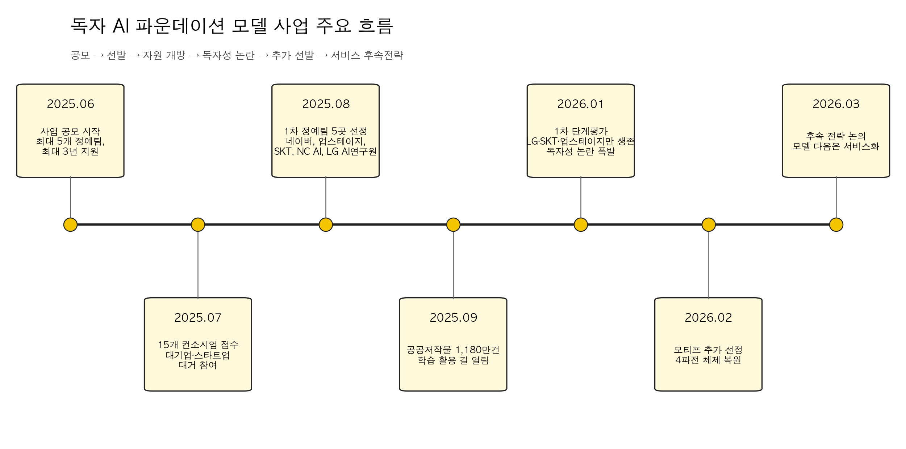
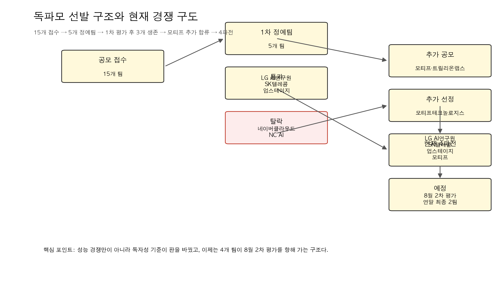
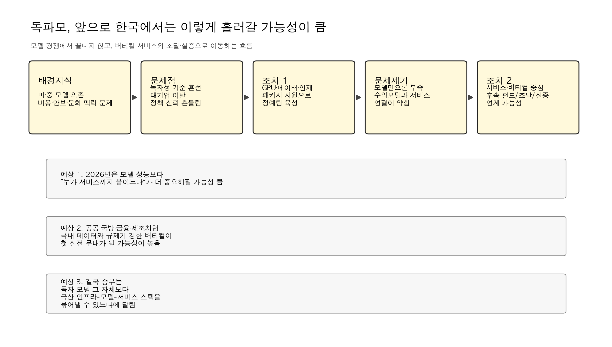

> 참고 자료: [지디넷코리아 2025.06.27 사업 설명회](https://zdnet.co.kr/view/?no=20250627170834), [연합뉴스 2025.08.04 5개 정예팀 선정](https://www.yna.co.kr/view/AKR20250804070200017), [정책브리핑 2025.09.11 공공저작물 1180만건 개방](https://www.korea.kr/news/policyNewsView.do?newsId=148949221), [정책브리핑 2025.12.12 업무보고](https://www.korea.kr/news/policyNewsView.do?newsId=148956404), [정책브리핑 2026.01.15 1차 평가 결과](https://www.korea.kr/briefing/policyBriefingView.do?newsId=156740468), [연합뉴스 2026.01.15 네이버·NC AI 탈락](https://www.yna.co.kr/view/AKR20260115121400017), [연합뉴스 2026.02.20 모티프 추가 선정](https://www.yna.co.kr/view/AKR20260220119652017), [디지털데일리 2026.03.18 후속 전략 논의](https://m.ddaily.co.kr/page/view/2026031814411339040)

독파모를 한 줄로 줄이면 이거임.

**한국이 외산 모델을 가져다 미세조정하는 수준을 넘어서, 컴퓨팅과 데이터와 모델 통제권을 가진 자체 파운데이션 모델 생태계를 만들겠다는 국가 프로젝트**임.

그래서 이 사업은 단순한 AI R&D 지원이 아님.

- GPU를 누가 쥐는가
- 데이터는 누가 확보하는가
- 모델 가중치를 누가 통제하는가
- 그 모델이 실제로 공공, 국방, 제조, 금융, 교육에 들어갈 수 있는가

이 네 가지를 한 번에 묶어놓은 사업임.

지금까지 나온 흐름을 보면, 독파모는 이미 **성능 경쟁**만의 사업이 아니라 **독자성 기준을 어디까지 볼 것인가**, 그리고 **모델 다음 단계인 서비스까지 어떻게 연결할 것인가**의 싸움으로 넘어갔음.

## 1. 독파모는 왜 시작됐나

출발점은 분명했음.

정부는 글로벌 AI 모델 의존이 커질수록 기술뿐 아니라 문화, 경제, 안보까지 종속될 수 있다고 봤음. 그래서 2025년 여름부터 독자 AI 파운데이션 모델 사업을 본격화했음.

지디넷코리아 보도와 과기정통부 설명회 내용을 보면, 이 사업의 기본 설계는 아래처럼 잡혀 있었음.

- 최대 5개 정예팀 선정
- 최대 3년 지원
- GPU, 데이터, 인재를 패키지로 지원
- 최신 글로벌 모델 대비 95% 이상 성능 목표
- 단순 데모가 아니라 오픈소스와 생태계 확장까지 평가

핵심은 정부가 모델 구조를 일일이 정하지 않고, **민간이 전략을 짜고 정부가 자원을 공급하는 방식**을 택했다는 점임.

이건 꽤 중요한 선택이었음.

정부가 중앙에서 “한국형 모델은 이렇게 만들어라”라고 박아버리면 빨라 보여도 실패 확률이 커짐. 반대로 독파모는 각 기업과 컨소시엄이 다른 전략으로 경쟁하게 만들었음. 네이버는 옴니 모델, 업스테이지는 글로벌 선도 수준 LLM, SKT는 포스트-트랜스포머, NC AI는 산업 특화 모델 패키지, LG AI연구원은 범용성과 전문성을 겸한 K-엑사원 계열로 접근했음.

## 2. 2025년 여름, 판은 생각보다 크게 깔렸다

2025년 7월 공모 마감 결과, 총 15개 AI 기업·기관 컨소시엄이 제안서를 냈음.

이 단계에서 이미 독파모는 상징성을 확보했음.

참여 주관사만 봐도 네이버클라우드, 업스테이지, SK텔레콤, NC AI, LG AI연구원, 카카오, KT, 코난테크놀로지, KAIST, 루닛 등이 들어왔음. 즉 이 사업은 처음부터 “소수 스타트업 실험”이 아니라 **한국 AI 업계의 국가대표 선발전**처럼 작동했음.

그리고 2025년 8월 4일, 정부는 15개 팀을 5개 정예팀으로 압축했음.

최종 선정된 팀은 아래 5곳이었음.

- 네이버클라우드
- 업스테이지
- SK텔레콤
- NC AI
- LG AI연구원

이때까지만 해도 그림은 비교적 단순했음.

정부는 5개 팀을 밀어주고, 연말 1차 평가를 거쳐 4개 팀으로 줄이고, 다시 단계적으로 압축한다는 계획이었음. 업계도 대체로 “이변은 없다”는 반응이었고, 사실상 국내 톱티어 플레이어들이 다 올라온 판이었음.

## 3. 하반기에는 데이터와 인프라도 붙기 시작했다

독파모가 그냥 이름만 거창한 사업이 아니었던 이유는, 하반기에 실제 데이터와 인프라 조치가 따라붙었기 때문임.

대표적인 것이 2025년 9월의 **공공저작물 1180만 건 학습 활용 허용**임.

정책브리핑에 따르면, 공공누리 공공저작물을 AI 학습용 데이터로 가공해 독파모 정예팀에 제공할 수 있도록 규제 특례가 부여됐음. 이건 단순히 데이터 몇 건 더 쓴다는 얘기가 아님.

한국어, 한국 행정, 한국 사회 맥락이 들어간 공공 데이터는 결국 국내 파운데이션 모델 경쟁력의 핵심 자산임. 독파모는 여기서부터 **한국형 데이터 레이어**를 실제로 붙이기 시작한 것임.

같은 흐름에서 2025년 12월 과기정통부 업무보고도 중요했음.

이 업무보고에서 정부는 2026년 정책 방향으로 아래를 제시했음.

- 독자 AI 파운데이션 모델 1차 개발을 2026년 1월 완료
- 상반기 내 오픈소스 제공 추진
- 연내 세계 톱10 수준 진입 목표
- 국방, 제조, 문화 등 특화 서비스 개발
- GPU 3만7000장 확보와 전략 배분
- 민관 합동 투자재원 확대

여기서 보이는 건 방향성임.

정부는 이미 독파모를 단순한 모델 경쟁이 아니라 **AI 고속도로, 국산 반도체, 특화 서비스, 투자 생태계**와 연결된 국가 스택의 일부로 보기 시작했음.

## 4. 2026년 1월, 진짜 충돌은 성능이 아니라 독자성에서 터졌다

독파모의 분수령은 2026년 1월 15일이었음.

1차 단계 평가에서 LG AI연구원이 총점 90.2점으로 최고점을 받았고, 5개 정예팀 평균은 79.7점이었음. 벤치마크, 전문가 평가, 사용자 평가를 합친 종합 점수 기준으로는 **LG AI연구원, 네이버클라우드, SK텔레콤, 업스테이지**가 상위 4개 팀에 들어갔음.

여기까지만 보면 원래 계획대로 4개 팀이 2차로 올라가면 끝나는 일이었음.

근데 독파모는 여기서 끝나지 않았음.

정부가 독자성 분석을 별도로 강하게 적용하면서 판이 뒤집혔음.

정책브리핑과 연합뉴스 보도를 종합하면, 과기정통부는 독자 AI를 단순 미세조정 모델이 아니라 **설계부터 사전학습까지 자체 수행하고, 가중치를 초기화한 뒤 형성·최적화한 모델**로 봤음. 이 기준을 적용한 결과, 네이버클라우드는 종합점수 상위권이었음에도 독자성 기준을 충족하지 못한 것으로 판단됐고, NC AI도 탈락했음.

결국 1차 평가 통과팀은 원래 예상했던 4개가 아니라 아래 3개가 됐음.

- LG AI연구원
- SK텔레콤
- 업스테이지

이 장면이 왜 중요하냐면, 독파모의 본질이 여기서 아주 선명하게 드러났기 때문임.

이 사업은 “한국 기업이 만든 고성능 AI”를 뽑는 사업이 아니라, **해외 오픈웨이트에 기대지 않고 한국이 통제권을 가진 모델을 어디까지 독자적으로 만들었는가**를 보겠다는 사업이었음.

문제는 그 기준이 사전에 충분히 명확했느냐는 데 있었음.

이후 업계에서는 “룰이 경기 도중 바뀐 것 아니냐”는 비판이 나왔고, 정부는 탈락팀과 기존 예선 탈락팀까지 다시 열어 **추가 공모**, 사실상 패자부활전 성격의 절차를 꺼내 들었음.

## 5. 2026년 2월, 모티프가 들어오면서 4파전이 됐다

추가 공모는 생각보다 흥행하지 못했음.

네이버, 카카오, KT, KAIST, 코난테크놀로지 같은 유력 플레이어들이 대거 불참하거나 미온적 반응을 보였고, 업계에서는 정책 신뢰도에 상처가 났다는 말도 나왔음. 지디넷 보도를 보면 당시 시장 분위기는 꽤 냉담했음.

그래도 2026년 2월 20일, 정부는 모티프테크놀로지스를 추가 정예팀으로 선정했음.

연합뉴스 보도 기준으로 모티프는 아래 그림을 제시했음.

- 300B급 추론형 LLM 개발
- 이후 310B급 VLM, 320B급 시각언어행동모델로 고도화
- 모델부터 소프트웨어까지 전 영역 오픈소스 공개
- 공공, 금융, 제조, 방산, 제약·바이오, 건설, 교육 등 산업 전환 지원

이로써 현재 경쟁 구도는 다시 4개 팀이 됐음.

- LG AI연구원
- SK텔레콤
- 업스테이지
- 모티프테크놀로지스

정부는 이 4개 팀을 대상으로 **2026년 8월 2차 평가**, 그리고 **2026년 말 최종 2개 팀 선정** 계획을 밝힌 상태임.

## 6. 지금 독파모의 현재 상황은 어떤가

지금 시점에서 독파모는 딱 세 가지 층위가 겹쳐 있는 상태임.

### 첫째, 모델 경쟁은 계속되고 있음.

표면적으로는 4개 팀이 남아 있고, 글로벌 벤치마크와 전문가 평가, 사용자 평가를 다시 치르게 됨. 성능은 여전히 중요함.

### 둘째, 독자성 정의는 아직도 사업의 핵심 변수임.

정부는 2차 평가부터 독자성 평가를 더 세분화하겠다고 했음. 즉 다음 라운드에서도 “잘 만들었느냐”만으로는 부족하고, **어디까지를 독자 모델이라고 볼 것인가**가 계속 발목이자 무기가 될 가능성이 큼.

### 셋째, 무게중심이 모델에서 서비스로 옮겨가고 있음.

2026년 3월 디지털데일리 보도에서 정부와 업계는 독파모 이후의 과제로 **글로벌 수준 AI 서비스 개발**을 공식적으로 논의하기 시작했음. 배경훈 장관은 인프라, 모델 다음 단계는 서비스라고 못 박았고, 펀드나 프로젝트성 자금 투입 가능성까지 언급했음.

이건 메시지가 명확함.

**좋은 모델을 만들었다고 끝이 아니라, 그 모델이 실제 산업과 공공 서비스에서 돌아가야 다음 단계 지원이 붙는다는 뜻**임.

## 7. 앞으로 예정된 계획

현재 공개된 기사와 브리핑 기준으로 보면, 앞으로의 일정은 대체로 이렇게 읽힘.

1. **2026년 8월 2차 평가**  
   4개 정예팀을 대상으로 글로벌 벤치마크, 전문가 평가, 사용자 평가를 다시 진행할 가능성이 큼.

2. **독자성 평가 세분화**  
   정부는 독자 AI의 정의와 기준을 추가 발표하겠다고 밝혔음. 학습 로그, 가중치 통제, 문제 발생 시 자체 수정 능력 같은 요소가 더 구체화될 가능성이 높음.

3. **멀티모달과 실사용성 비중 확대**  
   텍스트만 잘하는 LLM이 아니라 이미지, 음성, 비디오, 행동모델까지 얼마나 확장할 수 있는지가 더 중요해질 가능성이 큼.

4. **2026년 말 최종 2개 팀 압축**  
   정부는 연말 최종 지원 대상을 2개 팀으로 줄이겠다고 밝힌 상태임.

5. **서비스화 지원 논의 본격화**  
   공공, 국방, 제조, 금융, 교육 같은 버티컬 영역으로 실제 실증과 조달, 투자 지원이 이어질 가능성이 큼.

## 8. 그럼 한국에서 독자 파운데이션 모델 사업은 앞으로 어떻게 흘러갈까

여기부터는 공식 발표가 아니라, 지금까지 나온 흐름을 바탕으로 한 내 전망임.

### 1) 최종 승부는 벤치마크보다 서비스 쪽에서 갈릴 가능성이 큼.

이제 독파모는 모델 점수만 높다고 끝나는 사업이 아님.

정부가 3월부터 서비스 후속 전략을 꺼낸 건, 실제로는 **모델만으로는 국민 체감 성과가 안 나온다**는 걸 이미 알고 있다는 뜻임. 그래서 앞으로는 “누가 더 좋은 LLM을 만들었는가”보다 “누가 공공·산업 서비스까지 연결하느냐”가 더 중요해질 가능성이 큼.

### 2) 독자성 기준은 더 엄격해질 가능성이 큼.

1차 평가에서 한 번 크게 흔들린 만큼, 정부는 2차부터 독자성 기준을 더 분명하게 쓸 가능성이 높음.

이 말은 곧, 글로벌 오픈웨이트를 똑똑하게 활용해 빠르게 따라붙는 전략보다 **처음부터 학습 로그와 가중치 통제권을 확보하는 전략**이 더 높은 정책 점수를 받을 수 있다는 뜻임.

### 3) 최종적으로 남는 팀 수보다, 남는 자산이 더 중요해질 것임.

연말에 2개 팀으로 줄더라도 진짜 자산은 따로임.

- 대규모 GPU 클러스터 운영 경험
- 한국어·공공 데이터 가공 체계
- 멀티모달 학습 파이프라인
- 국산 칩, 데이터센터, 모델, 서비스 간 연결 경험

즉 독파모는 우승팀 2곳만 남기는 사업이 아니라, **한국 AI 생태계 전체의 학습 비용을 국가가 대신 치러주는 프로젝트**에 가까움.

### 4) 공공·국방·제조 같은 규제 강한 영역이 첫 실전 무대가 될 가능성이 큼.

왜냐하면 이 영역은 단순히 성능만 높다고 외산 모델을 쓰기 어려움.

- 보안
- 데이터 주권
- 장기 유지보수
- 정책 통제 가능성

이 네 가지가 같이 걸려 있기 때문임. 그래서 한국형 파운데이션 모델이 진짜 자리를 잡는 첫 시장은 소비자 챗봇보다 **규제와 맥락이 강한 버티컬 시장**일 가능성이 높음.

### 5) 반대로 서비스가 안 나오면 독파모는 비싼 경연대회로 보일 위험도 큼.

이건 솔직히 경계해야 함.

정부가 GPU, 데이터, 투자 재원을 밀어넣었는데도 연말 이후 국민이 체감하는 서비스나 산업 현장 적용 사례가 안 나오면, 독파모는 “나라 돈 들여 벤치마크 대회만 한 것 아니냐”는 비판에 바로 노출될 수 있음.

그래서 남은 몇 달은 단순 성능 경쟁보다 더 중요함.

**누가 실제 수요와 붙어 있느냐**, 이게 진짜 평가 기준이 될 가능성이 높음.

## 결론

독파모는 이제 막 시작한 사업이 아니라, 이미 한 번 크게 흔들리고 다시 판을 짠 상태임.

- 2025년에는 국가대표 AI 선발전처럼 출발했고
- 2026년 1월에는 독자성 논란으로 판이 뒤집혔고
- 2026년 2월에는 모티프가 추가 합류하면서 4파전이 됐고
- 2026년 3월부터는 모델 다음 단계인 서비스 전략 논의가 시작됐음

지금 독파모를 보는 가장 정확한 시선은 이거라고 봄.

**이 사업은 한국이 자체 파운데이션 모델을 만들 수 있느냐를 시험하는 프로젝트이기도 하지만, 그보다 더 크게는 한국이 AI 인프라-데이터-모델-서비스를 한 묶음으로 운영할 수 있느냐를 시험하는 국가 단위 실험임.**

그래서 8월 2차 평가와 연말 최종 결과도 중요하지만, 진짜 관전 포인트는 그 다음임.

최종 2팀이 누가 되느냐보다, **독파모가 한국에서 실제로 쓰이는 AI 서비스와 산업 전환으로 이어지느냐**. 그게 이 사업의 성패를 가를 가능성이 큼.

## 자료 출처

- 과학기술정보통신부·지디넷코리아, 2025.06.27 사업 설명회 보도
- 연합뉴스, 2025.07.21 공모 마감 및 15개 컨소시엄 접수 보도
- 연합뉴스, 2025.08.04 5개 정예팀 선정 보도
- 정책브리핑, 2025.09.11 공공저작물 1180만 건 학습 활용 보도
- 정책브리핑, 2025.12.12 과기정통부 업무보고
- 정책브리핑, 2026.01.15 독자 AI 파운데이션 모델 프로젝트 1차 단계 평가 결과
- 연합뉴스, 2026.01.15 네이버·NC AI 탈락 및 추가 공모 보도
- 연합뉴스, 2026.02.20 모티프 추가 선정 보도
- 디지털데일리, 2026.03.18 AI 서비스 후속 전략 논의 보도
