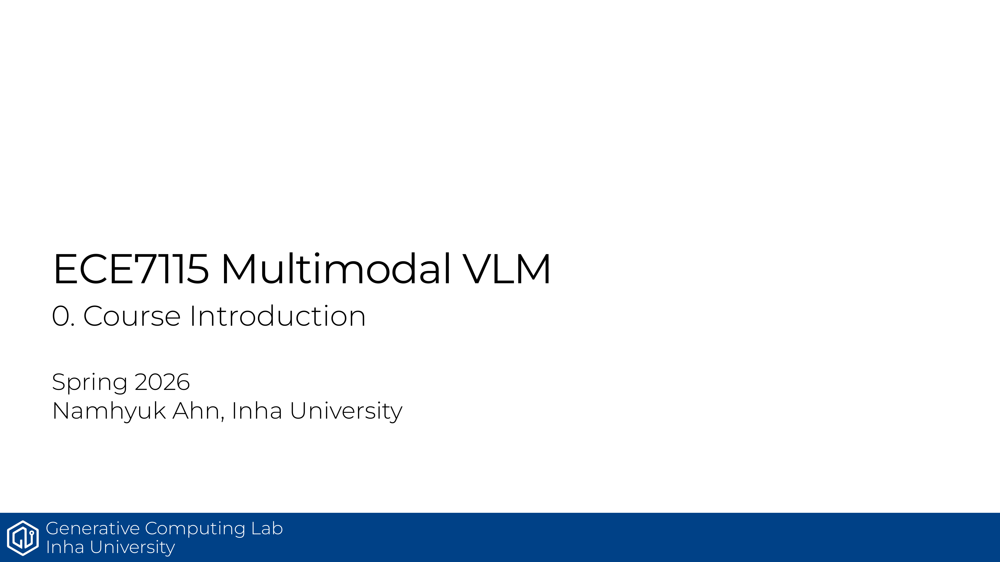

# ECE7115 0강: Course Introduction

## 한줄 정리
이 강의는 멀티모달 VLM 수업의 시작점이지만, 실제로는 LLM이 어떻게 산업화됐고 무엇을 배워야 하는지 먼저 잡아주는 오리엔테이션임.

## 핵심 포인트
- GPT-4, Grok, Stargate 사례로 LLM이 연구 단계를 넘어 산업 인프라로 넘어왔음을 보여줌.
- 수업에서는 LLM의 기본 메커니즘, 핵심 아키텍처, 학습·추론 파이프라인, GPU 인프라를 다룸.
- 이번 범위는 VLM 자체보다 LLM의 기초와 동작 원리를 먼저 이해하는 쪽에 가까움.
- 평가는 take-home final 100%라서 중간 정리 습관이 중요함.

## Source
- 원본 PDF: [0_course_introduction.pdf](https://gcl-inha.github.io/ece7115/slides/0_course_introduction.pdf)
- 강의 페이지: [ECE7115](https://gcl-inha.github.io/ece7115/)

---

**시리즈 네비**

[ECE7115 1강 — Resource Accounting 다음 편 →](./ece7115-1-resource-accounting)
