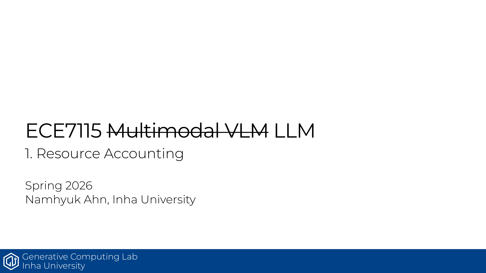

# ECE7115 1강: Resource Accounting

## 한줄 정리
이 강의는 대형 모델을 만들 때 결국 계산량과 메모리를 숫자로 따져봐야 한다는 점을 잡아줌.

## 핵심 포인트
- 자원은 크게 **Memory(GB)** 와 **Compute(FLOPs)** 두 축으로 본다.
- fp32, fp16, bf16, fp8의 차이는 정밀도보다도 메모리와 안정성에서 크게 갈림.
- 선형층 기준으로 forward는 `2 x (# data or tokens) x (# params)` FLOPs로 잡을 수 있음.
- backward까지 합치면 총 계산량은 대략 `6 x (# data or tokens) x (# params)`로 정리됨.
- MFU는 실제 FLOP/s가 하드웨어가 약속한 FLOP/s를 얼마나 잘 따라가는지 보는 지표임.

## 기억할 식
- 학습 시간 감각: `# FLOPs = 6 x tokens x params`
- 메모리 감각: Adam 계열은 파라미터, 그래디언트, 옵티마이저 상태가 함께 붙음

## Source
- 원본 PDF: [1_resource_accounting.pdf](https://gcl-inha.github.io/ece7115/slides/1_resource_accounting.pdf)
- 강의 페이지: [ECE7115](https://gcl-inha.github.io/ece7115/)

---

**시리즈 네비**

[← 이전 편: ECE7115 0강 — Course Introduction](./ece7115-0-course-introduction)  |  [ECE7115 2강 — Transformer Basics 다음 편 →](./ece7115-2-basics-transformer)
