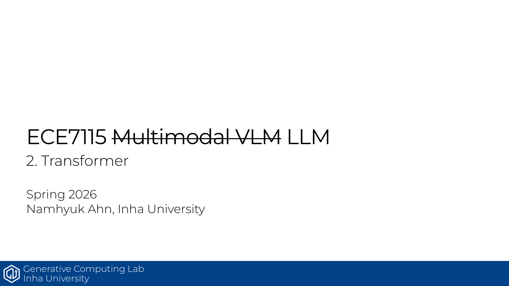

# ECE7115 2강: Transformer Basics

## 한줄 정리
트랜스포머의 핵심은 attention을 통해 입력 전체를 softly lookup하고, 그 위에 번역·생성 구조를 얹는 데 있음.

## 핵심 포인트
- Attention은 query가 key 전체에 가중치를 주고 value를 합치는 **soft lookup table**로 이해하면 됨.
- Seq2Seq with Attention은 decoder가 매 step마다 encoder의 특정 부분을 직접 참고하게 만든 구조임.
- Transformer는 tokenizer, embedding, positional encoding, multi-head attention, residual, layer norm, FFN으로 이어짐.
- Residual connection과 layer norm은 학습 안정성과 표현력을 같이 챙기는 장치임.
- 이 장의 목적은 "왜 transformer가 언어 모델의 기본형이 됐는가"를 감각적으로 잡는 것임.

## Source
- 원본 PDF: [2_basics_transformer.pdf](https://gcl-inha.github.io/ece7115/slides/2_basics_transformer.pdf)
- 강의 페이지: [ECE7115](https://gcl-inha.github.io/ece7115/)

---

**시리즈 네비**

[← 이전 편: ECE7115 1강 — Resource Accounting](./ece7115-1-resource-accounting)  |  [ECE7115 3강 — LLM Basics 다음 편 →](./ece7115-3-basics-llm)
