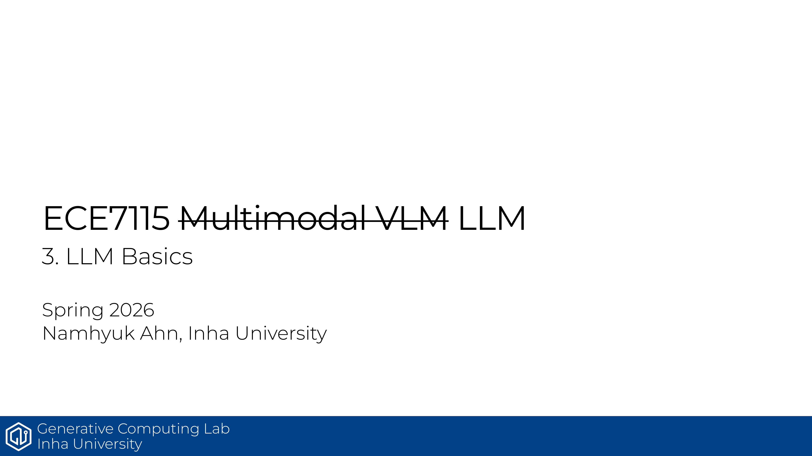

# ECE7115 3강: LLM Basics

## 한줄 정리
LLM은 단순히 더 큰 Transformer가 아니라, pre-training 이후에 fine-tuning, prompting, RL 기반 post-training이 결합된 운영 방식임.

## 핵심 포인트
- 전통적 패러다임은 task별 supervised training이었지만, 현대 패러다임은 pre-training → fine-tuning으로 이동했음.
- LLM 시대에는 prompting / in-context learning이 추가되어, 학습 없이도 여러 작업을 바로 수행함.
- BERT, T5, GPT는 pre-training 목표와 아키텍처 방향이 다르다는 점이 중요함.
- 학습 흐름은 pre-training → SFT → RL 기반 post-training으로 정리할 수 있음.
- 이 장은 "어떤 모델이냐"보다 "어떤 단계로 다듬어 쓰느냐"를 이해하는 장임.

## Source
- 원본 PDF: [3_basics_llm.pdf](https://gcl-inha.github.io/ece7115/slides/3_basics_llm.pdf)
- 강의 페이지: [ECE7115](https://gcl-inha.github.io/ece7115/)

---

**시리즈 네비**

[← 이전 편: ECE7115 2강 — Transformer Basics](./ece7115-2-basics-transformer)  |  [ECE7115 4강 — Modern LLM Architecture 다음 편 →](./ece7115-4-modern-llm-architecture)
