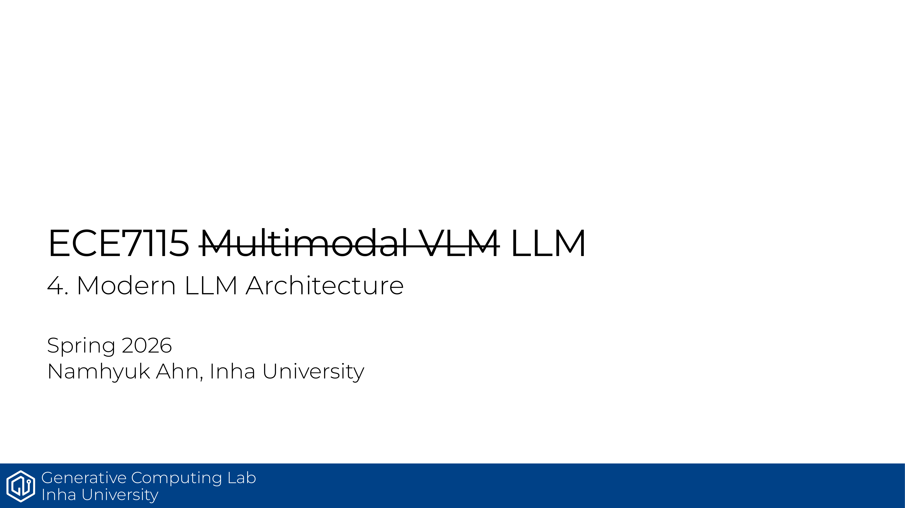

# ECE7115 4강: Modern LLM Architecture

## 한줄 정리
바닐라 Transformer에서 LLaMA 스타일로 수렴한 현대 LLM의 부품들 — Pre-Norm + RMSNorm, SwiGLU FFN, RoPE 위치 임베딩, 그리고 KV cache를 줄이기 위한 MQA/GQA/MLA 어텐션 변형들을 정리하는 장임.

## 핵심 포인트
- 거의 모든 모던 LLM은 Pre-Norm + RMSNorm 조합을 씀. mean/bias 계산을 빼서 LayerNorm 대비 빠르고, gradient spike를 줄여 큰 학습률에서도 안정적임. bias 항도 메모리/최적화 안정성 이유로 대부분 제거함.
- FFN은 ReLU/GeLU 대신 SwiGLU(Swish × linear gate)를 씀. 게이트 분기 때문에 파라미터를 맞추려고 d_ff를 4×d_model이 아니라 8/3×d_model로 줄이는 게 표준임.
- 위치 인코딩은 sinusoidal/absolute에서 RoPE로 넘어옴. Q, K에 위치별 2D 회전 행렬을 곱해 상대 위치를 내적에 자연스럽게 반영하고, T5식 relative bias와 달리 KV cache랑도 잘 맞음.
- 추론 시 매 토큰마다 K, V를 재계산하지 않고 KV cache로 누적함. 그런데 DeepSeek-V3급(layers 61, heads 128, seq 32k)이면 KV cache만 약 131GB로 메모리가 폭주해서, 어텐션 변형의 핵심 동기가 됨.
- 어텐션 변형 라인업: MHA(헤드별 KV) → MQA(KV 헤드 1개로 공유, 4MB→31KB) → GQA(헤드를 ng개 그룹으로 묶음, 약 500KB)로 KV cache와 성능을 트레이드오프함. LLaMA 계열은 GQA가 디폴트임.
- DeepSeek의 MLA는 KV를 작은 latent c_KV(예: d_c=576)로 압축해 캐싱하고, 추론 때 weight absorption으로 down/up projection을 하나의 행렬로 합쳐 추가 연산을 없앰. 단 RoPE랑은 곱셈 순서가 안 맞아 decoupled RoPE 키를 따로 두는 트릭을 씀.
- 기타 안정성 트릭: safe softmax / LogSumExp, PaLM의 z-loss, QK Norm, Gemma 2의 logit soft-capping(tanh로 attention/output logit을 cap)이 학습 발산을 막는 표준 도구로 자리잡음.

## Source
- 원본 PDF: [4_modern_llm_architecture.pdf](https://gcl-inha.github.io/ece7115/slides/4_modern_llm_architecture.pdf)
- 강의 페이지: [ECE7115](https://gcl-inha.github.io/ece7115/)
