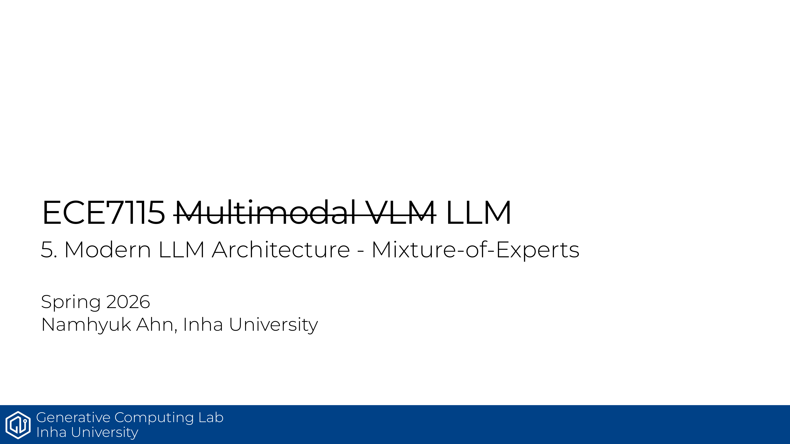

ECE7115 5강은 MoE가 왜 다시 뜨는지, 그리고 dense FFN과 뭐가 다른지에 초점을 맞춘다. 핵심은 더 많은 파라미터를 두되, 매 토큰에 모두 켜지지 않게 만드는 것이다.

- MoE는 큰 FFN 하나를 여러 개의 작은 expert로 나누고 router가 토큰을 배정하는 구조다.
- expert는 특정 도메인 전용이라기보다 토큰/문장 수준의 패턴을 분담한다.
- dense FFN은 모든 파라미터를 매번 쓰지만, MoE는 일부 expert만 활성화한다.
- 그래서 sparse params는 많아지고 active params는 적게 유지할 수 있다.
- 같은 FLOPs에서 더 많은 파라미터를 쓰는 방식이라, 품질과 학습 효율을 같이 노릴 수 있다.
- 강의의 메시지는 간단하다. MoE는 "거대한 하나"보다 "작은 여러 개를 똑똑하게 고르는 방식"이다.

## Source
- 원문 PDF: [5_moe.pdf](https://gcl-inha.github.io/ece7115/slides/5_moe.pdf)
- 강의 페이지: [ECE7115](https://gcl-inha.github.io/ece7115/)

---

**시리즈 네비**

[← 이전 편: ECE7115 4강 — Modern LLM Architecture](./ece7115-4-modern-llm-architecture)  |  [ECE7115 6강 — Scaling Laws 다음 편 →](./ece7115-6-scaling-laws)
