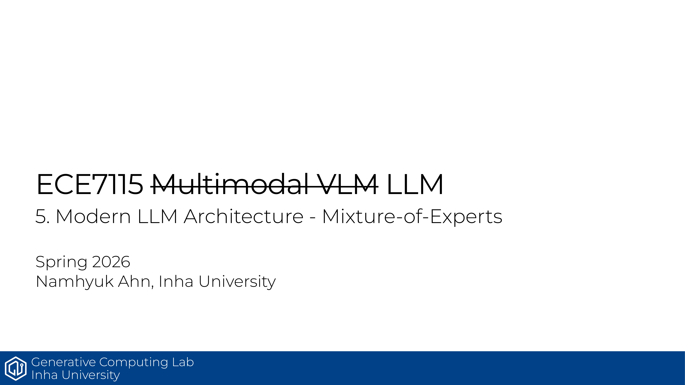

# ECE7115 5강: Mixture-of-Experts

## 한줄 정리
MoE는 큰 dense FFN을 작은 expert 다발로 쪼개고 router가 top-k만 골라 활성화함으로써, 같은 FLOPs로 더 많은 파라미터를 굴리는 sparse 아키텍처임.

## 핵심 포인트
- MoE 블록은 두 부품으로 구성됨. 큰 FFN을 잘게 나눈 expert들과, 어떤 토큰을 어느 expert로 보낼지 정하는 router(역시 작은 FFN)로 동작함.
- expert는 도메인 단위가 아니라 단어 수준의 syntactic 패턴에 특화되는 경향이 있고, sparse param은 많지만 inference 때 active param만 계산하므로 dense 대비 같은 FLOPs로 더 큰 모델 효과를 냄(Switch Transformer, OLMoE, DeepSeek V2 결과).
- Routing은 token-choice top-k가 사실상 표준임. expert-choice는 load balancing이 좋지만 autoregressive에 붙이기 어렵고, global routing은 최적이지만 비용이 큼. softmax 위치도 갈리는데 DeepSeek v1/2/Grok/Qwen은 pre-softmax, Mixtral과 DeepSeek v3는 post-softmax 방식임.
- Mixtral은 dense FFN과 같은 크기의 coarse-grained expert를 쓰지만, 최근 DeepSeek-MoE/Qwen 계열은 expert를 m배로 잘게 쪼갠 fine-grained experts에 항상 켜지는 shared experts 몇 개를 더하는 구조로 가고 있음.
- 학습은 sparse·discrete gating이 미분 불가능해 expert collapse(rich-get-richer)에 빠지기 쉬움. 이걸 막기 위해 auxiliary load balancing loss와 router z-loss를 넣고, 작은 fine-tuning 데이터 과적합은 MLP 부분만 튜닝하거나 expert dropout으로 완화함. dense 체크포인트에서 sparse upcycling으로 MoE를 띄우는 방식도 가능함.

## Source
- 원본 PDF: [5_moe.pdf](https://gcl-inha.github.io/ece7115/slides/5_moe.pdf)
- 강의 페이지: [ECE7115](https://gcl-inha.github.io/ece7115/)
