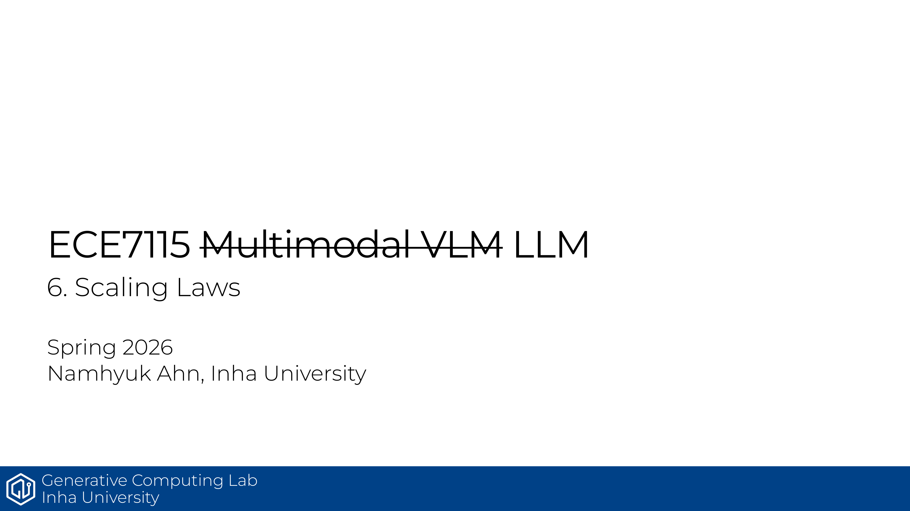

ECE7115 6강은 큰 모델을 감으로 키우는 대신, 작은 실험에서 나온 scaling law로 큰 모델을 예측하는 방법을 정리한다. 데이터, 모델 크기, compute 배분을 같은 틀에서 보는 강의다.

- scaling laws는 작은 모델 결과를 바탕으로 큰 모델 성능을 예측하는 실용 규칙이다.
- 데이터 크기와 오류, 모델 크기와 오류는 둘 다 power-law 형태로 설명되는 경우가 많다.
- 데이터 구성은 보통 slope보다 offset에 더 큰 영향을 준다.
- 실제로는 제한된 데이터에서 반복 학습과 데이터 필터링 전략도 scale에 맞춰 조정해야 한다.
- 모델 크기를 볼 때는 embedding 파라미터보다 non-embedding 파라미터를 기준으로 보는 경우가 많다.
- 결론은 compute allocation이다. 더 많은 데이터를 쓸지, 더 큰 모델을 쓸지, scaling law로 먼저 가늠한다.

## Source
- 원문 PDF: [6_scaling_laws.pdf](https://gcl-inha.github.io/ece7115/slides/6_scaling_laws.pdf)
- 강의 페이지: [ECE7115](https://gcl-inha.github.io/ece7115/)

---

**시리즈 네비**

[← 이전 편: ECE7115 5강 — Mixture of Experts](./ece7115-5-mixture-of-experts)  |  [ECE7115 7강 — LLM Case Study 다음 편 →](./ece7115-7-llm-case-study)
