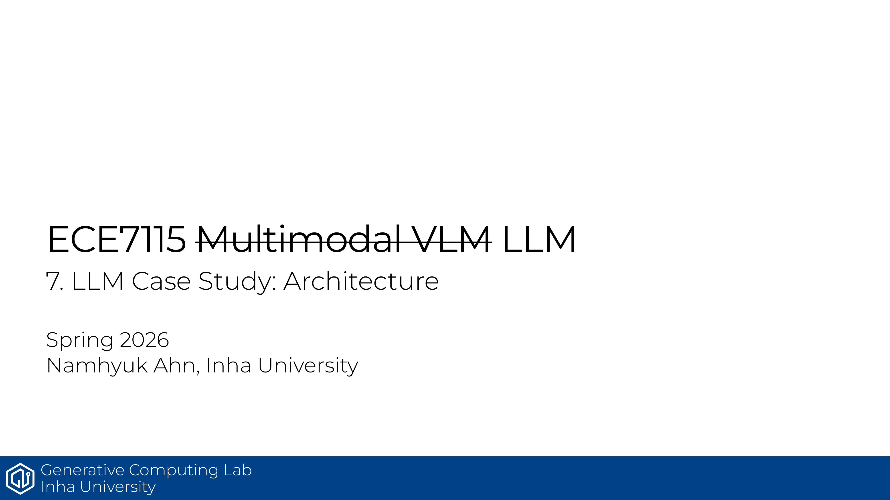

# ECE7115 7강 요약: LLM Case Study로 보는 아키텍처 변화

LLM 아키텍처가 2023년부터 2025년까지 어떻게 정리되는지 순서대로 보는 강의임. 핵심은 **decoder-only + pre-norm + RoPE + SwiGLU**가 사실상 표준이 됐고, 이후 모델들이 이 기본기를 조금씩 다듬어 왔다는 점임.

## 핵심만 보면

- LLaMA recipe: RMSNorm, pre-norm, RoPE, SwiGLU, no bias
- LLaMA 2: context 2K → 4K, 큰 모델에 GQA 도입
- Mistral: GQA + sliding window attention으로 긴 문맥 처리 효율 강화
- 강의 포인트: 아키텍처 혁신보다 **컨텍스트 효율, 메모리, attention 변형**이 진화축이었음

## 정리

LLM은 완전히 새로운 구조를 계속 만든다기보다, 검증된 뼈대를 유지하면서 더 긴 문맥과 더 낮은 비용을 맞추는 쪽으로 진화했음. 이 강의는 그 흐름을 모델별로 연결해 주는 역할임.

## Source
- 원본 PDF: [7_llm_case_study.pdf](https://gcl-inha.github.io/ece7115/slides/7_llm_case_study.pdf)
- 강의 페이지: [ECE7115](https://gcl-inha.github.io/ece7115/)
