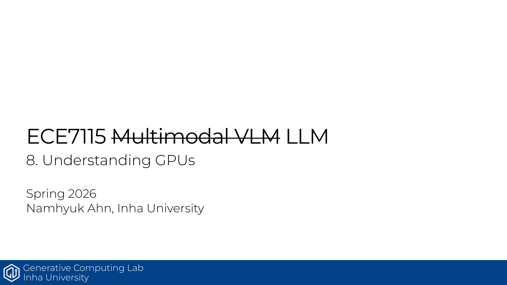

# ECE7115 8강 요약: Understanding GPUs

GPU를 “엄청 빠른 CPU”로 보면 감이 안 옴. 이 강의의 핵심은 **CPU는 latency, GPU는 throughput**에 최적화된 장치라는 점을 정확히 잡는 것임.

## 핵심만 보면

- GPU는 많은 스레드를 동시에 처리하도록 설계됨
- SM, SP, warp(32 threads), block 개념이 실행 모델의 뼈대임
- 메모리 계층은 L1/shared memory, L2, HBM 순으로 가까울수록 빠름
- 성능 개선의 키워드: coalescing, kernel fusion, tiling, recomputation
- FlashAttention은 메모리 이동을 줄이는 설계의 대표 예시임

## 정리

GPU 성능을 이해하려면 연산량만 볼 게 아니라, **데이터를 얼마나 자주, 어디서 가져오는지**를 봐야 함. 이 강의는 그 관점을 잡아 주는 입문 강의임.

## Source
- 원본 PDF: [8_understanding_gpus.pdf](https://gcl-inha.github.io/ece7115/slides/8_understanding_gpus.pdf)
- 강의 페이지: [ECE7115](https://gcl-inha.github.io/ece7115/)

---

**시리즈 네비**

[← 이전 편: ECE7115 7강 — LLM Case Study](./ece7115-7-llm-case-study)  |  [ECE7115 9강 — Parallelism 다음 편 →](./ece7115-9-parallelism)
