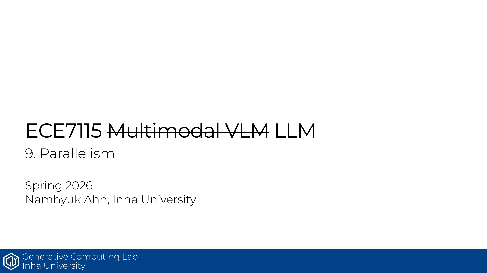

# ECE7115 9강 요약: Parallelism

모델이 커지면 단일 GPU만으로는 메모리와 연산을 버티기 어려움. 그래서 이 강의는 **어떻게 쪼개서 돌릴 것인가**를 병렬화 관점에서 정리함.

## 핵심만 보면

- 단일 GPU 한계 때문에 멀티 GPU / 멀티 머신 구성이 필요해짐
- 연결 계층은 HBM, NVLink, NVSwitch처럼 빠른 경로를 먼저 이해해야 함
- 집단 통신 기본기: all-reduce, broadcast, scatter, gather, reduce-scatter
- 병렬화 축: data parallel, tensor/model parallel, pipeline parallel, sequence parallel, ND parallel
- 분산 학습의 핵심은 계산 분해와 통신 비용의 균형임

## 정리

병렬화는 그냥 “GPU를 더 많이 쓰는 법”이 아니라, **메모리와 통신 제약을 동시에 설계하는 법**임. 다음 강의들로 이어질 기반을 이 파트에서 깔아 줌.

## Source
- 원본 PDF: [9_parallelism.pdf](https://gcl-inha.github.io/ece7115/slides/9_parallelism.pdf)
- 강의 페이지: [ECE7115](https://gcl-inha.github.io/ece7115/)
