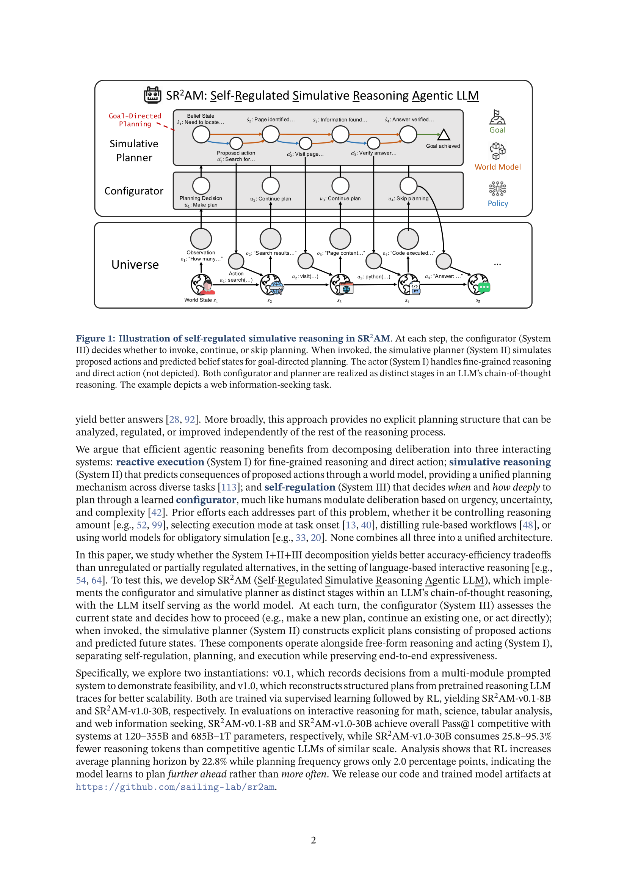
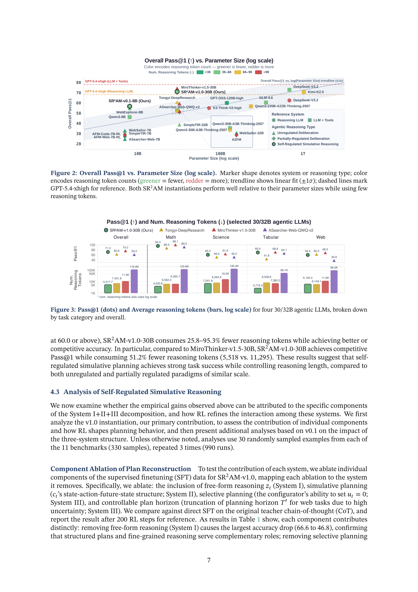
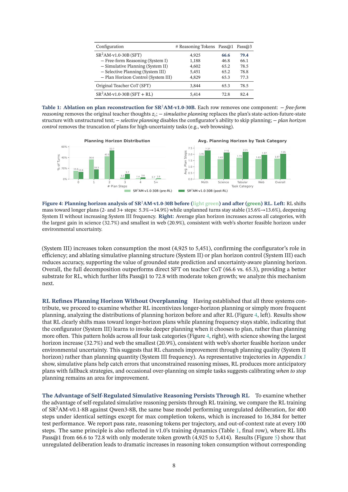

## Q. 최근 "에이전트가 알아서 잘 추론하겠지"라는 접근에 문제가 있다고 들었는데, 어떤 점이 비효율적인 건가요?

현재 대부분의 에이전트 LLM은 chain-of-thought를 그냥 길게 늘리는 방식으로 추론합니다. 훈련 과정에서 추론 길이가 급격히 증가하는데, 이게 정확도 향상으로 이어지지 않는 경우가 많아요. 토큰을 엄청나게 쓰면서도 성능은 답보 상태인 거죠.

근본적인 원인은 **계획(planning)을 제어하는 메커니즘이 없다**는 겁니다. 모델이 언제 계획을 세워야 하는지, 얼마나 깊게 계획해야 하는지, 아니면 계획 없이 바로 행동해도 되는지를 스스로 판단하지 못합니다. 그냥 무조건 긴 사고를 출력하도록 훈련되는 거예요.

## Q. 그럼 이 논문에서 제안하는 해결책은 뭔가요?

Carnegie Mellon University 연구진이 **SR²AM(Self-Regulated Simulative Reasoning Agentic LLM)**이라는 프레임워크를 제안했습니다. 핵심 아이디어는 에이전트의 의사결정을 **세 가지 시스템으로 분해**하는 거예요.

- **System I (반응적 실행)**: 정밀한 추론과 직접적인 행동. 빠르고 효율적인 처리
- **System II (시뮬레이션 추론)**: 세계 모델을 사용해 행동의 결과를 예측하며 계획을 수립
- **System III (자기 조절)**: 언제, 얼마나 깊게 계획할지 결정하는 설정기(configurator)

이 세 시스템이 상호작용하면서, 에이전트가 상황에 따라 계획을 세우거나 건너뛰거나 기존 계획을 이어가는 식으로 유연하게 대응합니다.

## Q. "시뮬레이션 추론"이라는 게 구체적으로 어떤 건가요?

에이전트가 실제로 행동하기 전에, 후보 행동들을 제안하고 각각의 결과를 **세계 모델(world model)을 통해 예측**합니다. 그중에서 목표 달성에 가장 유리한 행동 순서를 선택하는 거죠.

일반적인 chain-of-thought와의 차이는 **구조**에 있어요. 시뮬레이션 추론은 현재 상태, 제안된 행동, 예측된 미래 상태를 명시적으로 표현합니다. 이렇게 하면 계획의 진행 상황을 추적하고, 예측이 빗나간 걸 감지할 수 있어요. 반면 무차별적인 사고 과장(unconstrained CoT)은 이런 구조가 없어서 계획이 암묵적으로만 드러납니다.

## Q. "자기 조절"은 어떻게 작동하나요?

각 턴마다 설정기(configurator)가 현재 상태를 평가해서 세 가지 결정 중 하나를 내립니다:

1. **새 계획 수립** — 상황이 복잡하거나 불확실할 때
2. **기존 계획 계속** — 계획대로 진행 중일 때
3. **계획 건너뛰기** — 단순한 작업이나 긴급한 상황일 때

이게 핵심입니다. 모든 상황에서 무조건 계획을 세우는 게 아니라, **필요할 때만** 계획을 호출하는 거예요. 이렇게 하면 불필요한 토큰 소모를 크게 줄일 수 있습니다.

## Q. 실험 결과는 어떤가요?

4개 분야(수학, 과학, 표 데이터 분석, 웹 정보 탐색) 11개 벤치마크에서 평가했습니다.

**SR²AM-v0.1-8B**는 8B 파라미터 모델인데, 120–355B 급 시스템과 견줄 만한 정확도를 달성했습니다. **SR²AM-v1.0-30B**는 685B~1T 급 모델들과 경쟁하는 성능을 보여줬어요.

더 중요한 건 효율성입니다. SR²AM-v1.0-30B는 비슷한 규모의 다른 에이전트 LLM 대비 **25.8–95.3% 적은 추론 토큰**을 사용했습니다. MiroThinker-v1.5-30B와 비교하면 정확도는 비슷한데 토큰은 51.2% 적게 썼어요.

## Q. 강화학습을 거치면 어떻게 달라지나요?

흥미로운 발견이 있었어요. RL을 거친 후 **계획 빈도는 거의 안 변했는데, 계획 수평(horizon)은 평균 22.8% 증가**했습니다. 즉, 모델이 "더 자주" 계획하는 게 아니라 **"더 깊게" 계획하는 법을 배운** 거예요.

이건 중요한 통찰입니다. 비조절 모델은 RL을 거치면 토큰 소모가 폭발하는데, SR²AM은 계획의 질을 높이는 방향으로 개선되어 토큰 증가가 제한적이었습니다.

## Q. 데이터는 어떻게 구축하나요?

두 가지 방식을 실험했습니다.

**v0.1 방식**은 설정기와 플래너를 별도의 프롬프트 기반 LLM 모듈로 구현해서 궤적을 기록합니다. 다중 모듈 시스템에서 결정을 수집하는 거죠.

**v1.0 방식**은 기존에 학습된 추론 LLM(DeepSeek-V3.2)의 사고 궤적에서 구조화된 계획을 **복원(reconstruct)**합니다. 어노테이터 LLM이 각 스텝에서 계획이 필요한지 판단하고, 필요하면 상태-행동-미래상태 구조의 계획을 추출해요. 기존 추론 내용은 그대로 보존하면서 구조화된 계획 레이어를 추가하는 방식입니다.

v1.0 방식이 더 확장성이 좋아서, 다양한 선생 모델의 추론 궤적을 활용할 수 있습니다.

## Q. 이 연구의 의의는 뭘로 보시나요?

에이전트 설계의 근본적인 전제를 바꾸는 연구라고 생각합니다. 지금까지는 "충분한 데이터와 컴퓨트를 주면 계획이 알아서 나타나겠지"라는 접근이 지배적이었어요. 이 논문은 **계획을 명시적으로 모델링하고 조절하는 구조**를 넣어야 한다는 걸 실험적으로 보여줍니다.

특히 "더 길게 생각한다고 더 나은 게 아니다"라는 점을 정량적으로 입증한 게 의미 있어요. SR²AM의 설정기 개념은 추론 시점의 계획뿐만 아니라, 에이전트가 **스스로 학습하고 적응하는 방식까지 조절하는** 더 넓은 원칙으로 확장될 수 있다고 저자들은 말합니다. 자율성의 새로운 차원을 여는 연구라고 할 수 있겠네요.

---

**참고 논문**: Deng, M. et al., "Efficient Agentic Reasoning Through Self-Regulated Simulative Planning", arXiv:2605.22138, 2026. [코드 저장소](https://github.com/sailing-lab/sr2am)
