# EgoPush: 로봇이 자기 눈으로만 물건을 밀어 재배치하는 뉴욕대 연구

사람은 방 안의 물건을 옮길 때 전체 지도가 필요 없다. 눈으로 보이는 것만으로 충분하다. 책상 위 컵을 옆으로 밀고, 의자를 살짝 돌리고, 바닥의 상자를 구석으로 미는 건 시야 안에 있는 정보만으로도 가능하다.

로봇은 달랐다. 물건을 옮기려면 방 전체의 3D 맵이 필요했고, 자기 위치를 정밀하게 알아야 했고, 외부 카메라나 모션 캡처 시스템이 필요했다. 물건 하나 밀겠다고 하는 짓이 많았다.

[EgoPush](https://ai4ce.github.io/EgoPush/)는 이 구조를 뒤집는다. 로봇 머리에 달린 카메라 하나만으로 여러 물체를 밀어서 원래 위치로 재배치한다. 지도 없이, 위치 추적 없이, 외부 센서 없이.

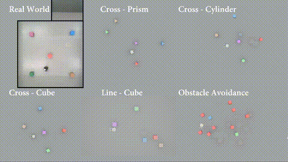

## Q. EgoPush가 뭔가요?

**이동 로봇이 1인칭 카메라만으로 여러 물체를 밀어서 재배치하는 학습 프레임워크**다.

뉴욕대 AI4CE 연구실에서 발표했고, arXiv에 2026년 2월 공개됐다 (arXiv:2602.18071). 저자는 Boyuan An, Zhexiong Wang, Yipeng Wang, Jiaqi Li, Sihang Li, Jing Zhang, Chen Feng.

핵심 차이점은 세 가지다:

1. **글로벌 맵이 필요 없다** — 방 전체를 스캔하거나 3D 맵을 만들지 않는다
2. **정밀한 자기 위치 추적이 필요 없다** — GPS도, 로봇 자세 추정도 안 쓴다
3. **외부 트래킹이 필요 없다** — 모션 캡처나 외부 카메라 없이 로봇에 달린 카메라 하나로 끝난다

사람이 눈으로만 물건을 옮기는 것과 같은 방식이다. 그래서 이름도 Ego(자기 자신) + Push(밀기).

## Q. 무슨 문제를 푸는 건가요?

**장기 시간·다물체·비파지형 재배치** (long-horizon, multi-object, non-prehensile rearrangement)라는 문제다.

- **장기 시간**: 물건이 여러 개면 한 번 밀고 끝나는 게 아니라 여러 단계를 거쳐야 한다
- **다물체**: 물건 하나가 아니라 여러 개를 동시에 다뤄야 한다
- **비파지형**: 물건을 집어서 (grasp) 옮기는 게 아니라 밀어서 (push) 옮긴다

기존 방식은 이걸 풀기 위해 방 전체를 알아야 했다. 물건의 절대 좌표, 로봇의 절대 위치, 장애물의 위치까지 다 알아야 했다. 근데 실제 환경에서는 물건이 치워지고, 사람이 지나가고, 조명이 바뀐다. 그때마다 맵을 다시 만들어야 한다.

EgoPush는 **상대적 공간 관계**만으로 동작한다. "컵이 책 오른쪽에 있어야 한다"를 알면, 책과 컵의 상대 위치만 맞추면 된다. 방 전체를 몰라도 된다.

## Q. 어떻게 동작하나요?

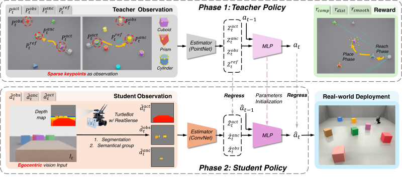

구조는 Teacher-Student 방식이다.

**1단계: Object-Centric 표현**

장면의 물체를 세 가지 역할로 나눈다:
- **Active Object**: 지금 밀고 있는 물체
- **Anchor Object**: 기준이 되는 물체 (목표 관계를 정의)
- **Obstacles**: 장애물

각 역할을 공유 가중치 인코더로 임베딩해서 하나의 잠재 상태로 합친다. 핵심은 절대 위치가 아니라 **물체 간 상대 관계**를 인코딩한다는 점.

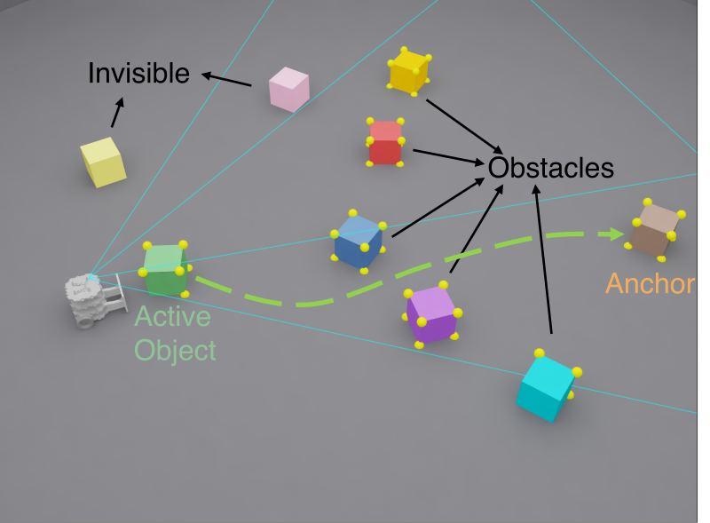

**2단계: 제약 관측 RL Teacher**

강화학습 Teacher가 희소 키포인트(sparse keypoints)를 관측해서 행동을 학습한다. 여기서 핵심 설계가 두 가지:

- **Virtual Egocentric FOV Masking**: Teacher가 로봇 카메라 시야 밖의 정보를 못 보게 마스킹한다. 전지전능한 Teacher가 학생이 따라 할 수 없는 행동을 배우는 걸 막는다.
- **Center-Gated Reference Visibility**: 기준 키포인트를 앵커 물체가 화면 중앙 근처에 있을 때만 보여준다.

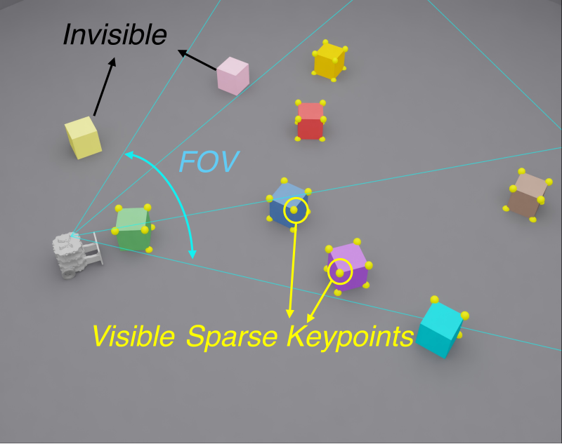

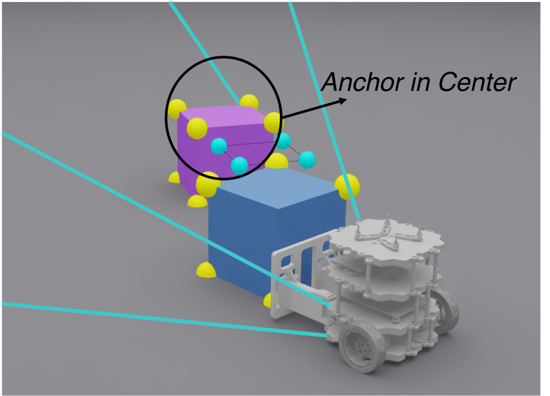

이 제약 덕분에 Teacher가 **능동적 지각(active perception)** 행동을 학습한다. 물체를 잘 보기 위해 로봇이 스스로 움직여서 시야를 확보하는 식이다.

**3단계: Relational Distillation**

Teacher가 학습한 잠재 상태와 행동을 순수 비전 Student 정책으로 증류한다. Student는 카메라 이미지만 받아서 Teacher와 같은 행동을 해야 한다.

Teacher의 관측을 시각적으로 접근 가능한 것으로 제한해놨기 때문에, Student도 따라 할 수 있다.

## Q. 장기 과제는 어떻게 해결하나요?

물건이 여러 개면 한 번 밀고 끝나는 게 아니다. A를 밀고, 이동하고, B를 밀고, 다시 이동하고... 이런 긴 시퀀스에서 보상이 뒤로 갈수록 희미해지는 게 큰 문제다 (long-horizon credit assignment).

EgoPush는 재배치를 **단계별 하위 문제**로 분해한다. 각 단계마다 도달-배치 (reach-then-place) 패턴이 반복되고, 단계별 완료 보상에 **시간 감쇠(stage-local timer)** 를 적용한다.

단순하지만 효과적이다. "빨리 끝낸 단계에 더 큰 보상"을 주면 로봇이 각 단계를 효율적으로 완수하려고 한다.

## Q. 시뮬레이션 결과는 어떤가요?

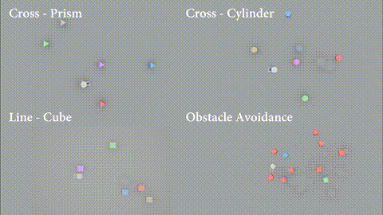

EgoPush가 엔드투엔드 RL 베이스라인들을 성공률에서 크게 앞선다. 특히 물체 수가 많아질수록 격차가 벌어진다.

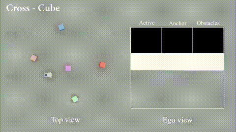

기존 베이스라인들은 물체가 많아지면 시야가 가려지거나, 긴 시퀀스에서 길을 잃는다. EgoPush는 능동적 지각 행동 덕분에 시야를 확보하면서 진행한다.

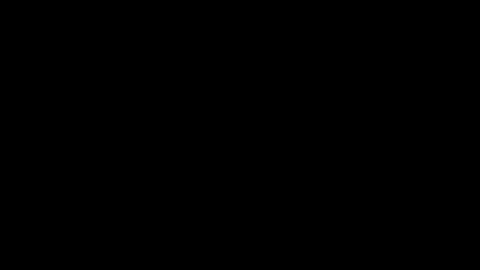

베이스라인은 물체를 밀다가 다른 물체와 충돌하거나, 목표 위치를 잃어버리는 경우가 많다.

## Q. 실제 로봇에서도 되나요?

**된다. Zero-shot sim-to-real.**

시뮬레이션에서 학습한 정책을 실제 로봇에 그대로 올려도 동작한다. 추가 파인튜닝 없이.

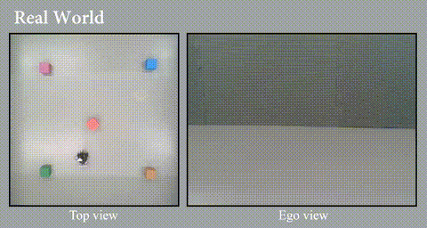

로봇은 바퀴 달린 이동 플랫폼에 카메라 하나를 달고 있다. 카메라 이미지만으로 주변 물체를 인식하고, 밀어야 할 순서를 결정하고, 직접 밀어서 목표 위치로 옮긴다.

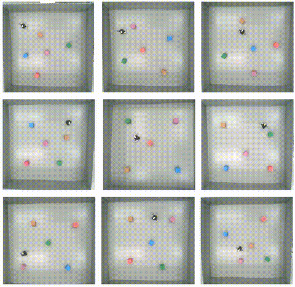

실제 환경에서는 조명 변화, 바닥 재질, 물체의 실제 마찰력 같은 시뮬레이션에서 없던 변수가 있다. 그래도 동작한다. 이고센트릭 비전 기반이라 환경 변화에 상대적으로 강한 편이다.

## Q. 깊이(Depth) 처리는 어떻게 하나요?

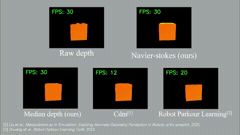

이고센트릭 카메라에서 얻은 깊이 정보를 어떻게 처리하느냐에 따라 성능 차이가 크다. EgoPush는 깊이 맵을 직접 쓰는 대신 키포인트 기반 표현을 사용해서 노이즈에 더 강하다.

## Q. Teacher-Student 갭은 어떻게 좁히나요?

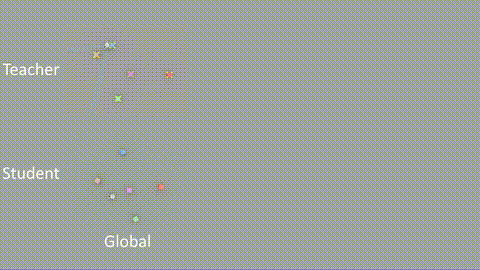

Teacher가 전지전능한 관측을 하면 Student가 따라갈 수 없다. 그래서 EgoPush는 Teacher의 관측을 일부러 제한한다:

- **w/o FOV Masking (global)**: 시야 제한을 없애면 Teacher는 잘하지만 Student가 따라 못 한다
- **w/o Center-Gated Visibility**: 시야는 제한하지만 기준 공개 조건을 없애도 성능이 떨어진다

결론: Teacher를 일부러 "Student가 따라 할 수 있는 것만" 보게 만드는 게 핵심이다.

## Q. 어디서 직접 해볼 수 있나요?

프로젝트 페이지에서 **Unity WebGL 데모**를 직접 실행할 수 있다. 브라우저 안에서 로봇을 조작하면서 재배치 과정을 체험할 수 있다.

👉 [EgoPush 데모 실행하기](https://ai4ce.github.io/EgoPush/static/unity/index.html)

## Q. 관련 연구와 비교하면?

| 항목 | 기존 방식 | EgoPush |
|---|---|---|
| 관측 | 글로벌 맵 + 외부 트래킹 | 이고센트릭 카메라 1대 |
| 위치 추정 | 정밀 로컬리제이션 필요 | 불필요 (상대 관계 기반) |
| 물체 표현 | 절대 포즈 | 상대 공간 관계 |
| 긴 시퀀스 | 보상 희미화 문제 | 단계별 감쇠 보상 |
| Sim-to-Real | 파인튜닝 필요 | Zero-shot |
| 능동 지각 | 수동 설계 | 학습으로 자동 획득 |

## Q. 한계는 없나요?

있다.

- **밀기(push)만 가능하다.** 집기(grasp), 들기(lift)는 아직 안 된다. 물체를 뒤집거나 들어서 옮겨야 하는 상황은 커버 못 한다.
- **물체의 물리적 특성 변화에 취약할 수 있다.** 마찰력, 무게, 모양이 학습 환경과 많이 다르면 밀기가 안 될 수 있다.
- **이고센트릭 카메라의 시야 제한이 여전히 존재한다.** 카메라 뒤에 있는 물체는 당연히 못 본다. 능동적 지각으로 어느 정도 커버하지만 완전하진 않다.
- **실제 환경 테스트가 아직 제한적이다.** 더 복잡한 환경(사람이 있는 공간, 계단, 경사면)에서의 검증은 향후 과제다.

## Q. 왜 주목할 만한가요?

로봇이 물건을 다루는 방식의 근본적인 전환이기 때문이다.

기존은 "방을 완전히 알아야 움직일 수 있다"는 전제였다. EgoPush는 "눈에 보이는 것만으로도 충분하다"고 말한다. 사람이 그렇게 하듯이.

Teacher-Student 구조의 활용도 인상적이다. Teacher가 마음대로 다 할 수 있게 두는 게 아니라, Student가 따라 할 수 있는 것만 하도록 제약을 걸었다. 이 제약이 오히려 더 나은 성능으로 이어진다.

Zero-shot sim-to-real도 실용적이다. 실제 로봇에서 따로 학습할 필요 없이 시뮬레이션 결과를 그대로 쓸 수 있다면, 로봇 학습의 비용과 시간이 크게 줄어든다.

👉 **프로젝트 페이지:** <https://ai4ce.github.io/EgoPush/>
👉 **논문 (arXiv):** <https://arxiv.org/abs/2602.18071>
