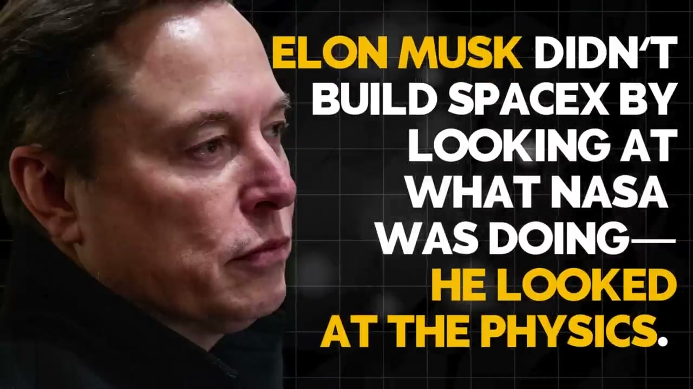
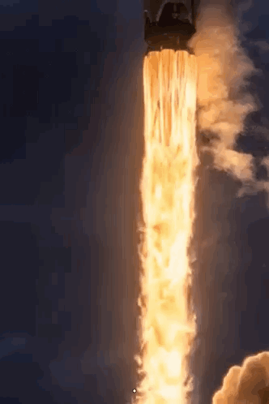
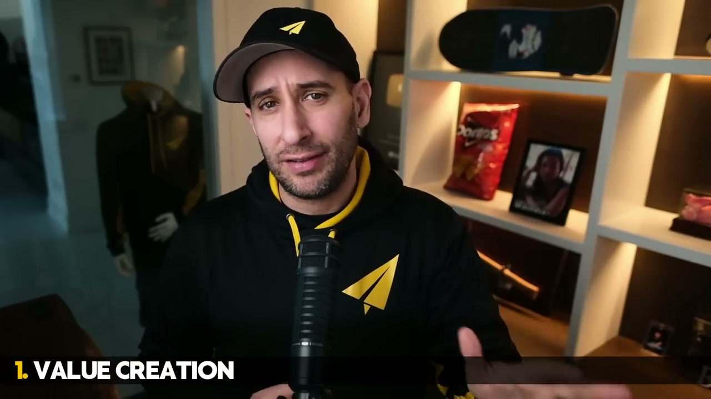
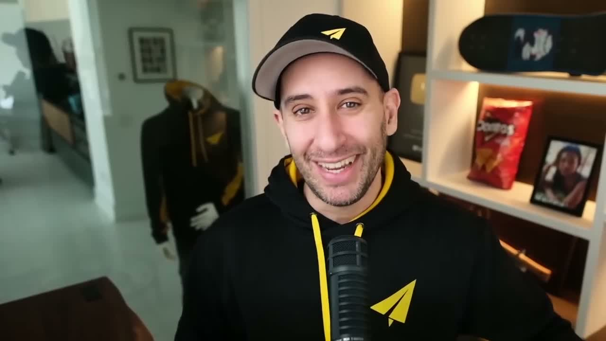
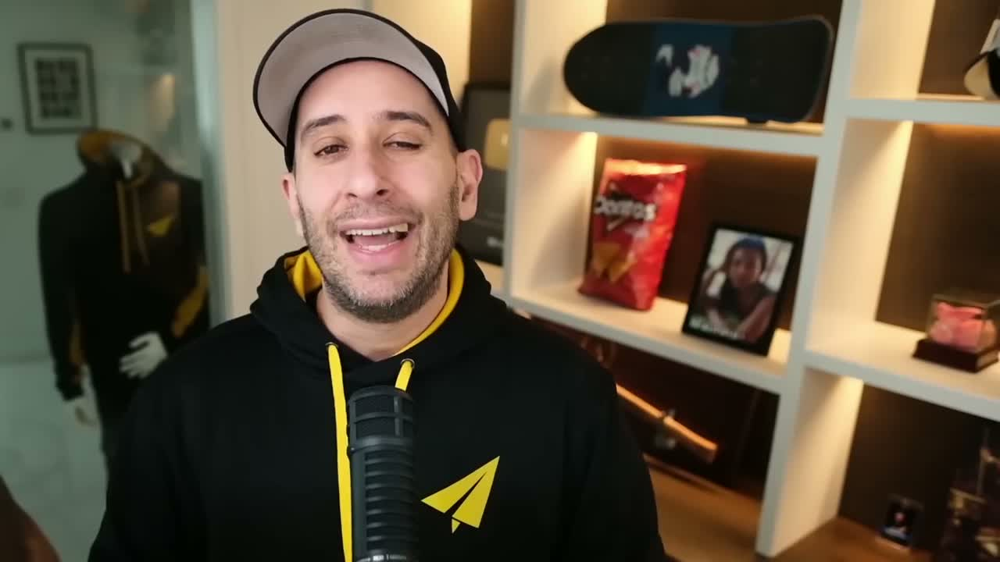
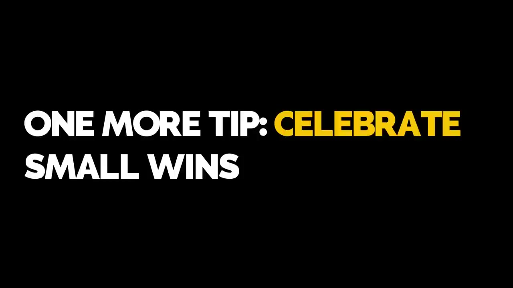
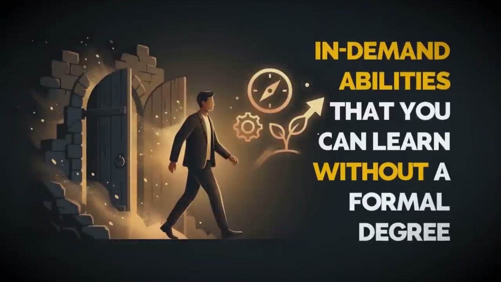
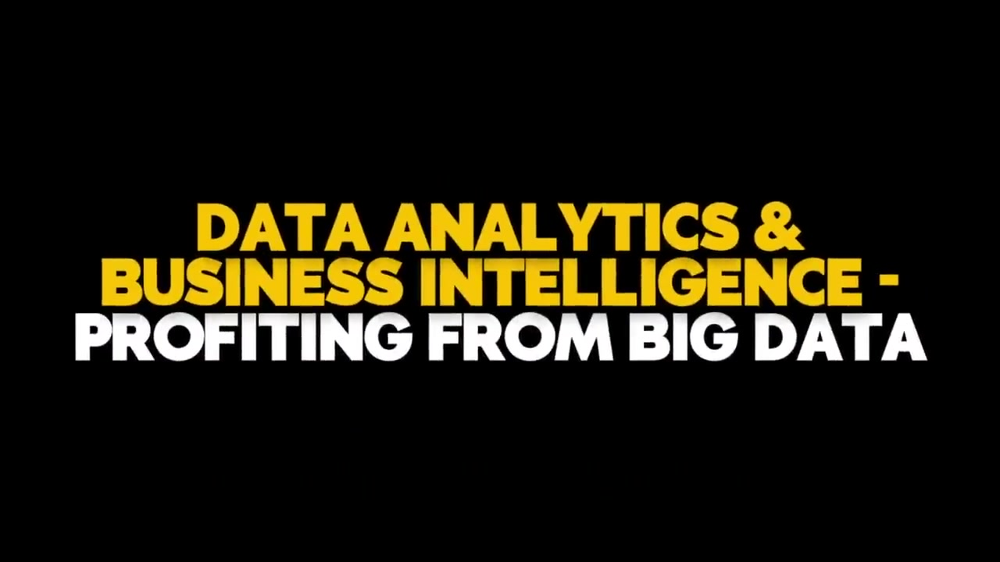
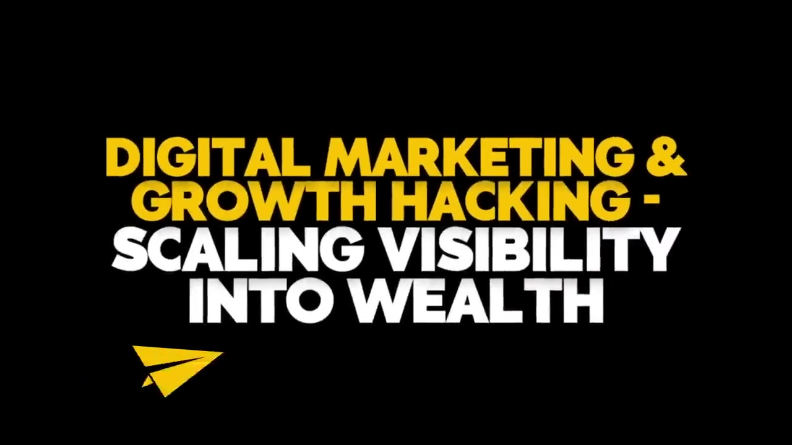

에반 카마이클(Believe Nation) 1시간짜리 압축 영상. 일론 머스크 재료비 해체부터 조시 카우프만 5요소, 해밀턴 헬머 7가지 힘, 그리고 학위 없이 배우는 고소득 스킬 5개까지 한 번에 밀어붙임. 영상은 [RGT7nNrvSek](https://youtu.be/RGT7nNrvSek) 이고, 아래는 번호 매긴 비트만 남긴 버전.

1. 비즈니스는 복잡한 게 아님. **다른 사람의 문제를 푸는 것**, 그게 전부임. 대부분 망하는 이유는 계획을 과도하게 굴리느라 자기가 섬겨야 할 사람한테 빠져들 시간을 못 잡기 때문임.

2. 일론 머스크는 NASA를 벤치마킹해서 스페이스X를 만든 게 아님. **물리학**을 봄. 로켓 한 발에 6,500만 달러, 업계 표준. 머스크는 그걸 안 받아들임.

3. 대신 물었음. *"로켓은 뭘로 만들어지지?"* 항공우주용 알루미늄, 타이타늄, 구리, 탄소섬유. 런던 금속거래소(LME) 가격으로 다시 계산함. **재료비는 전체의 2%**. 나머지 98%는 비효율이었음.

4. 그래서 10배 싸게 쏠 수 있었음. 비유로 생각(reasoning by analogy)하지 말고 **제1원리(first principles)로 생각하라**는 게 영상 전반의 축임.

5. 배터리도 같은 루프. 업계는 kWh당 600달러가 바닥이라고 했음. 머스크는 분자 단위로 쪼갬. 코발트, 니켈, 알루미늄, 탄소. LME 가격으로 사면 **kWh당 80달러**. 600 - 80 = 520달러 구간이 비효율. 기회는 그 간극에 있음.

6. 적용법은 단순함. *"애플처럼 만들려면 어떻게 하지?"* 가 아니라 *"내 고객의 근본 문제는 뭐지?"*. 피곤하다는 문제에 유추로 답하면 커피숍. 제1원리로 답하면 낮잠/영양제/좋은 매트리스까지 열림.

---

7. 근데 원리만으로는 안 됨. 모든 사업이 공유하는 **5가지 요소**가 있음. 조시 카우프만(Personal MBA) 정리. 하나라도 빠지면 사업이 아니라 취미임.

8. **1번, 가치 창출.** 사람들이 필요/원하는 것을 찾아서 만드는 것. 본인이 하고 싶은 게 아니라 상대가 필요로 하는 것. 획득·연결·학습·방어·감정 중 하나의 인간 동기를 만족시켜야 함.

9. **2번, 마케팅.** 만들기만 하면 안 옴. *"If you build it, they will come"* 은 거짓말임. 마케팅은 **신념을 바꾸는 기술**. 무자각 → 문제자각 → 해결자각으로 청중을 옮기는 게 일.

10. **3번, 판매.** 마케팅이 데려오면 판매가 서명시킴. 속이는 게 아니라 **신뢰를 만드는 것**. 고객이 가격에 상응하는 가치를 이해하게 도와야 함.

11. **4번, 가치 전달.** 약속한 걸 실제로 줘야 함. 드림 팔고 악몽 배송하면 끝. 기대 이상을 넘겨야 평판이 쌓임.

12. **5번, 재무.** 나가는 돈이 들어오는 돈보다 많으면 파산임. 회계사일 필요는 없지만 이 부등식은 무조건 맞춰야 함. 힘들어하고 있으면 이 5개 중 하나가 고장 난 거임. 진단하고 고치고 다음.

---

13. 기초 위에 전략이 얹힘. 영상에서 가져온 건 **해밀턴 헬머의 7가지 힘(Seven Powers)**. 하나만 있어도 경쟁사가 이익을 못 뺏어감. 주당 100시간 나쁜 전략은 20시간 좋은 전략한테 짐.

14. **① 규모의 경제.** 커질수록 싸짐. 넷플릭스가 House of Cards에 1억 달러를 쓸 수 있었던 건 가입자 수가 받쳐줬기 때문. 작은 경쟁사는 단일 프로그램에 1억을 못 박음. **사이즈가 방패**가 됨.

15. **② 네트워크 경제.** 유저가 많아질수록 가치가 올라감. 페이스북·링크드인이 왜 안 죽냐면, 새 SNS는 *nobody's there* 라서 시작점이 0임. 불붙은 네트워크는 꺼트리기가 제일 어려움.

16. **③ 카운터 포지셔닝.** 경쟁사가 따라 하면 **자기 본업이 망하는 모델**을 쓰는 것. 코닥이 1975년에 디지털카메라를 발명하고도 못 민 이유. 필름 매출을 자기 손으로 박살 내야 했음. 뱅가드 저비용 인덱스펀드가 대형 은행을 잡은 것도 같은 원리.

17. **④ 전환 비용.** 떠나기를 귀찮게 만듦. 가둬서가 아니라 **삶에 깊이 박혀서**. 아이폰·맥·아이패드·아이클라우드를 다 쓰면 안드로이드 이전은 악몽. 그래서 머무름.

18. **⑤ 브랜드.** 로고가 아니라 **객관적으로 동일한 제품에 더 높은 값을 매기게 만드는 힘**. Good Morning America 테스트 하나. 코스트코 6,600달러 다이아반지, 티파니 16,600달러. 감정가는 코스트코가 더 좋다고 나옴. 근데 사람들은 티파니 파란 박스에 10,000달러를 더 냄. 브랜드가 **불확실성을 줄여주기** 때문.

19. **⑥ 구석 자원(Cornered Resource).** 아무도 못 갖는 무엇. 특허, 위치, 팀. 픽사는 세계 최고 스토리텔러·애니메이터가 모인 Brain Trust를 보유. 디즈니가 따라 만들 수 없어서 그냥 샀음.

20. **⑦ 프로세스 파워.** 너무 효율적이어서 안 따라짐. 토요타는 생산 시스템에 자신감이 넘쳐서 **경쟁사한테 공장 투어**를 돌렸음. GM이 그대로 봤는데 못 복제함. 기계가 아니라 **문화에 박힌 프로세스**였기 때문. 수십 년간 삼투압으로 배운 것.

---

21. 원리도, 5요소도, 7가지 힘도 있어도 **자기를 안 믿으면** 소용없음. 공포가 가장 큰 변수임. 실패 공포, 판단 공포, 눈에 띄는 것 자체의 공포.

22. 이유는 단순함. 자기 목적은 **자기가 가장 고생한 지점**에서 나옴. 에반은 19살 창업가 시절 도움이 필요했던 자기를 위해 영상을 만든다고 함. *서비스에 집중하면 공포가 사라짐*. 자기가 어떻게 보일지 걱정하는 대신, 어떻게 도울지를 걱정하기 시작하기 때문.

23. 그리고 '어떻게'에 매달리지 말 것. 웹사이트는 어떻게 만들지, 펀딩은 어떻게 받을지. **How는 늘 바뀜**. 고집해야 하는 건 **Why와 Who**. 누구를 섬기는지, 왜 그게 중요한지가 고정되면 How는 알아서 나옴.

---

24. 실행. 시작하는 법은 **시작하는 것**. 에반의 초기 영상은 끔찍했음. 땀 흘리고 긴장한 티가 났음. 그래도 올렸음. 완벽할 때까지 기다렸으면 시작 자체가 없었음.

25. 직장을 당장 그만둘 필요 없음. 집을 담보 잡힐 필요도 없음. **하루 30분**으로 시작 가능. 한 명의 문제를 한 번 푸는 것으로 시작 가능. 진짜 차이는 *시작했고 남들 다 그만둘 때까지 버텼는가* 뿐.

---

26. 영상 중반 포인트가 바뀜. 2026년에 **학위 없이 배워서 돈이 되는 스킬 5개**를 짚음. 시장이 실제로 굶주린 지점만 고름.

27. **하나, AI 통합.** 생성 AI 자체가 아니라, **자기 사업/클라이언트 워크플로에 AI를 꽂는 능력**. 툴은 널렸고 방향 잡는 사람이 부족함.

28. **둘, 데이터 분석/비즈니스 인텔리전스.** SQL·Python·대시보드 없이 의사결정하는 회사가 아직도 많음. 빅데이터에서 수익을 뽑아내는 스킬은 계속 희소함.

29. **셋, 디지털 마케팅 + 그로스 해킹.** 가시성을 부로 전환하는 쪽. SEO, 광고 최적화, 랜딩페이지 전환, 콘텐츠 분산. AI가 글은 써도 *감정의 방향*을 잡아주는 건 사람이어야 함.

30. **넷, 설득적 커뮤니케이션/스토리텔링.** 스토리는 팩트보다 **22배 더 잘 기억됨**. 68%의 소비자가 브랜드 스토리에 따라 산다고 말함. 세일즈 리터도 10,000달러짜리가 흔함. 상위 프리랜서 카피라이터는 연 15만 달러 이상을 가져감.

31. **다섯, 사이버보안/데이터 보호.** 글로벌 데이터 유출 평균 비용 490만 달러. 인력난이 누적 **480만 명** 부족. 프리랜서 상위 요율 시간당 $200~$300, 경력 컨설턴트 연 50만 달러 이상. 자기 회사 지키면서 서비스로도 팔 수 있음. 이중 자산임.

---

32. 다섯 개 공통점은 **실용적, 학습 가능, 즉시 가치 생성**. 학위 필요 없고 유튜브·부트캠프·커뮤니티로 지금 시작 가능. 1-2개만 잡아도 1-2년 안에 부가 붙는 궤적이 생김.

33. 그리고 또 하나. 영상이 마지막에 못 박은 20가지 돈의 법칙 중 **1번만 짚음**. *돈은 가치를 따라감*. 돈은 랜덤이 아님. **문제 해결에 대한 보상**임. 신나는 걸 만든다고 부자가 되는 게 아니라, 남을 섬기는 걸 만들 때 부가 따라옴.

34. 근데 이 모든 구조가 있어도 움직이는 건 **자기**뿐임. 원리를 알고, 5요소를 맞추고, 7가지 힘 중 하나를 잡고, 고소득 스킬 하나를 꽂고, 그리고 시작. 시작한 자와 안 한 자의 차이는 기술 차이가 아님.

35. 1시간짜리 영상을 압축하면 결국 **"섬길 사람을 정하고, 물리학 레벨로 분해하고, 지금 움직여라"** 임. 나머지는 파생임.

---

**출처**

- [Evan Carmichael — RGT7nNrvSek (YouTube)](https://youtu.be/RGT7nNrvSek)
- Josh Kaufman, *The Personal MBA* (2010)
- Hamilton Helmer, *7 Powers: The Foundations of Business Strategy* (2016)
- Jeff Bezos, 'Regret Minimization Framework' (1994 Amazon 창업 인터뷰)
