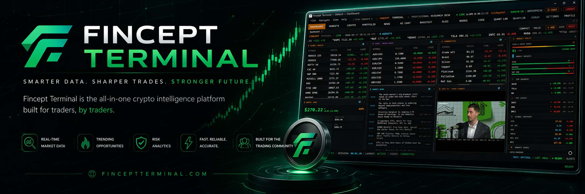
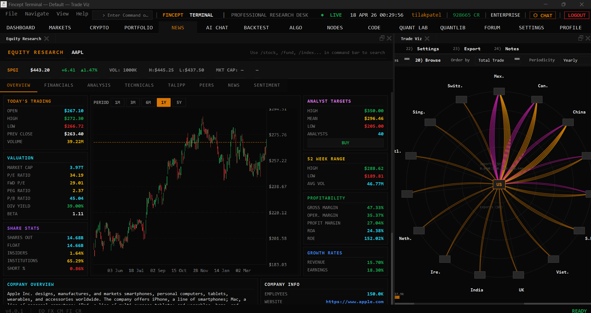
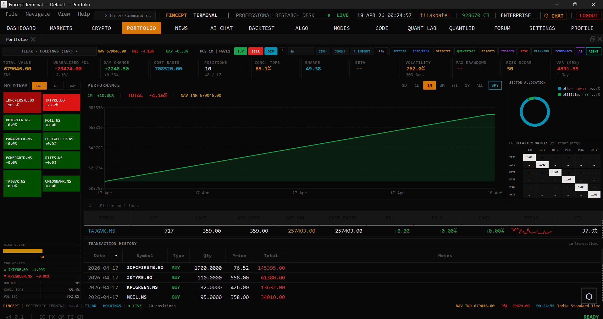
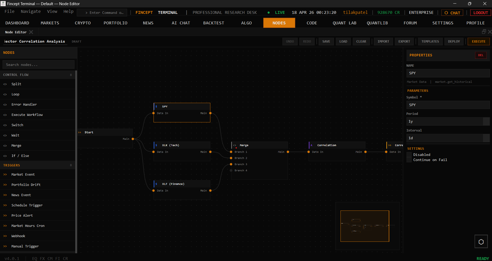

블룸버그 터미널이 연간 2만 4천 달러임. 개인 투자자나 스타트업에겐 접근 불가능한 가격. 그런데 이걸 오픈소스로 만들려는 사람들이 있음.

1. **Fincept Terminal v4**는 순수 네이티브 C++20 데스크톱 앱임. Qt6로 UI를 만들고, Python을 내장해서 분석 엔진으로 씀. Electron도 아니고 웹 런타임도 아님. 단일 바이너리로 배포됨.

2. Electron 기반 금융 앱들이랑 비교하면 체감 성능 차이가 큼. C++20 + Qt6 조합은 메모리 사용량이 수십 MB 수준에서 시작함. 같은 기능의 Electron 앱은 기본이 수백 MB.

## 37개 AI 에이전트: 투자 철학을 코드로

3. 가장 흥미로운 기능. 단순히 "AI가 주식을 분석해줘"가 아니라, **유명 투자자들의 실제 철학을 에이전트로 모델링**함.

4. 워렌 버핏(Buffett), 벤저민 그레이엄(Graham), 피터 린치(Lynch), 찰리 멍거(Munger), 세스 클라먼(Klarman), 하워드 마크스(Marks) 같은 가치 투자자부터, 경제 분석·지정학 분석 에이전트까지 37개가 준비되어 있음.

5. 각 에이전트는 해당 투자자의 실제 프레임워크를 따름. 버핏 에이전트에게 물으면 "내재가치 대비 할인 가격인가?"를 기준으로 분석하고, 린치 에이전트는 "PEG 비율이 합리적인가?"를 묻는 식.

6. LLM 프로바이더는 OpenAI, Anthropic, Gemini, Groq, DeepSeek, MiniMax, OpenRouter, Ollama를 지원함. Ollama가 있다는 건 **로컬 LLM으로 완전 오프라인 운영이 가능**하다는 뜻. 금융 데이터를 외부 API로 보내지 않아도 됨.

## 100+ 데이터 커넥터

7. DBnomics, Polygon, Kraken, Yahoo Finance, FRED, IMF, World Bank, AkShare, 정부 API까지 100개 이상의 데이터 소스를 연결함.

8. 최신 빌드에서는 Adanos Market Sentiment 연동도 지원함. Reddit, X, 금융 뉴스, Polymarket에서 소비자 심리를 크로스소스로 수집해서 Equity Research에 반영. 설정하지 않으면 그냥 꺼져 있음.

## 실시간 트레이딩: 16개 브로커

9. Kraken, HyperLiquid WebSocket으로 실시간 암호화폐 스트리밍. Zerodha, Angel One, Upstox, IBKR, Alpaca, Tradier, Saxo 등 16개 브로커 연동.

10. 페이퍼 트레이딩 엔진이 내장되어 있어서 실전 돈을 쓰지 않고도 전략을 테스트할 수 있음.

## QuantLib 기반 퀀트 분석 18개 모듈

11. 옵션 가격 책정, 리스크 메트릭(VaR, Sharpe), 확률 과정, 변동성 모델, 고정 수익 분석까지 18개 퀀트 모듈이 들어감. 배후에 QuantLib이 깔려 있음.

12. DCF 모델, 포트폴리오 최적화, 파생상품 가격 책정을 내장 Python에서 직접 실행. 파이썬 코드를 터미널 안에서 돌릴 수 있음.

## 비주얼 워크플로우: 노드 에디터

13. 자동화 파이프라인을 노드 에디터로 구성함. 데이터 수집 → 전처리 → 분석 → 실행을 시각적으로 연결. 코드를 안 써도 워크플로우를 만들 수 있음.

14. MCP(Model Context Protocol) 툴 통합도 지원. 외부 AI 도구들을 파이프라인에 끼워 넣을 수 있음.

## AI Quant Lab

15. ML 모델, 팩터 발견, HFT, 강화학습 트레이딩을 실험할 수 있는 공간. "연구 → 백테스트 → 실전" 파이프라인을 하나의 터미널 안에서 완성.

## 글로벌 인텔리전스

16. 해상 추적, 지정학 분석, 관계 매핑, 위성 데이터까지 연결함. 단순히 주식 차트 보는 게 아니라 글로벌 이벤트가 시장에 미치는 영향을 추적.

## 기술적 디테일

17. 빌드가 까다로운 편임. CMake 3.27.7, Qt 6.8.3, Python 3.11.9, C++20 지원 컴파일러(MSVC 19.38 / GCC 12.3 / Apple Clang 15.0)가 필요함. 버전이 정확히 pinned되어 있음.

18. 대신 인스톨러가 준비되어 있음. Windows, Linux, macOS 각각 pre-built 바이너리를 제공. Docker도 지원(Linux + X11).

## 라이선스: AGPL-3.0 + 상업 라이선스 듀얼

19. 개인 사용, 학습, 학술 연구, 이 리포에 대한 오픈소스 기여는 AGPL-3.0으로 무료.

20. 상업적 사용은 유료 라이선스가 필요함. 포크해서 자기 데이터 소스로 바꿔도 라이선스 의무는 유지됨. 미승인 상업 사용에 대해 $50,000/년의 위약금 조항이 있음. 인도 법률 준거.

21. 대학 교육용으로 $799/월에 20계정 패키지를 제공.

## 왜 주목하는가

22. 금융 인프라의 민주화가 이런 방향으로 진행될 수 있음을 보여줌. C++20으로 네이티브 성능을 내면서, Python 내장으로 분석 생태계를 활용하고, 100개 이상의 데이터 소스를 연결하는 건 작업량이 장난이 아님.

23. AI 에이전트 부분이 재밌음. "AI가 주식을 골라준다"가 아니라 "버핏이라면 어떻게 볼까?"를 시뮬레이션하는 접근. 투자 철학을 프롬프트 엔지니어링이 아니라 구조화된 프레임워크로 모델링하려는 시도.

24. 블룸버그 터미널이 "데이터 + 뉴스 + 분석 도구"의 결합이라면, Fincept Terminal은 "데이터 + AI 에이전트 + 퀀트 분석 + 트레이딩 실행"의 결합. 목표는 같지만 접근 방식이 다름.

---

**참고자료**
- [Fincept Terminal (GitHub)](https://github.com/Fincept-Corporation/FinceptTerminal)
- [다운로드 (v4.0.3)](https://github.com/Fincept-Corporation/FinceptTerminal/releases)
- [Discord](https://discord.gg/ae87a8ygbN)
