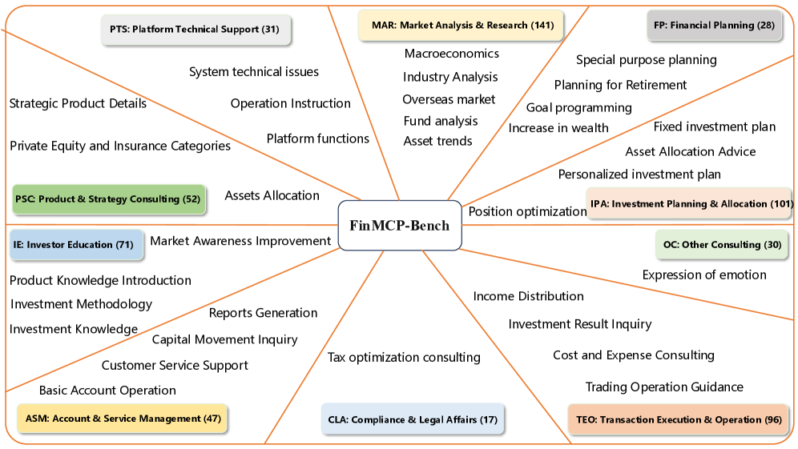
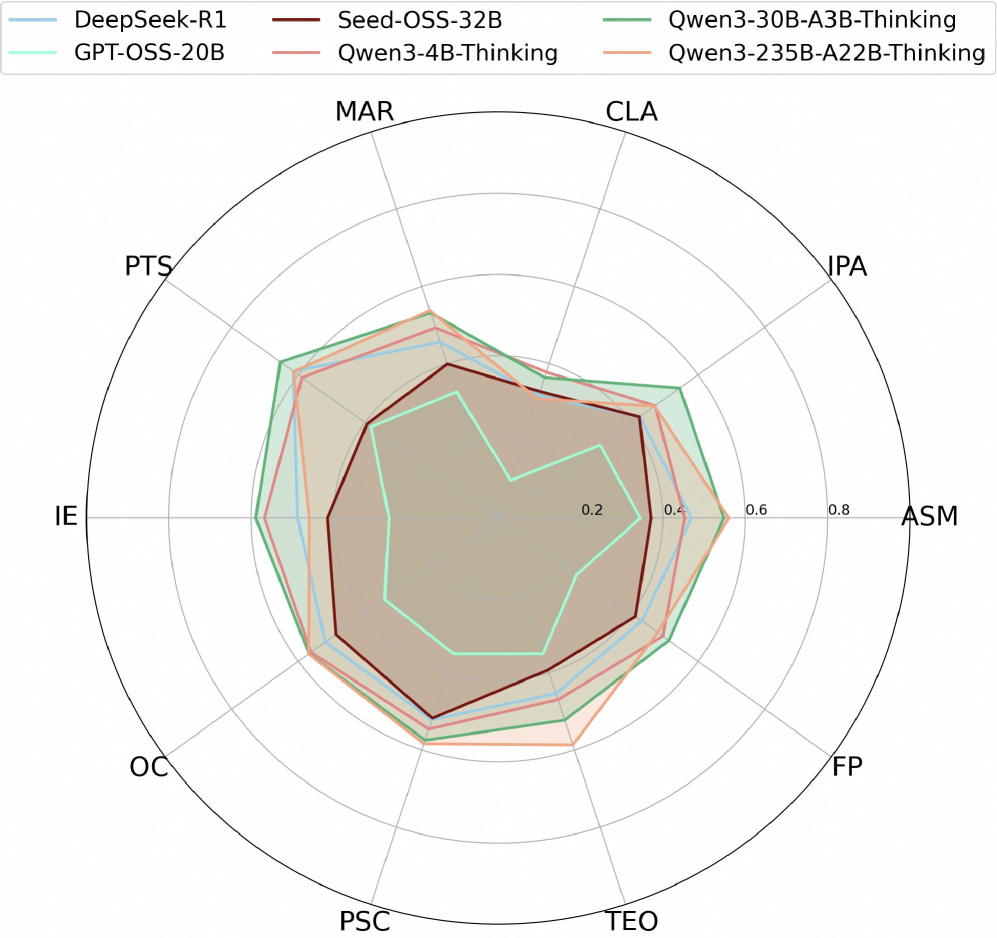
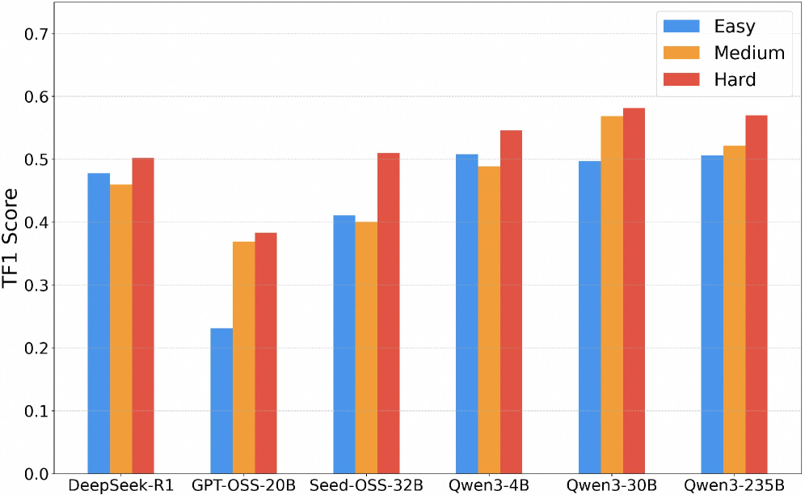

금융 도메인에서 LLM 에이전트가 진짜 일을 하려면 단순히 답을 잘 말하는 것만으로는 부족합니다. **사용자 의도를 해석하고, 적절한 도구를 호출하고, 여러 단계의 의존성을 가진 워크플로를 끝까지 수행하는 능력**이 필요합니다. 그런 점에서 오늘 고른 논문 **FinMCP-Bench**는 아주 실전적인 질문을 던집니다.

> **"MCP를 붙인 금융 에이전트는 실제 업무형 질문에서 얼마나 잘 도구를 호출하고 추론할까?"**

이 글에서는 논문 **[FinMCP-Bench: Benchmarking LLM Agents for Real-World Financial Tool Use under the Model Context Protocol](https://arxiv.org/abs/2603.24943)**를 바탕으로, 왜 이 벤치마크가 중요한지, 무엇을 측정하는지, 어떤 결과가 나왔는지, 그리고 우리가 실전 에이전트 설계에서 어떤 힌트를 얻을 수 있는지 정리해보겠습니다.

## 논문 한 줄 요약

**FinMCP-Bench는 MCP(Model Context Protocol)를 사용하는 금융 LLM 에이전트의 실제 도구 호출 능력을 평가하기 위해 만든 벤치마크다.**

단순 질의응답이 아니라,

- 단일 도구 호출
- 여러 도구를 한 턴에서 연쇄적으로 호출하는 작업
- 여러 턴에 걸쳐 도구와 대화를 섞어가며 문제를 해결하는 작업

까지 포함한다는 점이 핵심입니다.

## 왜 이 논문이 중요할까?

기존 벤치마크 상당수는 최종 답변의 정확도나 단발성 태스크에 집중합니다. 그런데 실제 금융 상담이나 투자 분석 업무는 훨씬 더 복잡합니다.

예를 들어 이런 식입니다.

1. 사용자의 투자 목적을 파악하고
2. 시장 데이터 도구를 호출하고
3. 상품 정보 도구를 호출하고
4. 포트폴리오 분석 도구를 연결하고
5. 그 결과를 바탕으로 다시 설명하고
6. 추가 질문이 오면 이전 맥락을 이어서 응답해야 합니다.

즉, **현실 세계의 에이전트는 “정답 생성기”라기보다 “도구 오케스트레이터”**에 가깝습니다. FinMCP-Bench는 바로 이 지점을 측정하려고 합니다.

특히 코난쌤처럼 **MCP, 에이전트, 자동화 워크플로**에 관심이 많은 분들에게는 거의 정면으로 꽂히는 논문입니다.

## FinMCP-Bench는 무엇을 담고 있나?

논문에 따르면 이 벤치마크는 다음과 같이 구성됩니다.

- **총 613개 샘플**
- **10개 주요 시나리오**
- **33개 하위 시나리오**
- **65개 실제 금융 MCP 도구**
- **실제 사용자 로그 + 합성 데이터** 혼합

샘플은 세 가지 유형으로 나뉩니다.

### 1. Single-tool
한 번의 대화 턴에서 **도구 하나만 호출**하면 해결되는 작업입니다.

- 145개 샘플
- 가장 단순한 유형
- 도구 선택의 정확성이 중요

### 2. Multi-tool
한 번의 턴 안에서 **여러 도구를 순차적 또는 병렬로 호출**해야 하는 작업입니다.

- 249개 샘플
- 평균 7.32개 도구 호출
- 평균 5.72단계
- 일부는 병렬 호출 포함

### 3. Multi-turn
여러 대화 턴에 걸쳐 도구를 호출하며 문제를 해결합니다.

- 219개 샘플
- 평균 5.95턴
- 평균 5개 도구 호출
- 가장 실전적이지만 가장 어렵습니다

## Figure 1. 벤치마크가 다루는 금융 시나리오

*FinMCP-Bench는 10개 주요 금융 시나리오와 33개 하위 시나리오를 포함합니다. 시장 분석과 투자 계획 같은 실제 금융 상담 흐름을 폭넓게 포괄한다는 점이 강점입니다.*

이 그림은 FinMCP-Bench가 단순한 장난감 데이터셋이 아니라는 걸 보여줍니다. 논문은 특히 다음과 같은 실제 금융 상황을 포괄하려고 합니다.

- 시장 분석 및 리서치
- 투자 계획 및 자산 배분
- 포트폴리오 관리
- 위험 평가
- 금융 상품 추천
- 데이터 조회 및 리포팅

즉, “금융 QA”를 넘어 **금융 업무형 도구 사용**을 평가하려는 시도입니다.

## 데이터는 어떻게 만들었나?

이 논문의 인상적인 점 중 하나는 데이터 구성 방식입니다.

### 실제 로그 기반
연구진은 실제 금융 앱(Qieman APP)의 AI 어시스턴트 로그 1만 건을 수집하고, 여기서 품질이 높은 샘플을 선별했습니다.

조건은 대략 이렇습니다.

- 실제 금융 니즈를 반영하는가
- 문제 해결에 실제 도구 호출이 필요한가
- 결과가 충분히 만족스러운가

### 합성 데이터 보강
실제 로그만으로는 복잡한 멀티툴/멀티턴 패턴이 부족할 수 있으므로, 연구진은 추가로 합성 데이터를 만듭니다.

#### 체인 기반 멀티툴 샘플 생성
1. 도구 간 의존성 그래프를 만들고
2. 도구 체인에 맞는 사용자 질의를 생성하고
3. 해당 질의에 대한 전체 실행 트라젝토리를 생성합니다.

#### 역할극 기반 멀티턴 샘플 생성
- planner가 사용자 페르소나와 목표를 정의하고
- 모델이 사용자와 상담사 역할을 동시에 수행하며
- 실제처럼 여러 턴에 걸친 대화를 생성합니다.

이 방식은 단순 복붙형 데이터셋보다 훨씬 더 **워크플로 지향적**입니다.

## 무엇으로 평가하나?

FinMCP-Bench는 단순히 최종 답변이 맞았는지만 보지 않습니다. 대신 **도구 호출 능력 자체**를 측정합니다.

### 1. Tool Recall (TR)
정답 도구 중 모델이 맞게 호출한 비율

### 2. Tool Precision (TP)
모델이 호출한 도구 중 실제로 맞는 도구의 비율

### 3. Tool F1 (TF1)
Recall과 Precision의 균형 점수

### 4. Exact Match Rate (EMR)
도구 호출의 **구성 자체**가 정답과 완전히 일치하는지 보는 가장 엄격한 지표

이 평가 방식이 중요한 이유는 분명합니다. 실전에서는 “결과가 얼추 맞는 것처럼 보이는 답변”보다 **적절한 도구를 적절한 순서로 불러오는 능력**이 훨씬 중요하기 때문입니다.

## 결과는 어땠나?

논문에서 보고한 대표 결과는 다음과 같습니다.

- **Qwen3-235B-A22B-Thinking**: 최고 성능
- **Qwen3-30B-A3B-Thinking**: 강력한 균형형
- **Qwen3-4B-Thinking**: 작은 모델인데도 꽤 잘함
- **DeepSeek-R1 / Seed-OSS-36B**: 중간권
- **GPT-OSS-20B**: 상대적으로 낮은 성능

흥미로운 포인트는 세 가지입니다.

### 1. 모델 크기 = 성능, 항상 성립하지 않는다
더 큰 모델이 항상 이기는 건 아니었습니다. 즉, **에이전트형 툴 사용에서는 단순 파라미터 규모보다 계획/호출 품질이 중요**하다는 해석이 가능합니다.

### 2. Single-tool은 쉬워 보여도 과호출 문제가 있다
도구 하나만 쓰면 되는 문제에서 오히려 모델들이 불필요한 도구를 추가 호출하는 경향이 나타났습니다. 즉, **과잉 행동(over-calling)** 문제가 존재합니다.

### 3. Multi-turn이 가장 어렵다
여러 턴에 걸쳐 맥락을 유지하고 도구를 이어 붙이는 문제에서 성능이 크게 떨어졌습니다. 이건 지금 대부분의 에이전트 프레임워크가 겪는 문제와도 정확히 연결됩니다.

## Figure 4. 시나리오별 성능 비교

*시나리오별 TF1 성능을 비교한 결과입니다. 상위 모델은 특정 영역만 잘하는 것이 아니라, 여러 금융 시나리오에서 비교적 고르게 성능을 유지합니다.*

이 그림의 포인트는 단순 최고점이 아니라 **균형감**입니다. 강한 모델은 한두 시나리오만 잘하는 게 아니라, 여러 금융 시나리오에서 고르게 버틴다는 점이 인상적입니다.

실전 서비스에선 이 균형이 정말 중요합니다. 특정 태스크에서만 반짝하는 모델은 운영에 투입했을 때 불안정할 수 있기 때문입니다.

## Figure 5. 난이도별 성능 변화

*흥미롭게도 상위 모델은 쉬운 문제보다 오히려 더 복잡한 문제에서 TF1이 상승하는 경향을 보입니다. 더 많은 제약과 더 풍부한 도구 연결 기회가 오히려 올바른 호출을 유도했을 가능성이 있습니다.*

이 결과는 꽤 재미있습니다.

보통은 어려운 문제일수록 성능이 떨어질 거라고 생각하지만, 상위 모델들은 오히려 Hard 구간에서 더 나은 TF1을 보이기도 합니다. 논문은 그 이유를 이렇게 해석합니다.

- 쉬운 문제는 도구를 적게 불러야 해서 과호출이 감점 요소가 됨
- 어려운 문제는 더 많은 제약과 더 복잡한 계획이 필요해, 잘하는 모델이 오히려 강점을 발휘함

이건 실전 에이전트 설계에서도 시사점이 큽니다. **문제를 너무 단순화하면 오히려 에이전트의 과잉 행동을 유발할 수 있다**는 점이죠.

## 이 논문이 주는 실전 인사이트

제가 보기엔 이 논문의 핵심 가치는 세 가지입니다.

### 1. MCP 시대엔 “모델 성능”보다 “도구 사용 성능”이 중요하다
앞으로 에이전트는 모델 하나로 끝나지 않습니다. MCP처럼 표준화된 인터페이스를 통해 여러 도구를 연결하게 되고, 그때 중요한 건 “답변 품질”만이 아니라 **호출 선택, 순서, 의존성 처리, 멀티턴 지속성**입니다.

### 2. 벤치마크도 이제 워크플로 중심으로 가야 한다
정답 텍스트 하나 맞히는 벤치마크만으로는 실전성을 보기 어렵습니다. FinMCP-Bench는 벤치마크가 **실행 흐름 전체**를 평가해야 한다는 방향을 보여줍니다.

### 3. 멀티턴 안정성은 아직 큰 숙제다
도구를 잘 부르는 것보다 더 어려운 건 **상황을 이어서 일관되게 수행하는 것**입니다. 이건 지금 에이전트 제품들이 왜 중간에 삽질하고, 왜 컨텍스트가 길어질수록 이상해지는지 설명해줍니다.

## 한계도 분명하다

좋은 논문이지만 한계도 있습니다.

- 특정 금융 플랫폼 로그 기반이라 범용성에 한계가 있을 수 있음
- 중국어/중국 금융 생태계 중심이라 다른 시장에 바로 일반화하긴 어려움
- 최종 답변 품질보다 도구 호출 성능에 초점이 맞춰져 있음
- 613개 샘플은 충분히 의미 있지만, 장기적으로는 더 큰 규모가 필요할 수도 있음

그럼에도 불구하고 이 논문은 **실전형 에이전트 평가의 방향**을 아주 선명하게 보여줍니다.

## 마무리

FinMCP-Bench는 단순히 금융 벤치마크 하나가 아닙니다. 저는 이 논문을 **“MCP 시대의 에이전트 평가가 어디로 가야 하는지 보여주는 시금석”**처럼 봤습니다.

특히 코딩 에이전트, 리서치 에이전트, 업무 자동화 에이전트를 다루는 분들이라면 금융 도메인이 아니더라도 꼭 볼 가치가 있습니다. 결국 핵심 질문은 같기 때문입니다.

> **에이전트는 도구를 붙였을 때 정말 일을 잘하는가?**

이 질문에 대해, FinMCP-Bench는 꽤 실전적인 방식으로 답을 시도한 논문입니다.

---

## 참고 링크

- 논문 페이지: [arXiv 2603.24943](https://arxiv.org/abs/2603.24943)
- PDF: [https://arxiv.org/pdf/2603.24943](https://arxiv.org/pdf/2603.24943)
- HTML: [https://arxiv.org/html/2603.24943v1](https://arxiv.org/html/2603.24943v1)
- MCP 소개: [Anthropic MCP Docs](https://docs.anthropic.com/en/docs/agents-and-tools/mcp)
