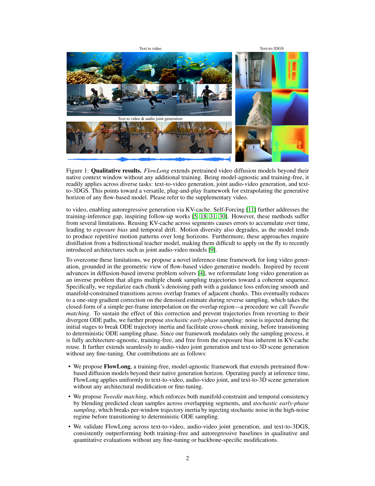
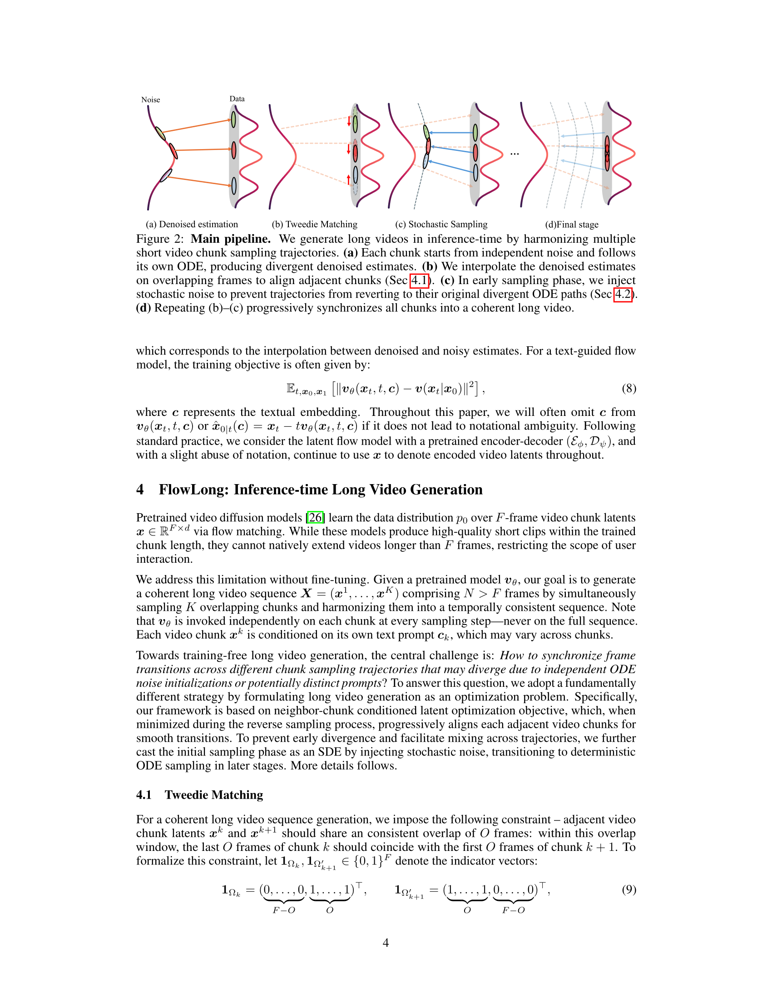
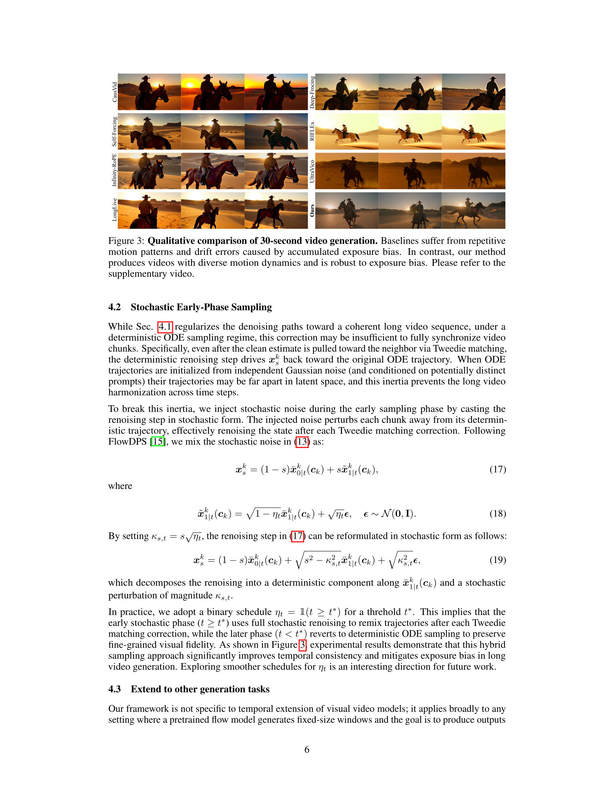

## 긴 영상 생성, 왜 어려운가요?

비디오 diffusion 모델은 짧은 클립에서는 놀라운 품질을 보여주지만, 학습 길이를 넘어서는 영상을 만들려 하면 품질이 급격히 떨어집니다. 대규모 고품질 긴 영상 데이터가 부족하기 때문에 대부분의 모델이 짧은 클립으로만 학습되죠.

기존 접근은 크게 두 갈래였습니다. 첫째, **bidirectional 모델을 확장**하는 방식(FIFO-Diffusion, RIFLEx, UltraViCo)인데, 특정 아키텍처에 종속되고 영상이 길어질수록 품질이 떨어집니다. 둘째, **autoregressive 방식**(CausVid, Self-Forcing)인데, KV-cache 재사용으로 인해 노출 편향(exposure bias)이 누적되고, 반복적인 모션 패턴이 나타납니다.

FlowLong은 이 두 한계를 모두 극복합니다. 추가 학습 없이, 아키텍처에 구애받지 않고, 오직 추론 시점에서만 작동합니다.

## 핵심 아이디어가 무엇인가요?

FlowLong의 전략은 **겹치는 슬라이딩 윈도우**로 긴 영상을 생성하는 것입니다. 독립적인 가우시안 노이즈에서 시작해 여러 청크를 병렬로 샘플링하면서, 인접한 청크 간 일관성을 맞추는 것이 핵심이죠.

구체적으로 두 가지 기법이 결합됩니다.

### 1. Tweedie Matching

각 청크는 독립적인 ODE 궤적을 따르기 때문에, 그대로 두면 인접 청크의 겹치는 구간(overlap)이 서로 달라집니다. 여기서 FlowLong은 **Tweedie 공식으로 추정한 깨끗한 샘플(clean estimate)을 겹치는 프레임에서 보간**합니다.

수학적으로 보면, 이 과정은 diffusion inverse solver의 guidance loss를 최적화하는 것과 동등합니다. 즉, 인접 청크의 denoised estimate을 부드럽게 블렌딩하는 단순한 프레임 단위 보간인데, 데이터 매니폴드 위에서 이루어지기 때문에 **manifold constraint**를 자연스럽게 만족합니다.

논문에서는 이것이 단순한 보간 이상이라고 강조합니다. DDS(Diffusion Solver) 프레임워크와 동일한 구조를 가져, 깨끗한 데이터 매니폴드 상에서 최적화가 이루어지는 것이 핵심이라고 하네요.

### 2. Stochastic Early-Phase Sampling

Tweedie matching으로 궤적을 맞춰도, 결정론적 ODE 샘플링에서는 관성 때문에 원래 궤적으로 되돌아가는 문제가 있습니다. 서로 다른 노이즈에서 시작한 궤적은 잠재 공간에서 멀리 떨어져 있으니까요.

FlowLong은 초기 단계(노이즈가 높은 구간)에서 **확률적 노이즈를 주입**해 이 관성을 깨뜨립니다. 각 Tweedie matching 수정 후에 새로운 노이즈를 섞어 궤적을 재배열하는 거죠. 이후 임계값 이하에서는 다시 결정론적 ODE로 전환해 시각적 충실도를 보존합니다.

이 하이브리드 방식 덕분에 긴 영상에서도 모션 다양성이 유지되고, 노출 편향으로 인한 에러 누적이 사실상 제거됩니다.

## 기존 방법과 어떻게 다른가요?

가장 큰 차이는 **KV-cache를 전혀 사용하지 않는다**는 점입니다. Autoregressive 모델들은 이전 프레임의 키-값 쌍을 캐시에 저장해 재사용하는데, 이것이 바로 에러 누적과 모션 반복의 원인이 됩니다.

FlowLong은 모든 청크를 독립적인 가우시안 노이즈에서 병렬로 샘플링합니다. 청크 간 유일한 연결고리는 Tweedie matching을 통한 overlap 영역의 정렬뿐이죠. 구조적으로 노출 편향이 발생할 여지가 없습니다.

또한 bidirectional 모델 확장 방식(RIFLEx, UltraViCo)은 아키텍처별 수정이 필요하지만, FlowLong은 백본을 건드리지 않습니다. 새로운 아키텍처가 나와도 바로 적용할 수 있죠.

## 실험 결과는 어때요?

Wan 2.1-T2V-1.3B 기준 30초 영상 생성에서 VBench 종합 점수 **0.8233**을 기록했습니다. 모든 autoregressive baseline(CausVid, Self-Forcing, Deep-Forcing, ∞-RoPE, LongLive)을 상당한 차이로 앞섭니다.

특히 **Dynamic Degree(모션 다양성)**에서 압도적인데, 60초 영상에서도 0.8200을 기록해 2위인 Deep-Forcing(0.5253)을 크게 상회합니다. 길어져도 모션이 단조로워지지 않는 거죠.

60초 영상에서도 종합 1위를 유지하며, bidirectional 모델 확장 방식들이 30초 이상에서 거의 작동하지 못하는 것과 대조적입니다.

## 비디오 말고 다른 응용도 있나요?

FlowLong은 "고정 크기 윈도우를 생성하는 flow 모델을 더 긴 출력으로 확장하는" 일반적인 프레임워크라서, 비디오 외에도 적용할 수 있습니다.

**오디오-비디오 동시 생성**에서는 LTX-2를 확장해 더 긴 오디오-비디오 시퀀스를 위상 동기(phase-locked) 상태로 생성합니다. **Text-to-3DGS**에서는 VIST3A를 확장해 원래는 불가능했던 넓은 시점의 3D 장면을 텍스트만으로 생성합니다.

두 경우 모두 파인튜닝 없이, 동일한 Tweedie matching + stochastic renoising을 그대로 적용합니다.

## 요약하면

FlowLong은 긴 영상 생성을 inverse problem으로 재정의한 깔끔한 프레임워크입니다. 핵심은 두 가지:

- **Tweedie matching**: 인접 청크의 denoised estimate을 매니폴드 위에서 보간해 일관성 확보
- **Stochastic early-phase sampling**: 초기에 노이즈를 주입해 궤적 관성을 깨고 교차 청크 믹싱 유도

학습 없이, 아키텍처 변경 없이, 추론 시점에서만 작동하면서 기존 모든 baseline을 능가합니다. 그리고 비디오 생성을 넘어 오디오-비디오, 3D 장면 생성까지 자연스럽게 확장되는 범용성을 보여줍니다.

새로운 아키텍처가 계속 등장하는 비디오 생성 분야에서, "백본을 수정하지 않고 길이만 늘리는" 접근의 실용적 가치는 꽤 크다고 봅니다.
