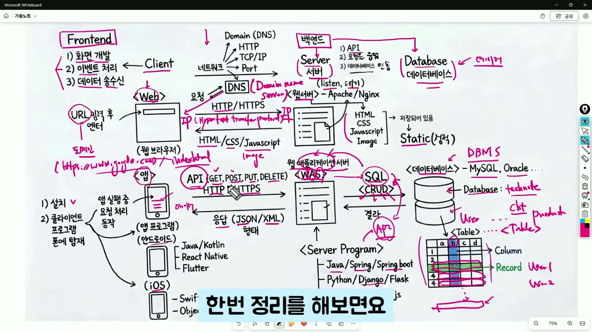
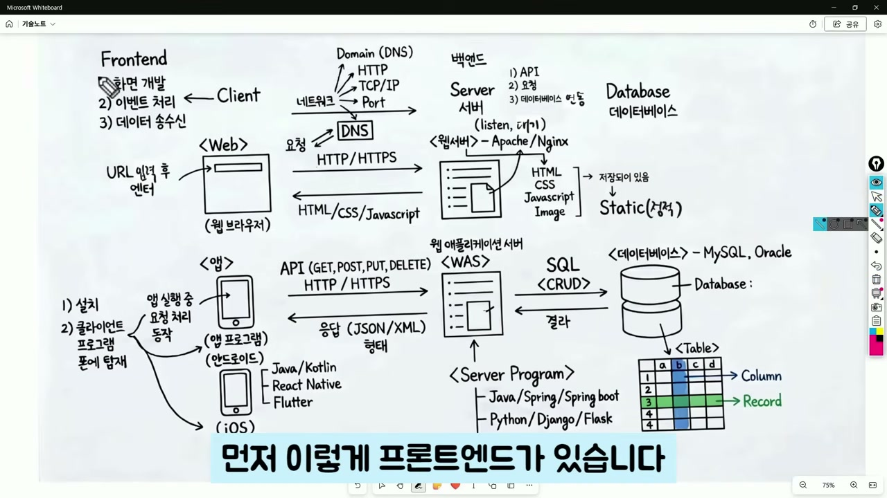
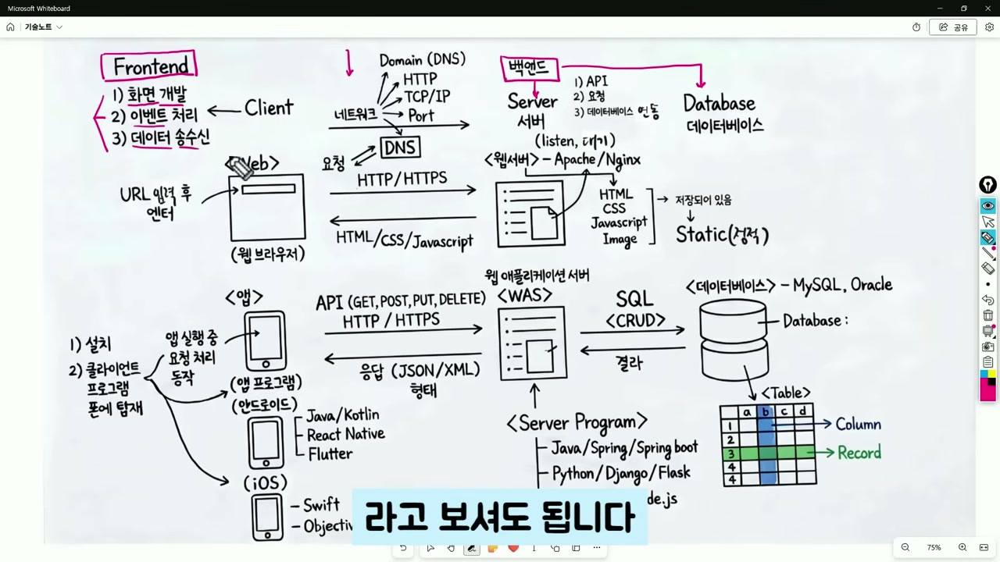
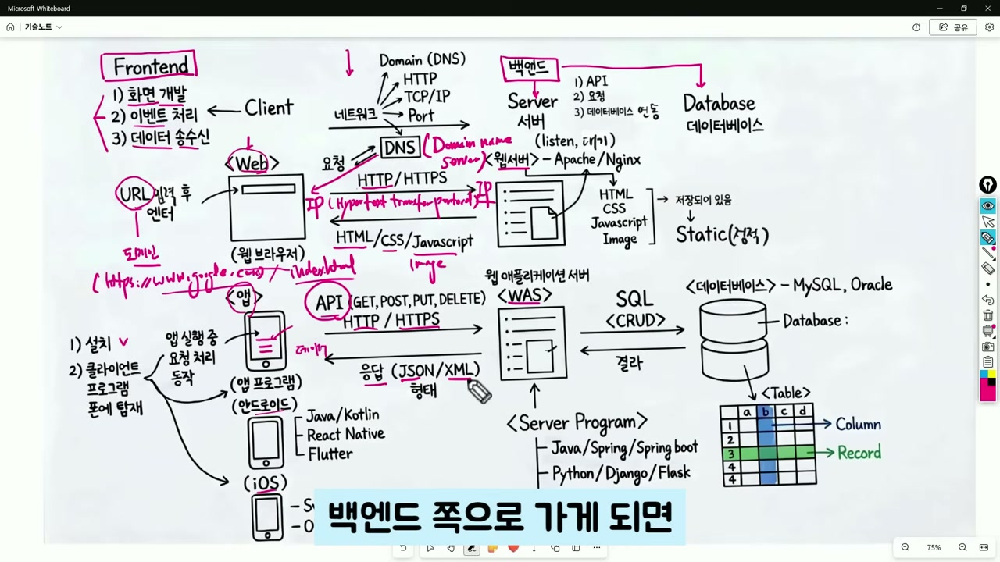
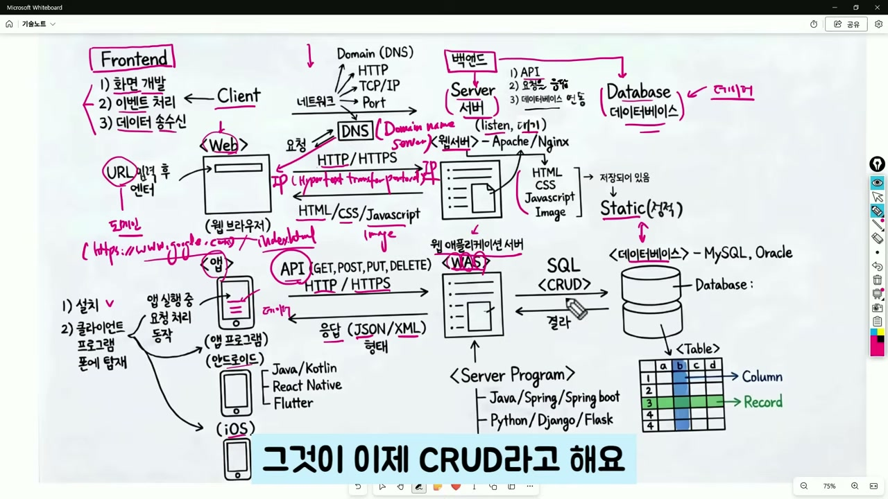
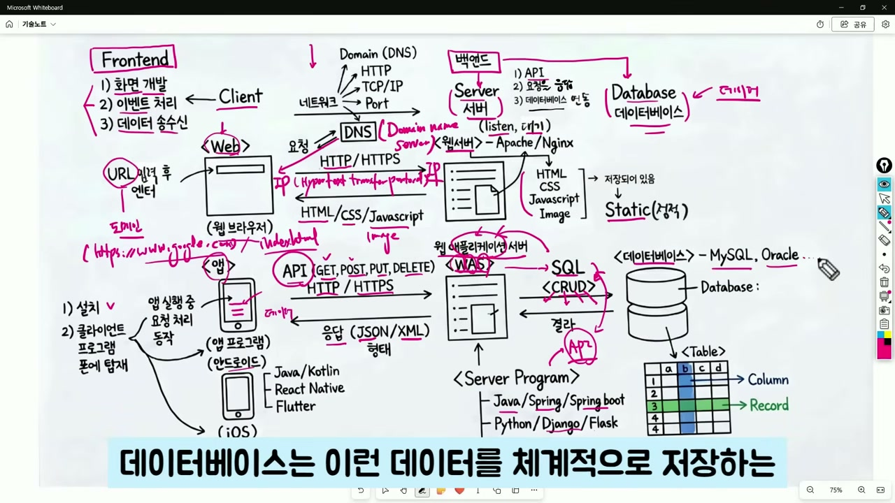

# 프론트엔드 백엔드 데이터베이스 전체 구조를 한눈에 이해하는 바이브코딩 가이드

IT 시스템이 어떻게 돌아가는지 궁금했던 적 있으신가요? "프론트엔드", "백엔드", "데이터베이스"라는 단어는 많이 들어봤지만, 이것들이 어떻게 연결되어 하나의 서비스를 만드는지 전체 그림을 그리기는 쉽지 않습니다. 이 글에서는 유튜브 채널 **기술노트with 알렉**의 [바이브코딩 영상](https://youtu.be/l5z6UNa-ons)을 바탕으로, 프론트엔드부터 데이터베이스까지 전체 시스템 구조를 비전공자도 이해할 수 있도록 정리했습니다.

*Figure 1: 프론트엔드 → 백엔드 → 데이터베이스 전체 흐름 구성도 (출처: 기술노트with 알렉)*

---

## 프론트엔드란? 사용자가 보는 화면의 모든 것

프론트엔드란 사용자가 직접 눈으로 보고 손으로 조작하는 화면 영역을 말합니다. 웹 브라우저에서 열리는 웹사이트든, 스마트폰에 설치된 앱이든 모두 프론트엔드에 해당합니다.

프론트엔드의 핵심 역할은 세 가지입니다.

- **화면 개발**: 사용자에게 보여지는 UI를 구성합니다.
- **이벤트 처리**: 버튼 클릭, 스크롤, 입력 같은 사용자 행동에 반응합니다.
- **데이터 송수신**: 서버와 통신하여 필요한 데이터를 주고받습니다.

*Figure 2: 프론트엔드의 3대 핵심 기능 — 화면, 이벤트, 데이터 송수신 (출처: 기술노트with 알렉)*

> **비전공자를 위한 용어 설명:** 프론트엔드는 식당의 홀과 같습니다. 손님(사용자)이 메뉴판(화면)을 보고, 주문 버튼(이벤트)을 누르면, 주방(서버)으로 주문이 전달되는 구조입니다.

---

## 웹과 앱, 무엇이 다를까?

프론트엔드는 크게 **웹**과 **앱** 두 가지 형태로 나뉩니다.

### 웹 (Web)

웹 브라우저에서 URL을 입력하면 서버에 접속하게 됩니다. 이때 URL은 사람이 이해하기 쉽게 만든 **도메인**(예: www.google.com)으로 되어 있지만, 실제 접속은 **DNS**(Domain Name Server)가 도메인을 IP 주소로 변환해서 이루어집니다. 웹 화면은 **HTML**(뼈대), **CSS**(디자인), **JavaScript**(동적 기능), 그리고 이미지들로 구성됩니다.

### 앱 (App)

앱은 모바일 기기에 직접 설치되는 클라이언트 프로그램입니다.

| 구분 | 개발 언어/도구 | 특징 |
|------|---------------|------|
| Android | Java, Kotlin, Android Studio | 구글 생태계 |
| iOS | Swift, Objective-C, Xcode | 애플 생태계 |
| 크로스 플랫폼 | React Native, Flutter | 한 번에 양쪽 OS 지원 |

*Figure 3: 웹과 앱의 프론트엔드 구조 비교 (출처: 기술노트with 알렉)*

웹은 HTTP/HTTPS 프로토콜을 통해 **웹 서버**에 접속하고, 앱은 **API**를 통해 **WAS(웹 애플리케이션 서버)**에 요청을 보냅니다. 응답 데이터는 주로 **JSON** 형태로 전달됩니다.

---

## 백엔드: 서버와 데이터베이스를 잇는 두뇌

백엔드는 사용자 눈에 보이지 않는 서버 영역입니다. 클라이언트의 요청을 받아 처리하고, 데이터베이스에서 데이터를 가져와 응답하는 역할을 합니다.

### 웹 서버 vs WAS

| 구분 | 웹 서버 (Apache, Nginx) | WAS (Tomcat, Node.js 등) |
|------|------------------------|--------------------------|
| 역할 | 정적 파일(HTML, CSS, JS, 이미지) 제공 | 동적 처리(비즈니스 로직, DB 연동) |
| 데이터 성격 | 고정된 파일(Static) | 요청마다 달라지는 데이터(Dynamic) |
| 비유 | 미리 만들어둔 전단지 나눠주기 | 주문에 맞춰 요리하기 |

*Figure 4: 웹 서버와 WAS의 역할 분담 (출처: 기술노트with 알렉)*

> **비전공자를 위한 용어 설명:** 웹 서버는 이미 인쇄된 메뉴판을 나눠주는 직원, WAS는 주문을 받고 주방에 전달하는 매니저라고 생각하면 됩니다.

### 서버 개발 언어와 프레임워크

백엔드 서버는 다양한 언어와 프레임워크로 개발됩니다.

| 언어 | 프레임워크 | 특징 |
|------|-----------|------|
| Java | Spring, Spring Boot | 기업용 대규모 시스템에 강점 |
| Python | Django, Flask | 빠른 개발, AI/ML 연동 유리 |
| JavaScript | Node.js, Express | 프론트/백엔드 언어 통일 가능 |

---

## API와 CRUD: 서버가 하는 핵심 작업

서버의 가장 중요한 역할은 **API 개발**입니다. API(Application Programming Interface)는 클라이언트와 서버가 데이터를 주고받는 규칙이자 통로입니다.

API 요청은 **CRUD**라는 네 가지 기본 작업과 매핑됩니다.

| API 메서드 | CRUD 작업 | SQL 명령 | 설명 |
|-----------|-----------|---------|------|
| GET | Read (조회) | SELECT | 데이터 읽기 |
| POST | Create (생성) | INSERT | 새 데이터 만들기 |
| PUT | Update (수정) | UPDATE | 기존 데이터 변경 |
| DELETE | Delete (삭제) | DELETE | 데이터 제거 |

*Figure 5: API 메서드와 CRUD 작업의 매핑 관계 (출처: 기술노트with 알렉)*

> **비전공자를 위한 용어 설명:** CRUD는 엑셀 파일을 다루는 것과 비슷합니다. 새 행 추가(Create), 내용 읽기(Read), 셀 수정(Update), 행 삭제(Delete) — 데이터베이스 작업의 대부분이 이 네 가지입니다.

---

## 데이터베이스: 모든 데이터가 저장되는 곳

데이터베이스란 데이터를 체계적으로 저장하고 관리하는 소프트웨어입니다. 대표적으로 **MySQL**, **Oracle**, **PostgreSQL** 등이 있습니다.

### 테이블 구조 이해하기

데이터베이스 안에는 여러 개의 **테이블**이 있습니다. 테이블은 엑셀 시트와 비슷한 구조입니다.

- **레코드(Record)**: 가로 한 줄, 하나의 데이터 항목 (예: 사용자 1명의 정보)
- **컬럼(Column)**: 세로 항목, 데이터의 속성 (예: 이름, 이메일, 비밀번호)

| 컬럼 → | 아이디 | 이름 | 이메일 |
|--------|-------|------|--------|
| 레코드 1 | user01 | 홍길동 | hong@email.com |
| 레코드 2 | user02 | 김철수 | kim@email.com |

*Figure 6: 데이터베이스의 테이블, 레코드, 컬럼 구조 (출처: 기술노트with 알렉)*

서버의 애플리케이션은 **SQL**(Structured Query Language)이라는 언어를 사용하여 데이터베이스를 조작합니다. SQL을 통해 데이터를 조회하고, 저장하고, 수정하고, 삭제합니다.

---

## 전체 흐름 정리: 앱에서 버튼 하나를 누르면 어떤 일이 벌어질까?

모든 구성 요소를 연결해서 전체 흐름을 정리하면 다음과 같습니다.

1. 사용자가 **앱에서 조회 버튼**을 클릭합니다.
2. 앱이 **API를 통해 서버(WAS)에 요청**을 보냅니다.
3. WAS의 애플리케이션이 **SQL을 데이터베이스에 전달**합니다.
4. 데이터베이스가 해당 **테이블에서 데이터를 조회**하여 응답합니다.
5. WAS가 데이터를 **JSON 형태로 가공**하여 앱에 전달합니다.
6. 앱이 받은 데이터를 **화면에 표시**합니다.

이 과정은 웹이든 앱이든 거의 동일한 구조로 이루어집니다. 세부적인 차이는 있지만, **프론트엔드 → 서버 → 데이터베이스 → 서버 → 프론트엔드**라는 왕복 흐름이 IT 시스템의 기본 골격입니다.

---

## 자주 묻는 질문 (FAQ)

**Q: 프론트엔드 개발자와 백엔드 개발자의 차이가 뭔가요?**

프론트엔드 개발자는 사용자가 보는 화면(웹/앱)을 만들고, 백엔드 개발자는 서버와 데이터베이스를 다루는 보이지 않는 영역을 담당합니다. 둘 다 할 수 있는 개발자를 풀스택 개발자라고 부릅니다.

**Q: 바이브코딩으로 이 모든 것을 혼자 만들 수 있나요?**

네, 최근 AI 코딩 도구의 발전으로 프론트엔드, 백엔드, 데이터베이스를 한 사람이 구축하는 것이 점점 현실적이 되고 있습니다. 전체 구조를 이해하는 것이 그 첫걸음입니다.

**Q: SQL을 반드시 배워야 하나요?**

백엔드 개발을 한다면 SQL 기본은 필수입니다. CRUD(생성, 조회, 수정, 삭제) 정도의 기본 문법만 알아도 실무에서 충분히 활용할 수 있습니다.

---

## About the Author

이 글은 유튜브 채널 [기술노트with 알렉](https://www.youtube.com/@기술노트with알렉)의 ["프론트엔드 백엔드 데이터베이스 전체를 20분만에 보이게 해드립니다"](https://youtu.be/l5z6UNa-ons) 영상을 요약·정리한 것입니다. 원본 영상에서는 더 자세한 설명과 시각 자료를 확인할 수 있습니다.
