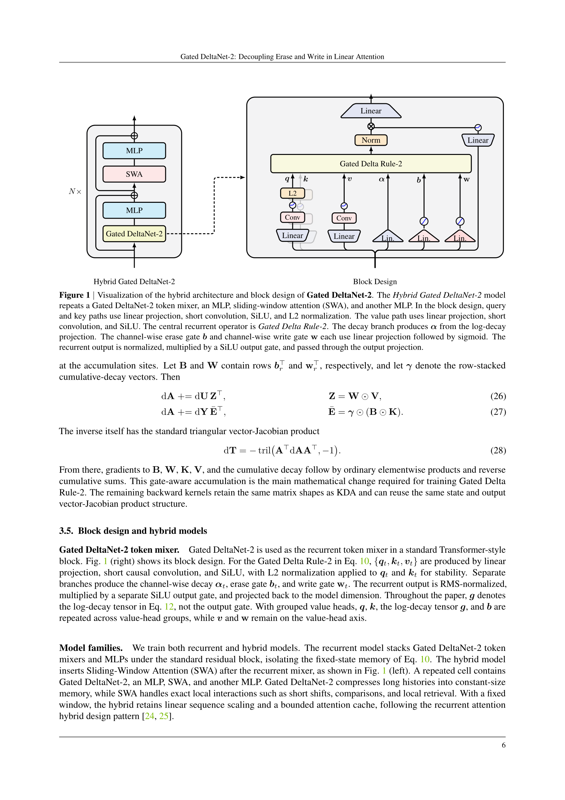
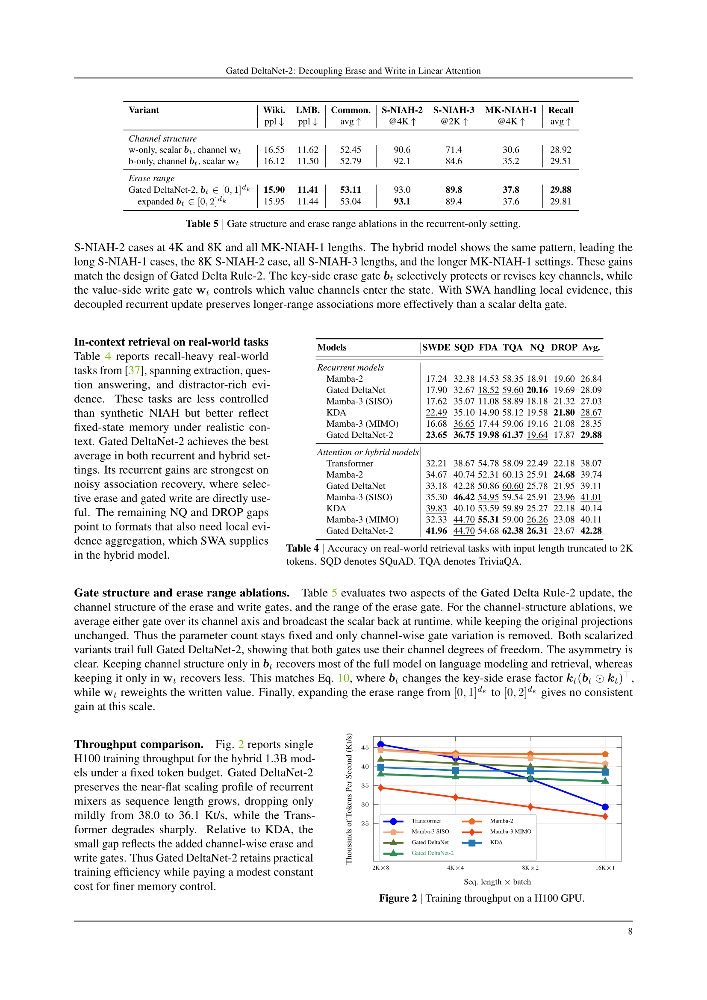

원본 논문: [Gated DeltaNet-2: Decoupling Erase and Write in Linear Attention](https://arxiv.org/abs/2605.22791) (Ali Hatamizadeh, Yejin Choi, Jan Kautz · NVIDIA · 2026년 5월)

형식: 논문 내용을 바탕으로 핵심 질문과 답변을 인터뷰 스타일로 재구성함.

코드: [github.com/NVlabs/GatedDeltaNet-2](https://github.com/NVlabs/GatedDeltaNet-2)

---

선형 어텐션은 소프트맥스 어텐션의 무한 캐시를 고정 크기 순환 상태로 바꿉니다. 시퀀스 혼합을 선형 시간으로, 디코딩을 상수 메모리로 만들죠. 문제는 "뭘 잊을까"만이 아니라, **이 압축 메모리를 어떻게 편집할까**입니다.

Gated DeltaNet-2는 바로 이 편집 문제를 겨냥합니다.

## Q1. 기존 선형 어텐션의 한계가 뭔가요?

소프트맥스 어텐션은 모든 토큰 쌍을 계산하니까 시퀀스 길이에 제곱으로 비용이 늘어납니다. 선형 어텐션은 이걸 고정 크기 행렬 상태 $S_t$로 바꿔서 길이가 늘어나도 메모리가 안 커지게 합니다.

근데 상태가 고정 크기니까, 많은 연관 정보가 같은 공간을 공유해야 합니다. 그러면 **간섭(interference)** 이 생겨서 정확한 검색이 어려워집니다.

Mamba-2는 데이터 의존적 감쇠(decay)로 이걸 완화하고, DeltaNet은 델타 룰로 기존 연관을 덮어쓰는 기능을 넣었고, Gated DeltaNet은 둘을 결합했습니다. KDA는 감쇠를 채널 단위로 세밀화했고요.

**그런데 여전히 하나의 스칼라 게이트가 두 가지 역할을 동시에 하고 있었습니다.** 지울 때도 그 게이트를 쓰고, 쓸 때도 같은 게이트를 쓰는 거죠.

## Q2. 그 두 가지 역할이 뭔가요?

**지우기(erase)** 와 **쓰기(write)** 입니다.

지우기는 **키 쪽(key-side)** 작업이에요. 기존 메모리에서 어떤 좌표를 읽어서 지울지 결정합니다.

쓰기는 **값 쪽(value-side)** 작업이에요. 들어오는 새 값의 어떤 좌표를 메모리에 넣을지 결정합니다.

이 두 결정이 같은 축에 있지 않은데, 기존 KDA와 Gated DeltaNet은 하나의 스칼라 $\beta_t$로 둘 다 제어합니다. 이건 제약이지 필수가 아니에요.

## Q3. Gated DeltaNet-2는 어떻게 분리하나요?

채널 단위 **erase 게이트** $b_t$와 채널 단위 **write 게이트** $w_t$를 독립적으로 만듭니다.

- $b_t \in [0,1]^{d_k}$: 키 좌표별로 기존 읽기를 얼마나 지울지
- $w_t \in [0,1]^{d_v}$: 값 좌표별로 새 값을 얼마나 넣을지

업데이트 식이 이렇게 바뀝니다:

$$S_t = (I - k_t(b_t \odot k_t)^\top) D_t S_{t-1} + k_t(w_t \odot v_t)^\top$$

지우기 항의 오른쪽 인자가 $b_t \odot k_t$로 채널 선택적이 되고, 쓰기 항이 $w_t \odot v_t$로 채널 선택적이 됩니다.

$b_t = \beta_t \mathbf{1}$, $w_t = \beta_t \mathbf{1}$로 두면 KDA로 돌아가고, 거기서 감쇠까지 스칼라로 묶으면 Gated DeltaNet으로 돌아갑니다. 즉, 기존 모델들은 Gated DeltaNet-2의 tied subspace인 거죠.

## Q4. 학습은 여전히 효율적인가요?

네. 채널 단위 감쇠를 누적해서 rank-one erase 인자에 흡수시키면, 순수 비대칭 델타 순환으로 정규화됩니다. chunkwise WY 알고리즘 구조가 KDA와 같은 형태를 유지해요.

backward pass에서 게이트가 분리되어 있어서, erase 쪽 게이트 요소와 write 쪽 게이트 요소를 개별적으로 누적해야 합니다. 스칼라 게이트 때 쓰던 단축이 안 통하죠. 저자들은 이 **gate-aware backward**가 수학적으로 필요한 주요 변경이라고 설명합니다.

Triton fused 커널로 구현되어 있습니다.

## Q5. 하이브리드 구조는 어떻게 돼요?

그림 1 왼쪽에 나오는 하이브리드 모델은 이런 반복 셀을 $N$번 쌓습니다:

1. **Gated DeltaNet-2** (순환 토큰 믹서)
2. **MLP**
3. **Sliding-Window Attention (SWA)**
4. **MLP**

Gated DeltaNet-2가 긴 문맥을 고정 크기 메모리에 압축하면, SWA가 짧은 범위의 정확한 로컬 상호작용을 처리합니다. 윈도우가 고정이니 시퀀스에 대해 선형 스케일링을 유지합니다.

## Q6. 실험 결과는 어때요?

1.3B 파라미터, FineWeb-Edu 100B 토큰으로 학습한 결과입니다.

### 언어 모델링 & 상식 추론 (Table 2)

| 모델 | Wiki ppl ↓ | LMB ppl ↓ | 평균 ↑ |
|---|---|---|---|
| **순환 모델** | | | |
| Mamba-2 | 16.79 | 12.38 | 51.82 |
| Gated DeltaNet | 16.40 | 11.89 | 52.07 |
| KDA | 16.81 | 11.68 | 52.28 |
| Mamba-3 MIMO | 16.45 | 11.66 | 52.39 |
| **Gated DeltaNet-2** | **15.90** | **11.41** | **53.11** |
| **하이브리드 모델** | | | |
| Transformer | 19.22 | 13.72 | 50.86 |
| KDA | 16.01 | 10.66 | 52.68 |
| Mamba-3 MIMO | 15.81 | 10.92 | 52.72 |
| **Gated DeltaNet-2** | **15.62** | **10.43** | **53.97** |

순환 모델과 하이브리드 모델 모두에서 Gated DeltaNet-2가 최고 평균을 기록했습니다. 순환 상태 크기는 같으니, 성능 향상은 **더 강력한 업데이트 룰**에서 온 겁니다.

### 긴 문맥 검색 — RULER (Table 3)

이게 Gated DeltaNet-2의 진가가 가장 잘 드러나는 부분입니다.

Multi-Key NIAH (여러 바늘이 건초더미에 숨겨진 상태에서 검색) 결과를 보면:

| 모델 | MK-NIAH-1 @1K | @2K | @4K |
|---|---|---|---|
| **순환 모델** | | | |
| Mamba-2 | 29.0 | 21.2 | 21.4 |
| KDA | 54.0 | 44.2 | 28.0 |
| Mamba-3 MIMO | 49.4 | 19.2 | 18.0 |
| **Gated DeltaNet-2** | **72.6** | **51.4** | **37.8** |
| **하이브리드 모델** | | | |
| Transformer | 75.6 | 66.6 | 38.2 |
| KDA | 91.0 | 78.4 | 44.8 |
| **Gated DeltaNet-2** | **93.0** | **84.6** | **48.0** |

고정 크기 상태가 여러 연관을 구분해야 하는 multi-key 검색에서 Gated DeltaNet-2가 압도적이에요. 순환 모델에서 Mamba-2의 21.4% vs Gated DeltaNet-2의 37.8% — 거의 두 배 차이입니다.

## Q7. 처리량은 어떤가요?

Figure 2에서 H100 단일 GPU 처리량을 비교합니다. 시퀀스 길이가 2K에서 16K로 8배 늘어나도:

- **Transformer**: 46 → 29 Kt/s (37% 하락)
- **Gated DeltaNet-2**: 38 → 36 Kt/s (5% 하락)
- **Mamba-2**: 44 → 43 Kt/s (2% 하락)

Gated DeltaNet-2가 KDA보다 약간 느린 건 channel-wise erase/write 게이트의 추가 비용 때문이에요. 저자들은 이 정도 상수 오버헤드는 작고, 대신 더 정교한 메모리 제어를 얻는다고 주장합니다.

## Q8. 어블레이션에서 뭘 알 수 있나요?

Table 5에서 흥미로운 결과가 나옵니다.

erase 게이트 $b_t$만 채널 구조를 유지하고 write 게이트 $w_t$를 스칼라로 만들면, 언어 모델링과 검색 대부분을 회복합니다. 반대로 write 게이트만 채널로 두고 erase를 스칼라로 만들면 회복이 덜 됩니다.

**즉, erase 쪽 채널 구조가 write 쪽보다 더 중요합니다.** 이건 식 10에서 $b_t$가 키 쪽 erase 인자 $k_t(b_t \odot k_t)^\top$를 바꾸는 역할이기 때문이에요. 어떤 키 채널을 지울지가 어떤 값 채널을 쓸지보다 더 큰 영향을 미친다는 뜻입니다.

## 이 논문이 보여준 것

Gated DeltaNet-2의 핵심 기여는 단순합니다: **지우기와 쓰기를 분리했다**. 하나의 스칼라가 두 역할을 묶고 있던 걸, 채널 단위 게이트 두 개로 풀었습니다.

결과적으로 1.3B 규모에서 Mamba-2, Gated DeltaNet, KDA, Mamba-3 변형들 전체에 걸쳐 가장 강한 전반적 성능을 냈습니다. 특히 **여러 키가 경쟁하는 긴 문맥 검색**에서 차이가 컸어요. 고정 크기 메모리가 간섭을 어떻게 다루느냐가 순환 선형 모델의 핵심 압박점인데, Gated Delta Rule-2가 바로 그 지점을 겨냥한 겁니다.

## 한 줄 결론

선형 어텐션의 델타 룰에서 "지우기"와 "쓰기"를 분리하니, 고정 크기 메모리의 검색 능력이 확연히 올라갔다.
