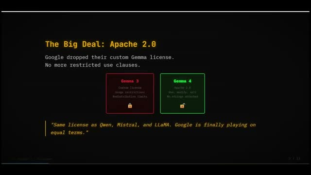
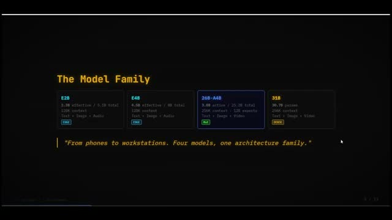
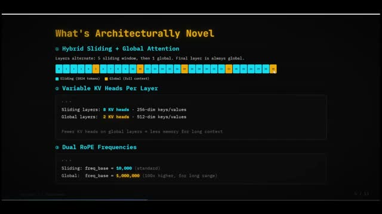
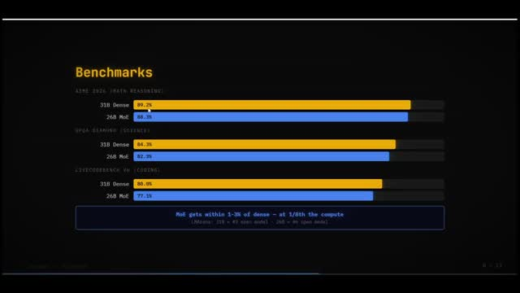
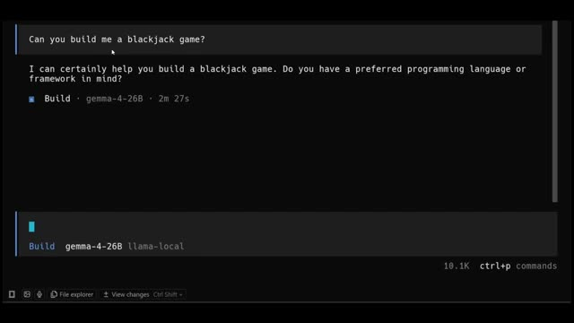

> 원본 영상: [First Look at Google's Gemma 4: Architecture Breakdown and Real Testing](https://www.youtube.com/watch?v=LTYF2UNXG2M)

구글이 공개한 **Gemma 4**는 단순히 “새 모델이 나왔다” 수준으로 보기엔 아까운 발표입니다. 이번 세대에서 가장 눈에 띄는 변화는 성능 수치보다도 **Apache 2.0 라이선스** 전환, **긴 컨텍스트를 현실적으로 다루기 위한 구조적 설계**, 그리고 **로컬 환경에서도 실제 워크플로우에 넣어볼 수 있는 접근성**입니다.

이번 글은 Onchain AI Garage의 영상을 바탕으로, 블로그 관점에서 중요한 장면을 캡처해 핵심 내용을 빠르게 정리한 요약본입니다.

## 한눈에 보는 핵심 요약

- **Gemma 4의 진짜 포인트는 Apache 2.0 라이선스**다. 기업과 개발자가 훨씬 자유롭게 도입·배포·상용화할 수 있다.
- 모델은 **E2B / E4B / 26B MoE / 31B Dense**의 네 가지 축으로 나뉜다.
- **26B MoE는 총 26B급이지만 추론 시 약 3.8B만 활성화**되어, 체감 속도와 효율이 좋다.
- **31B Dense는 오픈 모델 상위권 성능**을 겨냥한 플래그십 포지션이다.
- 구조적으로는 **슬라이딩 윈도우 + 글로벌 어텐션을 섞은 하이브리드 설계**가 핵심이다.
- **256K 컨텍스트**를 말로만이 아니라 메모리 효율까지 고려해 구현하려는 설계가 돋보인다.
- 영상 후반부에서는 실제로 **RTX 3060 환경에서 llama.cpp와 OpenCode로 실험**하는 장면도 나온다.

## 왜 Apache 2.0 전환이 가장 중요할까?

영상 초반에서 발표자는 Gemma 4의 가장 큰 뉴스가 **모델 자체보다도 라이선스 변화일 수 있다**고 말합니다. 이전 세대의 커스텀 라이선스는 상용 활용이나 재배포 측면에서 심리적·법적 장벽이 있었는데, 이번에는 Apache 2.0으로 바뀌면서 상황이 달라졌습니다.

이 변화가 중요한 이유는 분명합니다.

1. **기업 도입이 쉬워집니다.**
   법무 검토 부담이 줄어들고, 사내 제품/서비스에 붙이기 쉬워집니다.
2. **오픈소스 생태계 확장이 빨라집니다.**
   파생 프로젝트, 튜닝 모델, 도구 통합이 훨씬 자연스럽게 일어납니다.
3. **“좋은 모델”에서 “쓸 수 있는 모델”로 넘어갑니다.**
   현업에서는 성능보다도 라이선스가 최종 도입을 가르는 경우가 많습니다.

Google 공식 블로그도 같은 메시지를 강조합니다. Gemma 4는 **Apache 2.0 라이선스**로 공개되어, 개발자가 데이터·인프라·배포 환경을 더 자유롭게 통제할 수 있다고 설명합니다.

## Gemma 4 모델 라인업: 누구를 위한 구성인가?

영상에서는 Gemma 4가 네 가지 축으로 출시되었다고 설명합니다.

- **E2B / E4B**: 모바일·엣지 중심
- **26B MoE**: 효율과 성능의 균형
- **31B Dense**: 최고 성능 지향

이 구성이 흥미로운 이유는, 단순히 파라미터 수를 늘리는 방향이 아니라 **사용 환경별 최적화 전략**이 분명하기 때문입니다.

### 1) E2B / E4B
작고 가벼운 모델로, 모바일이나 온디바이스 시나리오를 강하게 의식한 포지션입니다. 발표 영상에서는 이 작은 모델들이 **오디오 입력까지 지원**한다는 점도 강조합니다.

### 2) 26B MoE
가장 실전적인 선택지처럼 보이는 모델입니다. 총 파라미터 수는 크지만, 실제 추론에서는 일부만 활성화되므로 **작은 모델처럼 빠르게 돌리면서도 더 큰 모델에 가까운 품질**을 노립니다.

### 3) 31B Dense
튜닝 베이스나 최고 성능 중심 작업에 더 적합한 모델로 소개됩니다. 공식 자료 기준으로도 오픈 모델 리더보드 상위권을 겨냥합니다.

## 구조적으로 뭐가 새롭나: 하이브리드 어텐션 설계

이 영상에서 가장 흥미로운 부분은 성능 자랑보다 **구조적 선택을 비교적 쉽게 풀어준 점**입니다. 발표자가 강조한 핵심은 세 가지입니다.

### 1) Sliding Window + Global Attention 혼합
모든 레이어가 전체 문맥을 다 보게 만들면 비용이 너무 큽니다. 그래서 Gemma 4는 여러 레이어는 **가까운 토큰만 보는 슬라이딩 윈도우 어텐션**을 쓰고, 주기적으로 **전체 문맥을 보는 글로벌 어텐션**을 넣는 구조를 택했다고 설명합니다.

즉,
- 평소에는 **싸게(local)** 계산하고
- 필요한 시점에만 **넓게(global)** 본다는 전략입니다.

긴 문서를 다룰 때 이 접근은 꽤 설득력이 있습니다. 모든 순간에 비싼 계산을 하지 않고도 전체 문맥 연결성을 유지하려는 설계이기 때문입니다.

### 2) KV heads를 레이어 유형에 따라 다르게 사용
글로벌 레이어와 슬라이딩 레이어의 KV 설정을 다르게 가져가서, 긴 컨텍스트에서 **메모리 사용량을 낮추려는 의도**가 보입니다. 256K 컨텍스트를 마케팅 문구가 아니라 실제 운영 가능한 수준으로 가져가려는 시도라고 볼 수 있습니다.

### 3) 서로 다른 RoPE 주파수
긴 시퀀스에서 위치 정보를 더 안정적으로 다루기 위한 선택으로 설명됩니다. 결국 이 모든 선택은 **긴 컨텍스트를 더 현실적으로 쓰기 위한 설계 패키지**라고 이해하면 됩니다.

## 벤치마크에서 보인 포인트: “무조건 최고”보다 “효율 대비 강함”

영상에서는 Gemma 4와 다른 오픈 모델을 비교하며, 특히 **31B Dense**와 **26B MoE**의 포지션을 설명합니다.

핵심은 이겁니다.

- **31B Dense**는 오픈 모델 상위권 품질을 노린다.
- **26B MoE**는 더 적은 활성 파라미터로도 꽤 근접한 결과를 낸다.
- 즉, Gemma 4의 경쟁력은 단순 최고점이 아니라 **지능 대비 파라미터 효율(intelligence-per-parameter)**에 있다.

Google 공식 글도 같은 방향으로 설명합니다. 31B는 오픈 모델 상위권, 26B는 그보다 더 낮은 계산 비용으로 높은 성능을 내는 효율형 포지션입니다.

## 로컬 실행 장면이 주는 메시지

후반부에서 발표자는 26B MoE 모델을 로컬 PC에서 직접 돌려봅니다. RTX 3060 환경에서 llama.cpp로 질의응답을 해보고, 이어서 OpenCode 같은 코딩 에이전트 흐름에 연결해 간단한 게임 코드를 만들어보는 장면이 나옵니다.

이 장면이 중요한 이유는 **“이론상 가능”이 아니라 “실제로 써볼 수 있음”**을 보여주기 때문입니다.

물론 이 테스트 하나만으로 코딩 성능 전체를 판단하긴 어렵습니다. 다만 적어도 아래 두 가지는 확인됩니다.

- 로컬 환경에서 **완전히 비현실적인 무게급은 아니다**.
- 단순 채팅이 아니라 **에이전트형 워크플로우에 연결해보려는 흐름**이 이미 자연스럽다.

즉, Gemma 4는 “오픈 모델”이라는 상징성만이 아니라, **개인 개발자나 실험가가 자기 장비에서 직접 굴려보는 시대감**과 잘 맞는 모델입니다.

## 교육자·콘텐츠 제작자 관점에서 본 시사점

이 영상을 보며 특히 인상적이었던 건, Gemma 4가 단순히 연구 논문용 모델이 아니라 **설명하기 좋은 모델**이라는 점입니다.

왜냐하면 이번 발표에는 초보자에게도 설명 가능한 메시지가 명확하게 들어 있기 때문입니다.

- 라이선스가 왜 중요한가?
- 작은 모델과 큰 모델은 어떤 역할 차이가 있는가?
- 긴 컨텍스트는 왜 그냥 숫자 싸움이 아닌가?
- 로컬 AI는 어느 수준까지 현실화되고 있는가?

교육 콘텐츠나 블로그 글로 옮길 때도 이 구조가 좋습니다. 단순히 “성능 몇 점”보다, **도입 가능성·활용 시나리오·설계 철학**을 함께 설명할 수 있기 때문입니다.

## 내 한줄 평

Gemma 4는 “성능 좋은 오픈 모델 하나 더”가 아니라,
**오픈 라이선스 + 긴 컨텍스트 설계 + 로컬 실행 가능성**을 한 번에 밀어붙인, 꽤 전략적인 출시라고 보는 편이 맞겠습니다.

특히 Apache 2.0 전환은 앞으로 더 큰 파급력을 만들 가능성이 큽니다. 실제 현업에서는 벤치마크 1~2점 차이보다도, **법적 명확성과 배포 자유도**가 훨씬 더 결정적일 때가 많으니까요.

## 함께 보면 좋은 링크

- 원본 영상: <https://www.youtube.com/watch?v=LTYF2UNXG2M>
- Google 공식 발표: <https://blog.google/innovation-and-ai/technology/developers-tools/gemma-4/>
- Hugging Face Gemma 4 컬렉션: <https://huggingface.co/collections/google/gemma-4>

## 마무리

Gemma 4는 이제 막 공개된 만큼, 앞으로는 실제 코딩 성능·에이전트 안정성·멀티모달 워크플로우에서 어떤 평가를 받을지가 더 중요해질 것 같습니다.

그래도 첫인상만 놓고 보면, 이번 공개는 꽤 강합니다. **“오픈 모델도 이제 진짜 실무 후보가 되는구나”**라는 감각을 다시 한번 줬습니다.
