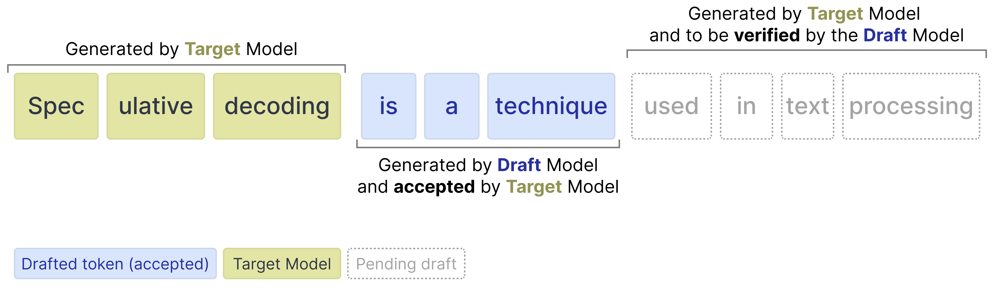
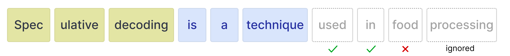
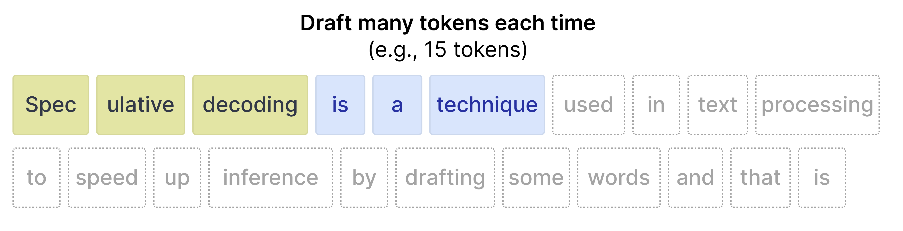
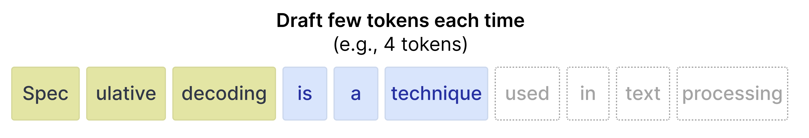

> 원문: [Gemma 4 Multi-Token Prediction (MTP) using Hugging Face Transformers](https://ai.google.dev/gemma/docs/mtp/mtp)

---

Gemma 4 모델의 추론 속도를 개선하기 위해, 주요 모델 라인업과 함께 새로운 자회귀(autoregressive) "drafter" 모델 시리즈가 릴리스되었습니다. 기존처럼 주 Gemma 4 모델("target" 모델)에만 의존하는 대신, draft 모델이 target 모델이 단 하나의 토큰을 처리하는 시간 동안 여러 토큰을 자회귀적으로 예측합니다. 이 기법은 speculative decoding로도 알려져 있습니다.

drafter가 여러 draft 토큰을 예측한 후, target 모델은 제안된 draft 토큰들을 검증(verify)하기만 하면 됩니다. 이 검증은 병렬로 수행되어 추론 속도를 극적으로 향상시킵니다. target 모델이 각 토큰마다 수행해야 하는 forward pass 횟수를 줄여줍니다. drafter는 검증을 위해 토큰 시퀀스를 생성하므로, 이를 Multi-Token Prediction (MTP) head라고 부릅니다.



Gemma 4 패밀리를 위해 릴리스된 draft 모델은 작고 가벼우며, 더 나은 draft 토큰 품질과 추가적인 추론 가속을 위해 target 모델의 activations와 KV-cache를 활용하는 등 여러 가지 향상을 도입했습니다.

이러한 향상은 품질을 보장하면서도 상당한 디코딩 속도 향상을 가져오며, 저지연(low-latency) 및 온디바이스 애플리케이션에 이상적입니다.

## Install Python packages

Gemma 4 및 Gemma 4 assistant 모델 실행에 필요한 Hugging Face 라이브러리를 설치합니다.

```bash
# Install PyTorch & other libraries
pip install torch accelerate

# Install the transformers library
pip install transformers
```

## Load the Models

각 target 모델(Gemma 4 모델 라인업의 주 모델 중 하나)에는 추론 속도 향상을 돕는 assistant가 있습니다. 따라서 두 모델을 로드합니다:

- **Target** (예: `google/gemma-4-E2B-it`): 전체 Gemma 4 target 모델
- **Drafter** (예: `google/gemma-4-E2B-it-assistant`): 후보 토큰을 제안하는 경량 4-layer MTP drafter

drafter는 모델이 더 큰 모델이 어떤 토큰을 예측할지 선택하는 것을 도와주기 때문에 종종 **assistant**라고도 불립니다.

`transformers` 라이브러리를 사용하여 `AutoProcessor`와 `AutoModelForCausalLM` 클래스로 `processor`와 `model` 인스턴스를 생성합니다:

```python
TARGET_MODEL_ID = "google/gemma-4-E2B-it" # @param ["google/gemma-4-E2B-it","google/gemma-4-E4B-it", "google/gemma-4-31B-it", "google/gemma-4-26B-A4B-it"]
ASSISTANT_MODEL_ID = TARGET_MODEL_ID + "-assistant"
```

```python
import torch
from transformers import AutoProcessor, AutoModelForCausalLM

# Target Model
processor = AutoProcessor.from_pretrained(TARGET_MODEL_ID)
target_model = AutoModelForCausalLM.from_pretrained(
    TARGET_MODEL_ID,
    torch_dtype=torch.bfloat16,
    device_map="auto",
)

# Assistant Model (the drafter)
assistant_model = AutoModelForCausalLM.from_pretrained(
    ASSISTANT_MODEL_ID,
    torch_dtype=torch.bfloat16,
    device_map="auto",
)
```

## Gemma 4 with the Assistant

`transformers`에서 assistant를 사용하는 것은 매우 간단합니다. `model.generate` 함수에 assistant 모델을 전달하기만 하면 됩니다:

```python
# Process inputs with the `target_model`
messages = [
    {
        "role": "user",
        "content": "Explain the concepts of speculative decoding and MTP in 3 sentences."
    }
]
input_text = processor.apply_chat_template(messages, tokenize=False, add_generation_prompt=True)
inputs = processor(text=input_text, return_tensors="pt").to(target_model.device)

# `assistant_model=assistant_model` is all you need to enable MTP!
outputs = target_model.generate(
    **inputs,
    assistant_model=assistant_model,
    max_new_tokens=256,
    do_sample=False,
)

# Decode the response into text
response = processor.decode(outputs[0][inputs["input_ids"].shape[1]:], skip_special_tokens=True)
print(response)
```

**출력:**

> **Speculative decoding** is a technique where a smaller, faster language model (the "draft model") generates several candidate tokens, which are then quickly verified by a larger, more accurate model to produce a final, high-quality output much faster than decoding the large model alone. **MTP (Multi-Task Prediction)** involves training a single model to perform multiple related tasks simultaneously, allowing it to leverage shared knowledge across different objectives. Together, these methods aim to significantly accelerate the inference speed of large language models while maintaining or improving output quality.

내부적으로 프로세스는 다음과 같이 동작합니다:

- drafter가 N개의 토큰을 자회귀적으로 생성하여 제안합니다
- target 모델이 N개의 토큰 모두를 **하나의** forward pass에서 검증합니다
- 높은 확률을 가진 draft 토큰은 **수락(accepted)** 됩니다
- 낮은 확률을 가진 draft 토큰은 **거절(rejected)** 됩니다
- target 모델은 forward pass를 수행하므로, 수락되거나 거절된 draft 토큰 수에 관계없이 항상 스스로 1개의 토큰을 생성합니다

## Draft Tokens

drafter는 target 모델이 검증할 토큰을 임의의 개수만큼 생성할 수 있습니다. 하지만 target 모델은 특정 토큰을 거절할 수 있습니다. 거절하면 그 이후의 모든 토큰은 무시됩니다.



따라서 draft 토큰 수에 대한 다양한 값을 사용할 때의 트레이드오프를 이해하는 것이 중요합니다.

### More draft tokens (더 많은 draft 토큰)

많은 토큰(예: 15개)을 draft하면 모든 토큰이 수락되지 않을 가능성이 높습니다. 따라서 낭비되는 컴퓨팅이 발생할 가능성이 더 큽니다. 반면, 수락률이 높을 때는 추론 속도를 높이는 경향이 있습니다.



### Fewer draft tokens (더 적은 draft 토큰)

더 적은 토큰을 draft하면 초기 프롬프트에 더 가까운 위치의 토큰이 더 정확하므로 수락률이 높아지는 경향이 있습니다. 하지만 적은 수의 토큰만 draft되므로 더 빠른 drafter 모델에서 얻을 수 있는 속도 향상이 줄어듭니다.



다행히 `transformers`에서는 `num_assistant_tokens_schedule`을 "heuristic"으로 설정하면 런타임에 draft 토큰 수를 자동으로 조정하므로 사용 사례에 맞는 최적의 값을 실험할 필요가 없습니다:

- **All tokens accepted** — drafter가 프롬프트에 대해 상당히 정확하므로 draft할 토큰 수를 2개 증가시킵니다. draft된 토큰 수를 늘리면, 그 토큰들도 수락되는 경우 속도 향상이 발생할 수 있습니다.
- **Any tokens rejected** — 토큰이 거절되면 draft할 토큰 수를 1개 줄입니다. 토큰 수를 줄이면 target 모델이 대부분의 토큰을 계속 거절하는 경우 너무 많은 draft가 낭비되지 않습니다.

마찬가지로 `num_assistant_tokens`를 업데이트하여 draft 토큰 수를 조정할 수 있습니다:

```python
# Update how many draft tokens are generated at the start of inference
assistant_model.generation_config.num_assistant_tokens = 4

# Update how the number of draft tokens are updated ("heuristic" for a dynamic schedule and "constant" for a constant schedule)
assistant_model.generation_config.num_assistant_tokens_schedule = "heuristic"

# Run with MTP
outputs = target_model.generate(
    **inputs,
    assistant_model=assistant_model,
    max_new_tokens=256,
    do_sample=False,
)

# Decode the response into text
response = processor.decode(outputs[0][inputs["input_ids"].shape[1]:], skip_special_tokens=True)
print(response)
```

**출력:**

> **Speculative decoding** is a technique where a smaller, faster language model (the "draft model") generates several candidate tokens, which are then verified by a larger, more accurate model to quickly produce a high-quality output. **MTP (Multi-Task Prediction)** involves training a single model to perform multiple related tasks simultaneously, allowing it to leverage shared knowledge across different objectives. Together, these methods aim to significantly speed up the inference process of large language models while maintaining or improving output quality.
