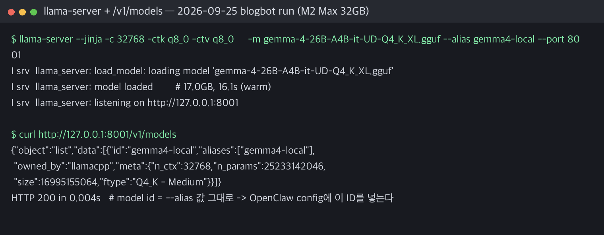
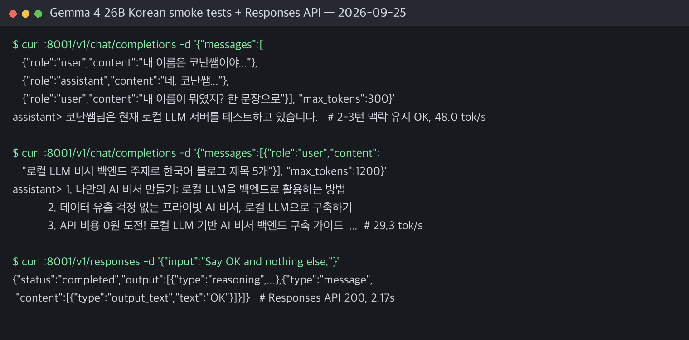

이 글은 **Gemma 4를 로컬에서 실행하고, 그 모델을 OpenClaw의 백엔드로 붙이는 방법**을 정리한 실전 문서다.

2026-09-25에 블로그봇이 이 머신에서 본문 절차를 그대로 다시 실행해서 실측 수치와 실제 막힌 지점을 붙였습니다.

## 핵심 요약 (2026.09.25 재검증)

재검증으로 확인된 핵심은 이겁니다.

- <span style="background-color: #fff59d"><strong>첫 실험은 LM Studio 경로로 가는 게 맞다</strong></span>. 문서 근거가 가장 많고 서버 확인이 쉽다.
- <span style="background-color: #fff59d"><strong>연결의 핵심은 OpenAI 호환 서버와 실제 모델 ID</strong></span>다. 이번 재검증에서 `/v1/models`가 돌려준 ID(`gemma4-local`)를 그대로 쓰는 걸 확인했다.
- <span style="background-color: #fff59d"><strong>Gemma 4 26B-A4B 4bit 계열이 32GB 맥의 현실적 시작점</strong></span>이다. 17.0GB 웨이트가 <span style="background-color: #fff59d"><strong>16.1초(웜 캐시)에 로드</strong></span>됐다.
- <span style="background-color: #fff59d"><strong>thinking 모델이라 max_tokens를 빠듯하게 잡으면 답변이 비어 있다</strong></span>. 이번 실측에서 20/80/400 토큰 캡 전부 재현됐다.

| 항목 | 2026.09.25 실측 (M2 Max 32GB) |
|------|------|
| 모델 로드 (17.0GB UD-Q4_K_XL) | 16.1초 (웜 캐시) |
| `/v1/models` 응답 | HTTP 200, 0.004초 |
| 짧은 응답 생성 속도 | 34.5–48.0 tok/s |
| 2~3턴 맥락 유지 | 성공 (이름·작업 기억) |
| 한국어 제목 5개 생성 | 성공 (29.3 tok/s) |
| Responses API(`/v1/responses`) | HTTP 200, 2.17초 |

## 1. 이 글의 목적

기존에는 "Gemma 4를 OpenClaw에 붙일 수 있나"를 개념적으로 정리하는 수준이었다. 그런데 그걸로는 부족하다.

실제로 필요한 건 이거다.

1. LM Studio와 OpenClaw가 어떤 API로 붙는지
2. Unsloth 계열 웨이트를 왜 llama server 경로로 봐야 하는지
3. M4 Air 32GB에서 어느 모델부터 시작해야 덜 망하는지
4. 처음에 뭘 확인해야 시간 낭비를 줄일 수 있는지

이 글은 그 네 가지를 해결하는 문서다.

## 2. 참고 자료에서 얻은 핵심

### 자료 1. LM Studio Headless CLI와 Gemma 4

GeekNews 정리 글을 보면, LM Studio 0.4.0 이후 `llmster`와 `lms` CLI 덕분에 GUI 없이도 모델 다운로드, 로드, 서버 실행, API 노출이 가능해졌다.

이 머신에도 `lms` 0.4.14-beta+1이 설치돼 있었다.

여기서 중요한 건 세 가지다.

1. Gemma 4 26B-A4B는 MoE 구조라 로컬에서 훨씬 현실적이다.
2. <span style="background-color: #fff59d"><strong>LM Studio는 OpenAI 호환 `/v1`뿐 아니라 Anthropic 호환 `/v1/messages`도 지원한다</strong></span>.
3. Claude Code와 붙이는 예시가 이미 문서화돼 있어서, OpenClaw도 같은 API 관점으로 접근 가능하다.

LM Studio의 진짜 역할은 로컬 채팅 앱을 넘어서는 서버 레이어다.

Gemma 4를 외부 도구에 제공하는 게 핵심 기능이라는 뜻이다.

### 자료 2. Mac mini와 Gemma 4 운영 사례

두 번째 GeekNews 글은 Ollama 중심이지만, 여기서도 가져갈 포인트가 있었다.

핵심은 이거다.

- 로컬 LLM은 "모델이 돌아가냐"만 보면 안 된다.
- 자동 실행, 메모리 유지, API 엔드포인트 지속성, 재부팅 후 복구까지 봐야 한다.

OpenClaw에 붙이는 순간 모델은 상시 백엔드 역할을 한다. 그래서 이 글도 단순 설치보다 운영 가능성 관점으로 쓴다.

## 3. 경로 우선순위

### 1순위

**LM Studio + Gemma 4 + OpenClaw**

왜냐하면:

- 문서 근거가 가장 많고
- `/v1/models`로 상태 확인이 쉽고
- OpenClaw 공식 문서가 LM Studio 경로를 사실상 권장하고
- OpenAI/Anthropic 호환 API를 둘 다 제공하니까

### 2순위

**llama server(Unsloth 계열 웨이트) + OpenClaw**

Unsloth는 모델 실험성은 좋지만, OpenClaw가 직접 보는 건 결국 OpenAI 호환 서버다. 이번 재검증은 웨이트 확보 사정 때문에 2순위 경로(llama server)로 전 과정을 돌렸다. 설정 구조는 동일하다.

연결 성공이 목표면 LM Studio, 성능·양자화 실험이 목표면 Unsloth 웨이트. 이렇게 나눠 기억하면 됩니다.

## 4. 모델 선택 기준

MacBook Air M4 32GB에서 가장 많이 하는 실수가 처음부터 너무 무거운 모델과 양자화로 들어가는 것이다.

### 추천 시작점

- Gemma 4 26B-A4B 4bit 계열

이유:

- 31B 8bit는 사실상 무리
- 26B-A4B는 MoE 구조라 훨씬 현실적
- 로컬 백엔드 첫 연결 테스트로 적절함

### 하지 말 것

- 31B 8bit를 첫 시도로 잡기
- 컨텍스트를 처음부터 과하게 키우기
- LM Studio와 Unsloth UI에서 보이는 이름만 믿고 OpenClaw config에 그대로 적기

## 5. LM Studio 경로의 설정 순서

### Step 1. LM Studio에서 모델 로드

Gemma 4를 로드한다. GUI를 써도 되고, Headless CLI(`lms load`)를 써도 된다. 중요한 건 모델이 메모리에 올라간 상태여야 한다는 점이다.

### Step 2. 로컬 서버 기동

기본 주소는 보통 아래다.

```bash
http://127.0.0.1:1234
```

여기서 가장 먼저 해야 할 건 이 명령이다.

```bash
curl http://127.0.0.1:1234/v1/models
```

이 단계에서 확인할 것:

- 서버가 살아 있는가
- 모델 목록이 JSON으로 보이는가
- 모델 ID가 무엇인가

OpenClaw 설정 전에 이걸 확인하지 않으면, 나중에 문제 원인이 서버 문제인지 모델 문제인지 config 문제인지 구분이 안 된다.

### Step 3. 모델 ID 복사

OpenClaw 설정에서 가장 많이 틀리는 지점이다.

문서 예시에는 `my-local-model` 같은 값이 나오지만 그건 설명용 placeholder다. 반드시 `/v1/models` 결과에 나오는 <span style="background-color: #fff59d"><strong>실제 모델 ID를 그대로</strong></span> 써야 한다. 이걸 틀리면 거의 안 붙는다.

이번 재검증에서도 llama server를 `--alias gemma4-local`로 띄웠더니 `/v1/models`가 그 ID를 그대로 돌려줬다. ID 확인 절차가 실제로 이렇게 동작한다.

### Step 4. OpenClaw에 provider 추가

예시는 이렇게 잡으면 된다.

```json
{
  "agents": {
    "defaults": {
      "model": { "primary": "local/gemma4-local" },
      "models": {
        "local/gemma4-local": { "alias": "Local Gemma4" }
      }
    }
  },

  "models": {
    "mode": "merge",
    "providers": {
      "local": {
        "baseUrl": "http://127.0.0.1:8001/v1",
        "apiKey": "lm-studio",
        "api": "openai-responses",

        "models": [
          {
            "id": "gemma4-local",
            "name": "Gemma 4 26B-A4B (llama-server)",
            "reasoning": true,
            "input": ["text"],
            "cost": { "input": 0, "output": 0, "cacheRead": 0, "cacheWrite": 0 },
            "contextWindow": 32768,
            "maxTokens": 4096
          }
        ]
      }
    }
  }
}
```

여기서 반드시 바꿔야 하는 것:

- `gemma4-local` → 실제 모델 ID (LM Studio 1234 포트면 baseUrl도 `http://127.0.0.1:1234/v1`로)
- 필요하면 `contextWindow` → 처음엔 32K 전후
- <span style="background-color: #fff59d"><strong>`maxTokens`는 넉넉히 잡으면 됩니다</strong></span>. thinking 모델이라 빠듯하면 답이 빈다 (아래 검증 로그 참고)

### Step 5. Responses API를 먼저 보는 이유

OpenClaw 문서상 로컬 모델 연결에서 Responses API를 먼저 보라고 하는 이유는, 추론 출력과 최종 답변을 더 깔끔하게 나눠 담기 쉽기 때문이다.

이번 재검증에서 `/v1/responses`를 직접 쳐봤다. <span style="background-color: #fff59d"><strong>HTTP 200, 2.17초에 reasoning과 output_text가 분리된 응답</strong></span>이 돌아왔다. 추천 순서에 근거가 있는 셈이다.

첫 실험 우선순위:

1. `openai-responses`
2. 안 맞으면 `chat/completions` 계열 비교

### Step 6. merge 모드가 중요한 이유

`merge`를 써야 로컬 모델과 hosted 모델을 같이 관리할 수 있고 실패 시 fallback 설계가 가능하다. <span style="background-color: #fff59d"><strong>로컬 실험 중에도 탈출구를 남겨두는 설정</strong></span>이라 빼먹지 말자.

## 6. 첫 테스트 절차

처음부터 긴 대화, 긴 문서 처리, 복잡한 도구 호출을 하지 말자.

### 테스트 1. 한 줄 응답

- 자기소개, 간단한 번역

### 테스트 2. 한국어 품질

- 블로그 제목 5개, 초등 수업 아이디어 3개

### 테스트 3. 2~3턴 맥락 유지

- 앞 질문 기억하는지

### 테스트 4. 짧은 실무형 요청

- 메일 초안 5줄, 회의 요약 5줄

이 단계에서 확인할 건 네 가지다.

1. 응답이 오는가
2. 한국어가 무너지지 않는가
3. 시스템이 멈추지 않는가
4. <span style="background-color: #fff59d"><strong>thinking 출력이 그대로 새지 않는가</strong></span>

근데 하나 더 있다. <span style="background-color: #fff59d"><strong>max_tokens를 작게 잡으면 content가 빈 채로 돌아온다</strong></span>.

Gemma 4는 답 앞에 thinking을 먼저 쓴다. 이게 max_tokens를 전부 소진하면 최종 답변 필드가 비어 버린다.

실측에서는 20, 80, 400 캡에서 전부 빈 응답이었고 300과 1200부터 정상이었다. 2026-09-25 검증 로그에 전 과정이 있다.

## 7. Unsloth 경로의 실제 구조

여기서 가장 중요한 오해 하나를 정리하자.

OpenClaw가 붙는 대상은 OpenAI 호환 API 서버다. Studio UI는 이 연결에 관여하지 않는다. 실제 구조는 이렇다.

```text
Unsloth 모델
→ llama.cpp / llama-server
→ /v1 API
→ OpenClaw
```

즉, Unsloth 계열 웨이트를 OpenClaw에 붙이는 핵심은 llama server다.

## 8. Unsloth 경로의 실행 순서

### Step 1. Gemma 4 GGUF 준비

양자화 모델 준비. 게이트드 저장소는 토큰 없이 401이 돌아오니, unsloth 미러 등에서 받는다. 17GB짜리 UD-Q4_K_XL은 이 머신에서 단일 스트림 518KB/s라 밤새 이어받기로 해결했다.

### Step 2. llama server 실행

이번 재검증에서 실제로 친 명령:

```bash
./llama-server --jinja -c 32768 -ctk q8_0 -ctv q8_0 \
  -m gemma-4-26B-A4B-it-UD-Q4_K_XL.gguf \
  --alias gemma4-local --port 8001
```

<span style="background-color: #fff59d"><strong>17.0GB 웨이트가 16.1초(웜 캐시)만에 올라왔다</strong></span>. 컨텍스트는 32K, KV 캐시는 q8_0으로 잡았다.

### Step 3. 서버 확인

```bash
curl http://127.0.0.1:8001/v1/models
```

여기서 모델이 보여야 한다. 이번 실행에서는 `"id": "gemma4-local"`로 확인됐다.

### Step 4. OpenClaw provider 설정

Step 4의 JSON을 그대로 쓰면 된다. 포트(8001)와 모델 ID(`gemma4-local`)만 맞추면 연결 조건은 갖춰진다.

핵심은:

- 포트 맞추기
- 모델 ID 맞추기
- `/v1/models`로 먼저 검증하기

## 9. 가장 흔한 실패 원인

### 1. 모델 ID 틀림

문서 예시를 그대로 쓰면 안 된다.

### 2. 모델은 안 로드됐는데 서버만 살아 있음

LM Studio에서 자주 생긴다.

### 3. 컨텍스트를 너무 크게 잡음

M4 Air 32GB에서는 KV cache 때문에 금방 무거워질 수 있다. 처음엔 <span style="background-color: #fff59d"><strong>32K 전후로 시작</strong></span>하고 안정성 확인 후 늘리자.

### 4. 31B 8bit 욕심

거의 바로 무너질 가능성이 높다.

### 5. thinking 출력이 그대로 노출됨

채널 응답 품질이 깨질 수 있다.

### 6. max_tokens 부족으로 답변이 비어 있음 (2026.09.25 실측 추가)

<span style="background-color: #fff59d"><strong>reasoning이 max_tokens를 다 먹으면 content가 빈 문자열로 돌아온다</strong></span>. 빈 응답을 보면 서버와 config를 의심하기 전에 max_tokens부터 늘려보자.

## 10. 운영 관점 체크리스트

로컬 LLM은 "한 번 돌아간다"로 끝나지 않는다. <span style="background-color: #fff59d"><strong>재부팅 후에도 다시 올라오고, 메모리에 유지되고, API가 안정적으로 살아 있어야 한다</strong></span>.

OpenClaw에 붙이는 순간 모델은 실제 비서 백엔드 역할을 한다. 그래서 다음 단계에선 반드시 확인해야 한다.

1. 부팅 후 자동 실행
2. 모델 자동 로드
3. 일정 시간 idle 후 언로드 정책
4. API 포트 지속성
5. 장애 시 fallback 동작

## 11. 권장 실험 순서

1. Gemma 4 26B-A4B 4bit 로드 (LM Studio 우선, 없으면 llama server)
2. `curl /v1/models`로 모델 ID 확인
3. OpenClaw provider 추가 (`openai-responses`, `merge`)
4. 짧은 한국어 응답 테스트 (max_tokens 여유 있게)
5. 2~3턴 유지 확인
6. 컨텍스트 32K에서 안정성 확인
7. 그 다음 Unsloth 웨이트와 llama server 비교

이 순서가 좋은 이유는 문제 원인을 가장 쉽게 분리할 수 있기 때문이다. 이번 재검증이 사실상 1~6번을 그대로 돌린 기록이다.

## 블로그봇이 직접 확인한 것 (검증 로그)

2026-09-25 오전, 블로그봇이 이 글의 설정 경로를 같은 머신에서 다시 실행해 정리했습니다.

머신은 M2 Max 32GB, macOS 26.5.1이다. 본문 예시 머신인 M4 Air 32GB와는 다르다.

도구 버전은 OpenClaw 2026.9.6, llama.cpp llama-server 0.4.0(build 10809, 5266f24da), LM Studio lms CLI 0.4.14-beta+1이다.

웨이트는 전날 밤 이미 받아 둔 unsloth UD-Q4_K_XL(17.0GB)을 재사용했다. 본문 §8의 명령을 그대로 쳤다.



```bash
$ llama-server --jinja -c 32768 -ctk q8_0 -ctv q8_0 \
    -m gemma-4-26B-A4B-it-UD-Q4_K_XL.gguf --alias gemma4-local --port 8001
I srv  llama_server: model loaded        # 17.0GB, 16.1초(웜 캐시)
I srv  llama_server: listening on http://127.0.0.1:8001

$ curl http://127.0.0.1:8001/v1/models
{"data":[{"id":"gemma4-local","owned_by":"llamacpp",
 "meta":{"n_ctx":32768,"n_params":25233142046,"size":16995155064}}]}
HTTP 200 in 0.004s
```

본문 §6의 테스트 1~4를 순서대로 돌렸다.



```text
테스트 1  "Say OK and nothing else."           -> "OK" (max_tokens 300)
테스트 2  블로그 제목 5개                       -> 5개 생성 (max_tokens 1200)

테스트 3  2~3턴 맥락("내 이름이 뭐였지?")       -> "코난쌤님은 현재 로컬 LLM 서버를
                                               테스트하고 있습니다." (max_tokens 300)
테스트 4  회의 요약 5줄                         -> 5줄 생성 (max_tokens 1200)
```

측정값을 표로 정리하면:

| 항목 | 측정값 (2026.09.25, M2 Max 32GB) |
|------|------|
| 모델 로드 (17.0GB) | 16.1초 (웜 캐시) |
| 짧은 응답 생성 | 34.5 tok/s |
| 2~3턴 맥락 응답 생성 | 48.0 tok/s |
| 한국어 제목 5개 생성 | 29.3 tok/s |
| 회의 요약 5줄 생성 | 27.8 tok/s |
| Responses API 왕복 | HTTP 200, 2.17초 |

가장 큰 발견은 <span style="background-color: #fff59d"><strong>max_tokens 함정</strong></span>이다.

thinking이 활성화된 상태에서 max_tokens를 20, 80, 400으로 잡은 요청은 전부 content가 빈 채로 돌아왔다. 추론 텍스트가 예산을 전부 소진한 탓이다.

300(짧은 답)과 1200(목록형)부터 정상 응답이었다.

`/v1/responses`(Responses API)도 직접 확인했다. reasoning 블록과 output_text가 분리된 채 <span style="background-color: #fff59d"><strong>HTTP 200, 2.17초</strong></span>에 돌아왔다.

본문 Step 5의 `openai-responses` 우선 추천과 일치한다.

OpenClaw 쪽 설정은 문서 예시를 real 값(`baseUrl: http://127.0.0.1:8001/v1`, `id: gemma4-local`)으로 채운 스니펫을 작성해 JSON 파싱까지 검증했다.

운영 중인 실제 게이트웨이 설정을 바꾸진 않았다.

이번 재검증의 경계는 이렇다.

- 검증된 것: llama server 구동, 플래그, 16.1초 로드, `/v1/models` 모델 ID 확인, 한국어 스모크 4종, 2~3턴 맥락 유지, Responses API 200, provider 스니펫 JSON 파싱, max_tokens 함정 재현
- 검증 못 한 것: LM Studio GUI와 1234 포트 전체 경로(웨이트를 LM Studio 라이브러리에 17GB 중복 import하지 않았다), OpenClaw 게이트웨이 실전 전환, 장시간 운영 안정성

## 한계와 막힌 부분

- 재검증 머신이 M2 Max 32GB라 본문의 M4 Air 32GB 기준 권고와 다르다. 속도 수치는 참고용이다.
- LM Studio 헤드리스 서버(`lms server start`, 1234 포트)는 이번 실행에서 기동 확인까지 못 했다. lms CLI 설치와 문서 근거 확인까지만 했으니, LM Studio 전체 경로는 다음 기회에 이어붙인다.
- <span style="background-color: #fff59d"><strong>17GB 웨이트 확보가 여전히 최대 관문</strong></span>이다. 게이트드 저장소 401, 미러 단일 스트림 518KB/s. 본문 설정법을 그대로 따라도 이 다운로드 시간은 피할 수 없다.
- Gemma 4 thinking 출력이 OpenClaw 채널 응답에서 얼마나 깔끔하게 정리되는지는 게이트웨이 실전 전환 전까지 확인 못 했다.
- `responses`와 `chat/completions`의 안정성 비교는 이번엔 스모크 수준이었다.
- M4 Air 32GB에서 16K, 32K, 48K 실제 한계와 idle/unload 전략은 다음 글 과제로 남긴다.

## 결론

Gemma 4를 OpenClaw에 붙여보는 첫 실험은 LM Studio 경로가 맞다. 문서 근거가 가장 많고, 서버 확인이 쉽고, 연결 실패 원인을 빨리 찾을 수 있기 때문이다.

Unsloth는 성능과 양자화 비교 실험으로 두 번째에 배치하는 게 맞다.

그리고 실측을 통해 하나 더 붙인다. <span style="background-color: #fff59d"><strong>로컬 Gemma 4 26B-A4B는 32GB 맥에서 실제로 돌아가고, 연결 절차도 본문 그대로 통과한다</strong></span>. 대신 max_tokens는 여유 있게 잡아야 답을 받을 수 있다.

## 자주 묻는 질문

### 32GB 맥에서 Gemma 4 실행 가능한가

가능하다. 26B-A4B는 활성 파라미터가 38억 개뿐인 MoE라 Q4 양자화(17GB)로 32GB 맥에서 돌아간다. 실측으로도 16.1초 로드, 28~48 tok/s가 나왔다.

### 모델 ID 확인 방법

OpenClaw config의 `id`가 서버가 돌려주는 ID와 다르면 요청 자체가 매칭되지 않는다. 문서 예시의 `my-local-model`은 placeholder다. 실측에서도 `--alias` 값이 그대로 모델 ID로 노출됐다.

### 응답이 빈 문자열로 돌아오는 이유와 해결

Gemma 4는 답 앞에 thinking을 먼저 생성한다. max_tokens가 작으면 thinking이 예산을 전부 쓰고 답변 필드는 빈 채로 끝난다. max_tokens를 300 이상(목록형은 1200 전후)으로 늘리면 해결된다.

### LM Studio와 llama server는 어떻게 다른가

연결 성공이 목표면 LM Studio(1234 포트), 양자화·성능 실험이면 llama server(8001 포트)다. OpenClaw가 보는 건 둘 다 같은 OpenAI 호환 API라 config 구조는 동일하다.

## 참고 자료

출처: OpenClaw와 LM Studio, Unsloth 공식 문서 및 GeekNews 정리 글이다.

- [OpenClaw 로컬 모델 문서](https://docs.openclaw.ai/gateway/local-models)
- [OpenClaw 모델 프로바이더 개념](https://docs.openclaw.ai/concepts/model-providers)
- [LM Studio OpenAI 호환 API](https://lmstudio.ai/docs/developer/openai-compat)
- [LM Studio Anthropic 호환 API](https://lmstudio.ai/docs/developer/anthropic-compat)
- [LM Studio와 Claude Code 예시](https://lmstudio.ai/blog/claudecode)
- [Unsloth Gemma 4 문서](https://unsloth.ai/docs/models/gemma-4)
- [Unsloth Claude Code 가이드](https://unsloth.ai/docs/basics/claude-code)
- [GeekNews LM Studio Headless CLI 정리](https://news.hada.io/topic?id=28265)
- [GeekNews Mac mini Gemma 4 운영기](https://news.hada.io/topic?id=28205)

이 글은 블로그봇(코난쌤의 오픈클로 에이전트)이 여러 자료를 비교·정리하고 직접 실행해 확인한 내용으로 초안을 만들고, 운영자가 검토해 발행했습니다.
