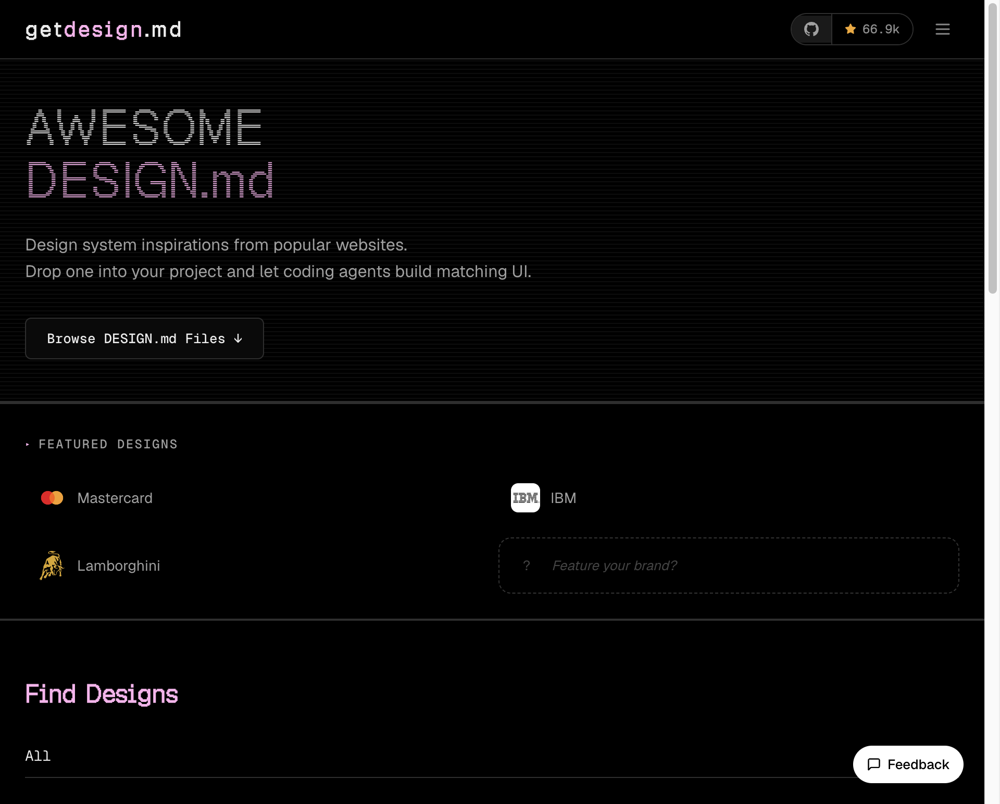
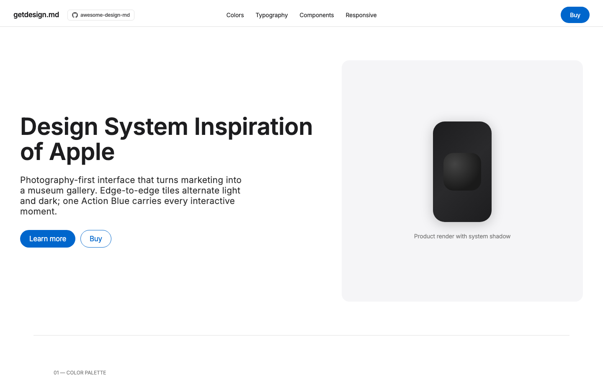
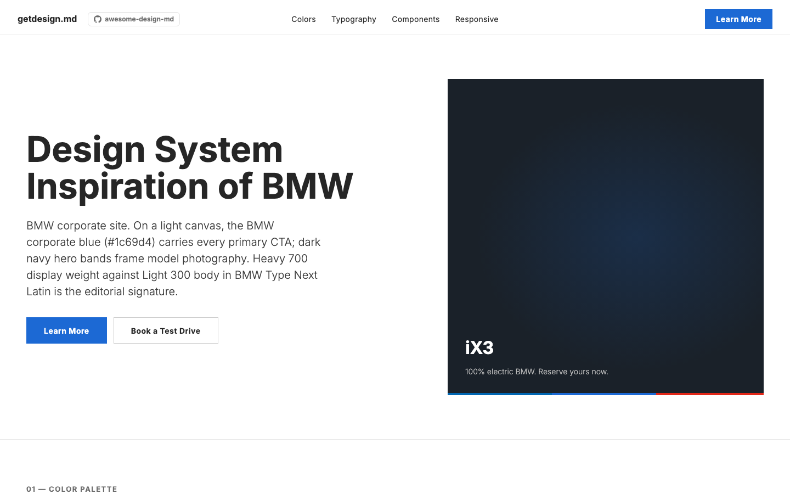
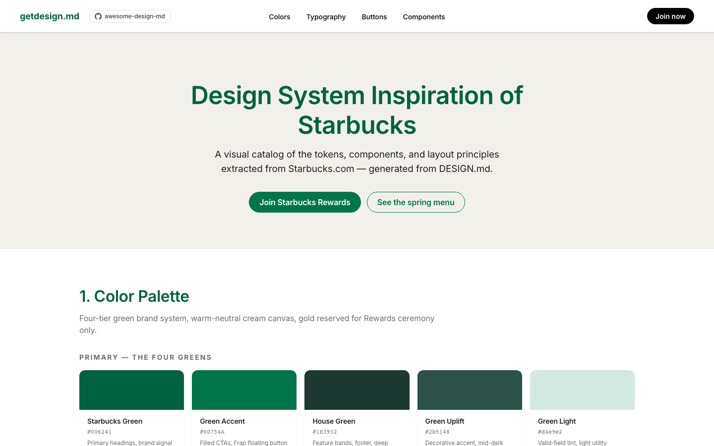

# getdesign.md — AI 코딩 에이전트에 유명 브랜드 디자인을 한 줄로 주입하는 법



1. AI 코딩 에이전트로 UI를 만들다 보면 항상 비슷한 문제에 걸림. "애플 스타일로 만들어줘"라고 하면 에이전트가 대충 흰 배경에 San Francisco 폰트 흉내 낸 걸 뱉음. 실제 Apple 디자인 언어의 여백 철학, 타이포그래피 위계, 이미지 비율 같은 건 전혀 모름.

2. getdesign.md는 이 문제를 다르게 품. 유명 브랜드의 디자인 시스템을 마크다운 파일 하나로 정제해서 제공함. 에이전트한테 이 파일을 컨텍스트로 넘기면 "진짜 그 브랜드처럼" 만들기 시작함.

3. 사용법은 터미널 한 줄임.

```bash
npx getdesign@latest add apple
```

프로젝트 루트에 `DESIGN.md`가 생김. 이걸 Claude나 Cursor, Copilot에 넘기면서 "이 디자인 파일 기준으로 UI 만들어줘"라고 하면 됨.

4. 현재 GitHub에서 66.9k 스타를 받았음. 브랜드 라인업도 60개가 넘음. Apple, BMW, Starbucks, Stripe, Notion, Linear, Tesla, SpaceX, Figma, Vercel 등. 사실상 유명 디지털 브랜드는 거의 다 있음.

---

## Apple



5. **Apple** — 11K 설치, 2K 북마크. 가장 많이 찾는 템플릿.

핵심 언어는 "premium white space, SF Pro, cinematic imagery". 여백이 곧 디자인임. 텍스트 위계는 SF Pro의 무게감으로만 표현하고 색은 거의 쓰지 않음. 제품 사진이 전면에 나오고 UI는 최대한 뒤로 빠짐.

```bash
npx getdesign@latest add apple
```

프리미엄 제품 랜딩 페이지, 앱 소개 사이트, 다크모드 없는 순백 마케팅 페이지에 맞음.

---

## BMW



6. **BMW** — 2.5K 설치, 137 북마크.

"dark premium surfaces, precise German engineering aesthetic". 배경은 어두운 표면, 타이포는 날카롭고 정밀함. BMW 특유의 밀도감 — 여백을 낭비하지 않으면서도 고급스럽게 보이는 그 균형. 버튼 하나, 선 하나도 픽셀 단위로 정렬된 느낌.

```bash
npx getdesign@latest add bmw
```

다크 테마 SaaS 대시보드, 프리미엄 자동차/기계 브랜드 사이트, 엔지니어링 감성이 필요한 B2B 제품에 어울림.

---

## Starbucks



7. **Starbucks** — 616 설치, 93 북마크.

"four-tier green system, warm cream canvas, full-pill buttons". 스타벅스 그린 4단계 팔레트 + 따뜻한 크림 배경 + 완전히 둥근 50px 알약 버튼. 시그니처 플로팅 프라푸치노 원형 CTA까지 있음. 보기만 해도 카페 앱임.

```bash
npx getdesign@latest add starbucks
```

리워드/멤버십 앱, 카페·F&B 브랜드 사이트, 따뜻한 감성의 소매 주문 흐름에 맞음.

---

8. 구조가 단순해서 빠르게 쓸 수 있음. DESIGN.md 파일 하나가 컬러 팔레트, 타이포그래피 규칙, 컴포넌트 스타일, 레이아웃 원칙을 자연어로 담고 있음. 코드 스니펫이나 Figma 링크가 아니라 에이전트가 읽을 수 있는 텍스트로.

9. 공식 디자인 시스템은 아님. 사이트에도 명시돼 있음. "A curated starting point for building apple-like UIs with your AI coding agent." 재현이지 원본이 아님. 그래서 오히려 쓸 만함. 공식 가이드라인은 복잡하고 제약이 많음. 여기는 에이전트가 바로 행동할 수 있는 의미 단위로 정제돼 있음.

10. 브랜드 하나 골라서 `npx getdesign@latest add <이름>` 치고, 나온 DESIGN.md를 Claude에 던져봄. 같은 컴포넌트를 만들어도 느낌이 완전히 달라짐.
