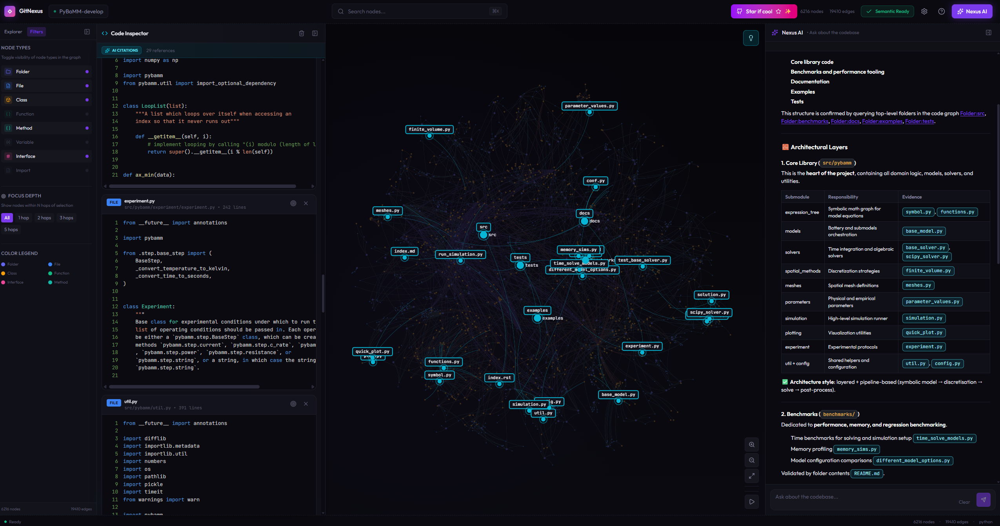
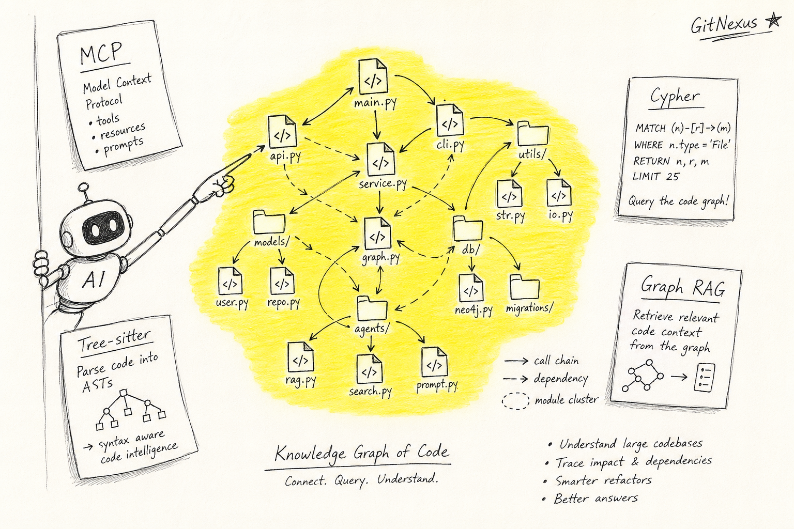
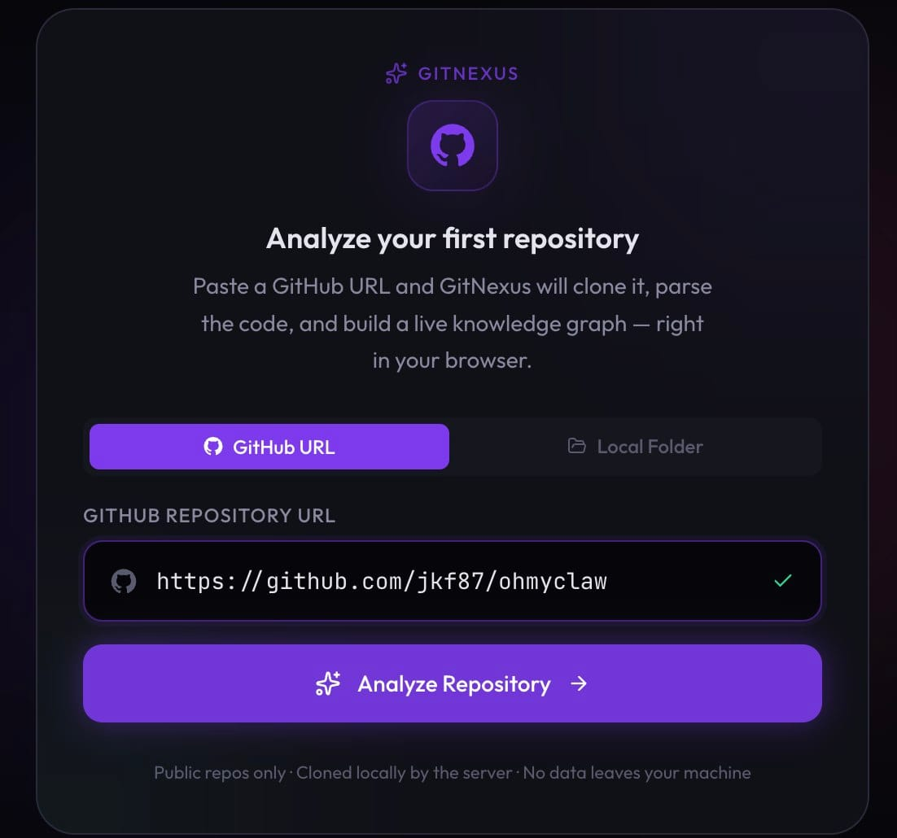
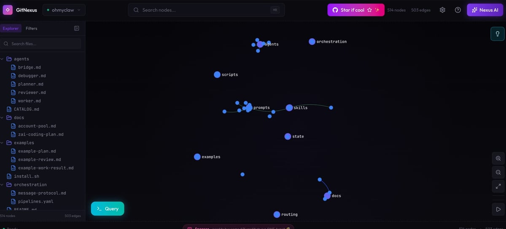
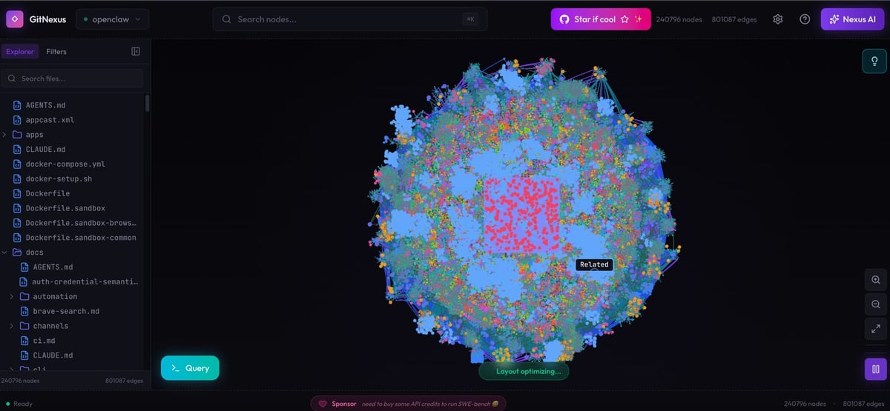

요즘 Cursor, Claude Code, Codex 같은 코딩 에이전트로 일하다 보면 비슷한 좌절을 만남. 작은 함수 하나 고치라고 시켰는데 그게 다른 파일의 콜체인을 깨버리는 일임. 잘 만든 모델이라도 그럼.

1. 이유는 단순함. 에이전트는 보통 grep + 임베딩 RAG로 코드를 읽음. 텍스트 유사도라서 비슷한 문자열은 잘 찾는데, "이 함수 고치면 어디까지 영향 가는지"는 못 봄. 콜체인, 의존성, 클러스터 같은 관계 정보가 없음.

2. 기존 대안으로 DeepWiki 같은 "AI 코드 위키"가 있었음. 근데 그건 코드를 설명해주는 도구임. 사람이 읽고 이해하는 용도지, 에이전트가 작업할 때 자동으로 참조하는 구조는 아님.

3. GitNexus는 다른 접근을 함. 레포 전체를 통째로 knowledge graph로 색인함. 파일, 함수, 클래스, 호출 관계, 의존성, 실행 흐름까지 노드와 엣지로 만듦. 그걸 MCP 서버로 띄워서 에이전트가 직접 쿼리하게 함.

4. 결과적으로 같은 모델이라도 더 정확하게 일함. 작은 모델조차 "이 변경의 영향 범위"를 그래프에서 바로 가져올 수 있어서, 전체 콜체인을 짚으면서 수정함. README 자체가 "even smaller models get full architectural clarity"라고 표현함.

5. 결국 GitNexus가 깔아주는 건 두 층임. 첫째는 안전망 층임. "이거 건드리면 어디 깨짐?"을 변경 전에 보여줌(`impact`, `detect_changes`). 둘째는 컨텍스트 보강 층임. "이 함수 주변에 뭐가 더 있나"를 검색 시점에 같이 던져줌(`query`, `context`). 그래프 자체가 본체가 아니라, 에이전트가 검색·수정·리네임할 때 그 그래프를 자동으로 쳐다보게 만드는 파이프라인이 본체임.

6. 사용법은 두 갈래임. 하나는 Web UI. gitnexus.vercel.app에 ZIP이나 GitHub 레포 던지면 브라우저 안에서 그래프와 챗봇이 뜸. Tree-sitter WASM과 LadybugDB WASM으로 전부 클라이언트에서 돌아서 코드가 서버로 안 나감. 데모용으로는 깔끔함.

7. 다른 하나는 CLI + MCP. 이쪽이 본체임. `npx gitnexus analyze` 한 줄로 색인 + 스킬 설치 + Claude Code 훅 등록 + AGENTS.md/CLAUDE.md 컨텍스트 파일 생성을 동시에 해줌. 그다음 `npx gitnexus setup`으로 Cursor/Claude Code/Codex/Windsurf/OpenCode MCP 등록을 한 번에 끝냄.

8. 에이전트가 받는 도구는 16개임. 핵심은 5개 정도임. `query`(BM25 + 임베딩 + RRF 하이브리드 검색), `context`(심볼 360도 뷰), `impact`(변경 영향 반경), `detect_changes`(git diff → 영향받는 프로세스), `rename`(다중 파일 일관 변경). 이름만 봐도 "에이전트가 평소에 헤매는 지점"을 노린 게 보임.

9. 더 흥미로운 건 Claude Code 통합임. 보통 MCP는 "도구 등록만 해두면 모델이 알아서 호출"하는 1단계 구조인데, GitNexus는 5중 안전장치를 깖. (1) MCP 도구 16개로 모델이 직접 그래프를 쿼리함. (2) PreToolUse 훅이 Grep/Glob 같은 검색 직전에 시스템 차원에서 강제로 그래프 컨텍스트를 끼워 넣음. 모델이 까먹어도 자동으로 보여주는 구조임. (3) PostToolUse 훅이 커밋 직후 색인 stale을 감지해 재색인을 유도함. (4) 에이전트 스킬 4개(Exploring/Debugging/Impact Analysis/Refactoring)가 `.claude/skills/`에 자동 설치돼서, Claude Code가 상황에 맞게 자동 활성화함. (5) `npx gitnexus analyze` 한 방으로 사용법이 AGENTS.md/CLAUDE.md에 자동으로 박힘. 새 세션 시작할 때 모델이 자동으로 읽음.

10. 비유하면 일반 MCP는 신입한테 "막히면 위키 읽어" 한마디 던지는 거고, GitNexus는 신입이 키보드 두드릴 때마다 위키 해당 페이지가 옆에 자동으로 뜨는 거임. 그래서 클로드코드한테 한번 물려두면 따로 명령 안 해도 알아서 씀. README가 "Claude Code gets the deepest integration"이라고 따로 강조하는 이유가 이거임.

11. 그래프 저장은 LadybugDB라는 임베디드 그래프 DB를 씀. CLI에선 네이티브, 웹에선 WASM. 색인은 `.gitnexus/` 폴더로 레포 안에 들어가고, 전역 레지스트리(`~/.gitnexus/registry.json`)는 어떤 레포가 어디 색인됐는지만 가리킴. MCP 서버는 그 레지스트리를 읽어서 여러 레포를 한 번에 서빙함. 에이전트가 `repo` 파라미터로 골라 쓰면 됨.

12. 여기서 잠깐 용어 정리. Tree-sitter는 GitHub가 만든 점진적(incremental) 파서임. 코드를 읽어서 함수, 클래스, 호출 같은 구조를 추상구문트리(AST)로 뽑아냄. C로 짜여 있어 빠르고, 파서가 언어별로 분리돼 있어서 새 언어 붙이기 쉬움. 끝에 붙는 WASM은 WebAssembly의 약자임. C/C++/Rust 같은 저수준 언어를 컴파일해서 브라우저에서 네이티브에 가까운 속도로 돌리는 표준 바이너리 포맷이고, W3C 표준이라 주요 브라우저가 다 지원함. Tree-sitter WASM은 그 C 파서를 WebAssembly로 빌드한 버전이라, GitNexus 웹 UI가 코드를 서버로 안 보내고 브라우저 안에서 바로 파싱하는 게 가능함.

13. LadybugDB는 임베디드 그래프 DB임. SQLite 같은 단일 파일 DB인데 데이터 모델이 노드와 엣지임. 별도 서버 안 띄우고 라이브러리로 임포트해서 씀. WASM 빌드도 있어서 브라우저 안에서 인-메모리로 돌릴 수 있음. CLI에선 네이티브 바이너리로 디스크에 영속, 웹에선 WASM으로 세션 동안만 메모리에 뜬다고 보면 됨.

14. 그래프 DB 얘기 나온 김에 두 가지 모델을 짚고 가야 함. RDF(Resource Description Framework)와 LPG(Labeled Property Graph)임. RDF는 W3C 시멘틱 웹 진영에서 나옴. 모든 데이터를 "주어-술어-목적어" 트리플로 표현함. 노드와 엣지가 전부 URI라서 외부 어휘(스키마)랑 잘 섞임. 학술/생명과학/지식그래프 표준에서 강함.

15. LPG는 Neo4j가 대중화한 모델임. 노드와 엣지에 라벨을 붙이고, 둘 다 키-값 속성을 들고 있을 수 있음. 모델이 단순하고 직관적이라 개발자가 쓰기 편함. 코드 그래프처럼 "함수 노드에 시그니처/시작줄/끝줄 같은 속성을 주렁주렁 다는" 도메인엔 LPG가 자연스러움.

16. 쿼리 언어도 두 갈래로 갈림. SPARQL은 RDF용 표준 쿼리어임. SQL과 비슷한 감각인데 트리플 패턴 매칭이 핵심임(`?s ?p ?o` 같은). Cypher는 Neo4j가 만든 LPG용 쿼리어임. ASCII 아트로 노드와 엣지를 그리듯 쓰는 문법이 특징임(`(a:Func)-[:CALLS]->(b:Func)`). 지금은 openCypher / GQL(ISO 표준)로 흘러가서 Neo4j 밖에서도 점점 표준이 되는 중임.

17. GitNexus는 LPG + Cypher 라인을 탐. LadybugDB가 LPG 모델이고, MCP 도구 중 하나가 그냥 `cypher`임. 에이전트가 직접 Cypher를 던질 수 있음. 코드 그래프는 노드 종류가 많지 않고(파일/함수/클래스 정도) 속성이 많은(시그니처/줄번호/언어 등) 도메인이라 이 선택이 자연스러움. RDF + SPARQL 조합이었으면 같은 의미를 트리플로 풀어야 해서 색인 크기와 쿼리 길이가 둘 다 늘어났을 거임.

18. 멀티 레포 그룹 기능도 있음. `gitnexus group create`로 마이크로서비스 묶음을 정의하고 `group sync`로 레포 간 컨트랙트(API 콜, 메시지 큐 같은 것)를 추출해서 매칭함. 그러면 "프론트의 이 호출이 백엔드 어느 핸들러로 가는지"를 그래프에서 직접 따라갈 수 있음.

19. 직접 한번 돌려봄. `npx gitnexus@latest serve`만 치면 로컬 서버가 뜨고, 브라우저로 들어가면 첫 화면이 이렇게 깔끔하게 받아줌. GitHub URL 탭에 분석하고 싶은 레포 주소 붙여넣고 `Analyze Repository` 누르면 끝. 데이터는 다 로컬에 머문다고 친절하게 적혀 있음(Public repos only · Cloned locally · No data leaves your machine).

20. 작은 레포부터 시험. 직접 만든 ohmyclaw 레포(에이전트/도큐멘트 정도만 들어 있는 가벼운 저장소)를 넣어보니 514 노드 / 503 엣지짜리 그래프가 금방 떴음. 좌측 익스플로러에 `agents/`, `docs/`, `examples/`, `orchestration/` 폴더 트리가 그대로 보이고, 그래프에서는 prompts와 skills가 중앙에 모여 있고 docs/state/routing 같은 작은 클러스터가 가장자리에 흩어져 있음. 이 정도 규모는 인간이 한눈에 구조를 파악할 수 있음.

21. 큰 레포는 이야기가 다름. openclaw(메인 레포) 넣었더니 240,796 노드 / 801,087 엣지가 나오면서 화면이 핑크-블루 폭발 상태가 됨. 좌측 트리도 `docs/`, `apps/` 같은 폴더 안쪽이 빽빽하게 차 있고 하단에 `Layout optimizing...`이 한참 도는 중이었음. 가운데에 `Sponsor: need to buy some API credits to run SWE-bench` 토스트까지 뜨는 걸 보면 임베딩/AI 호출 비용이 만만치 않다는 것도 같이 알게 됨. 큰 레포에 무턱대고 돌리면 매우 느려지고 자원도 많이 먹으니 `--skip-embeddings`나 작은 서브폴더부터 시작하는 게 안전함.

22. 라이선스는 PolyForm Noncommercial임. 개인 학습/사이드 프로젝트는 자유, 회사에서 매출 일으키는 용도면 별도 상용 라이선스가 필요함. 엔터프라이즈는 akonlabs.com에서 SaaS와 셀프호스트로 팔고, PR 자동 영향 분석, 자동 갱신 위키, 멀티레포, OCaml 지원 같은 게 추가됨.

23. 한계도 분명함. 첫째, 색인 시간이 큰 레포에서는 꽤 걸림. 임베딩 빼고 빠르게 돌리는 `--skip-embeddings` 옵션이 있는 이유임. 둘째, Tree-sitter 기반이라 지원 언어 밖이면 그래프 품질이 떨어짐. 셋째, 코드 변경이 잦으면 stale 상태 관리가 중요함(다행히 PostToolUse 훅이 어느 정도 받쳐줌).

24. 그래도 의미 있는 이유는, "에이전트가 코드를 텍스트로만 본다"는 가정 자체를 깨려 한다는 점임. 같은 모델이 같은 토큰 예산으로 더 멀리 보게 만드는 가장 빠른 방법은 모델이 아니라 컨텍스트 파이프라인을 손보는 거임. GitNexus는 그 파이프라인 한 칸을 그래프로 채움.

25. 정리하면, 큰 레포를 코딩 에이전트와 같이 굴리는 사람한테는 한 번 깔아볼 만함. CLI는 그냥 `npx gitnexus@latest serve`로 띄우고 작은 레포부터 넣어보면 됨. 결과가 별로면 `gitnexus clean`으로 깔끔히 지우면 됨. 깃허브 별 30k가 한 달 만에 모인 데는 이유가 있는 도구임.

---

**참고 자료**

- GitHub: [abhigyanpatwari/GitNexus](https://github.com/abhigyanpatwari/GitNexus) (★ 30,232)
- Web UI: [gitnexus.vercel.app](https://gitnexus.vercel.app)
- 엔터프라이즈: [akonlabs.com](https://akonlabs.com)
- npm: `npm install -g gitnexus`
