원문: Accelerating scientific discovery with Co-Scientist (Nature, 2026)
저자: Juraj Gottweis, Wei-Hung Weng, Alexander Daryin, Tao Tu 외
(Google DeepMind / Google Research / Stanford / Imperial College London 등)
DOI: [10.1038/s41586-026-10644-y](https://doi.org/10.1038/s41586-026-10644-y)

## 한 문장 요약

과학적 발견은 더 이상 인간 과학자만의 영역이 아니다. Google DeepMind의 **Co-Scientist**는 Gemini 기반 멀티에이전트 시스템으로, 연구 목표를 자연어로 입력하면 가설을 생성하고 **스스로 토론·비판·진화**시켜 실험 검증 가능한 연구 가설을 제안한다.

## 왜 이 논문이 중요한가

과학 연구는 점점 더 깊은 전문성을 요구하는 동시에, 학문 간 경계를 넘나드는 통찰이 혁신을 이끄는 모순적 상황에 놓여 있다. 논문 수는 폭발적으로 늘어났고, 한 사람이 모든 관련 연구를 읽고 종합하는 건 사실상 불가능해졌다.

Co-Scientist는 이 문제에 대한 Google의 답이다. 단순한 문헌 요약이나 "딥 리서치" 도구가 아니라, **새로운 지식을 발굴하고 예상치 못한 연결을 찾아내며 실험 계획까지 수립하는** 시스템이다.

## 시스템 아키텍처

### 전체 구조

Co-Scientist의 핵심은 **과학적 방법론을 멀티에이전트 아키텍처로 구현**한 것이다. 아래 Mermaid 다이어그램으로 전체 흐름을 정리했다:

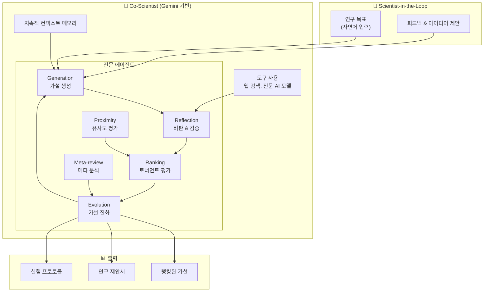
```mermaid
flowchart TB
    subgraph Scientist["🔬 Scientist-in-the-Loop"]
        GOAL["연구 목표<br/>(자연어 입력)"]
        FEEDBACK["피드백 & 아이디어 제안"]
    end

    subgraph CoScientist["🤖 Co-Scientist (Gemini 기반)"]
        direction TB
        
        subgraph Agents["전문 에이전트"]
            GEN["Generation<br/>가설 생성"]
            REF["Reflection<br/>비판 & 검증"]
            RANK["Ranking<br/>토너먼트 평가"]
            EVO["Evolution<br/>가설 진화"]
            PROX["Proximity<br/>유사도 평가"]
            META["Meta-review<br/>메타 분석"]
        end

        TOOLS["도구 사용<br/>웹 검색, 전문 AI 모델"]
        MEM["지속적 컨텍스트 메모리"]
    end

    subgraph Output["📊 출력"]
        HYP["랭킹된 가설"]
        PROPOSAL["연구 제안서"]
        PROTOCOL["실험 프로토콜"]
    end

    GOAL --> GEN
    FEEDBACK --> GEN
    GEN --> REF
    REF --> RANK
    RANK --> EVO
    EVO --> GEN
    PROX --> RANK
    META --> EVO
    TOOLS --> REF
    MEM --> GEN
    
    EVO --> HYP
    EVO --> PROPOSAL
    EVO --> PROTOCOL
```

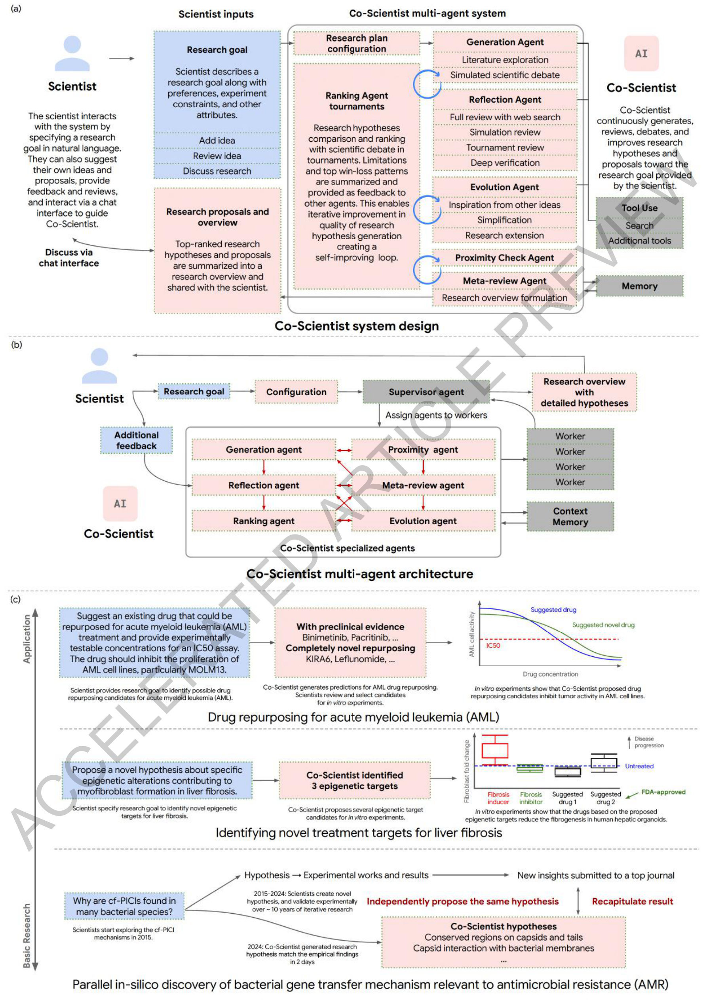
*Figure 1. Co-Scientist의 전체 설계, 멀티에이전트 아키텍처, 실험 검증 요약. (a) 시스템 개요 (b) 멀티에이전트 상세 구조 (c) 세 가지 생의학적 적용 사례*

### 전문 에이전트 구성

| 에이전트 | 역할 | 핵심 기능 |
|---------|------|----------|
| **Generation** | 가설 생성 | 연구 목표와 문헌 기반 초기 가설 도출 |
| **Reflection** | 비판·검증 | 외부 검색 도구로 가설 타당성 검증, hallucination 방지 |
| **Ranking** | 평가·비교 | 과학적 토론(self-play) 방식으로 Elo 레이팅 산출 |
| **Evolution** | 가설 진화 | 토너먼트 결과 기반 반복 개선 |
| **Proximity** | 유사도 관리 | 유사 가설 간 비교 우선으로 효율성 향상 |
| **Meta-review** | 메타 분석 | 전체 프로세스 품질 관리 |

### 핵심 메커니즘: 생성 → 토론 → 진화 루프

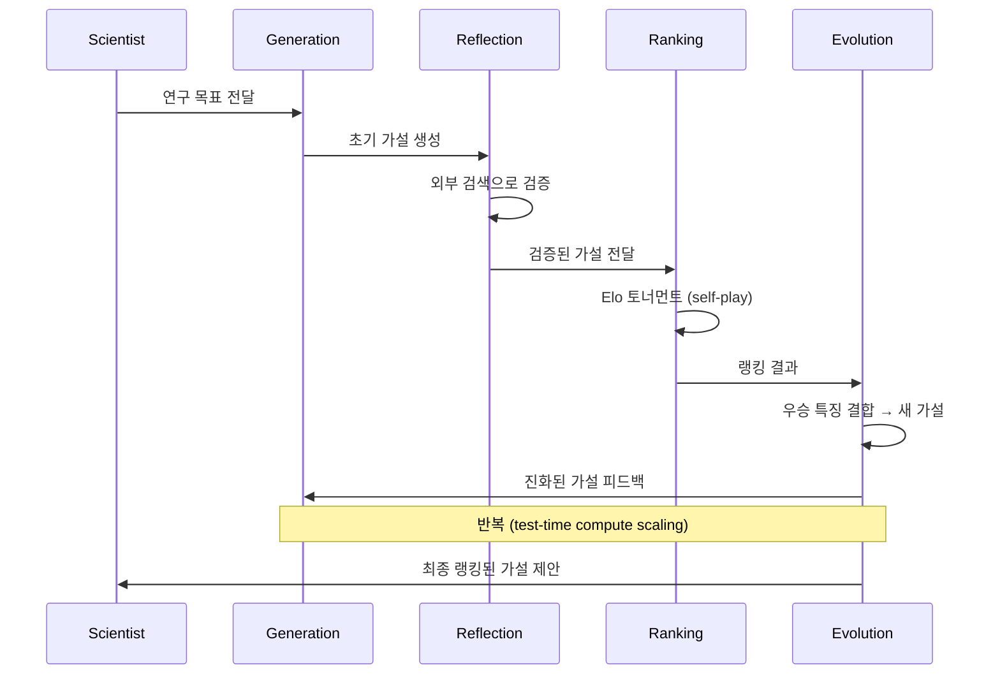
```mermaid
sequenceDiagram
    participant S as Scientist
    participant G as Generation
    participant R as Reflection
    participant K as Ranking
    participant E as Evolution
    
    S->>G: 연구 목표 전달
    G->>R: 초기 가설 생성
    R->>R: 외부 검색으로 검증
    R->>K: 검증된 가설 전달
    K->>K: Elo 토너먼트 (self-play)
    K->>E: 랭킹 결과
    E->>E: 우승 특징 결합 → 새 가설
    E->>G: 진화된 가설 피드백
    Note over G,E: 반복 (test-time compute scaling)
    E->>S: 최종 랭킹된 가설 제안
```

**1. 비동기 태스크 실행 프레임워크**
각 에이전트가 독립적으로 실행되며, 연산 자원을 유연하게 배분할 수 있다. 이는 test-time compute 스케일링의 기반이 된다.

**2. 토너먼트 진화 과정**
가설들이 Elo 레이팅 기반 토너먼트에서 경쟁한다. 승패 패턴을 학습하고, 우승 가설의 특징을 다음 세대로 전달하는 진화적 접근이다.

**3. 과학자-인-더-루프**
과학자가 자연어로 연구 목표를 지정하고, 피드백을 제공하며, 초기 아이디어를 제안할 수 있다.

## Test-time Compute 스케일링

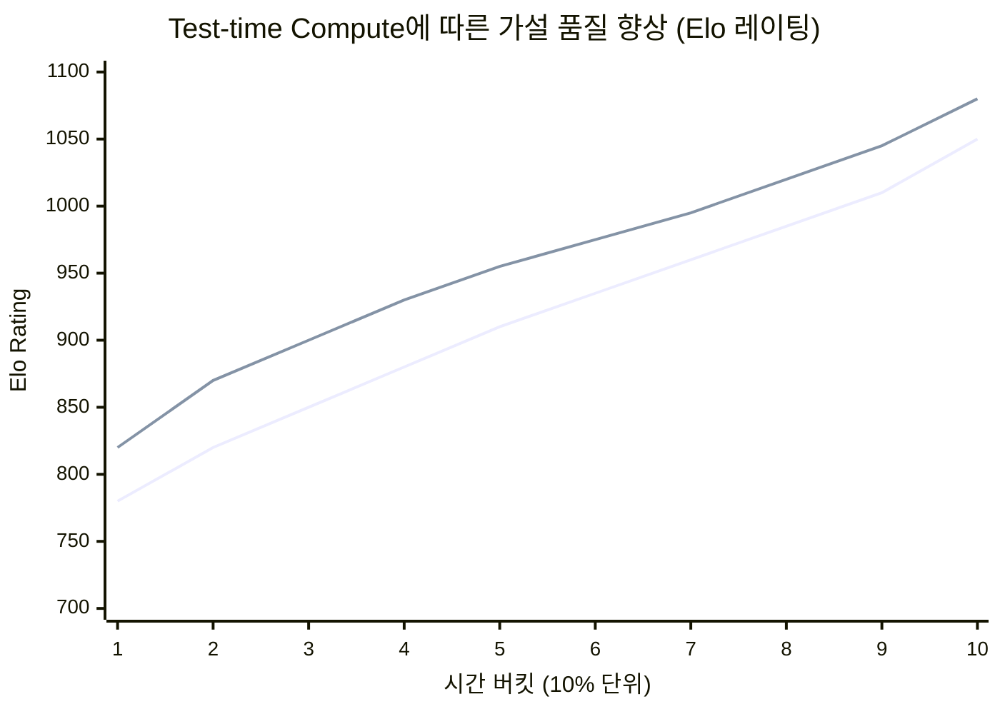
```mermaid
xychart-beta
    title "Test-time Compute에 따른 가설 품질 향상 (Elo 레이팅)"
    x-axis "시간 버킷 (10% 단위)" [1, 2, 3, 4, 5, 6, 7, 8, 9, 10]
    y-axis "Elo Rating" 700 --> 1100
    line [780, 820, 850, 880, 910, 935, 960, 985, 1010, 1050]
    line [820, 870, 900, 930, 955, 975, 995, 1020, 1045, 1080]
```

203개 연구 목표에 대한 분석에서, **더 많은 연산 시간을 할당할수록 가설 품질이 지속적으로 향상**되었다. Elo 레이팅이 직접적인 최적화 타깃이 아님에도, 시스템의 정보 피드백 루프를 통해 자연스럽게 개선된다.

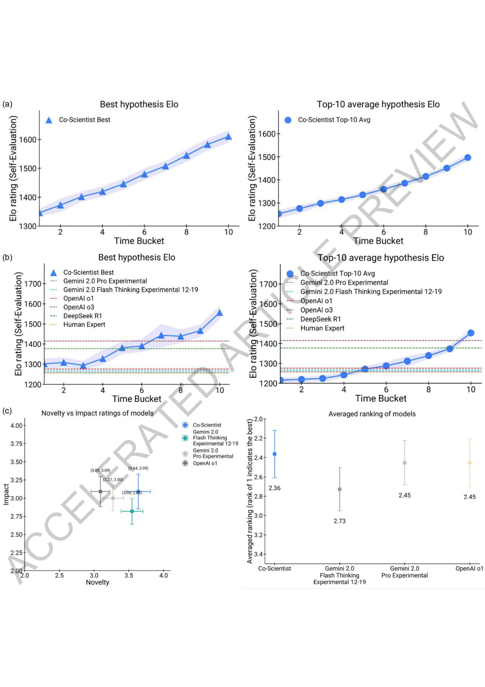
*Figure 2. Test-time compute 확장이 Co-Scientist의 과학적 사고 능력에 미치는 영향. (a) Elo 레이팅 추이 (b) 다른 AI 시스템과의 비교 (c) 전문가 평가 결과*

15개 전문가 큐레이션 난제에서 Co-Scientist는 다음 모델들을 능가했다:

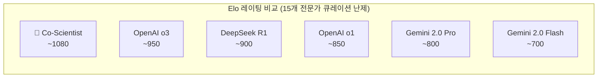
```mermaid
flowchart LR
    subgraph Comparison["Elo 레이팅 비교 (15개 전문가 큐레이션 난제)"]
        direction TB
        CS["🥇 Co-Scientist<br/>~1080"]
        O3["OpenAI o3<br/>~950"]
        R1["DeepSeek R1<br/>~900"]
        O1["OpenAI o1<br/>~850"]
        GP["Gemini 2.0 Pro<br/>~800"]
        GF["Gemini 2.0 Flash<br/>~700"]
    end
```

더 중요한 건 **성능 포화의 징후가 없다는 점**이다.

## 3가지 생의학적 실증 검증

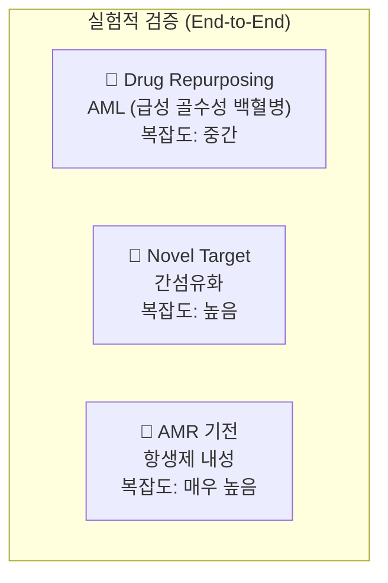
```mermaid
flowchart TB
    subgraph Validations["실험적 검증 (End-to-End)"]
        direction LR
        V1["💊 Drug Repurposing<br/>AML (급성 골수성 백혈병)<br/>복잡도: 중간"]
        V2["🧬 Novel Target<br/>간섬유화<br/>복잡도: 높음"]
        V3["🦠 AMR 기전<br/>항생제 내성<br/>복잡도: 매우 높음"]
    end
```

### 1. AML 약물 재포지셔닝

**검색 공간**: 2,300개 승인 약물 × 34개 암종

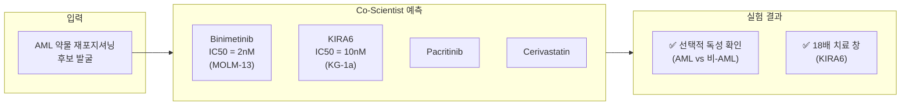
```mermaid
flowchart LR
    subgraph Input["입력"]
        GOAL["AML 약물 재포지셔닝<br/>후보 발굴"]
    end
    
    subgraph AI["Co-Scientist 예측"]
        B["Binimetinib<br/>IC50 = 2nM<br/>(MOLM-13)"]
        K["KIRA6<br/>IC50 = 10nM<br/>(KG-1a)"]
        P["Pacritinib"]
        C["Cerivastatin"]
    end
    
    subgraph Result["실험 결과"]
        R1["✅ 선택적 독성 확인<br/>(AML vs 비-AML)"]
        R2["✅ 18배 치료 창<br/>(KIRA6)"]
    end
    
    GOAL --> AI --> Result
```

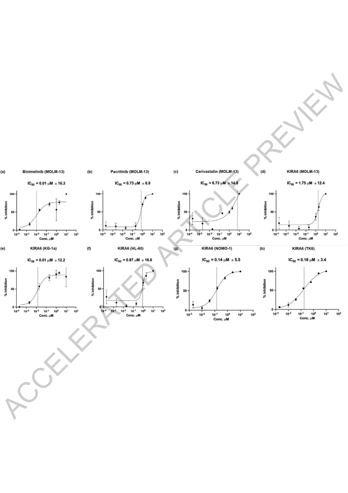
*Figure 3. Co-Scientist가 생성한 단일 약물 재포지셔닝 후보의 in vitro 생물학적 검증. (a-h) 각 약물의 용량-반응 곡선 및 IC50 값*

**단일 약물을 넘어 약물 조합 시너지**도 제안했다. 7개 조합을 MOLM-13, KG-1a에서 평가:

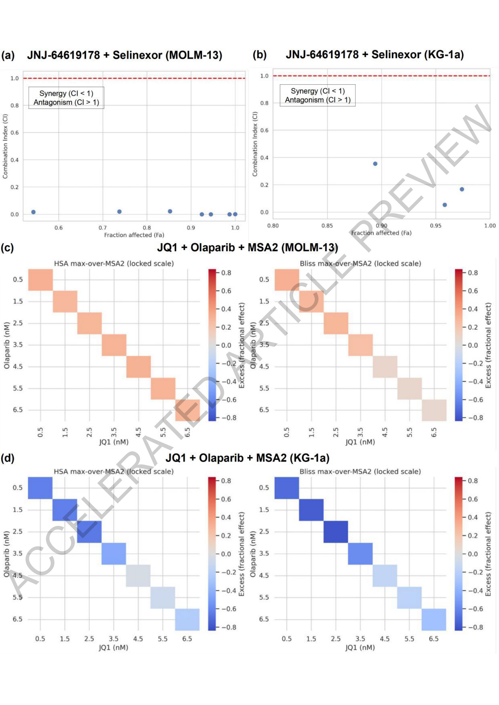
*Figure 4. Co-Scientist가 예측한 AML 시너지 약물 조합 검증. (a-d) JNJ-64619178 + Selinexor 및 JQ1 + Olaparib + MSA2 조합의 상호작용 분석*

### 2. 간섬유화 신규 타겟 발굴

인간 간 오가노이드와 실시간 세포 이미징을 활용하여 **간섬유화의 새로운 후생학적(epigenetic) 타겟**을 찾았다.

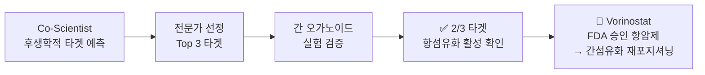
```mermaid
flowchart LR
    A["Co-Scientist<br/>후생학적 타겟 예측"] --> B["전문가 선정<br/>Top 3 타겟"]
    B --> C["간 오가노이드<br/>실험 검증"]
    C --> D["✅ 2/3 타겟<br/>항섬유화 활성 확인"]
    D --> E["🔑 Vorinostat<br/>FDA 승인 항암제<br/>→ 간섬유화 재포지셔닝"]
```

주목할 점: **Vorinostat**은 이미 FDA 승인된 항암제다. 암과 간섬유화라는 전혀 다른 분야를 연결하는 예상치 못한 발견이다.

### 3. 항생제 내성 기전 규명 — 가장 인상적인 검증

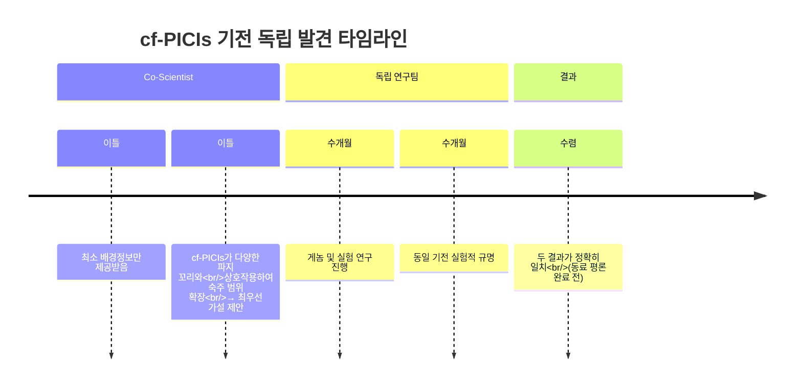
```mermaid
timeline
    title cf-PICIs 기전 독립 발견 타임라인
    section Co-Scientist
        이틀 : 최소 배경정보만 제공받음
        이틀 : cf-PICIs가 다양한 파지 꼬리와<br/>상호작용하여 숙주 범위 확장<br/>→ 최우선 가설 제안
    section 독립 연구팀
        수개월 : 게놈 및 실험 연구 진행
        수개월 : 동일 기전 실험적 규명
    section 결과
        수렴 : 두 결과가 정확히 일치<br/>(동료 평론 완료 전)
```

Co-Scientist는 **단 이틀 만에** cf-PICIs(캡시드 형성 파지 유도 염색체 섬)가 다양한 파지 꼬리와 상호작용하여 숙주 범위를 확장한다는 가설을 **최우선으로 제안**했다. 이는 독립적으로 진행 중이던 다른 연구팀의 실험적 발견과 **정확히 일치**했다.

## 전문가 평가 결과

11개 연구 목표에 대한 생의학 전문가 평가:

```mermaid
xychart-beta
    title "전문가 평가: 신규성 vs 임팩트 (5점 만점)"
    x-axis "모델" [0, 1, 2, 3, 4, 5]
    y-axis "점수" 0 --> 5
    bar [3.64, 2.8, 2.5, 2.0, 2.8, 2.3]
    bar [3.09, 2.5, 2.3, 2.0, 2.5, 2.0]
```

| 모델 | 선호도 순위 | 신규성 (5점 만점) | 임팩트 (5점 만점) |
|------|-----------|-----------------|-----------------|
| **Co-Scientist** | **2.36** | **3.64** | **3.09** |
| Gemini 2.0 Pro | ~2.9 | ~2.8 | ~2.5 |
| OpenAI o1 | ~3.2 | ~2.5 | ~2.3 |
| Gemini 2.0 Flash | ~3.5 | ~2.0 | ~2.0 |

LLM-as-a-judge 평가(OpenAI o3-mini, Gemini 등 4개 모델)에서도 Co-Scientist가 일관되게 최우선으로 선택되었다.

## Extended Data

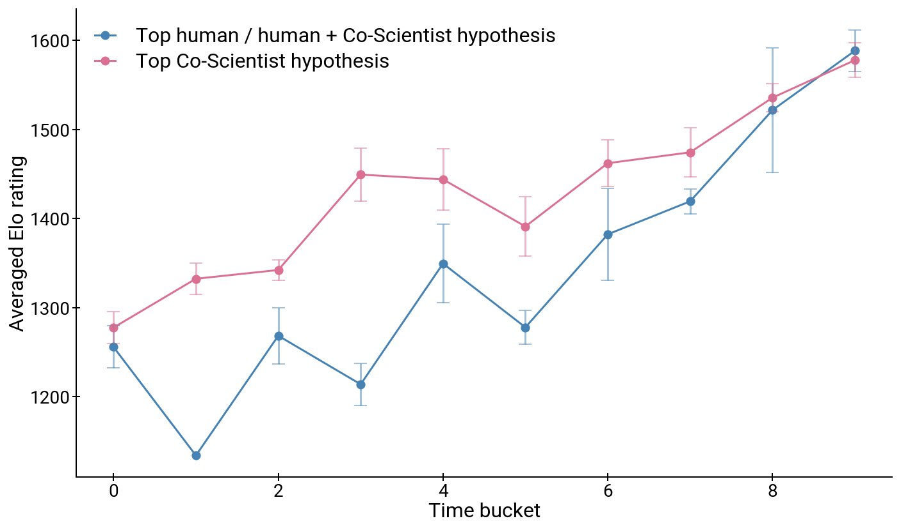

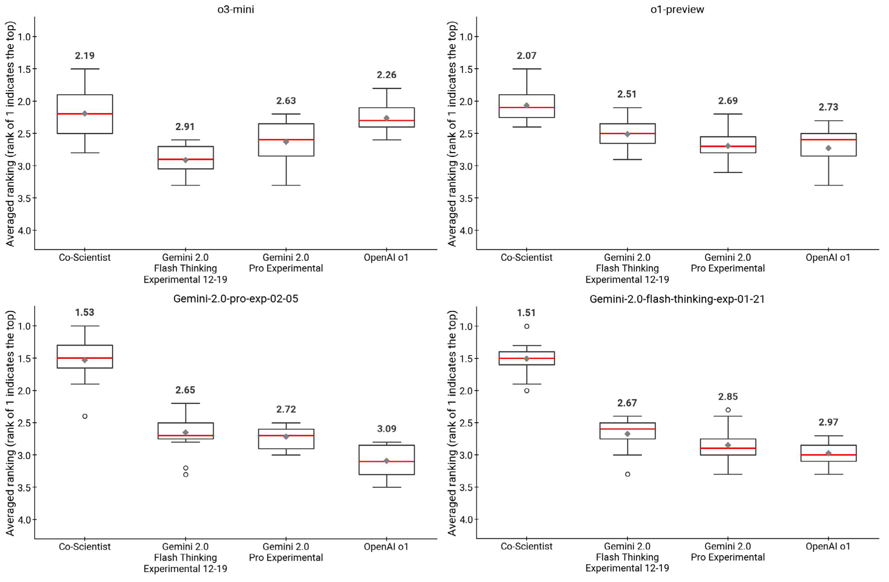

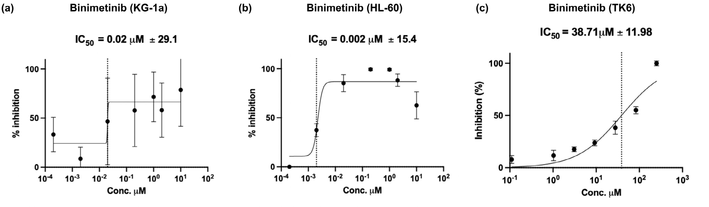

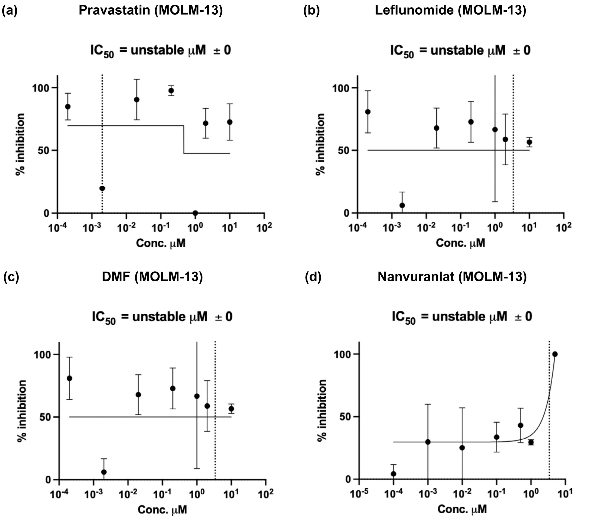

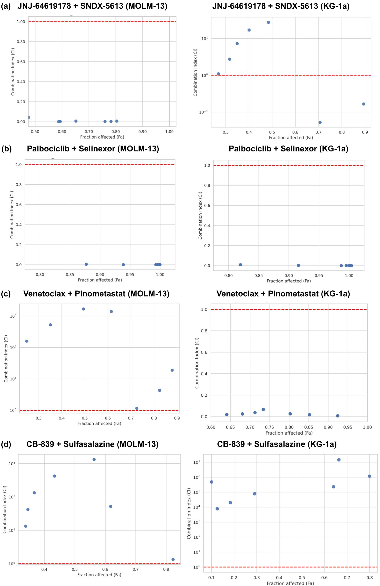

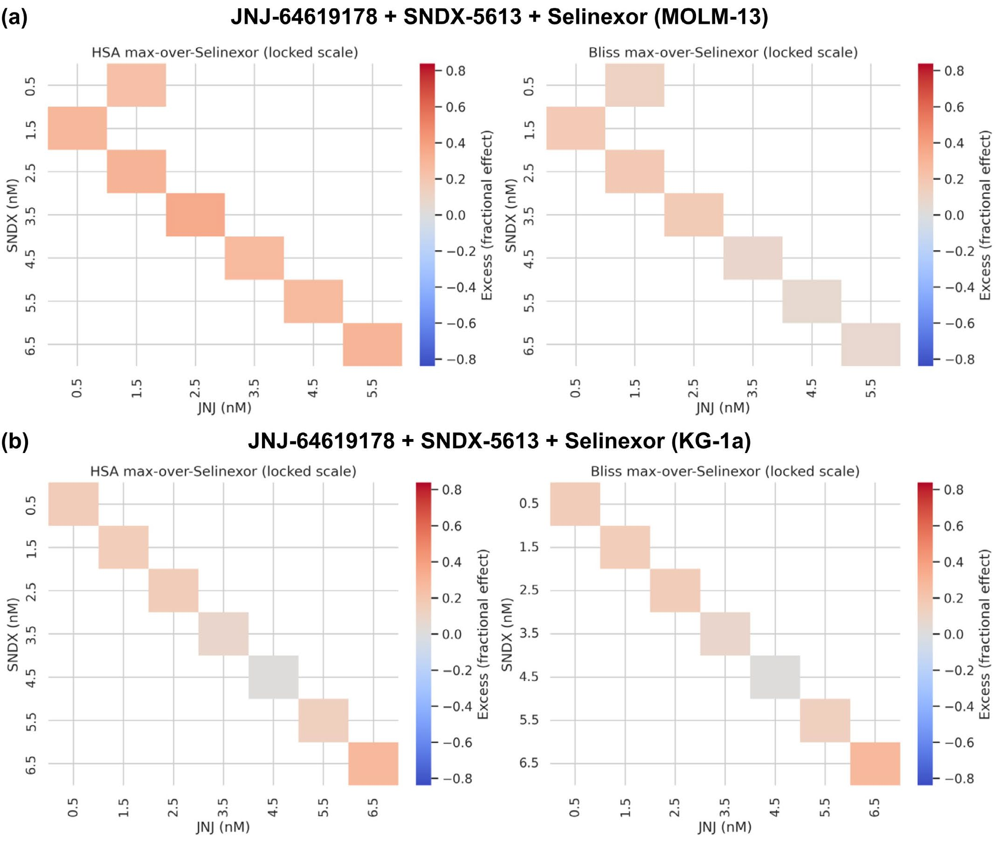

## 에이블레이션 분석: 왜 멀티에이전트인가

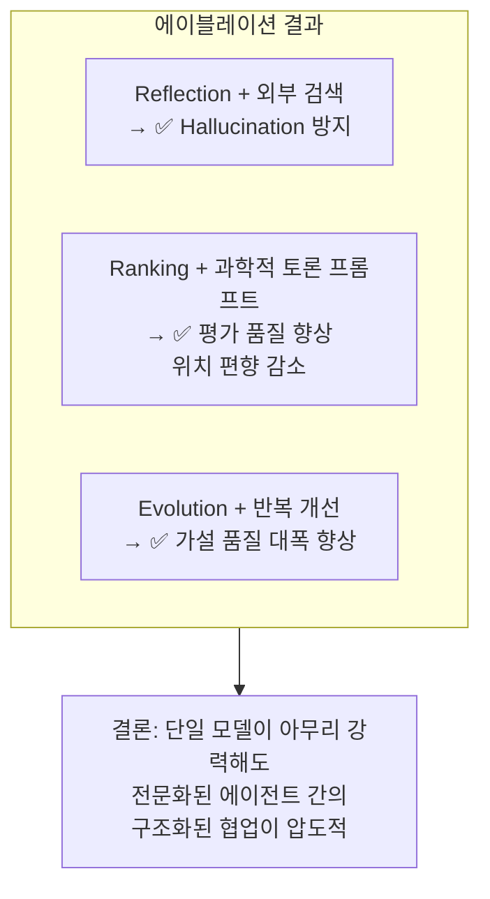
```mermaid
flowchart TB
    subgraph Ablation["에이블레이션 결과"]
        A1["Reflection + 외부 검색<br/>→ ✅ Hallucination 방지"]
        A2["Ranking + 과학적 토론 프롬프트<br/>→ ✅ 평가 품질 향상<br/>위치 편향 감소"]
        A3["Evolution + 반복 개선<br/>→ ✅ 가설 품질 대폭 향상"]
    end
    
    CONC["결론: 단일 모델이 아무리 강력해도<br/>전문화된 에이전트 간의<br/>구조화된 협업이 압도적"]
    
    Ablation --> CONC
```

단일 모델이 아무리 강력해도, 전문화된 에이전트 간의 **구조화된 협업**이 낸 결과를 따라오지 못한다는 걸 보여준다.

## 한계

논문은 솔직하게 한계를 인정한다:

- **지식의 경계**: 오픈액세스 문헌에 의존 → 페이월 뒤의 중요 연구 누락 가능
- **부정적 결과 부재**: 성공한 실험만 보고하는 문헌의 편향 상속
- **기저 LLM의 한계**: 할루시네이션, 편향 등 Gemini 자체의 한계
- **번역의 도전**: in vitro ≠ in vivo ≠ 임상 성공
- **재현성 위기**: 가드레일 없는 사용은 과학적 재현성 위기 악화 가능

## 시사점

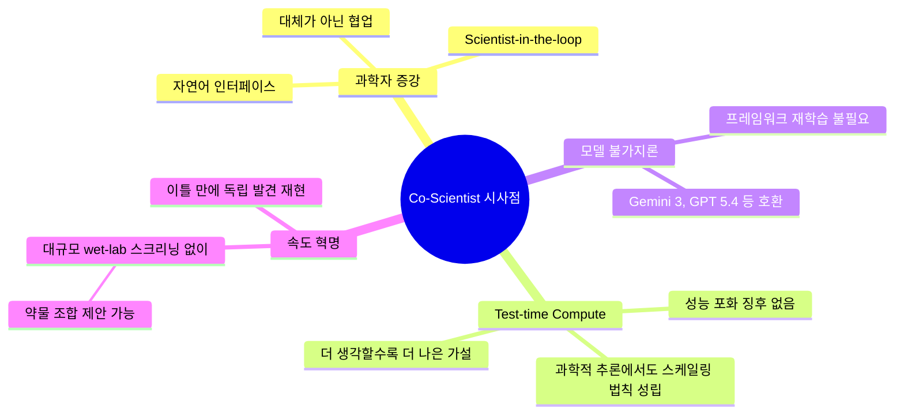
```mermaid
mindmap
  root((Co-Scientist 시사점))
    과학자 증강
      대체가 아닌 협업
      Scientist-in-the-loop
      자연어 인터페이스
    Test-time Compute
      과학적 추론에서도 스케일링 법칙 성립
      더 생각할수록 더 나은 가설
      성능 포화 징후 없음
    모델 불가지론
      Gemini 3, GPT 5.4 등 호환
      프레임워크 재학습 불필요
    속도 혁명
      이틀 만에 독립 발견 재현
      대규모 wet-lab 스크리닝 없이
        약물 조합 제안 가능
```

1. **AI는 과학자를 대체하는 게 아니라 증강한다.**
2. **Test-time compute는 과학적 추론에서도 스케일링 법칙이 성립한다.**
3. **모델 불가지론적 아키텍처**로 향후 더 강력한 모델 혜택 즉시 가능
4. **이틀 만에 독립적 발견을 재현**한 항생제 내성 사례는 속도 혁명의 증거

---

*이 포스트는 Google DeepMind의 Nature 논문 "Accelerating scientific discovery with Co-Scientist"를 바탕으로 작성되었습니다. 원문은 [Nature 웹사이트](https://www.nature.com/articles/s41586-026-10644-y)에서 확인할 수 있습니다. Figure 이미지는 reference PDF에서 PyMuPDF로 추출했습니다.*
