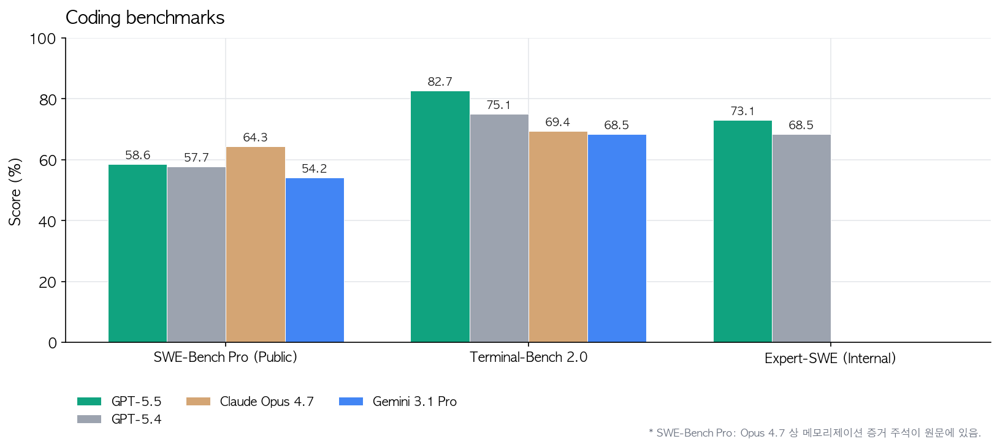
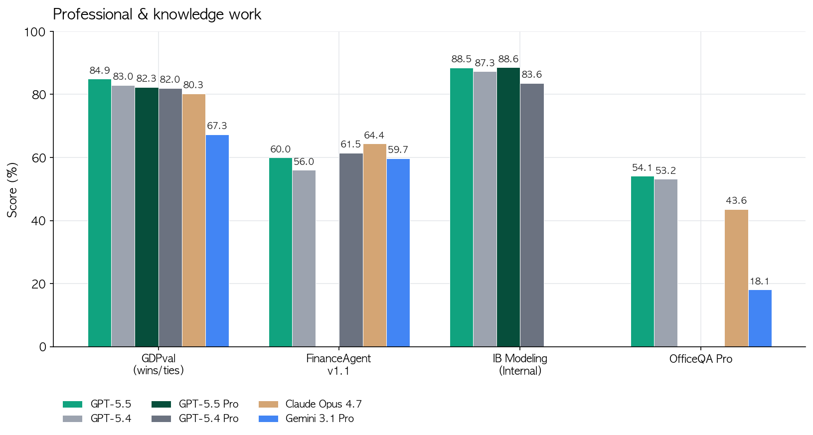
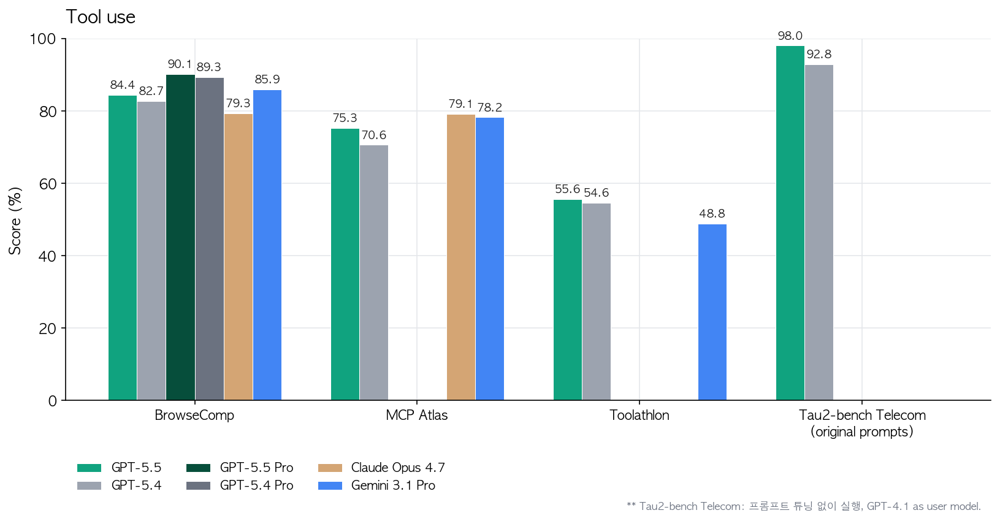
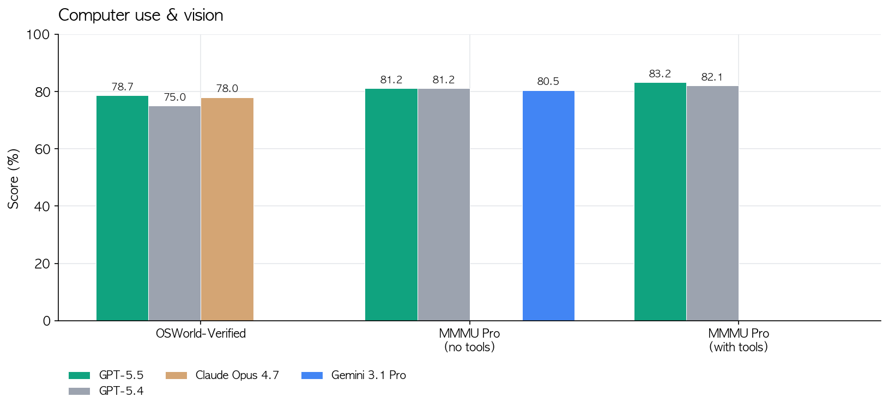
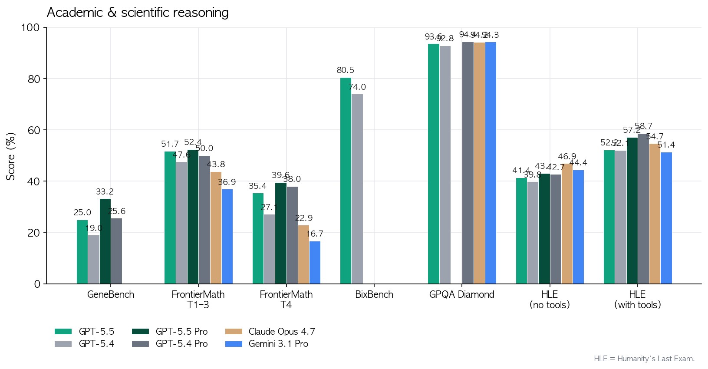
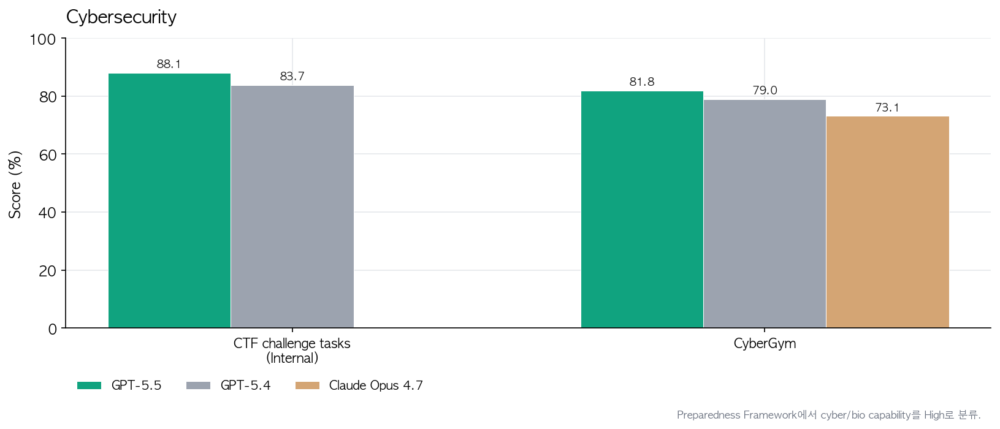
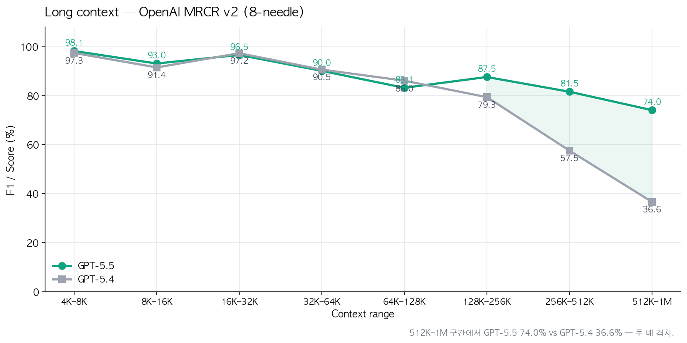
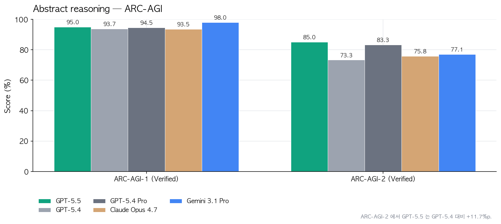

2026-04-23 OpenAI가 GPT-5.5를 풀었음. 한 줄 요약하면 **GPT-5.4와 같은 토큰당 지연시간으로 한 단계 위의 지능**임. 근데 벤치 숫자보다 더 큰 포인트는 따로 있음.

1. 출시일은 2026-04-23. ChatGPT Plus/Pro/Business/Enterprise + Codex에 먼저 들어감. API는 "곧" 풀린다고 했고 가격이 `$5 / $30` (입력/출력 1M 토큰). Pro는 `$30 / $180`. Claude Opus 4.7(`$15 / $75`) 대비 입력은 3배 싸고 출력은 2.5배 쌈.

2. 출시 타이밍도 급함. GPT-5.4 나온 지 6주만임. 포춘이 "rapid-fire"라고 쓴 이유가 있음. 경쟁 모델 따라잡기가 아니라 **레일 교체 작업**을 6주 사이클로 돌리는 중.

3. 코딩 벤치 핵심 두 개. **Terminal-Bench 2.0에서 82.7%** (GPT-5.4는 75.1%, Opus 4.7은 69.4%, Gemini 3.1 Pro는 68.5%). **Expert-SWE**라는 OpenAI 내부 20시간짜리 장기 코딩 작업도 73.1%. 근데 "SWE-Bench Pro"에서는 Opus 4.7이 64.3%로 더 높음. 이건 메모리화 증거가 있다고 각주가 달려있긴 함.

4. 그리고 숫자보다 무서운 건 **토큰 효율**임. 같은 Codex 과제를 GPT-5.4보다 토큰 더 적게 써서 푼다는 얘기. 가격이 높아도 실사용 비용은 비슷하거나 더 쌈. Artificial Analysis의 Coding Index에서는 "동급 프론티어 모델 절반 비용에 SOTA"라고 못박아 뒀음.

5. 초기 테스터들 멘트가 꽤 세게 나옴. Dan Shipper(Every CEO)는 "serious conceptual clarity를 가진 첫 코딩 모델"이라고 표현. 런치 후 디버깅 망한 코드를 시니어가 재작성한 걸, GPT-5.5한테 초기 상태 주고 돌려봤더니 같은 결론을 내놓더라는 거. GPT-5.4는 못 하던 거임.

6. MagicPath의 Pietro Schirano는 **프론트엔드+리팩터 수백 개 변경이 쌓인 브랜치를 main에 머지**하는 걸 20분 안에 한 방에 해결했다고 함. 머지 충돌이 쌓여서 사람이 손대기 무서웠던 그 지점을 AI가 자동으로 푼 거. 엔비디아 엔지니어는 "GPT-5.5 access 끊기는 건 팔다리 절단 수준"이라고 함. 과장은 있지만 체감 변화는 그만큼이라는 뜻임.

7. 코딩 밖으로 나가면 **지식 업무**가 본격적으로 붙음. OSWorld-Verified(실제 컴퓨터 환경 조작) 78.7%, GDPval(44개 직무 지식업무) 84.9%, Tau2-bench Telecom(고객 응대) 98%. 이건 "에이전트가 화면 보고 클릭해서 일을 끝낸다"는 시나리오가 이제 벤치 수치로 확인된다는 얘기.

8. OpenAI 내부에서 85% 직원이 매주 Codex 쓴다고 밝혔음. 인상적인 예시 세 개. 홍보팀이 6개월치 강연 요청을 스코어링+리스크 프레임워크로 정리해서 Slack 에이전트로 자동 분류. 재무팀은 **K-1 세무서류 24,771건(71,637페이지)을 개인정보 제외 워크플로로 리뷰**하면서 작년 대비 2주 단축. Go-to-Market 팀은 주간 비즈니스 리포트 자동화로 주당 5~10시간 벎. 이게 "AI가 업무한다"의 실제 모습임.

9. 과학 쪽에서 진짜 재밌는 건 **Ramsey number에 대한 새 증명**을 내놨다는 거. 조합론에서 수십 년 묵은 비대칭 Ramsey 수의 점근 성질에 대한 증명인데, Lean으로 검증까지 했다고 함. GeneBench(유전체 다단계 데이터 분석)에서도 GPT-5.4 19%에서 25%로 점프. BixBench에서도 공개 점수 중 최고. FrontierMath Tier 4(최난도)도 27.1%에서 35.4%로 올라감.

10. 수학자 Bartosz Naskręcki는 **11분 만에 대수기하학 앱**을 하나 빌드했음. 두 이차곡면의 교차곡선을 빨간색으로 그리고, 리만-로흐 정리로 Weierstrass 모델로 변환하는 웹앱. 프롬프트 하나로.

11. 추론 인프라 쪽 디테일도 재밌음. GB200/GB300 NVL72에서 co-design. 그리고 **Codex로 몇 주치 프로덕션 트래픽 분석해서 load balancing 휴리스틱을 다시 짰더니 토큰 생성 속도 20%+ 상승**. 모델이 자기를 돌리는 인프라를 직접 개선한 사례임. 이게 진짜 self-improving 루프의 초기 모습.

12. 사이버보안은 Preparedness Framework에서 **High**로 분류. Critical은 아직 아니지만 GPT-5.4보다 명확히 한 단계 위. 그래서 기본 ChatGPT에서는 cyber 요청에 더 빡센 분류기가 붙고, 대신 `chatgpt.com/cyber`에서 방어 목적 인증된 사용자에게는 풀어줌. CyberGym 81.8%로 Opus 4.7(73.1%) 앞섬. 내부 CTF 테스트도 83.7%에서 88.1%로 상승.

13. 긴 컨텍스트도 따로 짚어야 함. OpenAI MRCR v2 **512K–1M 범위에서 74.0%**. GPT-5.4는 36.6%였음. 두 배임. 1M 컨텍스트가 진짜로 쓸만해졌다는 얘기. 아래 그래프에서 128K 넘는 순간부터 격차가 벌어지는 게 보임.

추상 추론 쪽 ARC-AGI-2도 85.0%로 GPT-5.4의 73.3%에서 뛰어오름. 11.7%p 점프.

14. 근데 여기서 개발자 관점으로 진짜 중요한 게 하나 더 있음. **Codex에서 Fast 모드**. 토큰 생성 1.5배 빠르고 비용 2.5배. 400K 컨텍스트. 이걸 오픈클로 같은 멀티 에이전트 하네스에 태우면 planner는 Pro, executor는 Fast로 라우팅하는 설계가 자연스럽게 나옴.

15. 오픈클로(OpenClaw) 입장에서 이번 릴리즈의 실제 의미는 세 가지임. 첫째, GPT-5.5는 Claude Opus 4.7에 코딩/툴 사용에서 거의 붙거나 앞서는데 **가격은 절반 이하**라 라우팅 기본값이 흔들림. 둘째, `executor`에 GPT-5.5, `reviewer`에 Opus 4.7 같은 교차 검증 조합이 비용 대비 가장 센 구성이 됨. 셋째, Codex Fast + 오픈클로의 `subagents`/`team` 병렬 실행을 합치면 20시간짜리 Expert-SWE 급 태스크를 밤새 돌리는 패턴이 현실적으로 싸짐.

16. 이런 식으로 **여러 모델을 섞어서 하나의 태스크를 통으로 밀어붙이는 방법**을 잘 정리한 책이 있음. 블 크가 작년에 낸 [『이게 되네? 오픈클로 미친 활용법 50제』(교보문고)](https://www.yes24.com/product/goods/185166276)임. 오픈클로에서 Claude/GPT/Gemini를 한 하네스에 물려서 plan→work→review로 돌리는 실전 50가지가 들어있음. GPT-5.5 들어온 지금 읽으면 라우팅 예제들을 그대로 오늘 자 가격표에 다시 꽂아넣을 수 있음.

17. 정리하면 이번 릴리즈는 **모델 점프라기보다 경제성 점프**임. 벤치 1–2%p는 덤이고, 같은 일을 반값에 처리하는 게 본질. 근데 사이버보안 High 분류는 분명히 긴장할 지점임. 기본 ChatGPT가 보안 질문에 더 거절이 많아질 거고, 그걸 풀려면 인증 루트를 타야 함. Plus 사용자 입장에서는 "더 똑똑해졌는데 거절은 늘었다"로 체감될 가능성 있음.

18. 한 줄로 끝내면 이거임. **GPT-5.4보다 똑똑하고, Opus 4.7보다 싸고, 자기가 돌아가는 GPU 스케줄링도 자기가 최적화함.** 근데 이걸 단일 모델로 쓰는 것보다 오픈클로 같은 라우터에 태워서 다른 프론티어 모델과 섞어 쓸 때 비용 대비 결과가 제일 좋음.

---

원문: [Introducing GPT-5.5 (OpenAI)](https://openai.com/index/introducing-gpt-5-5/)
