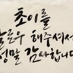
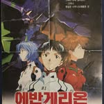
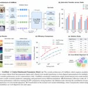
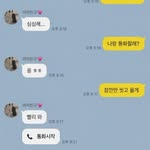
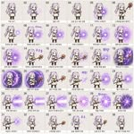

## duct-tape 시리즈란?

2026년 4월 중순, OpenAI는 **LM Arena**의 이미지 평가 사이트 [arena.ai/image](https://arena.ai/image)에서 익명으로 새로운 이미지 생성 모델을 테스트하기 시작했습니다.

코드네임은 **duct-tape** 계열:

| 모델명 | 비고 |
|--------|------|
| `maskingtape-alpha` | 알파 버전 |
| `gaffertape-alpha` | 알파 버전 |
| `packingtape-alpha` | 알파 버전 |
| `duct-tape` | 메인 모델 |

**아직 공식 배포 전**입니다. arena.ai/image 에서 블라인드 테스트로만 경험할 수 있으며, OpenAI가 직접 발표하기 전까지 정식 명칭도 공개되지 않았습니다.

하지만 커뮤니티의 반응은 이미 폭발적입니다. "인터넷에서 사진 다운로드 받아서 주는 게 아닌지 의심스러울 정도"라는 평가가 나올 정도로, 기존 이미지 생성 AI의 한계를 완전히 뛰어넘는 결과물들이 쏟아지고 있습니다.

## 왜 이 모델이 특별한가

기존 AI 이미지 모델들이 여전히 어려워하던 영역들을 duct-tape 시리즈는 거의 완벽하게 구현합니다.

### 1. 텍스트 렌더링 (Text Rendering)

가장 큰 도약입니다. 한국어를 포함한 비라틴 문자를 자연스럽게 렌더링합니다.

캘리그라피, 포스터, UI 요소, 간판, 뉴스 타이틀 등 — 텍스트가 이미지의 일부로 완벽하게 녹아듭니다. 기존 모델들은 글자가 외계어로 나오거나, 문자가 있어야 할 배경을 흐림 처리했던 것과 대조적입니다.

### 2. 포토리얼리즘 (Photorealism)

인물 사진, 길거리 사진, CCTV 영상 캡처까지 — 사진인지 AI인지 구별이 사실상 불가능합니다.

한국 CCTV 캡처까지 구현하는 것은, 한국어 컨텍스트에 대한 학습 데이터가 얼마나 깊은지를 보여주는 대목입니다.

### 3. UI / 디자인 모사

웹사이트 UI, 모바일 앱 화면, 프레젠테이션 슬라이드, 인포그래픽까지 완벽하게 재현합니다.

디자이너가 실제로 작업한 것 같은 레이아웃, 타이포그래피, 컬러 스케일까지 포착합니다.

### 4. 옛날 자료 복원

존재하지 않는 옛날 사진, 문서, 포스터를 과거의 인화지 질감까지 재현합니다.

이건 단순한 "옛스타일 필터"가 아닙니다. 당시의 인화 기술, 종이 질감, 컬러 베이스까지 학습한 결과로 보입니다.

### 5. 가상 논문 Figure & 아키텍처

학술 논문의 Figure, 차트, 건축 렌더링까지 생성합니다.

연구자가 아직 수행하지 않은 실험의 결과를 시각적으로 시뮬레이션하는 것이 가능해집니다. 윤리적 논의가 필요한 영역입니다.

### 6. 한국어 서비스 UI 모사

카카오톡 화면, 유튜브 썸네일, 인스타그램 라이브 화면까지 재현합니다.

이는 한국어 뿐 아니라 한국 서비스의 UI 컨벤션까지 학습한 것으로, 현지화(Localization) 수준이 전례 없이 높습니다.

### 7. 브랜드 & 광고

상업용 브랜드 시각물을 실제 에이전시가 제작한 것 같은 퀄리티로 생성합니다.

### 8. 게임 & 스프라이트

게임 화면, 캐릭터 스프라이트, 게임 일러스트까지 생성합니다.

## 기존 모델과의 비교

| 능력 | 기존 모델 (DALL-E 3 등) | duct-tape 시리즈 |
|------|------------------------|-------------------|
| 한국어 텍스트 | 외계어 또는 생략 | 완벽 렌더링 |
| UI/디자인 | 대략적 레이아웃 | 픽셀 단위 정확도 |
| 옛날 자료 | 스타일 필터 수준 | 인화지 질감 재현 |
| 포토리얼리즘 | AI 특유의 질감 | 구분 불가 |
| 한국 서비스 UI | 불가 | 카카오톡, 유튜브 등 |
| 논문 Figure | 차트 정도 | 전체 Figure 재현 |

## DALL-E 종료와의 연관성

OpenAI는 2026년 5월 기존 **DALL-E** 이미지 생성 서비스를 종료한다고 발표했습니다. duct-tape 시리즈가 공식 배포되면, GPT 내에 통합된 이미지 생성 기능이 DALL-E를 완전히 대체할 가능성이 높습니다.

타이밍이 맞습니다. arena.ai에서 커뮤니티 테스트를 진행하면서, 동시에 기존 서비스를 정리하는 것은 — 새 모델이 준비되었다는 강력한 신호입니다.

## 지금 테스트하려면

1. [arena.ai/image](https://arena.ai/image) 접속
2. 이미지 생성 블라인드 테스트 참여
3. `maskingtape-alpha`, `gaffertape-alpha`, `packingtape-alpha`, `duct-tape` 모델이 나오면 테스트

블라인드 테스트이므로 모델명이 보이지 않을 수도 있지만, duct-tape 시리즈의 결과물은 한 번 보면 알 수 있습니다. **그만큼 다른 모델과 차이가 납니다.**

## 윤리적 고민

이 수준의 이미지 생성 능력은 명백하게 양날의 검입니다.

- **뉴스 사진 조작**: 존재하지 않는 사건의 "증거 사진" 생성
- **인물 딥페이크**: 구분이 불가능한 가상 인물 사진
- **지식재산권**: 브랜드, 포스터, UI를 실제와 구별 불가하게 복제
- **학술 윤리**: 존재하지 않는 논문 Figure로 연구 시뮬레이션

"이미 AI 이미지는 구별할 수 있다"는 방어선이 무너지고 있습니다. duct-tape 시리즈는 이 방어선을 완전히 해체하는 수준입니다.

## 정리

- OpenAI가 **duct-tape 시리즈** (maskingtape, gaffertape, packingtape, duct-tape) 라는 코드네임의 차세대 이미지 모델을 테스트 중
- [arena.ai/image](https://arena.ai/image) 에서 블라인드 테스트로 경험 가능
- 텍스트 렌더링, 포토리얼리즘, UI 모사, 한국어 서비스 재현, 옛날 자료 복원 등 기존 한계를 완전히 뛰어넘음
- DALL-E 2026년 5월 종료와 맞물려, 공식 배포가 임박한 것으로 추정
- 윤리적 문제 (딥페이크, 허위 정보, 지식재산권)에 대한 사회적 논의가 시급함

---

## FAQ

### Q. duct-tape 모델을 공식으로 사용할 수 있나요?
아직 공식 배포 전입니다. arena.ai/image 에서 블라인드 테스트로만 경험할 수 있습니다.

### Q. DALL-E와 어떻게 다른가요?
텍스트 렌더링(특히 한국어), UI 정확도, 포토리얼리즘에서 근본적인 차이가 있습니다. DALL-E가 "AI 느낌이 나는 이미지"를 만든다면, duct-tape은 "진짜인지 의심하게 만드는 이미지"를 만듭니다.

### Q. 무료로 테스트할 수 있나요?
arena.ai/image의 블라인드 테스트는 무료로 참여할 수 있습니다. 모델명이 보이지 않는 블라인드 방식이지만, duct-tape 시리즈의 결과물은 다른 모델과 확연히 구분됩니다.

### Q. 왜 "duct-tape"라는 이름인가요?
OpenAI의 이미지 모델 코드네임 관행으로 보입니다. maskingtape(마스킹테이프), gaffertape(갑테이프), packingtape(포장용 테이프), duct-tape(덕트 테이프) — 모두 접착 테이프 계열에서 따온 이름입니다. 정식 명칭은 출시 때 다를 수 있습니다.

---

**참고:**
- [@choi.openai Threads 스레드](https://www.threads.com/@choi.openai/post/DXJmJIsD-fv) — 15가지 제작 사례
- [@choi.openai Threads 스레드 2](https://www.threads.com/@choi.openai/post/DXJxcnKD7H5) — 신뢰 불가 사례 15가지
- [LM Arena Image](https://arena.ai/image) — 블라인드 테스트 사이트
