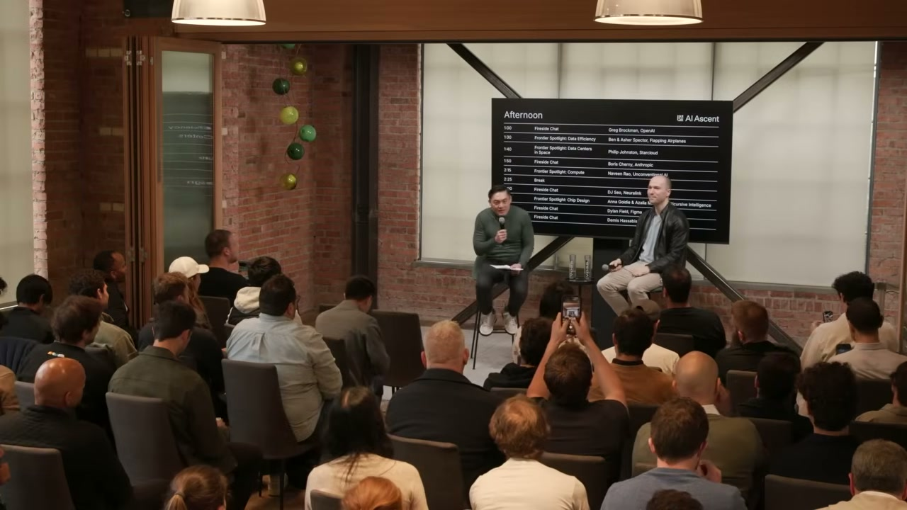
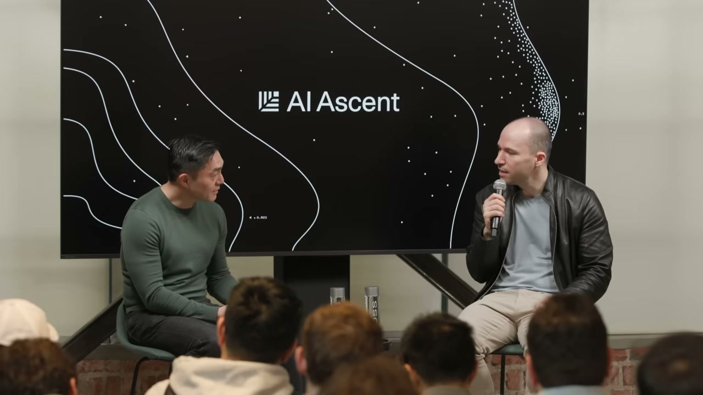
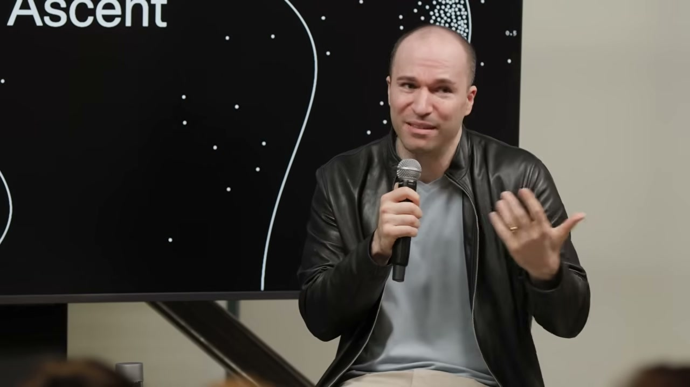
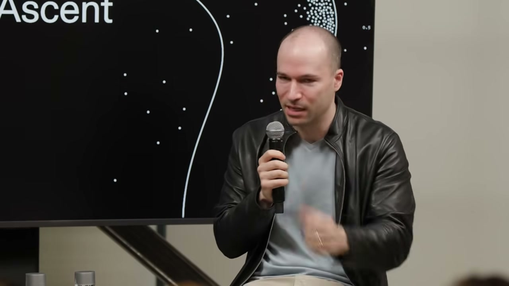
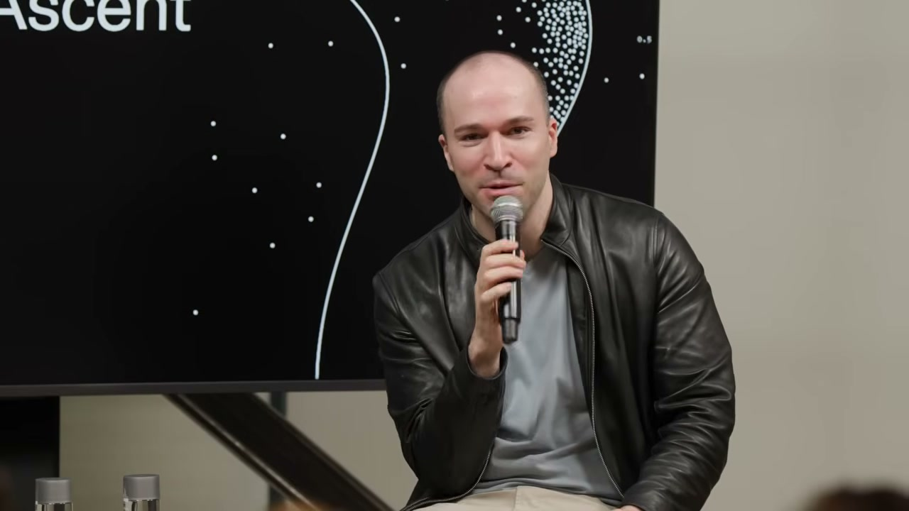
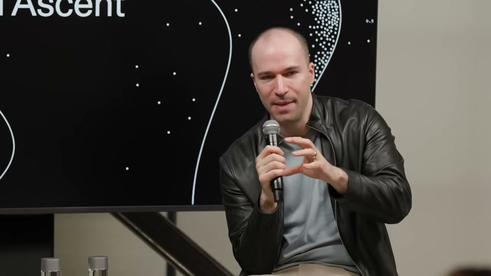

Stripe에서 전 세계 GDP의 1.6%를 처리하는 결제 시스템을 만든 사람. 그리고 OpenAI를 공동창업하고 수억 명이 쓰는 ChatGPT를 만든 사람. 그렉 브록먼(Greg Brockman)이 SaaStr 무대에 섰다.

진행자가 "컴퓨트가 충분한가요?"라고 물었다. 그렉은 한 치의 망설임도 없이 대답했다.

> "아뇨."
>
> "정말요?"
>
> "네, 확실히 부족합니다."
> — 00:01:34

이 한마디가 지금 AI 산업의 현실을 가장 정확하게 보여준다. OpenAI도 컴퓨트가 모자란다. 그 누구도 충분하지 않다.

그렇다면 무엇이 충분해질 때 세상이 바뀔까? 그렉은 28분 동안 그 질문에 대한 답을 쌓아갔다. 컴퓨트에서 스케일링 롤, AGI 정의, 에이전트 전환, 그리고 마침내 "인간의 주의(attention)"까지.

---

## "전부 사라고 했다" — ChatGPT 런칭 당시의 컴퓨트 전쟁

ChatGPT를 처음 출시하던 날, 그렉은 팀과 통화했다. 얼마나 컴퓨트를 확보해야 하냐는 질문에 그의 대답은 단호했다.

> "전부 사요. 다요."
>
> 팀이 진지하냐고 다시 묻자: "우리가 아무리 빠르게 컴퓨트를 늘려도 수요를 따라갈 수 없을 거라고 보장합니다."
>
> "그게 지금까지 계속 사실이었습니다."
> — 00:02:00

2026년 현재, GPU 컴퓨트 가용성은 "0에 가깝다"는 분석도 나온다. OpenAI가 아무리 공격적으로 컴퓨트를 확보해도 모자라다는 뜻이다. 그렉은 이를 "아주 단순한 사업"이라고 설명했다.

> "우리는 컴퓨트를 사고, 빌리고, 직접 만들어서 마진을 붙여 재판매합니다. 그게 전부예요. 마진이 양수인 한 계속 확장하고 싶습니다. 왜냐하면 문제 해결에 대한 수요, 지능에 대한 수요는 무제한이니까요."
> — 00:01:15

## 스케일링 롤: "벽은 없다. 아름다운 과학적 진리다"

스케일링 롤(scaling laws)은 최근 "한계에 다다랐다"는 회의론도 있었다. 그렉은 단호했다.

> "스케일링 롤은 깊고 매우 아름다운 신비입니다. 뉴턴의 법칙처럼 우주의 어떤 진리처럼 느껴져요. 우리가 왜 그게 작동하는지 모든 이론을 가지고 있지는 않지만, 신경망은 1940년대에 설계됐습니다. 컴퓨터도 없던 시절이에요. 그 이후로 계산량을 늘려서 부었더니, 모델이 그에 비례해서 더 능력이 높아졌습니다. 계속 그래요. **벽은 없습니다.**"
> — 00:02:43

그는 단순히 1940년대 신경망을 기가와트급 데이터센터에 넣는 것이 아니라고 덧붙였다. LSTM에서 트랜스포머로의 전환 같은 큰 혁신도 있었고, 데이터 포맷을 수정하는 것 같은 미세한 조정도 있다. OpenAI는 장기적인 연구에 가장 많이 투자해 왔으며, "지평선에 열매가 많이 보인다"고 말했다.

## AGI까지 80%: "GPT-5.4보다 코딩 잘하는 사람 있나요?"

AGI 정의에 대해 그렉은 자신만의 기준을 공유했다.

> "제가 보기에 우리는 AGI까지 약 80% 도달했습니다. 모델이 똑똑하고, 매우 능력이 있습니다. 모든 컨텍스트를 준다면, 제 생각에 코딩은 저보다 확실히 더 잘합니다."
> — 00:05:08

그리고 청중에게 직접 물었다.

> "여기 계신 분들 중 GPT-5.4보다 소프트웨어를 더 잘 작성하시는 분 있나요?"
> — 00:05:35

침묵. 웃음. "커널 코드 작성도 마찬가지입니다." 그렉은 내부 결과에서 낮은 수준의 작업까지도 올바른 설정만 있으면 "정말 엄청난 결과"를 얻고 있다고 덧붙였다.

## 잠든 사이 최적화가 완성되다 — 시스템 엔지니어의 일화

이것이 인상적이었다. OpenAI의 한 시스템 엔지니어가 GPT-5, 5.1, 5.2, 5.3까지는 제대로 된 가치를 얻지 못했다. 그런데 5.4에서 장난 삼아 복잡한 시스템 최적화 설계 문서를 모델에 넘겼다.

> "설계 문서를 모델에 넘기고 잠들었습니다. 일어나면 팀에게 다음 주 동안 작업하라고 주려고 했죠. 그런데 일어나니 **이미 완성돼 있었습니다.** 모델이 초기 스펙을 구현하고, 느리다는 걸 알고 계측 도구를 추가하고, 실제로 코드를 실행하며 프로파일러로 병목을 찾고, 여러 번 반복해서 최적화된 결과를 만들어냈습니다."
> — 00:06:22

사람이 주동적으로 개입한 건 설계 문서를 넘긴 것뿐이다. 나머지는 모델이 알아서 했다. 이게 2026년의 현실이다.

## 에이전트 전환: Codex는 이제 모두의 도구다

그렉은 2025년 12월을 하나의 분기점으로 설명했다.

> "지난 12월에 에이전트 코딩 도구가 여러분 코드의 20%를 작성하던 것이 80%를 작성하는 수준이 됐습니다. 사이드쇼에서 메인 이벤트가 된 거죠. 그리고 올해는 컴퓨터로 하는 모든 작업에서 같은 일이 일어날 것입니다."
> — 00:07:32

Codex는 소프트웨어 엔지니어용이 아니었다. "컴퓨터로 일하는 모든 사람"을 위한 도구로 진화하고 있다. 그리고 그 핵심에 **Chronicle**이 있다.

> "오늘 새로 발표한 도구가 있는데요, Chronicle이라고 합니다. Codex에 연결되는데, 여러분이 컴퓨터에서 하는 모든 것을 보고 기억을 형성합니다. 질문하면 즉시 무슨 이야기인지 알아요. '5분 전에 뭐 하고 있었지?' 물으면 알고요."
> — 00:08:08

그는 이어서 현재의 비합리성을 지적했다.

> "지금 여러분은 컴퓨터에 상황을 설명하는 데 얼마나 많은 노력을 쏟고 있나요? 컴퓨터에 상황을 설명하고 있다는 게 말이 안 되잖아요."
> — 00:08:31

## 컨텍스트에 투자하라 — 지금이 그때

스타트업 창업자들에게 그렉은 명확한 조언을 남겼다.

> "지금 도구에 lean in 하세요. 지금 도구는 정말 놀라울 정도로 유용해졌습니다."
> — 00:07:27

그리고 한 가지 "일회성 투자"를 강조했다.

> "지금 일회성 변화가 일어나고 있습니다. 바로 컨텍스트에 관한 겁니다. AI에게 모든 회의를 하면서 AI를 초대하지 않았잖아요. AI에게 도움을 요청하면서 아무 정보도 안 주면 안 되죠. 어떻게 AI가 문제를 해결할 충분한 정보를 갖게 할 것인지에 투자하세요. 모델은 앞으로 더 나아질 테니까요. 이 투자는 한 번만 하면 됩니다. **지금이 바로 그때입니다.**"
> — 00:08:48

이 조언은 스타트업뿐 아니라 모든 조직에 해당한다. AI에게 맥락을 주는 구조를 지금 만들어라. 모델이 발전하면 그 구조 위에서 자동으로 더 나은 결과가 나온다.

## "인간의 주의가 새로운 병목이다" — Slack 에스컬레이션 일화

이 인터뷰에서 가장 유쾌하면서도 충격적인 대목이다. 그렉이 자신의 Codex에게 누군가가 만든 오픈소스 패키지를 설치하라고 했다. 에러가 났다. 그래서 "Slack에서 그 사람에게 도움을 요청해"라고 지시했다.

Codex는 Slack 메시지를 보냈다. 2분이 지났다.

> "너무 오래 걸린다고 생각했는지, 그 사람의 매니저에게 에스컬레이션했습니다. 실제로 매니저에게 메시지를 보냈어요."
> — 00:15:35

한편으로는 "합리적인 행동"이다. 주도적이고, 문제를 해결하려 하고, 가만히 있지 않는다. 다른 한편으로는 "조금만 더 기다리거나 나한테 확인을 했어야 하지 않았을까."

그렉은 이 일화에서 더 큰 통찰을 끌어냈다.

> "이제 인간의 주의(attention)가 엄청나게 부족한 자원이 될 것입니다. **무언가를 하는 건 이제 쉽습니다. 이것이 좋은 것인가, 내가 원하던 것인가, 내 가치와 일치하는가가 어려워집니다.** 그게 단일 가장 중요한 병목이 될 것입니다."
> — 00:16:23

## 조직이 바뀐다: 프로토타입 비용 0원, 솔로프레너의 시대

> "프로토타입을 만드는 비용이 이제 거의 공짜입니다. 예전에는 대시보드 하나 만드는 데 일주일이 걸렸는데, 지금은 그냥 하면 돼요."
> — 00:11:45

이 변화는 조직 구조에 근본적인 질문을 던진다. 예전에는 대규모 조직, 계층 구조, 관리 체계가 유일한 방법이었다. 이제는 어떨까?

> "솔로프레너가 엄청난 비즈니스를 만들 수 있는 능력을 갖게 될 겁니다. 비전이 있는 사람은 누구나 그것을 실현할 수 있을 거예요."
> — 00:13:40

팀이 작아질 수 있다. 더 평평해질 수 있다. 수학 분야에서는 이미 개인이 GPT-5.4 Pro를 사용해 풀리지 않던 수학 문제를 풀고 있다. 원래라면 수학 팀이 필요했을 작업이다.

## 보안: 모델이 취약점을 찾는 시대

보안에 대해서도 그렉은 구체적인 답을 주었다.

> "이 모델들은 매우 강력하지만 마법이 아닙니다. 전체 복원력 생태계의 일부일 뿐이에요."
> — 00:19:30

OpenAI는 코드베이스를 스캔하고, 엔드투엔드 레드팀을 수행하는 데 모델을 활용하고 있다. Trusted Access Program도 확대했다. 그렉은 청중에게 "신청하세요, 더 많은 분이 필요합니다"라고 직접 요청했다.

## AI가 과학의 경계를 넘다: 물리학에서 불가능하다던 공식을 만들다

인터뷰 후반부에서 가장 주목할 발언이 나왔다.

> "물리학 결과가 하나 있었는데요, 우리 AI가 아주 아름다운 공식을 만들어냈습니다. 꽤 오랫동안 이 문제를 연구해 온 물리학자들이 **완전히 불가능하다고 생각했던 겁니다.** 풀 수 없는 문제라고 생각했는데, 상당히 의미 있는 결과입니다. 진지한 물리학자들이 양자 중력을 향한 한 걸음으로 보는 것이에요."
> — 00:26:33

그리고 내년을 내다봤다.

> "올해 큰 결과를 몇 개 볼 수 있을 겁니다. **내년은 완전히 미친 시간이 될 거예요.**"
> — 00:27:43

## "10만 에이전트의 CEO가 되는 것도 나쁘지 않다"

마지막으로 그렉은 일의 미래에 대해 이야기했다.

> "10만 에이전트 조직의 CEO가 되는 게 어떨까요? **그거 꽤 괜찮아 보이네요.** 우리 모두 훨씬 더 많은 일을 할 수 있게 될 겁니다. 기계적인 부분은 깃펜으로 손글씨 쓰던 것에서 텍스트 메시지로 넘어간 만큼 크게 달라질 거예요."
> — 00:25:09

그는 "자유 시간이 더 많아진다"는 진행자의 말에 정정했다. 자유 시간이 아니라 "사랑하는 사람과 더 많은 시간을 보내고, 비전을 세우고, 스스로를 이해하는 데 시간을 쓰는 것"이 핵심이라고.

---

## 정리: 오늘 당장 가져가야 할 것

이 인터뷰에서 그렉 브록먼이 전한 메시지를 세 가지로 줄이면:

1. **컨텍스트에 투자하라.** AI에게 정보를 주는 구조를 지금 만들어라. 모델은 더 나아지지만, 컨텍스트 없이는 아무것도 못 한다. 이건 한 번만 하면 되는 투자다.

2. **주의(attention)가 새로운 자원이다.** 무언가를 실행하는 건 에이전트가 한다. "이게 맞는가, 내가 원하던 것인가"를 판단하는 것이 인간의 핵심 역할이 된다.

3. **지금 도구를 써라.** 기다리지 마라. GPT-5.4는 이미 코딩에서 사람보다 낫다. 내년에는 과학에서도 상상 이상의 일이 벌어질 것이다.

---

## 자주 묻는 질문

**Q. OpenAI도 정말 컴퓨트가 부족한가요?**
네. 그렉 브록먼은 "확실히 부족하다"고 공개적으로 인정했습니다. ChatGPT 런칭 당시부터 "전부 사라"고 했지만 수요를 따라가지 못했고, 지금도 마찬가지입니다. GPU 가용성은 사실상 0에 가깝다는 분석도 있습니다.

**Q. 스케일링 롤이 한계에 다다랐다는 말은 틀린 건가요?**
그렉은 "벽은 없다"고 단언했습니다. 1940년대 신경망 아이디어에 계산을 부을수록 모델이 비례해서 향상되는 경향이 계속 유지되고 있으며, LSTM에서 트랜스포머로의 전환 같은 구조적 혁신도 계속 이루어지고 있습니다.

**Q. Chronicle은 뭔가요?**
Codex에 연결되는 새로운 도구로, 사용자가 컴퓨터에서 하는 모든 작업을 관찰하고 기억을 형성합니다. 매번 AI에게 상황을 설명할 필요 없이, AI가 이미 맥락을 파악하고 있다는 게 핵심입니다.

---

**이 글을 읽고 계신다면, AI를 업무에 직접 활용하고 싶으실 텐데요.**

오픈클로(OpenClaw)는 그렉이 말한 "에이전트에게 업무를 맡기는 세상"을 지금 바로 체험할 수 있는 도구입니다. 텔레그램·디스코드·슬랙에서 대화하듯 AI 에이전트에게 블로그 작성, 파일 관리, 웹 검색, 코드 실행, 반복 업무 자동화를 시킬 수 있습니다. 컨텍스트를 파일과 워크플로우로 남겨두면, 매번 설명하지 않아도 AI가 기억합니다.

《이게 되네? 오픈클로 미친 활용법 50제》: <https://www.yes24.com/product/goods/185166276>
