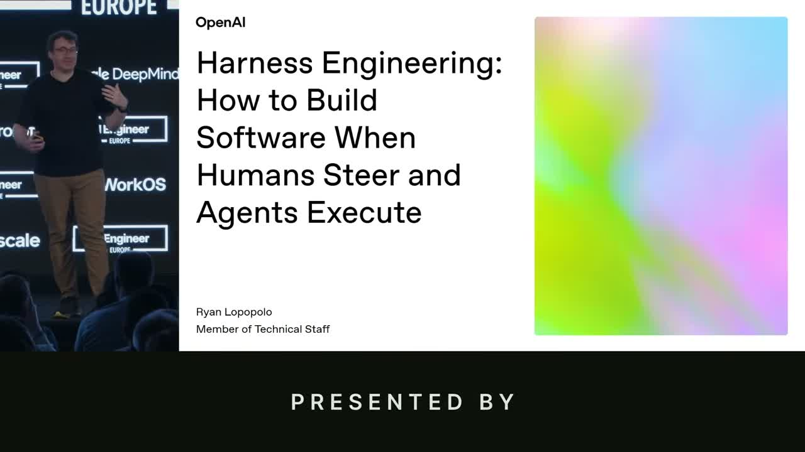
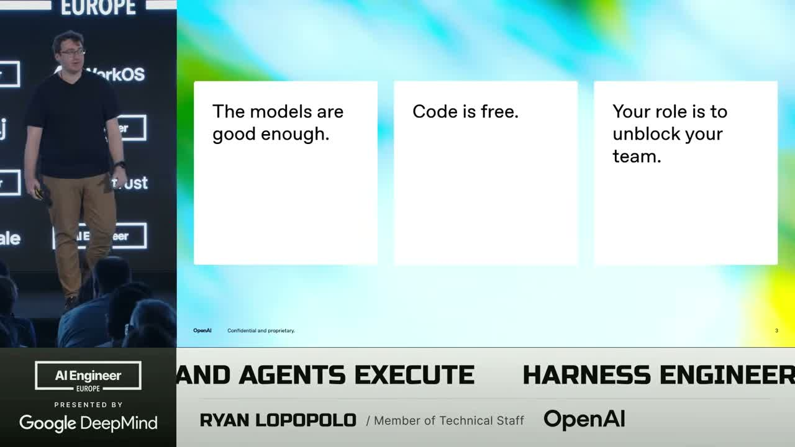
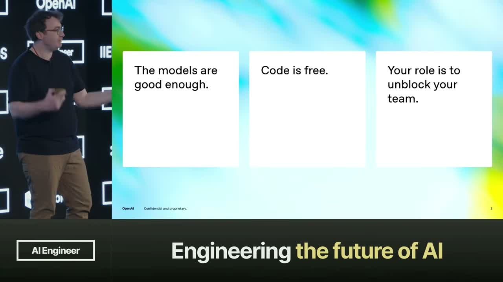
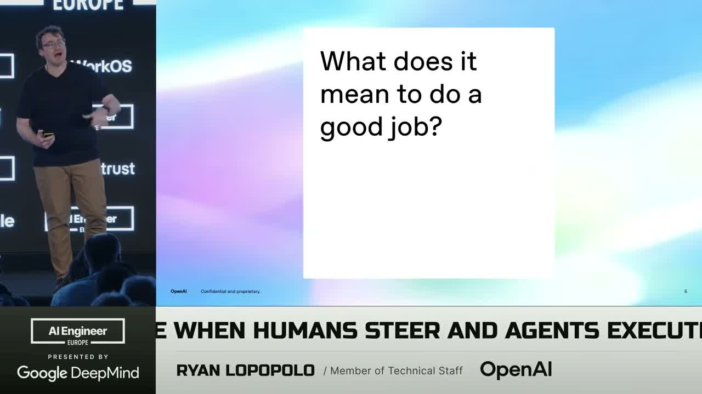
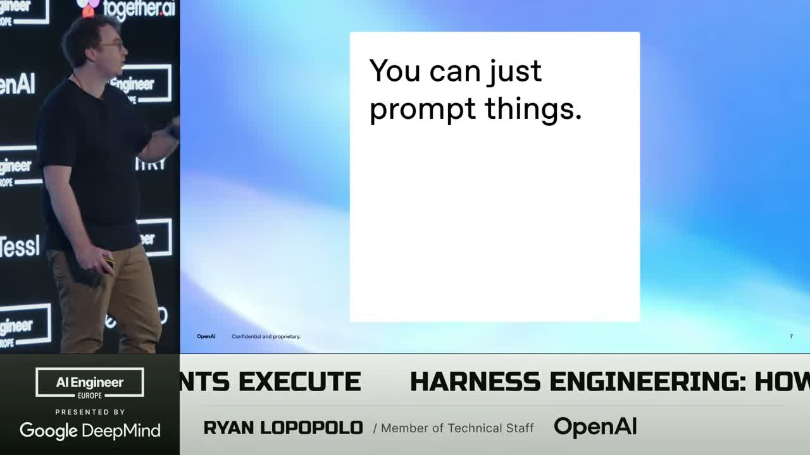
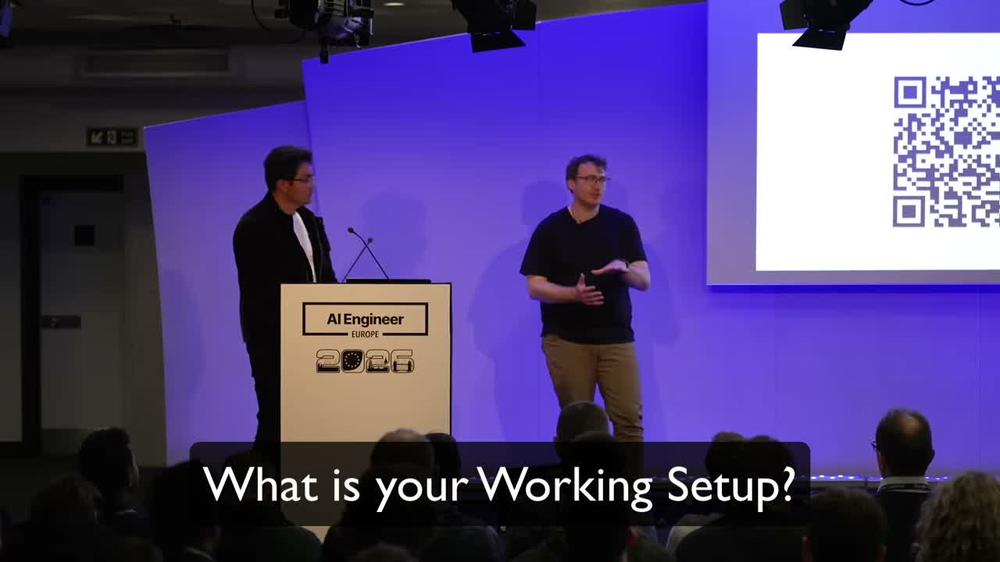
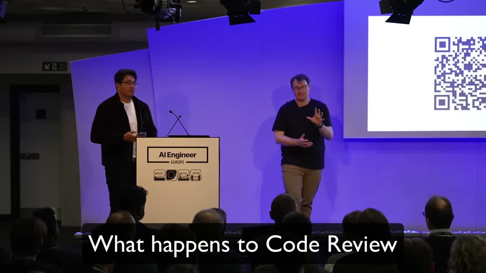
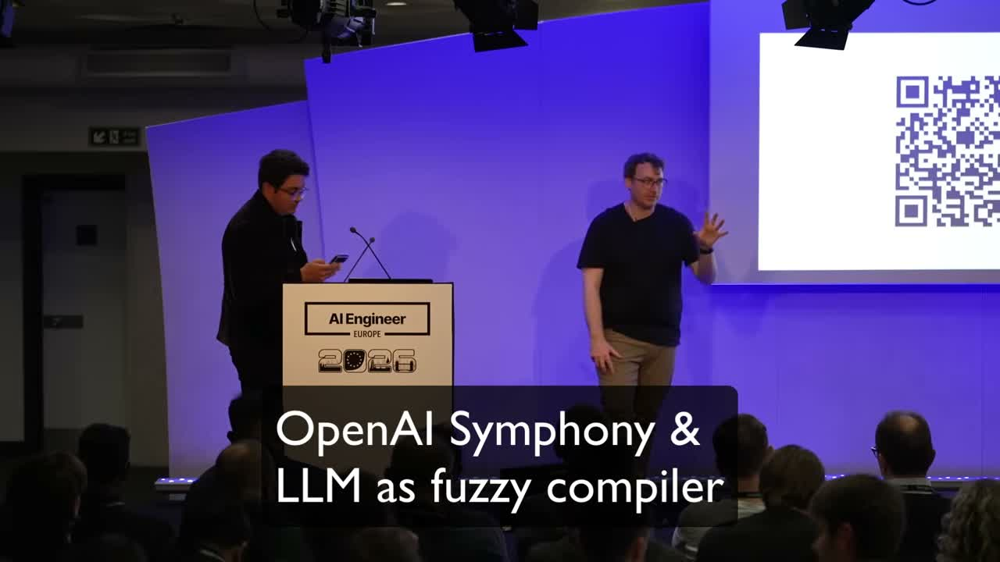

1. OpenAI의 Ryan Lopopolo가 AI Engineer London에서 발표한 **Harness Engineering** 키노트를 46분 분량 통째로 정리함. 원문은 [openai.com/index/harness-engineering](https://openai.com/index/harness-engineering/), 영상은 [유튜브 원본](https://youtu.be/am_oeAoUhew)에서 볼 수 있음.

2. 일단 스피커 자격부터 특이함. 발표 자리에서 본인을 이렇게 소개함.

> "For the last nine months I have had the privilege of building software exclusively with agents. I am a token billionaire."
> 지난 9개월 동안 오직 에이전트로만 소프트웨어를 빌드했음. 난 토큰 빌리어네어(10억 단위 토큰 소비자)임.

3. Latent Space 호스트가 패널에서 덧붙인 숫자가 더 센데, **하루 아웃풋 토큰만 10억 개 이상** 씀. 돈으로 환산하면 **일 1,000달러 이상**. 팀원들한테는 에디터를 아예 못 건드리게 금지시킴. 모델을 통해서만 작업하도록 강제해서 습관을 바꿨다고 함.

4. 발표 전체를 관통하는 주장은 하나임. **code is free(코드는 무료)**. 이게 어떤 의미냐.

> "Code is free. It's free to produce, free to refactor, and it is not a thing to get hung up on anymore."
> 코드는 무료임. 생산도 공짜, 리팩토링도 공짜, 이제 매달릴 대상이 아님.

5. 왜 이게 가능해졌냐. 2025년 말에 일어난 세 가지 변화라고 함.

- **GPT-5.2 등장**: 소프트웨어 엔지니어의 full job을 수행 가능. 코드 생산 퀄리티가 사람과 동등(isomorphic).
- **모델이 인내심이 무한**: 코드를 생산·유지·리팩토링·삭제하는 비용이 사람 주의력에서 해방됨.
- **병렬 무제한**: 한 엔지니어가 5명, 50명, 5,000명 몫의 동시 실행 가능.

6. 결과적으로 **스킬셋의 축이 이동**함. Implementation 자체가 희소 자원이 아니라 시스템 사고, 시스템 설계, 델리게이션이 희소해짐. 모든 엔지니어가 사실상 스태프 엔지니어 포지션으로 격상됨.

> "Every one of you is a staff engineer. You have as many team members as you can possibly drive concurrently and have tokens to support."
> 모두가 스태프 엔지니어임. 동시에 몰 수 있는 팀원 수는 당신이 감당 가능한 토큰만큼임.

7. 그럼 뭐가 희소 자원이냐. Ryan이 명시적으로 세 가지를 꼽음.

| 희소 자원 | 의미 |
|---|---|
| 인간 시간 | 더 이상 코드 생산에 쓰면 안 되는 자원 |
| 인간 + 모델 주의력 | 레이아웃·컨텍스트에 의해 쉽게 낭비됨 |
| 모델 컨텍스트 윈도우 | 토큰 예산은 무한하지만 한 번에 볼 수 있는 양은 유한 |

8. P0/P1/P2/P3 우선순위 개념이 무너짐. 예전엔 P3는 영원히 안 했는데, 지금은 **P3도 4개 병렬로 그냥 킥오프**해서 하나 골라서 머지하면 끝이라고 함. 이게 팀 문화를 완전히 바꿈.

9. 내부 툴도 달라짐. 예전엔 "영어 한 언어 i18n만 하면 됨"이 합리적이었는데, 지금은 **런던·더블린·파리·브뤼셀·취리히·뮌헨 동료들이 각자 모국어로 쓸 수 있는 툴을 day 1부터** 만들 수 있음. 다른 팀 캐파를 뺏지 않고.

10. 그럼 에이전트한테 "좋은 일"을 시키려면 뭐가 필요하냐. 핵심이 **non-functional requirements(비기능 요구사항)** 임. 모델은 훈련 중에 가능한 모든 선택을 다 본 상태라서, 우리가 명시해줘야 뭘 고를지 앎.

> "A single patch well probably requires 500 little decisions along the way around the underspecified non-functional requirements."
> 패치 하나를 잘하려면 과정에 명시되지 않은 비기능 요구사항에 대해 500개쯤 작은 결정이 필요함.

11. 그래서 **프롬프트를 온갖 곳에 심는다**고 함. AGENTS.md만이 아님. rules 파일, skills, **lint 에러 메시지**, review agent가 PR에 다는 코멘트, 테스트 실패 메시지까지 전부 프롬프트임.

> "Prompts are powers. Prompts rules files prompts skills prompts these lint error messages that I am talking about prompts."
> 프롬프트가 힘임. 룰 파일도 프롬프트, 스킬도 프롬프트, 내가 말하는 이 린트 에러 메시지도 프롬프트임.

12. 구체적 예시. 네트워크 호출에 timeout과 retry를 빠뜨리는 건 본인도 자주 함. 이걸 고치려면 "fetch 호출 감지하는 린트 룰 + 린트 실패 메시지에 구체 수정 방법" 을 박아둠. 에이전트는 그걸 보고 바로 고침. 한 번 고정해두면 **코드베이스 전체 마이그레이션**이 공짜라서 durable하게 해결됨.

13. 더 재미있는 건 **소스코드에 대한 테스트**를 쓴다는 것. 예를 들어 "모든 파일은 350라인 이하"를 테스트로 강제함. 컨텍스트 한계가 희소 자원이니까, 모델이 한 파일에 집중할 수 있게 코드베이스 자체를 harness에 맞게 적응시키는 셈임.

14. QA 플랜도 같은 원리로 풀었음. 팀에 프로덕트마인드 엔지니어 한 명이 "좋은 QA 플랜 쓰는 법"을 문서화함. 그 문서를 리뷰 에이전트가 읽고, 모든 유저 대면 작업에 QA 플랜 + 스크린샷 첨부 여부를 검사함.

> "A QA plan indicates what media should be attached to the PR. Which has the consequence of me trusting the output more, needing to shoulder surf the agent less."
> QA 플랜이 PR에 붙일 미디어를 지정함. 결과적으로 아웃풋 신뢰도가 올라가고 내가 에이전트 뒤를 덜 쫓게 됨.

15. Q&A에서 가장 충격적인 답변 하나.

> "Every time I have to type continue to the agent is a failure of the harness to provide enough context around what it means to continue to completion."
> 에이전트한테 내가 continue를 눌러야 한다는 건, 완료까지 뭘 해야 하는지 컨텍스트를 충분히 못 준 harness의 실패임.

16. 이 철학 덕분에 본인은 **commute 중에도 에이전트를 돌림**. 사무실 나오기 직전에 태스크 하나 kick off → 랩탑을 핸드폰에 테더링 → 뒷좌석에 묶어두고 30분 운전 → 집 도착 시 완료. "continue"를 본인이 누르지 않게 하는 게 harness 설계 목표임.

17. 리포지토리 구조는 대담함. 빈 Electron 앱에서 시작했다가 결국 **PNPM 워크스페이스 750패키지**까지 갔다고 함. 이유는 단순함.

> "Even if you don't actually have microservices, structuring your repositories in ways that you can actually scope the directory subtree you are looking in to be able to do most of the change helps."
> 실제로 마이크로서비스가 아니어도, 대부분 변경이 한 서브트리로 한정되게 리포를 구조화하면 도움됨.

18. 같은 맥락에서 "코드는 같게 만들기(make things the same)" 를 강조함. bounded concurrency 헬퍼는 하나, ORM 하나, CI 스크립트 쓰는 법 하나, 린트 추가하는 법 하나. 이유는 "모델이 만들어야 할 토큰을 예측 가능하게 만들기 위해서". 이게 **컨텍스트 활용도를 극대화**하는 방법임.

19. 스킬 개수 철학도 의외임. "수천 개 skills 가 아니라 **5~10개만 유지**하고 기존 걸 개선한다". 이유는 리포지토리 내부 툴이 너무 자주 바뀌어서 수많은 스킬을 유지할 밴드위스가 없음. 복잡성을 스킬 뒤에 숨기고 에이전트가 알아서 하게 둠.

20. 그렇게 Codex 진입점 하나로 모든 게 돌아감. Chrome DevTools 직접 호출 → 로컬 데몬으로 바뀐 게 **3주 동안 본인이 몰랐는데 문제없었음**. 왜냐하면 Codex가 문서 보고 알아서 처리함.

21. **Garbage Collection Day**. 팀 운영의 핵심 의식임. 매주 금요일마다 팀 전원이 "한 주간 본 슬롭을 카테고리별로 박멸"하는 데 하루를 씀.

> "Every bit of slop we had observed over the course of the week that was making a PR difficult to merge and figure out ways to categorically eliminate it from ever happening in the first place."
> 한 주 동안 PR 머지를 어렵게 한 모든 슬롭을, 애초에 발생하지 않도록 카테고리별로 제거할 방법을 찾음.

22. 코드 리뷰는 페르소나별 리뷰 에이전트로 풀었음. 프런트엔드 아키텍처 / 릴라이어빌리티 / 스케일러빌리티 / 프로덕트 마인드 각각에 해당 페르소나 문서를 주고, 푸시마다 에이전트가 돌아서 "P2 이상 이슈만" 코멘트함. 사람은 병목에서 빠짐.

23. 1B 토큰을 어떻게 쓰는지도 질문받았는데 답이 깔끔함. **1/3은 계획/티켓 큐레이션/문서, 1/3은 구현, 1/3은 CI에서 리뷰**. 무시할 수 없는 게 **CI 토큰 비중**임. 코드 쓰는 건 더 이상 어려운 파트가 아니고, "코드가 받아들여지게 하는" 게 가치 생성임.

24. Plan mode 사용 여부도 재미있음. 본인은 거의 안 씀.

> "If you do use a plan and you approve it without reading it at all, you're actually encoding a bunch of instructions that you don't necessarily want followed."
> 플랜을 안 읽고 승인하면, 따르기 싫은 지시를 한 뭉치 인코딩해버리는 셈임.

25. 대안은 **플랜을 단독 PR로 올려서 한 줄 한 줄 사람이 리뷰하고 머지**한 뒤 실행. 안 읽을 플랜이면 아예 티켓 바로 던져서 에이전트가 알아서 하게 놔두라고 함.

26. 발표 후반부 핵심 주장.

> "Is code a disposable build artifact? Yes."
> 코드는 소모품 빌드 산출물인가? 맞음.

27. 이걸 이해하는 프레임이 재미있음. **LLM을 퍼지 컴파일러**로 보는 것. 하네스 엔지니어링에서 쌓는 모든 컨텍스트는 LLVM의 정적 분석·최적화 패스와 같음. 모델 교체는 LLVM → Cranelift로 코드 생성 백엔드를 바꾸는 것과 동급. 최종 "머신코드(= 사람이 받아들일 소스코드)" 가 유효하게 나오면 됨.

28. 마지막에 비전을 묻는 질문이 나왔는데, 이게 발표 전체를 요약하는 답변임.

> "The feature that I want to build toward here is where I'm able to take a token budget and a quarter, a half or a year's worth of work, take the human input to rank what is most important, success metrics, reliability metrics, give it to the machines and have them continually work and advance my product forward."
> 내가 만들고 싶은 미래는, 토큰 예산과 분기·반기·연간 업무량을 쥔 상태에서 인간이 우선순위와 성공 지표·신뢰도 지표만 정해주면 에이전트가 계속 일해서 프로덕트를 전진시키는 구조임.

29. 그리고 **글쓰기 외 엔지니어링 업무도 에이전트로 넘김**. 유저 피드백 트리아지, 페이지 대응, 프로덕션 로그의 PII 누출 감시, Twitter 반응 모니터링, 유저 오퍼레이션 스태프용 런북 작성, 이걸 모두 "에이전트가 잘하는 것"으로 재분류하고 인간은 더 메타적인 작업으로 이동함.

30. 정리하면 Harness Engineering은 결국 세 가지 확신으로 수렴함.

- **코드는 무료, 컨텍스트는 희소**: 코드를 아낄 게 아니라 컨텍스트를 아껴야 함.
- **하네스는 의견의 집합**: 린트·테스트·스킬·리뷰 에이전트·문서 전부가 프롬프트임.
- **인간의 역할은 정의와 스케줄링**: 구현은 위임, 인간은 우선순위·성공 기준·병목 제거.

31. 발표의 마지막 메시지는 간단함.

> "Do not hesitate to remove yourselves from the loop by getting the agents to do the full job because they can."
> 에이전트한테 full job을 시켜서 자기 자신을 루프에서 빼는 걸 주저하지 마라. 그들은 할 수 있음.

32. 관련 자료.

- 원문 아티클: [OpenAI — Harness Engineering](https://openai.com/index/harness-engineering/)
- 유튜브 키노트: [AI Engineer — Ryan Lopopolo](https://youtu.be/am_oeAoUhew)
- Latent Space 풀 팟캐스트: [latent.space/p/harness-eng](https://latent.space/p/harness-eng)
- 발표자 X: [@_lopopolo](https://x.com/_lopopolo)
