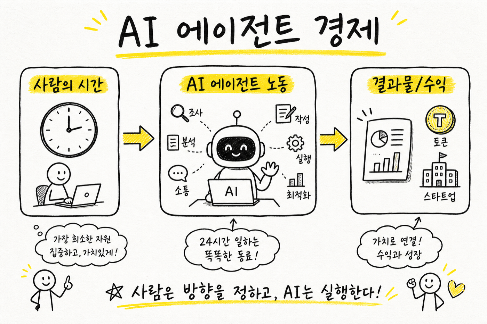
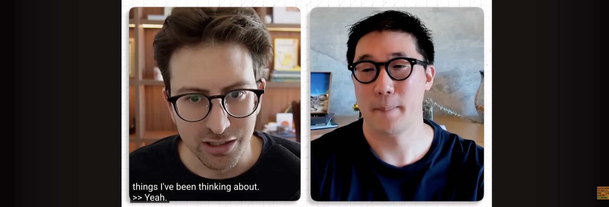
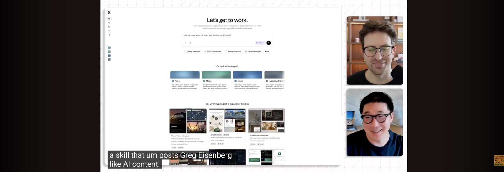
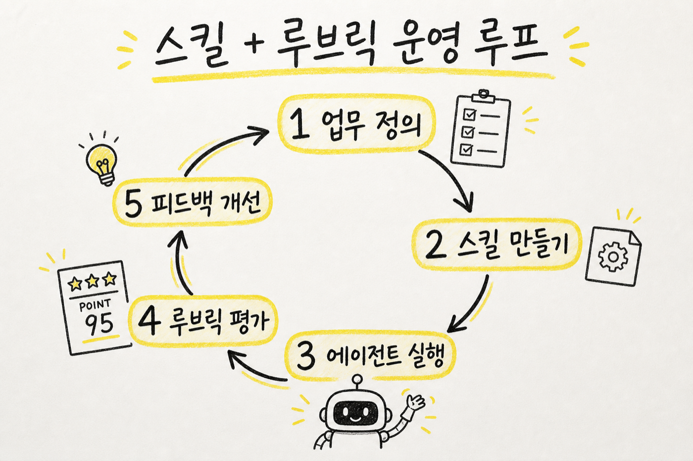
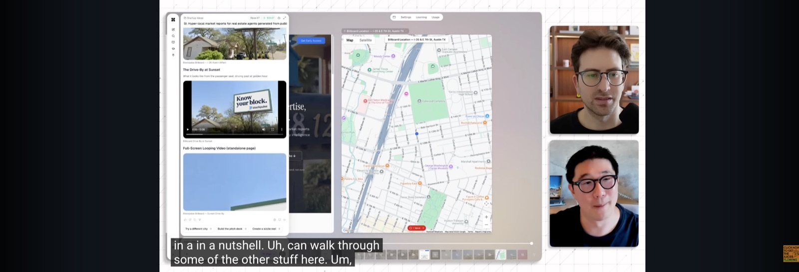
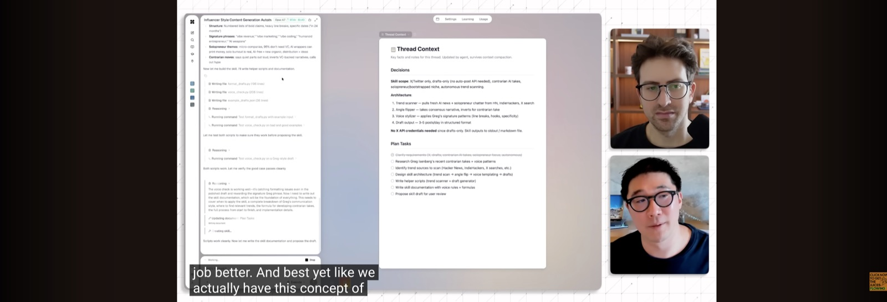
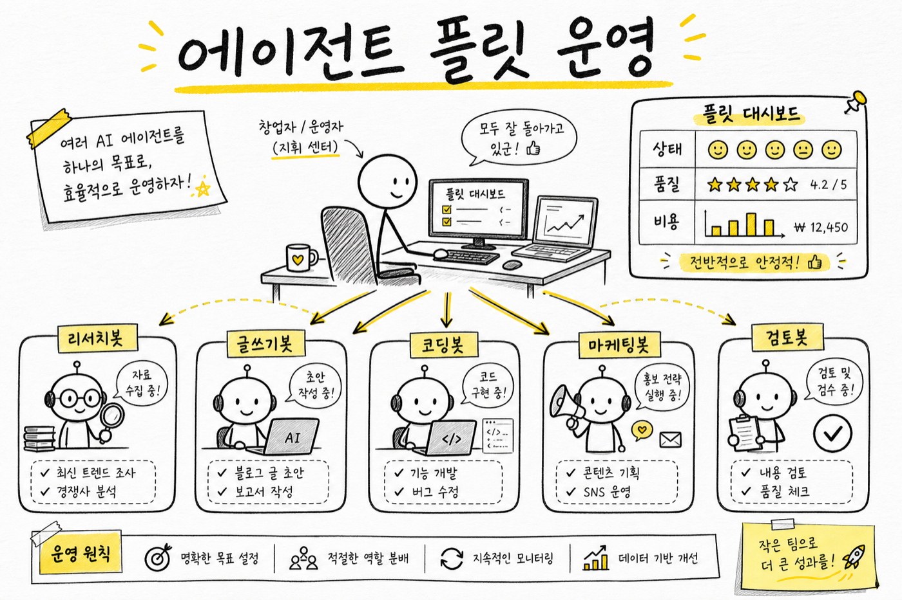

> 원본 영상: [Making \$\$ with AI Agents - Greg Isenberg × Howie Liu](https://www.youtube.com/watch?v=nyO60uzTnP4)  
> 형식: 원본 인터뷰 내용을 바탕으로 핵심 질문과 답변을 뉴스레터 스타일로 재구성함.

<iframe width="100%" height="420" src="https://www.youtube.com/embed/nyO60uzTnP4" title="Making money with AI Agents" frameborder="0" allow="accelerometer; autoplay; clipboard-write; encrypted-media; gyroscope; picture-in-picture; web-share" allowfullscreen></iframe>

AI 에이전트 이야기가 다시 뜨거워졌습니다.

이번에는 단순히 “챗봇이 똑똑해졌다”는 이야기가 아닙니다. Greg Isenberg가 Airtable 공동창업자이자 HyperAgent를 만든 Howie Liu와 나눈 대화의 중심에는 이런 질문이 깔려 있습니다.

**AI 에이전트는 이제 실제로 돈을 벌 수 있는 노동력이 되었는가?**

Howie의 답은 꽤 명확합니다.

“모델은 이미 충분히 똑똑해졌다. 이제 중요한 건 에이전트를 어떤 역할에 배치하고, 어떻게 운영하느냐다.”

*AI 에이전트 비용은 구독료가 아니라, 사람이 쓰던 시간과 결과물의 가치로 다시 계산해야 합니다.*

## Q1. AI 에이전트 시장은 왜 갑자기 커졌나?

**Greg:** Sequoia 차트를 보면 소프트웨어 엔지니어링 쪽은 AI 에이전트 도입률이 거의 50%에 가깝지만, 다른 직무는 아직 한 자릿수입니다. 이걸 어떻게 봐야 할까요?

**Howie:** 소프트웨어 개발자는 가장 먼저 변화를 체감한 집단입니다. 최근 몇 달 사이 프런티어 모델 기반 에이전트가 “진짜 동료 엔지니어”처럼 느껴지는 순간이 왔습니다.

예전에는 코드 자동완성이나 간단한 함수 작성이 중심이었습니다. 지금은 다릅니다. 몇 시간, 길게는 며칠 걸릴 일을 에이전트에게 맡기면 스스로 조사하고, 구현하고, PR까지 만들어 옵니다.

핵심은 이 변화가 개발에만 머물지 않는다는 점입니다. 모델이 복잡한 문제를 이해하고, 여러 도구를 사용하고, 여러 턴에 걸쳐 작업을 이어갈 수 있다면 마케팅, 리서치, 영업, 운영, 교육 콘텐츠 제작에도 같은 방식이 적용됩니다.

소프트웨어 개발은 먼저 온 미래였습니다.

*영상 초반, Sequoia의 AI 에이전트 배포 차트를 보며 소프트웨어 개발과 다른 직무의 도입 격차를 짚습니다.*

## Q2. “1조 달러 기회”라는 말은 과장인가?

**Greg:** Sequoia는 AI 에이전트 시장에 1조 달러 이상 기회가 있다고 봅니다. 너무 큰 숫자처럼 들리기도 합니다.

**Howie:** 오히려 작게 잡은 숫자일 수 있습니다. 에이전트가 대체하거나 보조할 수 있는 시장을 소프트웨어 구독료로 보면 작아 보입니다. 하지만 화이트칼라 노동 전체로 보면 이야기가 달라집니다.

AI 에이전트의 TAM은 “AI 소프트웨어 시장”이 아니라, 지식노동의 상당 부분입니다.

여기서 중요한 관점 전환이 있습니다.

에이전트 비용을 월 구독료처럼 보면 비싸 보입니다. “토큰에 150달러를 썼다”고 생각하면 부담스럽습니다. 그런데 같은 일을 사람이 했다면 몇 시간, 며칠이 걸렸을지로 보면 계산이 달라집니다.

Howie는 본인의 이사회 메모 사례를 이야기합니다. HyperAgent가 자료 조사와 초안 작성을 도왔고, 투자자들로부터 “지금까지 쓴 메모 중 가장 좋다”는 피드백을 받았다고 합니다. 토큰 비용이 150달러였더라도, CEO의 시간과 결과물의 가치를 생각하면 싼 비용이라는 겁니다.

AI 비용은 “소프트웨어 비용”이 아니라 **대체된 시간과 창출된 가치**로 봐야 합니다.

이 관점이 바뀌면, 토큰 비용은 단순 지출이 아니라 작은 팀을 운영하는 비용에 가까워집니다.

## Q3. HyperAgent는 무엇을 보여줬나?

**Greg:** HyperAgent는 정확히 어떤 제품인가요?

**Howie:** HyperAgent는 하나의 챗봇이라기보다, 여러 디지털 직원을 만들고 운영하는 에이전트 플랫폼에 가깝습니다.

영상에서는 하이퍼로컬 부동산 시장 리포트 아이디어를 예시로 보여줍니다. 에이전트는 시장 조사, Reddit 검증, 경쟁 분석, V1 앱 제작, 마케팅 사이트, 광고 소재까지 하나의 흐름으로 처리합니다.

이 대목이 중요합니다.

많은 사람이 AI에게 “아이디어 좀 줘”라고 묻고 끝냅니다. HyperAgent가 보여주려는 방향은 다릅니다.

- 아이디어를 찾는다
- 시장을 조사한다
- 검증 자료를 모은다
- 제품 초안을 만든다
- 마케팅 소재까지 만든다
- 이 과정을 반복 가능한 워크플로우로 바꾼다

즉, 에이전트를 단순 비서가 아니라 **작은 창업팀의 구성원**처럼 쓰는 그림입니다.

*라이브 데모에서는 하나의 아이디어가 시장 조사, 검증, 제품 초안, 마케팅 소재로 이어지는 흐름을 보여줍니다.*

## Q4. 에이전트 시대의 핵심 원시 단위는 무엇인가?

**Greg:** HyperAgent에서 말하는 “스킬”은 뭔가요?

**Howie:** 스킬은 프런티어 에이전트 세계에서 가장 중요한 개념 중 하나입니다.

모델은 이미 일반 지능이 충분합니다. 하지만 특정 분야의 일을 잘하려면 그 분야의 절차, 기준, 말투, 도구 사용법을 알아야 합니다. 스킬은 그걸 담은 플레이북입니다.

영상에서는 “Greg Isenberg식 contrarian AI 콘텐츠를 쓰는 스킬”을 즉석에서 만드는 장면이 나옵니다. 단순히 “Greg처럼 써줘”라고 프롬프트를 넣는 게 아닙니다.

에이전트가 먼저 Greg의 글쓰기 스타일을 조사합니다. 어떤 플랫폼에 올릴지 묻습니다. 어떤 주제를 다룰지 확인합니다. 이후 그 결과를 재사용 가능한 스킬로 증류합니다.

이건 블로그나 교육 콘텐츠 제작에도 그대로 적용됩니다.

예를 들면 이런 스킬을 만들 수 있습니다.

- 코난쌤식 AI 교육 블로그 글쓰기 스킬
- 초등학생 대상 AI 개념 설명 스킬
- 교사 연수 자료 구성 스킬
- 논문 리뷰를 쉽게 풀어 쓰는 스킬
- 유튜브 인터뷰를 뉴스레터로 바꾸는 스킬

에이전트의 진짜 힘은 “한 번 잘 시키기”가 아니라, **잘 시킨 방식을 스킬로 남겨 다음에도 재사용하는 것**입니다.

*스킬은 단순 프롬프트가 아니라, 특정 업무를 반복 가능하게 만드는 플레이북에 가깝습니다.*

*업무 정의 → 스킬 만들기 → 실행 → 루브릭 평가 → 피드백 개선. 에이전트 운영은 이 루프를 얼마나 잘 돌리느냐의 문제입니다.*

## Q5. HyperAgent와 OpenClaw, Manus, Perplexity Computer는 어떻게 다른가?

**Greg:** HyperAgent를 Codex, OpenClaw, Manus, Perplexity Computer 같은 도구와 비교하면 어떻게 봐야 하나요?

**Howie:** HyperAgent는 더 범용적인 에이전트 플랫폼을 지향합니다. OpenClaw는 강력하지만 기술 사용자에게 더 친숙한, 다소 raw한 제품처럼 보일 수 있습니다. 반면 HyperAgent는 턴키 방식, 보안 기본값, 클라우드 네이티브, UX에 더 초점을 둡니다.

그의 표현을 빌리면 HyperAgent는 “Macintosh 경험”, 더 기술적인 도구들은 “Linux 경험”에 가깝다는 겁니다.

이 비교는 꽤 흥미롭습니다.

OpenClaw 같은 도구는 사용자가 직접 메모리, 설정, 도구 권한, 워크플로우를 세밀하게 다룰 수 있습니다. 대신 진입 장벽이 있습니다. HyperAgent는 그 장벽을 낮추고, 여러 에이전트를 한눈에 운영하는 커맨드 센터 경험을 앞세웁니다.

*HyperAgent가 강조하는 차별점은 단일 에이전트 성능보다 여러 에이전트를 관리하는 운영 화면입니다.*

결국 시장은 두 방향으로 갈 가능성이 큽니다.

1. 고급 사용자를 위한 세밀한 제어형 에이전트
2. 일반 사용자를 위한 턴키형 에이전트 운영 플랫폼

둘 중 하나만 살아남는 구조라기보다, 쓰는 사람과 목적에 따라 나뉠 가능성이 큽니다.

## Q6. 에이전트를 여러 명 운영할 때 가장 중요한 것은?

**Greg:** 에이전트 하나가 아니라 여러 에이전트를 운영하면 무엇이 필요해지나요?

**Howie:** 관찰 가능성과 평가 루프가 필요합니다.

HyperAgent에는 루브릭 개념이 나옵니다. 루브릭은 “좋은 결과물이란 무엇인가”를 정의하는 평가 기준입니다. 예를 들어 Greg 스타일 콘텐츠 에이전트를 만든다면, 매번 결과물을 별도의 LLM 심사자가 평가하게 할 수 있습니다.

점수는 단순 만족도가 아닙니다.

- 주장이 선명한가?
- 데이터가 있는가?
- 말투가 너무 딱딱하지 않은가?
- 독자가 공유하고 싶어지는가?
- 비용 대비 품질이 유지되는가?

이런 기준을 계속 추적하면 에이전트 운영이 감이 아니라 시스템이 됩니다.

특히 비용 최적화에도 연결됩니다. Opus급 모델을 쓰다가 Sonnet급으로 낮춰도 점수가 거의 떨어지지 않는다면, 비용을 줄일 수 있습니다. 반대로 특정 작업은 고급 모델을 써야 품질이 유지된다는 것도 확인할 수 있습니다.

앞으로 에이전트 운영 능력은 프롬프트를 잘 쓰는 능력에서 끝나지 않습니다.

**업무를 정의하고, 기준을 만들고, 실행 로그를 보고, 개선 루프를 돌리는 능력**이 핵심이 됩니다.

*루브릭은 ‘좋은 결과물’의 기준을 명시하고, 별도 LLM 심사자로 품질을 추적하는 장치입니다.*

*에이전트를 여러 명 운영하기 시작하면 상태, 품질, 비용을 함께 보는 운영 감각이 필요해집니다.*

## Q7. 지금 시작하려면 무엇부터 해야 하나?

**Greg:** 처음 시작하는 사람은 뭘 해야 할까요?

**Howie:** 가장 어려운 건 제품 사용법이 아니라, 어떤 문제를 맡길지 고르는 일입니다.

많은 사람이 너무 작은 질문을 합니다. “이거 요약해줘”, “아이디어 하나 줘” 정도에서 멈춥니다. 하지만 에이전트의 힘을 체감하려면 더 야심 찬 작업을 맡겨야 합니다.

예를 들면 이런 식입니다.

- “내 지난 이메일과 회의록을 보고 반복되는 업무를 찾아줘.”
- “이 아이디어로 시장 조사, 경쟁 분석, 랜딩페이지 초안까지 만들어줘.”
- “내 블로그 스타일을 분석해서 다음 글 5개 기획안을 만들어줘.”
- “초등학생 대상 AI 수업 자료를 40분짜리 활동 중심으로 설계해줘.”

Howie와 Greg가 마지막에 강조한 것도 습관입니다. 하루 30분씩이라도 에이전트를 실제 업무에 넣어 봐야 합니다. 작가가 매일 써야 글이 느는 것처럼, 에이전트 사용자도 매일 써야 감이 생깁니다.

한 번의 멋진 프롬프트보다 중요한 것은 반복입니다.

## 코난쌤식으로 보면

이 인터뷰에서 가장 중요한 문장은 “에이전트로 돈을 벌 수 있다”가 아닙니다.

더 중요한 건 이겁니다.

**에이전트를 노동력으로 쓰려면, 일의 기준을 먼저 설계해야 한다.**

AI 교육에서도 마찬가지입니다. 학생에게 AI를 쓰게 할 때 “질문 잘해라”에서 끝나면 얕습니다. 대신 이런 구조를 가르쳐야 합니다.

1. 어떤 일을 맡길지 정의한다
2. 좋은 결과의 기준을 만든다
3. 필요한 자료와 도구를 연결한다
4. 결과를 평가한다
5. 기준과 스킬을 업데이트한다

이게 앞으로의 AI 활용 능력입니다.

프롬프트 한 줄을 잘 쓰는 사람이 아니라, **AI와 함께 돌아가는 작은 업무 시스템을 설계하는 사람**이 앞서갑니다.

## 한 줄 결론

AI 에이전트의 다음 경쟁력은 모델이 아닙니다.  
**스킬, 루브릭, 운영 습관을 가진 사람이 에이전트 경제의 실제 수혜자가 됩니다.**
