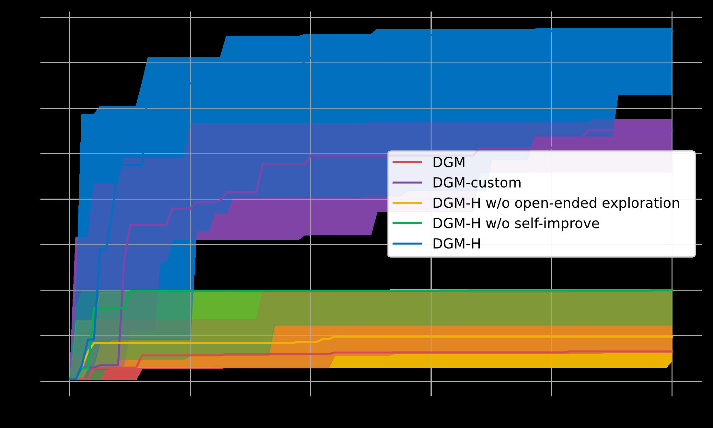
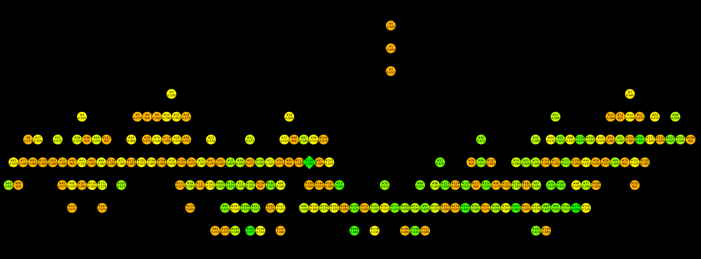

## HyperAgents란?

Meta FAIR와 UBC 등이 [발표한 HyperAgents](https://arxiv.org/abs/2603.19461)는 "자기참조 자기개선 에이전트(Self-referential self-improving agents)"라는 새로운 AI 시스템 클래스를 정의하고 구현한 연구입니다.

이전의 자기개선 에이전트(예: Darwin Gödel Machine, DGM)는 **코딩 과제에만** 자기개선이 가능했습니다. 메타 에이전트의 개선 메커니즘이 **코딩에 하드코딩**되어 있었기 때문입니다.

HyperAgents는 이 한계를 제거합니다:

> Task agent와 Meta agent를 **하나의 Python 프로그램**으로 통합. 에이전트가 자기 자신의 코드 전체 — 과제 해결, 에이전트 생성, 평가, 아카이빙 메커니즘까지 — 를 자유롭게 분석하고 편집하고 재실행할 수 있게 함.

이를 **"Metacognitive Self-modification"(메타인지적 자기수정)**이라고 부릅니다. 단순히 과제 성능을 개선하는 게 아니라, **개선 프로세스 자체를 개선**하는 것입니다.


*Figure 1: 원본 DGM과 HyperAgents(DGM-H)의 비교. DGM-H에서는 Meta agent도 완전히 편집 가능하여, 모든 도메인에서 메타인지적 자기수정이 가능합니다.*

---

## 아키텍처 분석

### 3-레이어 자기개선 루프

코드를 직접 분석해보니, 구조는 놀랍도록 직관적이었습니다:

**1. MetaAgent** — 리포지토리 전체에 접근해서 자유롭게 코드를 읽고 수정합니다. 사용하는 도구는 bash 셸과 파일 에디터 뿐. 프롬프트는 단 한 줄입니다:

```python
instruction = f"Modify any part of the codebase at `{repo_path}`."
```

에이전트가 스스로 무엇을, 어떻게 수정할지 판단합니다.

**2. TaskAgent** — 수정된 코드로 실제 과제를 풉니다. LLM 호출 1회로 JSON 형식 응답을 추출합니다.

**3. generate_loop** — Docker 컨테이너 기반으로 세대별 진화를 관리합니다:

```
부모 선택 → Docker 생성 → MetaAgent 실행(코드 수정)
→ TaskAgent 평가(staged → full) → 점수 기록 → 반복
```

### 부모 선택: 탐색과 활용의 균형

기본 전략은 `score_child_prop`입니다. 점수가 높은 후보에 가중치를 주면서, **자식이 많은 노드에는 페널티**를 부여합니다. 이게 핵심인데, 강한 노드만 계속 선택하면 **탐색이 멈추고 수렴해버리기 때문**입니다.

```python
scores = [1 / (1 + math.exp(-10 * (score - mid_point))) for score in scores]
penalties = [math.exp(-(child_counts[commit]/8)**3) for commit in commits]
combined = [s * p for s, p in zip(scores, penalties)]
```

약하지만 새로운 경로의 에이전트도 탐색 기회를 가지게 되는, 진화 알고리즘의 핵심 아이디어입니다.

### 12개 도메인 지원

| 카테고리 | 도메인 | 평가지표 |
|---|---|---|
| 인간 선호 | search_arena, paper_review | accuracy |
| 게임 (BALROG) | balrog_babyai, balrog_babaisai, balrog_minihack, balrog_nle | progress |
| 로봇 (Genesis) | genesis_go2walking, genesis_go2walkback, genesis_go2hop | fitness |
| 코드 | polyglot (SWE-bench 기반) | accuracy |
| 수학 | imo_grading, imo_proof | accuracy / points |


*Figure 2: DGM-H의 메타레벨 자기개선 메커니즘이 도메인 간 전이가 가능함을 보여줍니다. HyperAgents만이 강하고 전이 가능한 에이전트 생성 스킬의 성장을 달성했습니다.*


*주요 실험 결과: 다양한 도메인에서 HyperAgents가 베이스라인을 초과하는 성능을 달성했습니다.*

---

## Docker 기반 격리

모든 실행은 Docker 컨테이너에서 이루어집니다. 각 세대마다:

1. 새 컨테이너 생성
2. 이전 세대의 diff(patch)를 적용
3. MetaAgent 실행 (최대 6시간 타임아웃)
4. TaskAgent 평가 (최대 5시간)
5. 컨테이너 정리

Staged eval이라는 중간 검증도 있습니다 — 샘플 10개로 빠르게 점수를 확인하고, 일정 기준을 넘으면 전체 평가를 진행합니다. 컴퓨팅 리소스를 효율적으로 쓰기 위한 설계입니다.

---

## ⚠️ litellm 보안 사태

여기서 문제가 시작됩니다. HyperAgents는 LLM 호출을 위해 [litellm](https://github.com/BerriAI/litellm)을 사용하며, `requirements.txt`에 `litellm==1.74.9`를 고정해둔 상태입니다.

코드 분석을 하면서 litellm의 현재 상태를 확인했는데, **5일 전에 엄청난 사건**이 있었습니다.

### 2026년 3월 24일: TeamPCP 공급망 공격

보안 스캐너 **Trivy가 해킹당했고**, 그걸 통해 litellm의 PyPI 배포 권한이 탈취당했습니다. 보안 도구가 공격 경로가 된 아이러니한 사건입니다.

| 항목 | 내용 |
|---|---|
| 피해 버전 | `1.82.7`, `1.82.8` |
| 안전한 버전 | ≤ `1.82.6` |
| 공격자 | TeamPCP |
| 위험 기간 | 3/24 10:39~16:00 UTC (~3시간) |
| 현재 상태 | PyPI 격리 완료, 조사 진행 중 |

**타임라인:**
- 2/28: TeamPCP가 Trivy GitHub Actions 취약점 발견
- 3/19: Trivy v0.69.4에 악성 코드 주입, CI/CD 자격증명 탈취
- 3/23: Checkmarx KICS GitHub Action도 탈취
- 3/24: 탈취한 PyPI 권한으로 litellm 악성 버전 게시

### 페이로드

`v1.82.8`은 특히 위험합니다. `.pth` 파일 기반 Python 시작훅을 설치해서, `import litellm`을 하지 않아도 **파이썬 인터프리터가 시작될 때 자동 실행**됩니다.

3단계 페이로드:
1. **자격증명 수집** — SSH 키, AWS/GCP/Azure 자격증명, K8s 시크릿, CI/DC 토큰
2. **암호화 외부 전송** — `models.litellm.cloud` (C2 도메인)
3. **지속 백도어 + Kubernetes 웜** — Pod 간 전파

litellm은 하루 **340만 다운로드**를 기록하는 패키지입니다. DSPy, MLflow, CrewAI, OpenHands 등 수많은 AI 프레임워크가 의존하고 있습니다.

### HyperAgents의 취약점

`litellm==1.74.9`는 3/24 백도어 페이로드는 없지만:

- **CVE-2025-45809** (SQL Injection, CVSS 5.4) — 1.81.0 미만 취약
- **CVE-2025-11203** — API 키 정보 유출
- **CVE-2025-0330** — Langfuse 키 유출

최소 `1.82.6` 이상으로 업데이트해야 합니다.

---

## 교훈: 자기수정 에이전트와 보안

이 두 가지를 함께 보면 몇 가지 중요한 교훈이 나옵니다.

### 1. 자기수정 시스템의 보안 모델

HyperAgents의 MetaAgent는 코드베이스 전체를 수정할 수 있습니다. 여기에 **의존성 설치 권한**까지 있다면, litellm 같은 취약한 패키지를 자동 업데이트했다가 백도어를 끌어올 수 있습니다.

자기수정 시스템의 보안은 "무엇을 수정할 수 있는가"뿐 아니라 **"무엇을 설치할 수 있는가"**에도 달려 있습니다.

### 2. 버전 고정 ≠ 안전

`litellm==1.74.9`로 고정했지만, 그 사이 여러 CVE가 발생했습니다. 버전 고정은 재현성에는 좋지만 **보안 패치는 놓칩니다.** 정기적인 `pip-audit`나 Dependabot 설정이 필수입니다.

### 3. 공급망 공격은 AI 인프라를 겨냥한다

Trivy → KICS → litellm으로 이어지는 연쇄 공급망 공격. AI 개발의 핵심 인프라 패키지들이 타겟이 될 수밖에 없는 환경입니다. `pip install`로 그냥 설치하는 습관은 이제 위험합니다.

---

## 결론

HyperAgents의 아이디어는 AI 연구에서 중요한 방향성입니다. 에이전트가 자기 개선 메커니즘 자체를 수정할 수 있다는 것은, 이론적으로 **무한한 진화**의 가능성을 열어줍니다.

하지만 이런 시스템이 **취약한 의존성 위에서 돌아간다는 점**, 그리고 **자기수정이 보안과 어떻게 충돌할 수 있는지**는 경계해야 합니다.

Meta의 연구진이 보안을 고려했을 거라 믿지만, `requirements.txt`에 고정된 `litellm==1.74.9`는 그렇지 않았습니다. AI 연구 코드가 프로덕션급 보안을 갖추지 않은 채 공개되는 현실, 그리고 그 위에서 돌아가는 AI 인프라의 취약성.

litellm 사건은 AI 인프라 보안이 아직 **초기 단계**임을 보여줍니다. 모델 성능에 집중하는 동안, 바닥에 깔린 인프라의 보안은 간과되기 쉽습니다.

**결국 HyperAgents 설치는 보류했습니다.** 진행하려면 `litellm`을 `1.82.6`으로 업데이트하고 전체 의존성을 감사하는 작업부터 시작해야 합니다.

---

## 참고

- [HyperAgents 논문 (arXiv: 2603.19461)](https://arxiv.org/abs/2603.19461)
- [HyperAgents GitHub](https://github.com/facebookresearch/HyperAgents)
- [LiteLLM 공식 보안 업데이트](https://docs.litellm.ai/blog/security-update-march-2026)
- [Snyk: Poisoned Trivy → litellm 분석](https://snyk.io/articles/poisoned-security-scanner-backdooring-litellm/)
- [Datadog: TeamPCP 공급망 캠페인 추적](https://securitylabs.datadoghq.com/articles/litellm-compromised-pypi-teampcp-supply-chain-campaign/)
- [Bitsight: litellm 공급망 해킹 분석](https://www.bitsight.com/blog/litellm-versions-1-82-7-1-82-8-supply-chain-compromise)
- [Trend Micro: litellm 페이로드 분석](https://www.trendmicro.com/en_us/research/26/c/inside-litellm-supply-chain-compromise.html)
