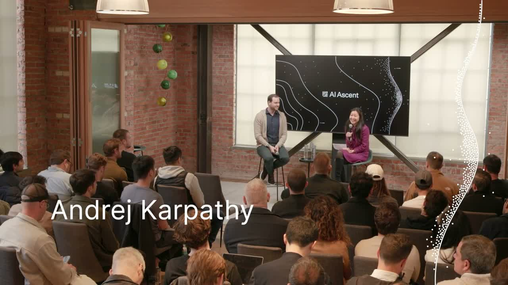
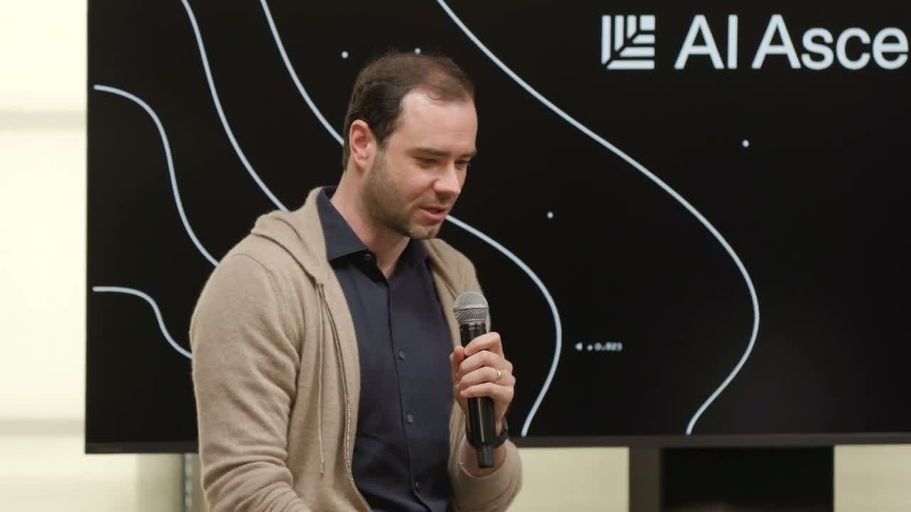
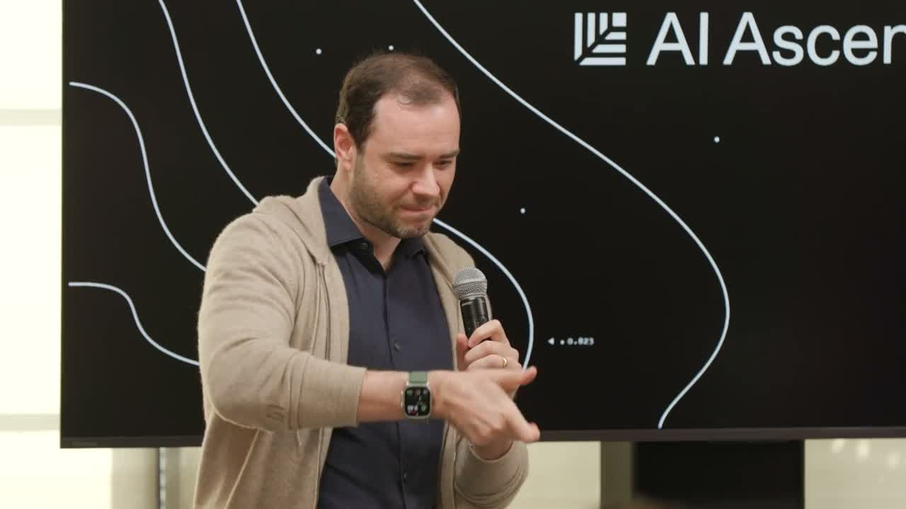
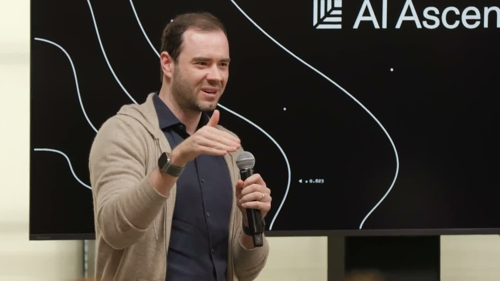
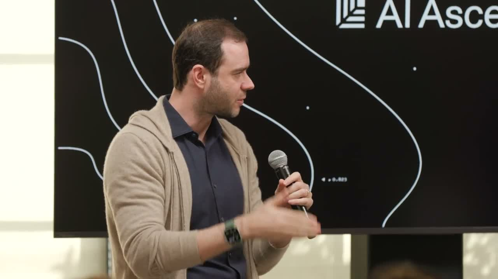
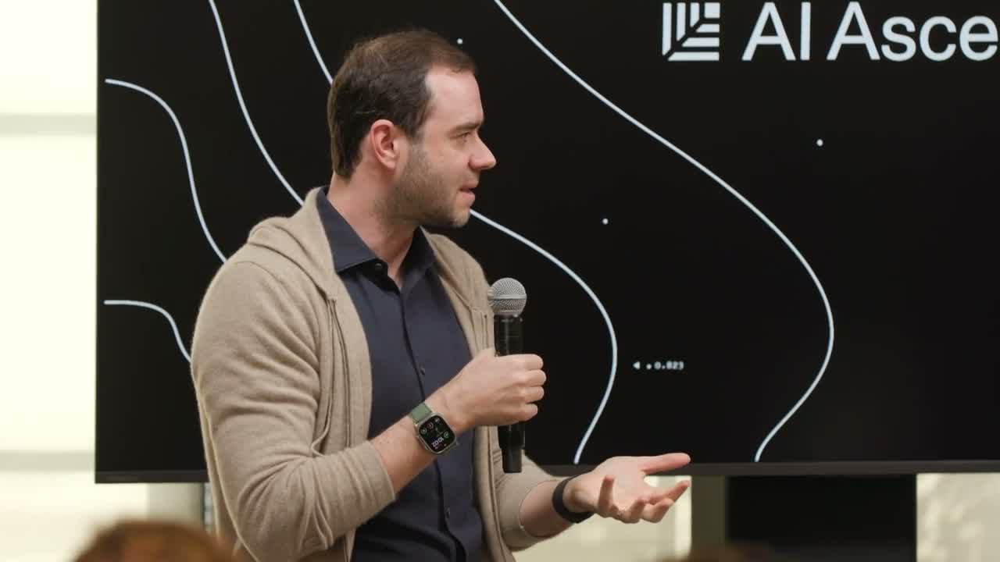
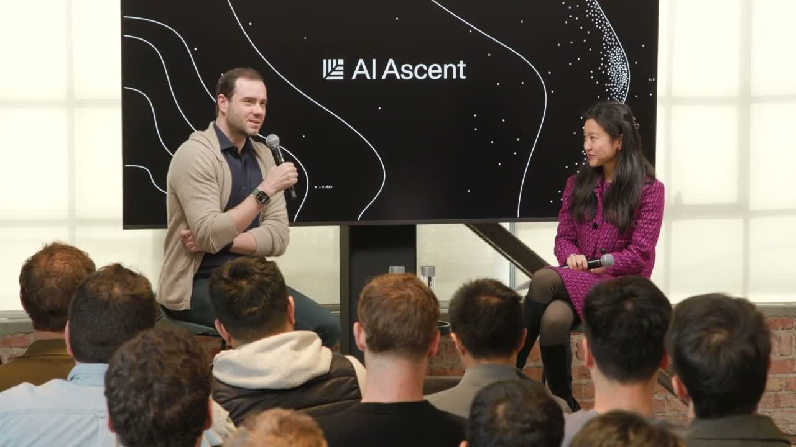

원본 영상: [Andrej Karpathy: From Vibe Coding to Agentic Engineering — AI Ascent 2026](https://youtu.be/96jN2OCOfLs)

*2026 AI Ascent. Sequoia의 Stephanie Zhan이 Karpathy에게 인터뷰하는 구도.*

---

"바이브 코딩"이라는 단어를 만든 사람이 있다.

Andrej Karpathy. OpenAI 공동창업자, 테슬라 AI 책임자, Eureka Labs 창업자. 그가 AI Ascent 2026에 올라와서 약 30분 동안 이야기했다.

"나는 지금 프로그래머로서 그 어느 때보다 뒤처진 느낌이다."

이 말을 꺼낸 사람이 카르파시라는 게 포인트다. 본인이 만든 개념인 바이브 코딩에서 한 발 더 나아가, 지금은 뭔가 더 진지한 것이 필요하다고 말하고 있다.

그게 "에이전틱 엔지니어링"이다.

---

## 1. 전환점은 2025년 12월이었다

카르파시는 이렇게 말했다.

> "12월이 명확한 전환점이었어요. 방학 기간이라 시간이 좀 있었는데, 최신 모델들에게 코드 청크를 요청했더니 그냥 바로 맞게 나왔어요. 더 달라고 했더니 또 잘 나왔어요. 마지막으로 수정했던 게 언제인지 기억이 안 났어요. 그냥 시스템을 더 믿기 시작했고, 그게 바이브 코딩이었습니다."

이전에는 AI가 코드 청크를 잘못 쓰면 직접 수정해야 했다. 그 루프가 12월을 기점으로 끊겼다는 거다.

카르파시는 이걸 단순히 "AI가 더 좋아졌다"라는 말로 설명하지 않는다. **패러다임이 전환됐다**고 본다. ChatGPT 식의 도구 경험을 여전히 하고 있는 사람들은 이 변화를 아직 못 봤을 가능성이 높다고 했다.

---

## 2. 소프트웨어 1.0 → 2.0 → 3.0

카르파시가 자주 쓰는 프레임이다.

- **소프트웨어 1.0**: 코드를 직접 쓴다. 명시적 규칙.
- **소프트웨어 2.0**: 데이터셋을 만들고 신경망을 훈련시킨다. 학습된 가중치.
- **소프트웨어 3.0**: 프롬프트가 프로그래밍이 된다. LLM이 인터프리터.

소프트웨어 3.0에서는 **컨텍스트 창 안에 무엇을 넣느냐**가 코드를 어떻게 쓰느냐보다 중요해진다.

그가 든 예시가 인상적이다. 예전에 소프트웨어를 설치하려면 쉘 스크립트를 실행했다. 그런데 여러 플랫폼을 지원하다 보면 그 스크립트가 엄청나게 복잡해진다. 근본적으로 소프트웨어 1.0 방식으로 문제를 푸는 거다.

이제 다른 방식이 있다. 에이전트에게 텍스트를 넘기면 에이전트가 환경을 파악하고, 알아서 설치하고, 오류가 생기면 루프 안에서 디버깅한다.

> "지금 프로그래밍 패러다임은 이거예요: 에이전트에게 무슨 텍스트를 복붙할 것인가?"

---

## 3. MenuGen이 쓸모없어진 이유

카르파시가 직접 바이브 코딩으로 만든 앱이 있다. MenuGen. 식당 메뉴 사진을 찍으면 각 음식 이미지를 생성해서 보여주는 앱.

OCR로 메뉴 텍스트를 뽑고, 이미지 생성기를 붙이고, Vercel에 배포하고, 전체 UI를 구성하는 앱이다.

그런데 소프트웨어 3.0 버전을 보고 충격을 받았다고 한다.

> "그냥 사진을 Gemini에게 넘기고, Nana Banana를 써서 메뉴에 오버레이 해달라고 했더니, 내가 찍은 메뉴 사진 그대로에 각 음식 이미지가 픽셀 단위로 렌더링되어 나왔어요. 내가 만든 앱 전체가 불필요해진 거예요."

앱이 존재할 이유가 없어졌다. 신경망이 직접 모든 걸 처리하고, 프롬프트와 아웃풋만 있으면 된다. 중간에 앱이라는 레이어 자체가 필요 없다.

이게 카르파시가 말하는 소프트웨어 3.0의 핵심이다. 기존 것이 더 빨라지는 게 아니라, **기존 패러다임이 아예 불필요해진다.**

---

## 4. 검증 가능성 — AI가 빠르게 자동화하는 영역의 패턴

왜 AI는 코딩이나 수학은 잘 하면서 "세차장이 50미터인데 걸어가야 하나요?"를 틀리는가.

카르파시는 이걸 **검증 가능성(verifiability)**으로 설명한다.

프론티어 랩들이 LLM을 훈련시킬 때, 강화학습 환경에서 검증 가능한 보상을 사용한다. 수학 문제의 정답은 검증이 쉽다. 코드 실행 결과도 검증이 쉽다. 그래서 이 영역에서 모델이 폭발적으로 성장한다.

반면 "이 상황에서 차를 몰아야 하나 걸어야 하나"는 강화학습 환경에 넣기 어렵다. 누가 보상 신호를 만들 것인가.

> "현재 최고 모델이 100,000줄 코드베이스를 리팩토링하거나 제로데이 취약점을 찾아낼 수 있으면서도 세차장에 걸어가라고 말해요. 이게 말이 안 됩니다."

이게 "재기 형태의 지능(jagged intelligence)"이다. 어떤 영역은 인간을 압도하고, 어떤 영역은 상식 수준에서 실패한다. 그 패턴은 **검증 가능성 + 랩의 관심**이라는 두 가지로 설명된다.

---

## 5. 바이브 코딩 vs 에이전틱 엔지니어링

이게 이 강연의 핵심 구분이다.

**바이브 코딩**: 소프트웨어를 다룰 수 있는 사람의 하한선을 높인다. 비개발자도 뭔가를 만들 수 있게 된다. 굉장한 일이다.

**에이전틱 엔지니어링**: 이미 전문적인 소프트웨어를 만들던 사람들이 그 품질 기준을 유지하면서 더 빠르게 가는 것. 바이브 코딩으로 보안 취약점을 도입해도 된다는 게 아니다. 여전히 책임은 있다. 다만 더 빠르게 가는 방법론.

> "에이전틱 엔지니어링을 그렇게 부르는 건, 진짜 엔지니어링 규율이기 때문이에요. 이 에이전트들은 약간 불안정하고 확률적이지만 매우 강력합니다. 품질 기준을 희생하지 않으면서 이들을 조율해서 더 빠르게 가는 것이 에이전틱 엔지니어링의 영역입니다."

그리고 덧붙인다: "10배 엔지니어라는 말이 있었는데, 에이전틱 엔지니어링을 잘 하면 그 속도 향상이 10배보다 훨씬 크다."

---

## 6. 유령을 소환하는 것 — 동물이 아니다

카르파시는 LLM을 이해하기 위한 프레임을 찾고 있었다.

AI를 동물처럼 생각하면 직관적으로 틀린 판단을 하게 된다. 동물은 혼내면 더 잘 하거나 못 하지만, LLM은 그렇지 않다. 동물은 진화로 만들어진 내재적 동기가 있지만, LLM은 없다.

LLM은 사전학습의 통계와 그 위에 강화학습으로 강화된 구조다. **유령(ghost)**이라는 단어가 더 맞다고 카르파시는 말한다. 인터넷의 방대한 인간 글쓰기에서 소환된, 데이터와 보상 함수로 형태가 만들어진 실체.

이 프레임이 중요한 이유는 실용적이다. 이 존재들이 무엇인지를 정확하게 이해하고 있어야 더 잘 쓸 수 있다. 화를 내도 소용 없고, 특정 서킷이 강화학습에 포함되어 있으면 잘 날고, 포함되지 않은 서킷이면 힘겹게 끌어당기는 느낌이 든다.

> "애플리케이션에서 어떤 서킷 위에 있는지 파악해야 해요. 강화학습 루프 안에 있으면 날아다니고, 분포 밖에 있으면 고생하게 됩니다."

---

## 7. 생각은 아웃소싱해도 이해는 아웃소싱할 수 없다

강연의 마지막 질문은 교육이었다. "지능이 싸질수록 여전히 깊이 배울 가치가 있는 것은 무엇인가?"

카르파시는 최근에 봤던 트윗을 인용했다.

> "생각은 아웃소싱할 수 있어도 이해는 아웃소싱할 수 없다."

그가 계속 LLM 지식 베이스 프로젝트에 관심을 갖는 이유도 이거다. 에이전트를 제대로 방향 지시하려면 자기가 이해하고 있어야 한다. 에이전트가 이해를 잘하지는 못한다. 에이전트를 좋은 방향으로 이끌 수 있는 건 여전히 인간의 이해에서 나온다.

아이러니하게도, 모든 걸 대신 해주는 도구들이 많아질수록, **진짜 이해의 가치는 더 올라간다.**

---

## 정리

카르파시가 이 강연에서 한 말들을 한 줄로 정리하면:

- 소프트웨어 3.0에서 프로그래밍은 "에이전트에게 무슨 텍스트를 넘길 것인가"다
- 기존 앱이 존재할 필요가 없어지는 방식으로 패러다임이 바뀌고 있다
- AI가 빠르게 성장하는 영역은 검증 가능하고 랩이 관심을 가진 곳이다
- 바이브 코딩은 하한선을 높이고, 에이전틱 엔지니어링은 품질을 유지하며 속도를 올린다
- LLM은 동물이 아니라 유령이다 — 소환된 것이고, 그에 맞게 다뤄야 한다
- 생각은 아웃소싱할 수 있어도 이해는 아웃소싱할 수 없다

---

*30분 영상이지만 밀도가 높다. 영어가 된다면 원본을 직접 보는 걸 추천한다.*
