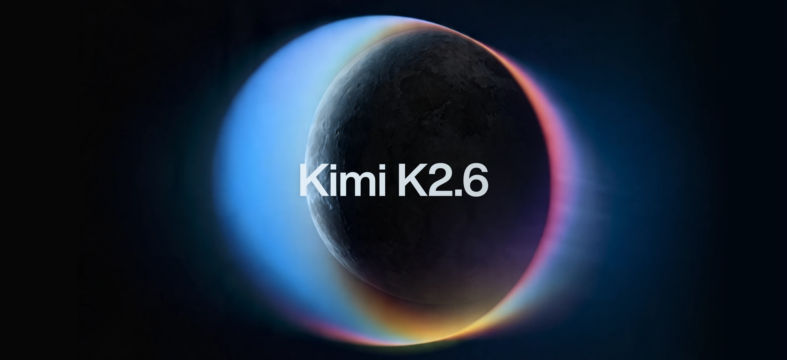
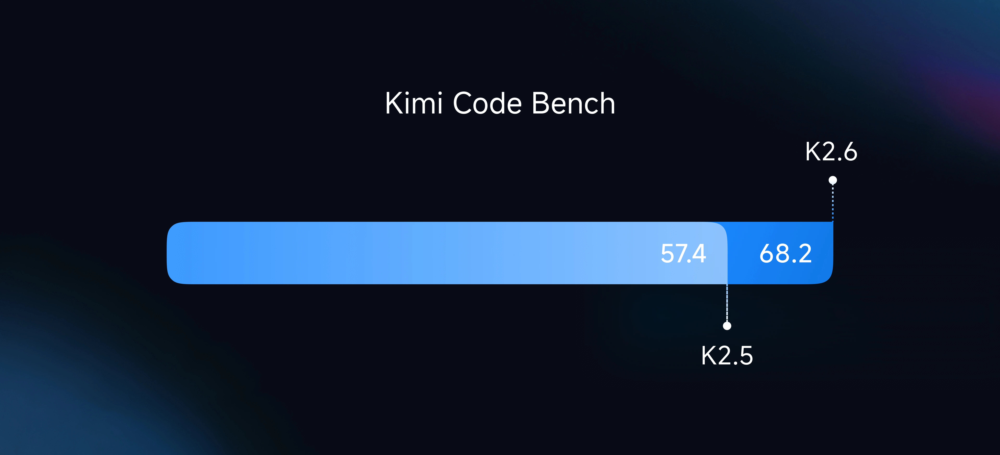
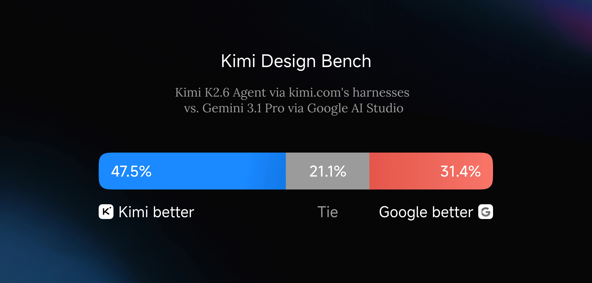
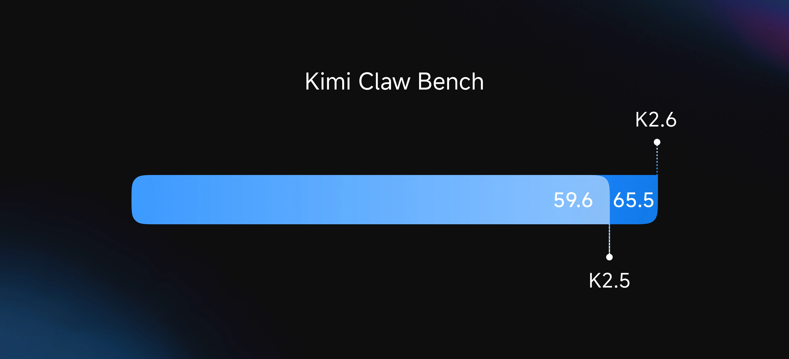

Moonshot이 2026년 4월 20일에 Kimi K2.6을 오픈소스로 공개했음. 가중치까지 다 풀었음.

핵심 한 줄로 말하면, **오픈소스인데 GPT-5.4(xhigh)와 Claude Opus 4.6(max effort)을 코딩·에이전트 벤치마크 몇 개에서 이김**.

## 배경부터 짚고 감

GPT-5.4가 올해 초에 나오고, Claude Opus 4.6이 나오고, Gemini 3.1 Pro까지 Thinking 모드 달고 나오면서, "프론티어 = 클로즈드 소스"가 거의 공식처럼 굳어졌었음.

오픈소스 쪽에서 가장 가까이 붙었던 게 Qwen3, DeepSeek, 그리고 Moonshot의 Kimi K2 라인이었음. 특히 K2.5는 100개짜리 Agent Swarm, 네이티브 비전까지 달고 나와서 오픈 웨이트 중 1등이긴 했음.

근데 여전히 아쉬운 게 있었음.

**오래 달리는 작업에서 무너짐.**

10분, 30분짜리 벤치마크에선 점수가 잘 나왔지만, 실제로 개발자가 시키는 건 그게 아님. "이 레포 리팩터링해", "벤치마크 성능 1.5배로 끌어올려" 같은 시간 단위 작업임. 여기 들어가면 오픈소스 모델은 중간에 맥락 놓치거나, 같은 실수 반복하거나, 엉뚱한 방향으로 드리프트했음.

Claude Opus, GPT-5.4는 이 구간에서 여전히 혼자 잘 달렸음. 그래서 "실무에서 쓸 건 결국 유료"라는 분위기였음.

K2.6은 여기에 정면으로 들어옴.

## 조치1 — 12시간, 4000번 이상 도구 호출

Moonshot이 공개한 첫 번째 실제 케이스가 인상적임.

K2.6한테 맥북에서 **Qwen3.5-0.8B 모델을 다운받고 Zig로 직접 추론 엔진을 짜라**고 시켰음. Zig는 아주 마이너한 언어고, 학습 데이터에도 많이 없음. 말 그대로 out-of-distribution 과제임.

결과:

- **4000번 이상 도구 호출**
- **12시간 이상 연속 실행, 14번 이터레이션**
- 시작: 약 15 tok/s → 마지막: **193 tok/s**
- 최종적으로 **LM Studio보다 20% 더 빠름**

보통 모델을 12시간 돌리면 중간에 한 번쯤은 꼬임. 같은 버그 고친다고 3번쯤 왕복하고, 나중엔 자기가 뭘 했는지 잊어버림. K2.6은 그 구간을 끝까지 돌려냄.

그다음 케이스가 더 과격함.

**exchange-core**라는 8년 된 오픈소스 매칭 엔진을, K2.6한테 혼자 13시간 리팩터링시킴. 이미 최적화된 코드라 일반적인 "더 빠르게 만들어줘"는 안 먹힘. K2.6이 한 일은:

- CPU flame graph, allocation flame graph 직접 분석
- 숨은 병목 찾아내고 **코어 스레드 토폴로지 자체를 재구성** (4ME+2RE → 2ME+1RE)
- 12번의 서로 다른 최적화 전략
- 1000번 이상 도구 호출로 4000줄 이상 수정

최종 성능: **Medium throughput 0.43 → 1.24 MT/s (+185%)**, **Perf throughput 1.23 → 2.86 MT/s (+133%)**.

이 정도면 시니어 아키텍트 1주일치 작업임. K2.6은 13시간에 해치움.

Kimi Code Bench에서도 K2.5 대비 큰 폭으로 올라옴.

## 근데 혼자 잘하는 건 한계가 있었음

12시간 혼자 달릴 수 있어도, 진짜 현업 작업은 이렇지 않음.

리서치 하나, 벤치마크 하나, 데모 하나, 프론트엔드 하나, 영상 하나 — 이런 걸 하나의 프로젝트에서 동시에 해야 하는 경우가 훨씬 많음.

K2.5 때 Moonshot이 이미 "Agent Swarm"을 냈었음. 오케스트레이터 모델 하나가 서브에이전트 여럿을 만들어서 병렬로 돌리는 방식. 근데 K2.5는 **100개 서브에이전트, 1500단계**가 한계였음. 더 키우면 서브에이전트끼리 꼬이거나 오케스트레이터가 맥락을 놓침.

K2.6은 여기서 한 번 더 점프함.

## 조치2 — 300개 에이전트, 4000단계 병렬

K2.6 Agent Swarm은 **300개 서브에이전트가 4000단계를 동시에 돌림**. 3배 확장임.

단순히 개수만 늘어난 게 아니고, 이질적인 스킬들이 섞일 수 있게 됐음. 웹 리서치 + 장문 문서 분석 + 슬라이드 생성 + 스프레드시트 — 이런 걸 한 번의 자율 실행 안에서 묶어서 뽑아냄.

그리고 **Skills**라는 재밌는 장치가 들어옴. PDF, 슬라이드, 워드 파일을 넣으면 그 파일의 **구조적·스타일적 DNA를 학습해서 나중에 같은 품질·같은 포맷으로 재생산**함. 내가 잘 만든 자료가 바로 재사용 가능한 스킬이 되는 구조임.

프론트엔드 쪽에서도 꽤 독함. Kimi Design Bench라는 걸 따로 만들어서 Gemini 3.1 Pro의 Google AI Studio랑 붙여봤는데, Visual Input / Landing Page / Full-Stack / Creative Programming 네 카테고리에서 대부분 K2.6이 유리함.

## Proactive Agent — 5일 동안 멈추지 않은 에이전트

Moonshot의 RL 인프라팀이 K2.6으로 **5일 연속 자율 운영되는 에이전트**를 돌려봤음. 모니터링, 인시던트 대응, 시스템 운영까지 사람 없이.

결과는 공개된 Claw Bench에서 나옴.

5개 영역(코딩, IM 생태계 연동, 리서치·분석, 스케줄 관리, 메모리 활용)에서 K2.5 대비 일관된 개선. 특히 "사람 개입 없이 오래 달리는" 워크플로우에서 tool invocation 정확도가 유의미하게 올라감.

실제로 이걸 이미 쓰는 자율 에이전트가 두 개 있음:

- **OpenClaw** — 멀티 앱 24/7 실행 에이전트
- **Hermes** (Nous Research) — 프로액티브 에이전트

두 쪽 다 K2.6 출시와 함께 "기존 K2.5 대비 long-context 안정성, 도구 호출 품질이 체감 상승"이라고 직접 평가함.

## 벤치마크 요약 — 이긴 데가 꽤 있음

| 벤치마크 | Kimi K2.6 | GPT-5.4 (xhigh) | Claude Opus 4.6 (max) | Gemini 3.1 Pro | K2.5 |
|---|---|---|---|---|---|
| HLE-Full w/ tools | **54.0** | 52.1 | 53.0 | 51.4 | 50.2 |
| DeepSearchQA (f1) | **92.5** | 78.6 | 91.3 | 81.9 | 89.0 |
| Toolathlon | 50.0 | **54.6** | 47.2 | 48.8 | 27.8 |
| SWE-Bench Pro | **58.6** | 57.7 | 53.4 | 54.2 | 50.7 |
| SWE-Bench Verified | 80.2 | — | **80.8** | 80.6 | 76.8 |
| Terminal-Bench 2.0 | 66.7 | 65.4 | 65.4 | **68.5** | 50.8 |
| LiveCodeBench (v6) | 89.6 | — | 88.8 | **91.7** | 85.0 |
| AIME 2026 | 96.4 | **99.2** | 96.7 | 98.3 | 95.8 |
| GPQA-Diamond | 90.5 | 92.8 | 91.3 | **94.3** | 87.6 |
| V\* w/ python | **96.9** | 98.4 | 86.4 | **96.9** | 86.9 |

훑어보면 보이는 경향:

- **에이전트·코딩 쪽 실무 지표(HLE w/ tools, DeepSearchQA, SWE-Bench Pro)**: K2.6이 이김
- **순수 추론 벤치마크(AIME, GPQA, IMO)**: GPT-5.4, Gemini 3.1이 앞섬
- **Vision·수학+도구 혼용**: 상위권 박빙

즉, "시험 잘 보는 머리 좋은 학생"으로는 여전히 클로즈드 소스가 앞인데, **"실무에서 오래 써먹을 에이전트"로는 오픈소스가 붙기 시작**했다는 그림임.

## 아키텍처 — 1T 파라미터, 32B 활성

Hugging Face 모델 카드에 따르면 스펙은 이럼.

| 항목 | 값 |
|---|---|
| 아키텍처 | Mixture-of-Experts (MoE) |
| 전체 파라미터 | 1T |
| 활성 파라미터 | 32B |
| 레이어 수 | 61 |
| 어텐션 | MLA, 64 heads, hidden 7168 |
| Expert 수 | 384개 (토큰당 8개 선택) |
| 컨텍스트 길이 | 256K |
| 활성화 | SwiGLU |
| Vision Encoder | MoonViT (400M) |
| 어휘 크기 | 160K |

**네이티브 INT4 양자화**를 기본으로 지원함. Kimi-K2-Thinking에서 쓰던 방식과 동일. 덕분에 같은 하드웨어에서 추론 속도 약 2배.

라이선스는 **Modified MIT** — 가중치까지 상업 사용 가능. vLLM, SGLang, KTransformers로 셀프 호스팅 가능.

## 써보려면

- **웹/앱**: [kimi.com](https://www.kimi.com/), Kimi App
- **CLI**: [Kimi Code](https://www.kimi.com/code) — 터미널 코딩 에이전트
- **공식 API**: [platform.moonshot.ai](https://platform.moonshot.ai) — OpenAI/Anthropic 호환 포맷
- **오픈 가중치**: [huggingface.co/moonshotai/Kimi-K2.6](https://huggingface.co/moonshotai/Kimi-K2.6)
- **Cloudflare Workers AI**: `@cf/moonshotai/kimi-k2.6` (Day 0 지원)
- **Agent Swarm**: [kimi.com/agent-swarm](https://www.kimi.com/agent-swarm)

Thinking 모드 기본 temperature 1.0, Instant 모드는 0.6. top_p는 둘 다 0.95 권장.

멀티턴에서 추론 흐름을 유지하고 싶으면 `preserve_thinking` 옵션을 키면 됨. 코딩 에이전트 시나리오에서 성능이 올라감.

## 그래서 어떻게 봐야 하나

Moonshot의 릴리즈 주기가 빨라지는 흐름이 보임.

- K2 (2025-07): 트릴리언급 MoE 최초 오픈소스
- K2 Thinking (2025-11): 200~300번 tool call
- K2.5 (2026-01): 비전 + Agent Swarm 100 agents
- **K2.6 (2026-04): long-horizon + 300 agents + Skills**

약 3개월 주기로 한 단계씩 올라옴. 이번 K2.6은 "벤치마크 점수 따기 모델"에서 "현업에서 며칠 돌려도 되는 모델"로 축을 옮긴 버전임.

평가할 포인트를 정리하면,

1. **오픈소스로 실무 에이전트 쓰는 게 현실이 됨.** Claw Groups, Kimi Code 같은 인터페이스가 함께 풀려서 바로 붙여볼 수 있음.
2. **코딩·에이전트 지표는 앞섬, 순수 추론은 뒷서열.** 논리 퍼즐·올림피아드 난이도 문제에는 GPT-5.4, Gemini 3.1이 여전히 유리함. 둘 중 뭐 쓸지는 작업 성격으로 갈라짐.
3. **Skills 개념이 먹히면 판이 또 바뀜.** 내가 쌓아둔 문서·슬라이드가 바로 재사용 가능한 에이전트 역량이 됨. 지식 노동자의 포트폴리오 자체가 자산이 되는 구조임.

개인적으로 제일 눈길이 가는 건 12시간 Zig 추론 엔진 작성 케이스임. 클로즈드 소스 프론티어 모델이 아니라도 그런 작업을 안정적으로 맡길 수 있는 오픈 웨이트가 나왔다는 사실 자체가 흐름을 바꿈.

이제 한국어 개발자 커뮤니티에서도 자연스레 "주 모델은 Claude·GPT, 장시간 배치 작업은 Kimi K2.6" 같은 혼성 스택이 표준이 되지 않을까 싶음.

## FAQ

**Q1. K2.5랑 뭐가 가장 크게 달라졌음?**
세 가지. (1) long-horizon 코딩 — 12시간+ 단일 세션에서도 안정적으로 달림. (2) Agent Swarm 확장 — 100개 → 300개, 1500단계 → 4000단계. (3) Skills — 문서·슬라이드·스프레드시트를 학습해 그 구조·스타일을 재생산함.

**Q2. Claude Opus 4.6이나 GPT-5.4 대신 쓸 만함?**
작업 종류에 따라 다름. 에이전트·코딩·long-context 작업에서는 K2.6이 대등하거나 일부 앞섬. 순수 추론(올림피아드·GPQA 같은)에서는 여전히 클로즈드 소스가 앞임. 혼성 구성이 현실적임.

**Q3. 셀프 호스팅 가능함?**
가능. Modified MIT 라이선스로 가중치까지 풀려 있고, vLLM/SGLang/KTransformers 지원. 네이티브 INT4 양자화로 추론 속도 2배.

**Q4. 한국어로 써도 괜찮음?**
K2.5부터 한국어 품질이 확실히 좋아졌고, K2.6도 SWE-Bench Multilingual 76.7점으로 다국어 코딩에서 Claude/Gemini와 박빙. 일상 한국어 사용에는 문제 없는 수준임.

**Q5. 가장 현실적인 첫 시도는?**
kimi.com/code 설치해서 기존 Claude Code/OpenClaw 대체해보는 게 제일 빠름. 기존 도구 체인 유지하면서 모델만 바꿔 끼울 수 있음.

## 출처

- [Kimi K2.6 공식 블로그 (Moonshot AI, 2026-04-20)](https://www.kimi.com/blog/kimi-k2-6)
- [moonshotai/Kimi-K2.6 — Hugging Face 모델 카드](https://huggingface.co/moonshotai/Kimi-K2.6)
- [SiliconANGLE — Moonshot AI releases Kimi-K2.6 with 1T parameters (2026-04-20)](https://siliconangle.com/2026/04/20/moonshot-ai-releases-kimi-k2-6-model-1t-parameters-attention-optimizations/)
- [Kilo Blog — Kimi K2.6 Has Arrived (2026-04-20)](https://blog.kilo.ai/p/kimi-k26-has-arrived-an-open-weight)
- [Cloudflare Changelog — Kimi K2.6 on Workers AI (2026-04-20)](https://developers.cloudflare.com/changelog/post/2026-04-20-kimi-k2-6-workers-ai/)
