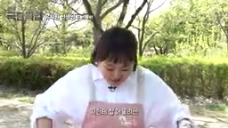
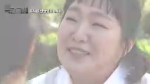
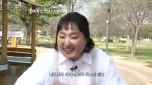
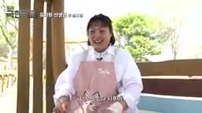
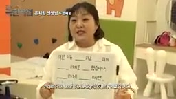

유튜브에 코미디 영상 하나가 올라왔다. 제목은 **"진짜 극한직업 유치원 선생님"**. 웃기려고 만든 영상이다. 그런데 웃고 나서도 뭔가 찜찜함이 남는다.

영상 링크: [유치원 교사 이민지 선생님의 봄 (feat.모기)](https://youtu.be/U6CnR287tvU)

---

## 영상 속 사건들

### 장면 1. 맨바닥에 엎드려 사진 찍는 선생님

유치원생 20명을 데리고 야외 활동 중인 이민지 씨. 아이들의 "인생샷"을 찍어주겠다며 공원 맨바닥에 엎드린다. 아이들 눈높이에 맞춰야 사진이 예쁘게 나온다는 이유다.

본인 무릎 아픈 건 뒷전이다. 아이들 웃는 얼굴 하나면 족하다는 표정이다. 이 장면은 코미디로 연출됐지만, 현실에서 유치원 교사가 감당하는 신체적 헌신의 수위를 보여준다.

---

### 장면 2. 가위바위보 민원 — "선생님이 이겨서 밤새 잠을 못 잤어요"

야외 활동 중 한 어머니가 다가온다.

> "저희 아이가 선생님이랑 가위바위보를 해서 이기셨다면서요. 그 얘기를 듣는데 심장이 벌렁벌렁 뛰고 손발이 벌벌 떨려서 잠을 한 숨도 못 잤어요."

민지 씨의 해명: "원에서는 정서 보호 차원에서 가위바위보를 하든 묵찌빠를 하든 **무조건 비기는 것**이 규칙입니다."

어머니 반응: "그럼 우리 아이가 거짓말을 한다는 거예요?"

민지 씨는 결국 **원장 선생님과 직접 면담**을 요청받는다. 선생님이 아이와 가위바위보에서 '이겼다'는 이유로 민원이 접수된 것이다.

웃긴 장면이다. 그러나 이 장면이 실제 유치원 현장에서 완전히 허구가 아니라는 것이 문제다.

---

### 장면 3. 조용한 운동회 — 민원이 무서워 소리도 못 지른다

미니 운동회가 시작됐다. 아이들이 달리기 시작하는데, 민지 씨의 응원 소리가 너무 작다.

> "놀이터 주변에 아파트가 있어요. 아이들이 신나게 떠들면 **시끄럽다고 민원**이 들어올까 봐 조용히 운동하고 있어요."

스무 명의 아이들이 달리는데 선생님은 목소리를 죽인다. 교사가 교육 활동을 자기 검열하는 장면이다. 민원 한 통이 두려워, 아이들이 신나게 뛰지도 못한다.

---

### 장면 4. 모두가 1등 — 아무도 지지 않는 교실의 딜레마

달리기가 끝났다. 먼저 들어온 도윤이가 기쁨에 차 있다. 그러나 민지 씨는 이렇게 선언한다.

> "우리 친구들 모두가 1등한 거예요."

도윤이는 울음을 터뜨린다.

"**악보님들이 가장 중요하게 생각하는 게 정서돌봄**이에요. 정서 보호 차원에서 승패를 나누지 않고 모두가 우승하는 게 중요하기 때문에…"

진다는 것을 경험하지 못한 아이들. 이긴다는 성취감도 빼앗긴 아이들. 교사는 학부모 민원과 아이의 정서 사이에서 샌드위치가 된다.

---

### 장면 5. 모기 한 마리와의 사투, 코딱지 선물

야외 활동 중 아이 한 명이 모기에 물렸다. 민지 씨는 "구급차 좀 불러주세요!"를 외치며 전력을 다한다. 코미디적 과장이지만, 아이 하나가 다쳐도 학부모 민원으로 이어지는 현실을 반영한다.

실내에서는 영단어 수업이 이어진다. "Agile(유연하다)", "Align(일치시키다)"을 유치원생에게 가르치는 장면. 학부모 요구 수준이 어디까지인지를 보여주는 장치다.

수업이 끝나고 한 아이가 선생님에게 선물을 건넨다. **코딱지**다. 민지 씨는 "냠냠, 너무 맛있다"며 맞받아친다.

---

## 웃음 뒤에 있는 구조적 문제

### 1. 과도한 민원을 막을 제도가 없다

가위바위보에서 졌다는 민원, 아이 옷차림 조언, 모기 한 마리. 이런 민원들을 막을 방법이 현재 교사에게는 없다. 민원이 들어오면 교사가 혼자 감당하거나, 원장이 나서거나, 관계가 틀어진다.

**교원지위법** 개정으로 일부 보호 조항이 생겼지만, 유치원·어린이집 교사까지 실질적으로 보호하는 체계는 여전히 미비하다. 민원 접수 후 조정 절차, 악의적 민원에 대한 공식 대응 창구가 필요하다.

### 2. 모든 해결이 교사 역량에 달려있다

영상 속 민지 씨는 혼자서 모든 것을 해결한다. 학부모 감정 관리, 아이들 정서 돌봄, 체력 소진, 민원 응대, 영어 교육까지. 교사 개인의 인내심과 기술에 전부 의존하는 구조다.

제도가 교사를 보호하지 않으면, **좋은 교사가 버티지 못하고 현장을 떠난다**. 이건 교사만의 손해가 아니라 아이들의 손해다.

### 3. 악성 학부모에 대한 처벌·과태료 근거가 없다

현행법상 교사를 상대로 한 **허위 민원, 반복적 악성 민원**에 대해 학부모에게 과태료를 부과하거나 법적 책임을 물을 수 있는 근거가 사실상 없다.

일부 국가에서는 교사를 향한 무고성 민원이나 명예훼손에 대해 민사·형사 책임을 묻는다. 한국도 **교육활동 방해 민원에 대한 과태료 조항**, 또는 **허위 신고에 대한 구상권 청구 절차**를 도입할 필요가 있다.

### 4. 교사는 왜 정치 발언을 못 하나

민지 씨 같은 교사들이 겪는 문제를 바꾸려면 결국 **법이 바뀌어야 한다**. 그런데 한국 교사는 국가공무원법과 사립학교법 등에 따라 정치 활동과 공개적 정책 발언에 강한 제한을 받는다.

교원이 자신의 노동 조건과 교육 정책에 대해 목소리를 낼 수 없다면, 민원 제도 개선이나 처우 개선은 교사 없이 논의된다. **교사의 정치적 표현의 자유 확대**는 교육 현장의 문제를 공론화하기 위한 전제 조건이다.

---

## 마무리

핫이슈지의 영상은 재밌다. 이민지 씨 캐릭터는 사랑스럽다. 아이들은 귀엽다.

그러나 영상이 끝난 후에도 이 구조는 바뀌지 않는다. 내일도 어딘가의 유치원 교사가 가위바위보 민원을 받고, 소리도 못 지르며 운동회를 진행하고, 코딱지를 선물로 받을 것이다.

웃기지만 웃을 수만은 없는 이유다.

---

*영상 출처: [핫이슈지 유튜브](https://youtu.be/U6CnR287tvU) (2026.04.28 방송)*
