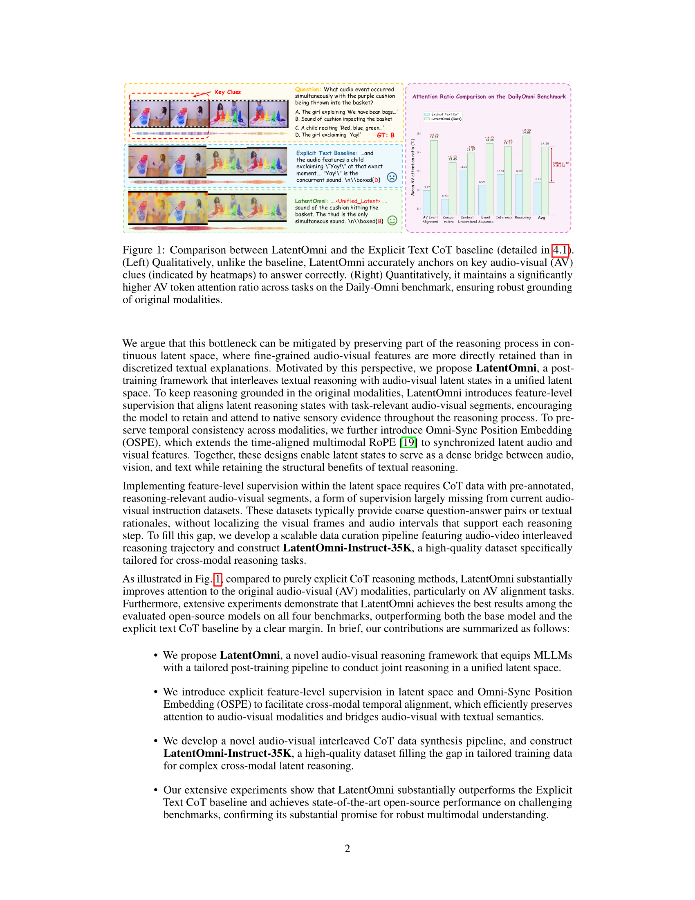
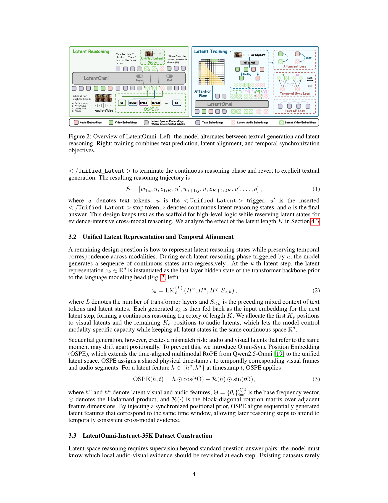
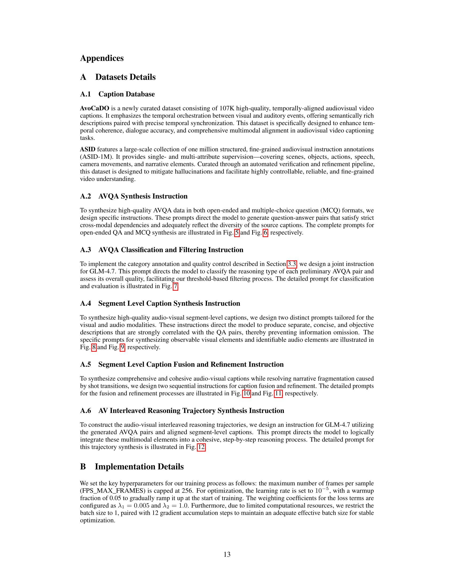

## 오디오와 비디오를 같이 이해한다는 건 어떤 의미일까?

영상 속 인물이 손을 흔들 때, 그 장면에는 시각 정보(손을 드는 모션)와 청각 정보(웃음소리, 배경음)가 동시에 존재합니다. "이 사람이 손을 흔든 직후 어떤 소리가 들렸나?"라는 질문에 답하려면 두 신호를 시간적으로 정확히 맞물려 이해해야 하죠.

기존 멀티모달 모델들도 오디오-비주얼 이해를 시도해 왔지만, 근본적인 한계가 있었습니다. 바로 **추론 과정을 텍스트로만** 한다는 점이었죠. 연속적인 오디오·비디오 신호를 이산 텍스트 토큰으로 압축하다 보니, 시간적 디테일이 손실되고 모델은 언어적 사전 지식에 의존하게 됩니다.

LatentOmni는 이 문제를 **잠재 공간(latent space)**에서 직접 추론하는 방식으로 해결합니다. 텍스트 기반 사고사슬(CoT)의 한계를 넘어, 오디오와 비디오의 원본 감각 정보를 보존한 채 추론하는 프레임워크입니다.

## Q. 기존 텍스트 기반 CoT의 문제가 구체적으로 뭔가요?

가장 큰 문제는 **정보 압축 병목**입니다. 오디오 파형과 비디오 프레임은 고차원 연속 신호인데, 이걸 텍스트 토큰으로 옮기면 시간적 정밀도가 떨어집니다. 예를 들어 보라색 쿠션을 바구니에 던지는 장면에서, "던지는 순간 어떤 소리가 들렸나?"라는 질문에 텍스트 기반 모델은 "Yay!"라고 오답을 냅니다. 실제로는 쿠션이 바구니에 부딪히는 소리(thud)가 정답인데, 모델이 오디오 신호를 텍스트로 압축하면서 놓친 거죠.

LatentOmni는 이 구간을 잠재 공간에서 처리합니다. 오디오-비주얼 특징을 연속적인 벡터로 유지한 채 교차 모달 추론을 수행하므로, 원본 감각 증거에 훨씬 더 충실하게 답을 찾습니다. 논문의 어텐션 분석에서도 LatentOmni가 원본 AV 토큰에 훨씬 더 높은 어텐션 비율을 유지하는 것으로 확인됩니다.

## Q. 잠재 공간 추론은 어떻게 동작하나요?

LatentOmni의 핵심 아이디어는 **텍스트 추론과 잠재 추론을 교차로 배치**하는 것입니다.

1. 모델이 텍스트로 논리적 스캐폴딩을 전개하다가
2. 오디오-비주얼 증거를 다시 살펴야 할 때 `<Unified_Latent>` 토큰을 발화
3. 연속 잠재 공간에서 K개의 잠재 상태를 자기회귀적으로 생성
4. `</Unified_Latent>` 토큰으로 잠재 추론을 마감하고 다시 텍스트로 복귀

이 과정에서 잠재 상태는 앞의 비전 인코더와 오디오 인코더가 추출한 특징에 직접 기반합니다. 즉, "비디오 프레임 3초 지점"과 "오디오 구간 3초"가 잠재 공간에서 같은 시간 위치를 가리키도록 정렬됩니다.

이를 위해 **OSPE(Omni-Sync Position Embedding)**라는 메커니즘을 도입했는데, 같은 물리적 타임스탬프를 공유하는 비전·오디오 잠재 특징에 동기화된 위치 임베딩을 부여합니다. 순차 생성으로 인해 두 모달리티의 위치가 어긋나는 것을 방지하는 핵심 장치입니다.

## Q. 학습은 어떻게 이루어지나요?

세 가지 손실 함수를 결합해서 학습합니다.

- **텍스트 예측 손실(Ltext)**: 기존처럼 다음 토큰을 예측하는 언어 모델 손실입니다. 잠재 상태를 제외한 이산 토큰에 대해서만 계산합니다.
- **잠재 정렬 손실(Llatent)**: 각 잠재 상태 zk가 원본 오디오-비주얼 특징의 압축된 앵커 ak에 가까워지도록 MSE 손실을 적용합니다. 이게 핵심인데, 잠재 추론이 원본 감각 증거에서 멀어지지 않게 묶어두는 역할을 합니다.
- **시간 동기화 손실(Lsync)**: 같은 시간의 오디오-비전 특징은 끌어당기고 다른 시간의 특징은 밀어내는 대조 손실입니다. InfoNCE 기반이고 대칭적으로 적용됩니다.

세 손실을 `Ltotal = Ltext + λ1·Llatent + λ2·Lsync`로 결합하여 엔드투엔드 최적화합니다.

## Q. LatentOmni-Instruct-35K 데이터셋은 어떻게 만들었나요?

잠재 공간 추론을 학습하려면 "이 추론 단계에서 어떤 오디오-비디오 구간을 참조해야 하는지"가 어노테이션된 데이터가 필요합니다. 기존 데이터셋에는 이런 정보가 없었죠.

세 단계 파이프라인으로 구축했습니다:

1. **AVQA 합성 및 필터링**: ASID와 AVoCaDO 데이터셋에서 시간 정렬된 오디오-비주얼 캡션을 수집하고, Qwen3-235B로 교차 모달 의존성이 있는 QA 쌍을 생성합니다. 난이도·논리적 건전성·모달리티 의존성으로 품질 필터링합니다.
2. **세그먼트 수준 캡션 합성**: 원본 스트림을 타임스탬프 단위로 분할하고, 각 구간의 오디오 캡션과 비디오 캡션을 개별 생성합니다. 환각 필터링과 시간 재정렬을 거칩니다.
3. **AV 교차 추론 궤적 합성**: 필터링된 QA 쌍과 세그먼트 캡션에서 전체 추론 궤적을 생성합니다. 오디오-비디오 구간이 필요한 지점에 명시적 마커를 삽입하고, Gemini-2.5-Flash로 품질 감사를 수행합니다.

최종적으로 35K 샘플의 고품질 데이터셋이 완성됩니다.

## Q. 성능은 어느 정도인가요?

4개의 오니모달 벤치마크에서 평가했습니다.

| 벤치마크 | Qwen2.5-Omni-7B | Explicit Text CoT | **LatentOmni** |
|---|---|---|---|
| Daily-Omni | 62.9 | 65.6 | **67.4** |
| WorldSense | 45.4 | 46.6 | **48.9** |
| OmniVideoBench | 29.3 | 33.2 | **35.4** |
| LVOmniBench | 33.2 | 35.1 | **35.4** |

모든 벤치마크에서 평가된 오픈소스 모델 중 최고 성능을 기록했습니다. 특히 OmniVideoBench에서는 베이스 모델 대비 +6.1%p의 향상을 보였고, 긴 영상(10~30분) 구간에서도 34.0%로 가장 강한 성능을 보여줍니다.

비전 전용 설정(VideoMME)에서도 기존 잠재 추론 방법인 Monet(51.6)과 LVR(36.7)을 크게 상회하는 60.8을 기록했습니다. 오디오 입력 없이도 잠재 추론 설계가 유효하다는 증거입니다.

## Q. 어블레이션에서 가장 중요한 요소는 뭔가요?

잠재 정렬 손실(Llatent)이 가장 결정적입니다. 이걸 빼면 Daily-Omni에서 67.4→61.0, OmniVideoBench에서 35.4→31.8으로 급감합니다. 잠재 상태가 원본 감각 특징에서 이탈하지 않도록 묶어두는 것이 전체 프레임워크의 핵심이죠.

OSPE를 제거해도 모든 벤치마크에서 일관된 성능 하락이 관찰됩니다. 특히 LVOmniBench(긴 영상 이해)에서 35.1→33.1로 떨어지는 것을 보면, 시간 동기화가 긴 시퀀스에서 더 중요해짐을 알 수 있습니다.

잠재 토큰 수는 40개가 최적이었고, 비전 32개·오디오 8개의 할당이 가장 좋았습니다. 오디오 할당을 줄이거나 늘리면 성능이 떨어지는데, 비전에 더 많은 예산을 배분하면서도 오디오 전용 공간을 반드시 확보해야 한다는 의미입니다.

## 이 논문의 의의

LatentOmni는 "멀티모달 추론을 반드시 텍스트로 해야 하는가?"라는 근본적인 질문에 대답을 제시합니다. 텍스트는 좋은 논리적 뼈대지만, 오디오와 비디오의 미세한 시간적 단서를 온전히 담기에는 병목입니다. 잠재 공간에서 두 모달리티를 직접 묶어 추론하면, 원본 감각 증거에 더 충실한 이해가 가능해집니다.

Qwen2.5-Omni-7B 위에 포스트트레이닝만으로 적용 가능하다는 점, 그리고 35K 샘플로도 일관된 성능 향상을 달성한다는 점은 실용성 면에서도 주목할 만합니다. 잠재 공간 추론이 오디오-비주얼 이해를 위한 유망한 방향임을 명확히 보여주는 연구입니다.

---

**참고**: [LatentOmni: Rethinking Omni-Modal Understanding via Unified Audio-Visual Latent Reasoning](https://arxiv.org/abs/2605.22012) — Yifan Dai 외, 2026년 5월
