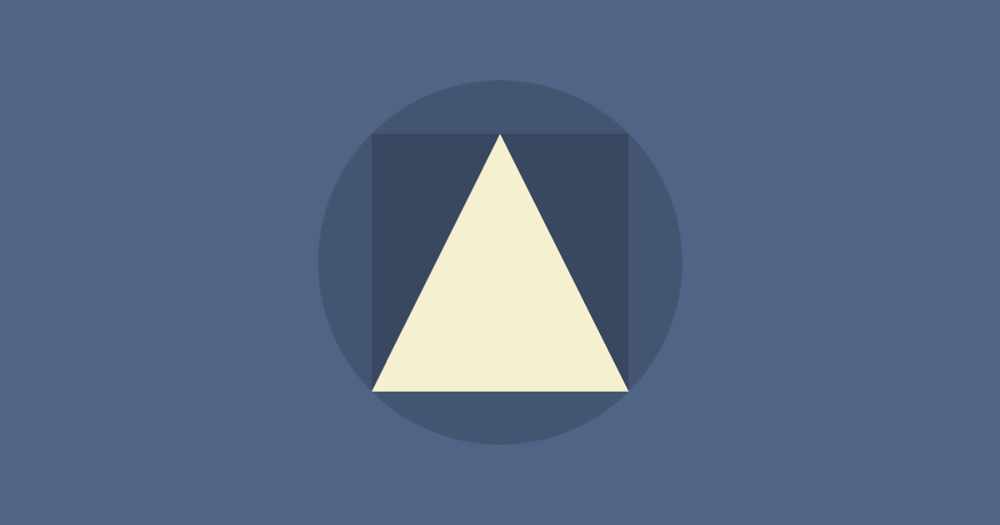

# 심미적 사용성 효과 (Aesthetic-Usability Effect)

> **"예쁜 디자인은 사용자를 관대하게 만든다."**

## 한줄 요약

사용자는 시각적으로 아름다운 인터페이스를 더 사용하기 쉽고, 오류도 덜 발생한다고 인식하는 경향이 있습니다.

## 무슨 법칙인가?

일본의 연구자 카츠마로 쿠로수(Kurosu)와 카시미르 쿠로카와(Kashimura)가 1995년 ATM 사용성 실험에서 처음 발견한 현상입니다. 연구진은 같은 기능을 가진 ATM 인터페이스를 두 가지 버전으로 만들었는데, 하나는 시각적으로 정돈되고 매력적인 디자인, 다른 하나는 기능적이지만 시각적으로 투박한 디자인이었습니다. 결과가 놀라웠습니다. 사용자들은 예쁜 디자인의 ATM이 **기능적으로도 더 뛰어나다**고 평가했습니다. 두 ATM은 완전히 같은 기능을 가졌는데도 말이죠.

이후 이스라엘의 노암 트라흐텐버그(Noam Tractinsky)가 이 실험을 재현했고, 문화권이 바뀌어도 결과는 동일했습니다. 미적 아름다움이 사용성 인식에 미치는 영향은 보편적인 현상이라는 뜻입니다.

심리학적으로는 **할로 효과(Halo Effect)** 로 설명할 수 있습니다. 어떤 대상의 한 가지 긍정적 특성(여기서는 '아름다움')이 다른 특성(사용성, 신뢰성, 기능성)에 대한 평가까지 긍정적으로 끌어올리는 현상입니다. 반대로, 실제로는 사용성에 문제가 있어도 예쁜 디자인 덕분에 사용자가 그 문제를 너그럽게 넘어가거나 아예 눈치채지 못하는 경우도 생깁니다.

## 실무에서 어떻게 쓰이나?

### 1. Apple의 제품 생태계

Apple이 디자인에 막대한 투자를 하는 이유가 단순히 '예쁘니까'가 아닙니다. 깔끔하고 일관된 시각 언어는 사용자가 제품을 더 직관적으로 느끼게 만듭니다. iPhone의 설정 앱을 떠올려 보세요. 계층 구조가 복잡한데도 시각적 정돈 덕분에 사용자는 '찾기 쉽다'고 느낍니다.

### 2. Stripe의 결제 페이지

개발자 결제 플랫폼 Stripe는 결제 UX의 정석으로 꼽힙니다. 미묘한 그라데이션, 정교한 타이포그래피, 부드러운 애니메이션. 이 시각적 디테일이 사용자에게 "이 서비스는 믿을 수 있다"는 인상을 줍니다. 실제로 결제 완료율(Conversion Rate)이 업계 평균을 크게 웃돕니다.

### 3. 에러 메시지의 디자인

재미있는 점은, 예쁜 인터페이스에서 에러가 발생했을 때 사용자가 **자신의 실수**로 돌리는 경향이 있다는 것입니다. 반면 투박한 인터페이스에서는 같은 에러가 발생해도 **시스템의 문제**로 돌립니다. 마음에 드는 디자인에는 관대해지는 것이죠.

## 코난쌤의 한줄 코멘트

AI 도구를 활용해 프레젠테이션이나 교육 자료를 만들 때, 내용이 아무리 훌륭해도 디자인이 투박하면 전달력이 떨어집니다. ChatGPT로 텍스트를 생성하고, 디자인 도구로 시각적 완성도를 높이는 워크플로우를 추천합니다. 학생들에게 AI 리포트를 제출할 때도 "내용+디자인"을 함께 평가하면 더 나은 결과물이 나옵니다.

## 더 읽어볼 거리

- [인지 부하 (Cognitive Load)](./05-cognitive-load.md) — 아름다운 디자인이 인지 부하를 줄여주는 이유
- [힉의 법칙 (Hick's Law)](./10-hicks-law.md) — 선택지가 많을 때 시각적 정돈이 주는 효과
- [도허티 임계값 (Doherty Threshold)](./06-doherty-threshold.md) — 빠른 반응속도가 주는 긍정적 인상

[← Laws of UX 전체 목록으로 돌아가기](./index.md)
