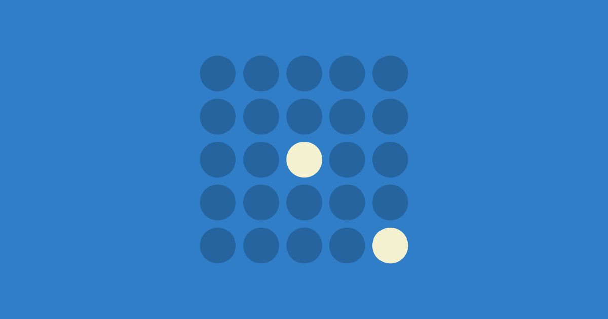

# 피크-엔드 룰 (Peak-End Rule)

> **"경험 전체를 기억하지 않는다. 가장 강렬했던 순간과 마지막 순간만 기억한다."**

## 한줄 요약

사람은 경험의 전체 합이 아니라 **가장 강렬했던 순간(피크)** 과 **마지막 순간(엔드)** 만 기억합니다. 이 두 가지가 전체 경험에 대한 평가를 좌우합니다.

## 무슨 법칙인가?

1993년, 노벨 경제학상 수상자 대니얼 카너먼(Daniel Kahneman)과 동료들은 실험 하나로 인간의 기억 메커니즘을 뒤집었다. 실험 참가자를 두 그룹으로 나누어, 한 그룹은 **60초간** 차가운 물(14°C)에 손을 담그게 했고, 다른 그룹은 **60초간 차가운 물 + 30초간 살짝 덜 차가운 물(15°C)** 에 담그게 했습니다. 객관적으로 보면 두 번째 그룹이 더 오래 고통을 겪었습니다. 90초 대 60초입니다.

하지만 실험이 끝나고 "둘 중 하나를 다시 선택하라"고 했을 때, **대다수가 90초 버전을 선택했습니다.** 고통의 총량이 아니라, 마지막 30초의 '덜 나쁜 느낌'이 전체 기억을 덮어쓴 것입니다. 카너먼은 이를 **'피크-엔드 룰(Peak-End Rule)'** 이라고 명명했습니다.

이 법칙의 작동 원리는 두 가지 인지 편향과 연결됩니다. 첫째, **기억 자체가 경험을 재생하는 것이 아니라 재구성한다**는 점입니다. 뇌는 경험을 비디오처럼 저장하지 않고, 하이라이트 장면(피크)과 엔딩 장면(엔드)만 스냅샷으로 찍어둡니다. 둘째, **지속 시간 무시(Duration Neglect)** 현상입니다. 경험의 길이가 기억에 거의 영향을 미치지 않습니다. 60초의 고통과 90초의 고통이 기억에서는 비슷하게 느껴집니다. 중요한 것은 '얼마나 오래'가 아니라 '가장 강렬했던 순간'과 '끝날 때의 느낌'입니다.

카너먼의 1996년 후속 연구에서는 대장내시경 검사 환자를 대상으로 같은 패턴을 확인했습니다. 검사 끝에 기구를 약간만 움직여 '덜 불편한' 상태로 1분을 추가한 그룹이, 정상적으로 바로 끝낸 그룹보다 **전체 검사 경험을 더 긍정적으로 평가**했습니다. 의학적으로 불필요한 1분이었지만, '덜 나쁜 끝'이 전체 기억을 개선한 것입니다.

UX에서 피크-엔드 룰의 시사점은 명확합니다. 모든 터치포인트를 동등하게 개선할 필요가 없습니다. **가장 강렬한 순간(피크)과 마지막 접점(엔드)** 에 집중 투자하는 것이 효율적입니다.

## 실무에서 어떻게 쓰이나?

### 1. 온보딩의 마지막 화면

새로운 앱에 가입하면 대개 3~5단계의 온보딩 과정을 거칩니다. 많은 서비스가 온보딩 마지막 화면을 대충 만듭니다. "시작하기" 버튼 하나 덜렁 놓는 식입니다. 하지만 피크-엔드 룰에 따르면, 온보딩의 마지막 화면이 전체 온보딩 경험의 평가를 결정합니다. Slack은 온보딩 마지막에 "🎉 첫 번째 채널에 메시지를 보내보세요!"라며 축하 애니메이션과 함께 명확한 첫 액션을 제시합니다. 마지막 인상이 긍정적이면, 앞선 약간의 마찰(초대장 입력, 프로필 설정 등)은 기억에서 희미해집니다.

### 2. 체크아웃 완료 페이지

결제가 완료되면 사용자는 해방감을 느낍니다. 이 순간이 쇼핑 경험의 '엔드'입니다. 이 페이지에 "주문이 완료되었습니다" 텍스트만 보여주면 낭비입니다. Shopify의 기본 완료 페이지는 주문 번호, 예상 배송일, 추적 링크, 관련 상품 추천을 함께 보여줍니다. Coupang은 결제 완료 화면에서 "rocket-delivery: 내일 도착"을 크게 표시합니다. 결제의 긴장감이 해소되는 동시에 기대감이 심어지는, 엔드의 정석 설계입니다.

### 3. 에러 복구 경험

에러 발생 자체가 부정적 피크입니다. 하지만 에러 복구 과정이 부드러우면, 부정적 피크가 오히려 긍정적으로 뒤집힐 수 있습니다. 2011년 Mailchimp의 사례가 유명합니다. 시스템 장애로 이메일 발송이 실패했을 때, Mailchimp는 단순한 에러 메시지가 아니라 재미있는 일러스트와 함께 "우리가 실수했습니다. 프레디(마스코트)가 고치고 있어요"라는 메시지를 보여줬습니다. 에러를 인정하고, 인간적으로 소통하고, 빠르게 복구하는 과정 자체가 새로운 긍정적 피크가 되었습니다. 사용자들은 불평 대신 소셜 미디어에 그 일러스트를 올렸습니다.

## 코난쌤의 한줄 코멘트

AI 교육 워크숍의 마지막 10분이 전체 평가를 결정합니다. "오늘 배운 걸로 이걸 만들었어!"라는 성취감으로 끝나는 수업과, "뭐가 뭔지 모르겠어요"로 끝나는 수업의 만족도 차이는 내용의 질보다 큽니다. 피크-엔드 룰은 "수업 설계는 마지막부터 거꾸로 하라"고 말합니다. 업무자동화 교육에서도, 마지막에 "이거 하나만 설정하면 내일부터 30분이 줄어듭니다"라는 구체적 성과를 보여주는 것이 전체 교육의 가치를 결정합니다.

## 더 읽어볼 거리

- [도허티 임계값 (Doherty Threshold)](./21-doherty-threshold.md) — 로딩 경험의 '끝'이 체감 속도에 미치는 영향
- [플로우 상태 (Flow)](./26-flow-state.md) — 몰입 경험의 '피크'를 만드는 조건
- [인지 편향 (Cognitive Bias)](./04-cognitive-bias.md) — 기억이 경험을 재구성하는 과정의 체계적 오류

[← Laws of UX 전체 목록으로 돌아가기](./index.md)
