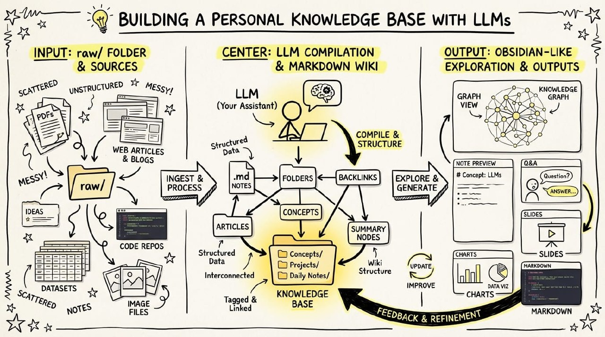

개인적으로 요즘 가장 흥미롭게 보는 흐름 중 하나는, **LLM을 코드 보조 도구가 아니라 지식 컴파일러로 쓰는 방식**입니다. 코드를 직접 많이 만지는 대신, 논문·아티클·리포지토리·데이터셋·이미지 같은 자료를 모아서 하나의 개인 지식 베이스로 정리하고, 그 위에서 다시 질문하고 확장해 가는 방식이죠.

핵심은 단순합니다. **원본 자료를 모은 뒤, LLM이 그것을 점점 더 잘 탐색 가능한 마크다운 위키로 바꾸고, 다시 그 위키가 이후의 질문과 연구를 더 똑똑하게 만드는 구조**입니다. 예전에는 이런 이야기를 하면 곧바로 RAG나 벡터DB를 떠올렸지만, 실제로는 일정 규모까지는 markdown 파일과 좋은 인덱싱 습관만으로도 꽤 멀리 갈 수 있습니다.

## 왜 이 방식이 강력할까

대부분의 사람은 LLM을 “질문하면 답을 주는 도구”로 먼저 접합니다. 하지만 연구나 학습을 꾸준히 하다 보면 진짜 병목은 답변 생성보다도 **맥락을 축적하고 재사용하는 일**에 있다는 걸 금방 느끼게 됩니다.

예를 들어 이런 문제가 반복됩니다.

- 지난주에 읽은 논문과 오늘 읽은 글이 어떻게 연결되는지 기억이 흐려진다.
- 비슷한 개념을 여러 문서에 중복 정리하게 된다.
- 흥미로운 자료를 모아두기만 하고 나중에 다시 활용하지 못한다.
- 질문할 때마다 LLM에게 같은 배경 설명을 반복하게 된다.

이때 개인 지식 베이스는 단순 저장소가 아니라, **질문이 쌓일수록 더 똑똑해지는 연구 환경**이 됩니다.

## 전체 구조: raw → wiki → Q&A → 산출물 → 다시 wiki

이 워크플로우는 크게 다섯 단계로 이해하면 쉽습니다.

### 1. 원본 자료를 raw 디렉토리에 모은다

먼저 연구 주제와 관련된 원본 자료를 모읍니다.

- 웹 아티클
- 논문 PDF
- GitHub 저장소
- 데이터셋 설명 문서
- 스크린샷과 도표 이미지
- 메모나 짧은 관찰 기록

중요한 점은 처음부터 너무 예쁘게 정리하려고 하지 않는 것입니다. 우선은 **잃어버리지 않게 잘 모으는 것**이 먼저입니다. 웹 아티클은 Obsidian Web Clipper로 markdown 형태로 가져오고, 관련 이미지는 로컬에 함께 저장해 두면 이후에 LLM이 훨씬 안정적으로 참조할 수 있습니다.

### 2. LLM이 raw 데이터를 markdown 위키로 “컴파일”한다

그다음부터가 진짜 핵심입니다. LLM이 raw 디렉토리를 읽고, 단순 요약을 넘어 **위키 구조 자체를 점진적으로 작성하고 유지**합니다.

예를 들어 다음과 같은 작업을 수행할 수 있습니다.

- 각 문서 요약 작성
- 주제별 분류
- 개념 문서 생성
- 문서 간 링크와 백링크 정리
- 인물, 모델, 방법론, 데이터셋별 색인 생성
- 같은 개념을 다르게 부르는 용어 통합

즉, LLM은 단발성 요약기가 아니라 **지식 편집자이자 문서 설계자** 역할을 하게 됩니다.

이 방식의 장점은 분명합니다. 사용자는 매번 구조를 손으로 설계하지 않아도 되고, 대신 LLM이 위키의 문서 집합을 계속 다듬으면서 탐색성과 연결성을 높여 갑니다.

## Obsidian이 좋은 이유

이런 구조를 운영할 때 Obsidian은 꽤 좋은 “프론트엔드”가 됩니다.

이유는 세 가지입니다.

### 첫째, 원본과 결과물을 같은 공간에서 볼 수 있다

raw 문서와 정제된 wiki 문서, 그리고 최종 산출물까지 같은 vault 안에서 함께 볼 수 있습니다. 연구 흔적이 분리되지 않기 때문에, 나중에 “이 결론이 어디서 나왔지?”를 역추적하기 쉽습니다.

### 둘째, markdown 기반이라 LLM이 다루기 쉽다

복잡한 전용 포맷보다 markdown 파일은 LLM이 읽고 쓰고 수정하기에 유리합니다. 구조가 명확하고, diff 관리도 쉽고, git과도 잘 맞습니다.

### 셋째, 출력 형태를 다양하게 확장하기 쉽다

질문의 결과를 단순 답변으로 끝내지 않고, 다음처럼 파일로 남길 수 있습니다.

- 요약 메모
- 비교 보고서
- Marp 슬라이드
- 차트 이미지
- 새로운 개념 문서
- FAQ 문서

이게 중요한 이유는, **한 번의 질문이 일회성 대화로 사라지지 않고 지식 베이스의 일부로 다시 편입되기 때문**입니다.

## RAG 없이도 어느 정도 되는 이유

많은 사람이 “문서가 수십 개만 넘어가도 결국 RAG가 필요하지 않나?”라고 묻습니다. 물론 규모가 더 커지면 검색 인프라가 필요해질 수 있습니다. 하지만 생각보다 꽤 긴 구간까지는, 잘 관리된 markdown 위키와 인덱스 파일만으로도 충분히 유의미한 성능이 나옵니다.

그 이유는 다음과 같습니다.

- LLM이 핵심 요약과 인덱스 문서를 스스로 유지할 수 있다.
- 관련 문서 후보를 좁히는 중간 문서를 만들 수 있다.
- 링크 구조가 곧 검색 힌트가 된다.
- 작은 규모에서는 전체 구조를 사람이 이해하기도 쉽다.

예를 들어 위키가 약 100개 문서, 40만 단어 수준이라면, 모델이 인덱스와 요약 노트를 기반으로 꽤 잘 탐색하는 경우가 많습니다. 이 구간에서는 “복잡한 인프라”보다 **좋은 문서 습관과 증분 업데이트 방식**이 더 중요할 수 있습니다.

## Q&A가 재미있어지는 순간

이 구조의 진짜 재미는 위키가 어느 정도 쌓인 뒤부터 시작됩니다. 그때부터는 단순 검색이 아니라, **축적된 문맥을 기반으로 한 복합 질문**이 가능해집니다.

예를 들어 이런 질문들이 가능해집니다.

- 최근 읽은 논문들 사이에서 반복적으로 등장하는 핵심 아이디어는 무엇인가?
- 특정 연구자의 주장과 다른 그룹의 접근은 어떻게 대비되는가?
- 이 주제의 발전 흐름을 초심자용 슬라이드로 설명해 달라.
- 아직 문서화되지 않았지만 새로 만들어야 할 개념 문서는 무엇인가?
- 이 위키 안에서 빠진 메타데이터나 불일치는 어디에 있는가?

즉, LLM은 단순 응답기가 아니라 **연구 보조자 + 편집자 + QA 엔진**처럼 행동하게 됩니다.

## 출력은 텍스트가 아니라 “파일”이 되는 게 좋다

이 워크플로우에서 특히 인상적인 부분은, 결과를 터미널 텍스트로만 보지 않는다는 점입니다.

질문 결과를 다음처럼 파일로 만들어 다시 저장하면 훨씬 강력해집니다.

- markdown 보고서
- Marp 슬라이드
- matplotlib 차트
- 비교표
- 읽기 가이드
- 다음 탐구 질문 목록

이렇게 되면 한 번의 탐색이 끝이 아니라, **다음 탐색의 출발점**이 됩니다. 질문이 쌓일수록 위키는 더 풍부해지고, 위키가 풍부해질수록 질문의 질도 높아집니다.

## LLM이 위키를 스스로 관리하게 할 때의 장점

직접 손으로 문서를 많이 편집하지 않아도 된다는 점도 큽니다. 사람은 구조를 자주 깨고, 일관성을 유지하기 어렵고, 귀찮아지면 메모가 쌓이기만 합니다. 반면 LLM은 다음 같은 유지보수 작업을 꽤 성실하게 수행할 수 있습니다.

- 문체와 형식 통일
- 중복 문서 탐지
- 빠진 링크 보완
- 분류 체계 업데이트
- 누락된 메타데이터 보강
- 새 문서 후보 제안

물론 완벽하지는 않습니다. 그래서 중요한 것은 “전권 위임”이 아니라 **건강검진 루프**를 넣는 것입니다.

## 위키 건강검진(health check) 아이디어

실제로 개인 지식 베이스를 운영할 때는 LLM에게 정기적으로 다음 작업을 맡길 수 있습니다.

### 데이터 무결성 점검
- 제목은 있는데 요약이 없는 문서 찾기
- 링크는 있는데 대상 문서가 없는 경우 찾기
- 같은 개념이 여러 이름으로 흩어진 경우 찾기

### 지식 확장 제안
- 자주 등장하지만 아직 문서가 없는 개념 찾기
- 두 문서군 사이의 연결 주제 제안
- 초보자용 입문 문서 후보 추천

### 외부 보강
- 빠진 메타데이터를 웹 검색으로 보완
- 논문 저자, 발표 연도, 코드 저장소 등 누락 정보 채우기

이런 식의 점검은 생각보다 가치가 큽니다. 개인 위키는 시간이 지나면 쉽게 낡고, 연결성이 무너지기 때문입니다.

## 추가 도구가 붙기 시작하는 순간

위키가 조금 커지면, 자연스럽게 보조 도구를 만들고 싶어집니다. 예를 들어 단순한 검색 엔진, CLI 기반 질의 도구, 태그 통계기, 그래프 생성기 같은 것들입니다.

흥미로운 건 이런 도구가 꼭 사람이 직접 쓰기 위한 것만은 아니라는 점입니다. 오히려 **다른 LLM 에이전트에게 넘겨줄 도구**로 더 유용해질 수 있습니다.

예를 들면,

- 위키 전용 검색 CLI
- 특정 문서군 비교 도구
- 메타데이터 일괄 보정 스크립트
- 시각화 생성기

이런 도구는 결국 “지식을 다루는 LLM의 손발”이 됩니다.

## 앞으로의 확장: synthetic data와 fine-tuning

이 흐름이 더 커지면 자연스럽게 다음 질문으로 넘어갑니다.

“이제는 컨텍스트로 매번 읽게 하지 말고, 이 지식을 모델 자체에 더 잘 스며들게 할 수 없을까?”

그래서 그다음 단계로는 이런 확장이 떠오릅니다.

- 위키를 기반으로 synthetic Q&A 생성
- 핵심 개념 간 관계 데이터셋 생성
- 특정 도메인 미세조정(fine-tuning)
- 작은 전용 모델 실험

물론 이 단계는 비용과 품질 관리 이슈가 커집니다. 하지만 최소한 방향성은 분명합니다. **잘 운영된 개인 지식 베이스는 단순 보관소를 넘어, 학습 데이터의 씨앗 역할**까지 할 수 있습니다.

## 이게 왜 제품이 될 수 있을까

여기서 중요한 통찰이 하나 있습니다. 지금 이 흐름은 대개 여러 스크립트와 도구를 억지로 이어 붙여 만든 “해키한 시스템”처럼 운영됩니다. 하지만 실제 사용자 가치로 보면, 이건 꽤 명확한 하나의 제품 문제를 가리킵니다.

필요한 것은 단순한 채팅창이 아니라,

- 자료 수집
- 자동 정리
- 위키 유지보수
- 질의응답
- 시각화 출력
- 건강검진
- 지식 재축적

이 전체를 자연스럽게 이어주는 **개인 연구 운영체제**에 가깝습니다.

특히 연구자, 콘텐츠 제작자, 기술 분석가, 교육자에게는 굉장히 매력적인 방향입니다. 코드를 몰라도 쓸 수 있고, 매번 새 프로젝트를 시작할 때마다 이전 지식이 버려지지 않기 때문입니다.

## 교육자와 콘텐츠 제작자에게 특히 유용한 이유

저는 이 구조가 특히 **교육자와 콘텐츠 제작자**에게 강력하다고 봅니다.

왜냐하면 이들은 늘 비슷한 문제를 안고 있기 때문입니다.

- 자료는 많지만 체계화가 어렵다.
- 비슷한 주제를 여러 채널에서 반복해서 다뤄야 한다.
- 초심자용 설명과 전문가용 정리를 동시에 해야 한다.
- 질문을 받을 때마다 기존 자료를 다시 뒤져야 한다.

개인 지식 베이스가 잘 구축되면, 하나의 주제를

- 블로그 글로 바꾸고
- 강의안으로 바꾸고
- 슬라이드로 바꾸고
- Q&A 문서로 바꾸고
- 다음 콘텐츠 아이디어로 연결하는

흐름이 훨씬 쉬워집니다.

## 정리

정리하면, 이 방식의 핵심은 LLM을 “답변 생성기”로만 쓰는 것이 아니라, **지식을 축적하고 연결하고 재가공하는 운영 파트너**로 쓰는 데 있습니다.

흐름은 아주 간단합니다.

1. 원본 자료를 모은다.
2. LLM이 markdown 위키로 정리한다.
3. Obsidian에서 보고, 묻고, 시각화한다.
4. 결과물을 다시 위키에 편입한다.
5. 정기적으로 무결성과 연결성을 점검한다.

이 구조가 좋은 이유는, 내가 공부하고 탐구한 흔적이 사라지지 않고 **계속 자산으로 누적된다는 점**입니다.

앞으로 LLM 시대의 개인 생산성 도구는 단순 채팅앱보다, 이런 식의 **지식 축적형 작업 환경**으로 더 빠르게 진화할 가능성이 큽니다.

## 이런 분께 추천합니다

- 논문과 아티클을 많이 읽는 연구자
- AI 트렌드를 정리하는 콘텐츠 제작자
- 강의 자료를 반복 재활용해야 하는 교육자
- 특정 도메인을 깊게 파고드는 개발자와 분석가
- “검색”보다 “축적”이 중요한 일을 하는 사람

## FAQ

### Q1. 벡터 데이터베이스 없이도 정말 가능한가요?
초기~중간 규모까지는 충분히 가능합니다. 특히 markdown 위키 구조, 인덱스 문서, 요약 노트가 잘 관리되면 생각보다 훨씬 오래 버팁니다. 다만 규모가 더 커지면 검색 인프라를 추가하는 편이 유리합니다.

### Q2. 사람이 직접 편집하지 않아도 괜찮을까요?
가능은 하지만, 완전 무감독보다는 주기적인 검토가 좋습니다. 특히 핵심 개념 문서나 외부 공개용 산출물은 사람이 마지막 품질 점검을 하는 편이 안전합니다.

### Q3. Obsidian이 꼭 필요할까요?
꼭 그렇지는 않습니다. 다만 markdown 기반 파일 구조를 잘 다루고, 원본·위키·산출물을 한 공간에서 보기 좋다는 점에서 Obsidian이 매우 잘 맞는 편입니다.

## 마무리

요즘은 “LLM으로 무엇을 자동화할까?”보다, **“LLM과 함께 어떤 지식 시스템을 운영할까?”**를 고민하는 쪽이 더 흥미롭게 느껴집니다.

지식을 잘 모으는 사람보다, 잘 연결하고 다시 꺼내 쓰는 사람이 훨씬 강해지는 시대가 오고 있습니다. 그런 점에서 개인 지식 베이스는 단순 메모장이 아니라, 앞으로의 연구와 창작을 위한 핵심 인프라가 될 가능성이 큽니다.
