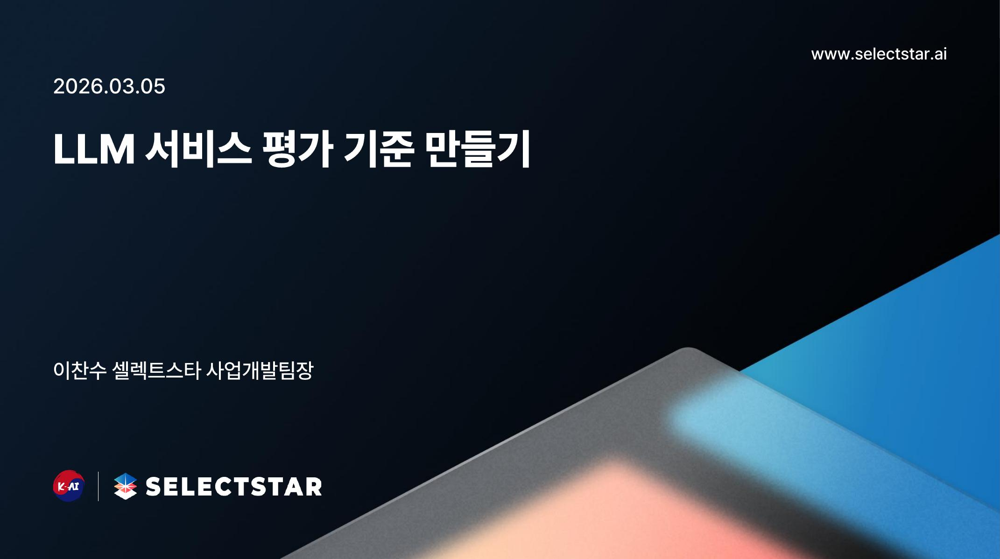
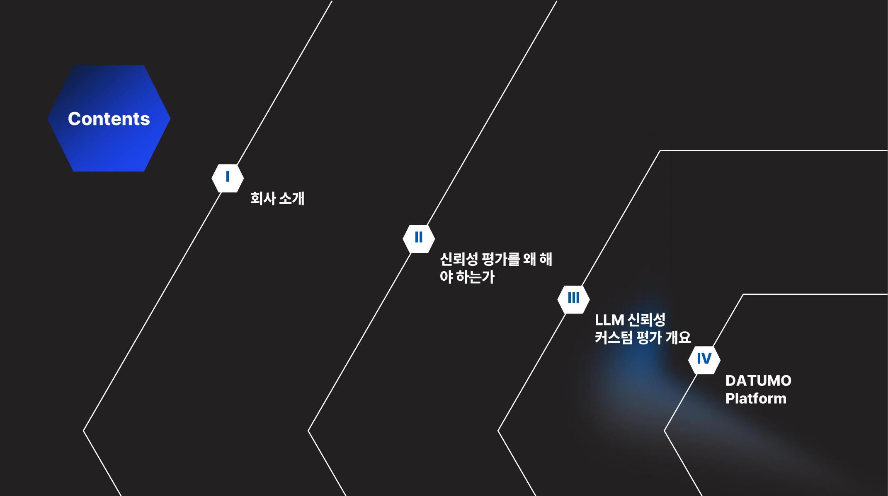

LLM 서비스를 실제로 운영해 보면, **모델 성능 자체보다 ‘평가 기준의 부재’가 더 큰 리스크**가 됩니다.  
이번 글은 아래 두 자료를 바탕으로, 현업에서 바로 적용할 수 있게 핵심만 정리한 내용입니다.

- 발표자료(PDF): <https://drive.google.com/file/d/1oZsGJ-PMKKalehnteYm1RXyRpjXS-iQt/view>
- 웨비나 영상: <https://www.youtube.com/live/_RoG8rAIbDQ?si=WC-A-9Mx4-TQzgJF>

## 왜 ‘LLM 평가’가 먼저인가?

LLM 프로젝트는 보통 이렇게 실패합니다.

1. 모델은 잘 답하는데, 서비스 목적과 맞지 않음
2. 출시 기준이 모호해서 품질 논쟁이 반복됨
3. 운영 중 품질 저하(드리프트)를 조기에 못 잡음

핵심은 간단합니다.  
**“좋은 답변”을 먼저 정의하지 않으면, 측정도 개선도 불가능**합니다.

## 평가 설계 4단계 (실무형)

### 1) 서비스 목적을 문장으로 고정

예:  
- “고객 질문에 정확하고 정책에 맞는 답변 제공”  
- “RAG 기반으로 근거 문서에 충실한 안내 제공”

이 문장이 지표의 출발점입니다.

### 2) 평가 축(차원) 정하기

실무에서 자주 쓰는 축은 다음과 같습니다.

- **정확성**: 사실 오류가 없는가
- **근거 충실도(Faithfulness)**: 제공 문서/컨텍스트를 벗어나지 않는가
- **적합성/관련성**: 질문 의도에 맞는가
- **정책 준수**: 금칙어·톤앤매너·컴플라이언스 준수 여부
- **유용성**: 사용자가 실제 행동할 수 있는 답변인가

### 3) 루브릭(Rubric)으로 평가 기준 명문화

정성 평가를 줄이려면 루브릭이 필수입니다. 예시:

- 5점: 질문 의도 정확히 파악, 근거 명확, 실행 가능한 답변
- 3점: 대체로 맞지만 근거/맥락 반영이 약함
- 1점: 질문과 무관하거나 사실 오류 포함

이렇게 써두면 평가자·팀·부서가 같은 기준으로 이야기할 수 있습니다.

### 4) 출시 기준(Go/No-Go) 수치화

예시 기준:

- 핵심 시나리오 평균 4.2점 이상
- 정책 위반률 1% 미만
- 치명 오류(고객 오도) 0건

이 기준을 통과해야 배포한다는 원칙을 세우면, 감(感)이 아닌 데이터로 의사결정이 가능합니다.

## RAG/챗봇 서비스에서 특히 중요한 체크포인트

- **근거 문서 선택 정확도**: 올바른 문서/청크를 가져왔는가
- **환각(Hallucination) 통제**: 없는 사실을 만들지 않는가
- **프롬프트·검색 파이프라인 분리 평가**: 문제 원인(검색/생성)을 분해해서 봐야 개선이 빠름
- **실패 케이스 저장소**: 틀린 질문을 재평가 세트로 누적 관리

## 운영 단계: 자동화 없이는 유지가 어렵다

평가는 1회성 테스트가 아니라 운영 체계여야 합니다.

- 주간/월간 배치 평가
- 버전별 성능 비교(모델/프롬프트/검색기)
- 경고 임계치 설정(급락 시 롤백/차단)
- 리포트 자동 생성

즉, **평가 자동화 = 서비스 신뢰성의 안전장치**입니다.

## 교육·공공·기업 현장에 적용할 때의 팁

1. 처음부터 지표를 많이 두지 말고 3~5개 핵심 지표로 시작
2. “정확성” 하나로 뭉뚱그리지 말고, 업무 맥락(정책·친절도·행동가능성)으로 분해
3. 모델 교체보다 먼저 평가셋과 루브릭을 정교화
4. 회의에서 쓰는 문서(운영 기준서)와 평가 기준을 동일화

## 자료 스냅샷

발표자료 일부 페이지를 참고 이미지로 첨부합니다.

## 한 줄 결론

LLM 서비스 품질은 모델이 아니라 **평가 체계**가 결정합니다.  
목적-지표-루브릭-출시기준-자동화, 이 5가지를 먼저 고정하면 도입 속도와 신뢰성을 동시에 잡을 수 있습니다.

---

### 함께 보면 좋은 원문
- 발표자료(PDF): <https://drive.google.com/file/d/1oZsGJ-PMKKalehnteYm1RXyRpjXS-iQt/view>
- 웨비나 영상: <https://www.youtube.com/live/_RoG8rAIbDQ?si=WC-A-9Mx4-TQzgJF>
