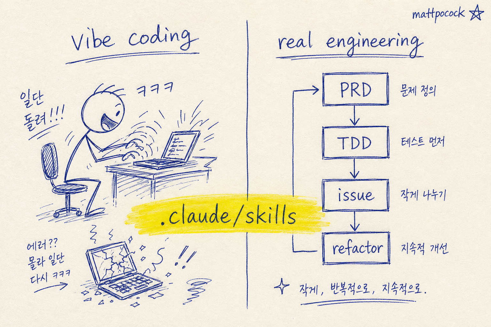

오늘자 깃허브 트렌딩 1위가 좀 의외임. 새로 나온 모델도 아니고 무슨 프레임워크도 아님. 그냥 한 사람이 "내가 매일 쓰는 클로드 스킬 폴더 그대로 던질게"라고 올린 레포임. 하루 만에 별 5,500개가 붙음.

1. 이름은 mattpocock/skills임. 정식 제목은 "Agent Skills For Real Engineers". 부제가 "Straight from my .claude directory"임. 본인 노트북에 깔려 있는 클로드 코드 스킬 폴더를 그대로 공개했다는 뜻임.

2. 만든 사람은 Matt Pocock. TypeScript 쪽에서 꽤 알려진 인물임. Total TypeScript라는 유료 강의 운영하고, AI Hero라는 뉴스레터로 6만 명한테 매주 글 보냄. 이번 레포의 README도 끝에 "내 뉴스레터 구독해라"가 박혀 있음.

3. 메시지가 단호함. "Real engineering — not vibe coding". 분위기 타서 LLM한테 던지고 결과 받아 쓰는 식 말고, 제대로 된 엔지니어링을 하라는 거임. 그래서 이름도 그냥 skills가 아니라 "real engineers"용 skills임.

4. 스킬은 22개고 4개 카테고리로 나뉨. Planning & Design 5개, Development 5개, Tooling & Setup 2개, Writing & Knowledge 4개, 그리고 카테고리 안 잡힌 도메인 모델·QA·줌아웃 같은 6개. 하나하나가 클로드 코드 스킬 형식(SKILL.md + 리소스 파일)으로 들어 있음.

5. 가장 흥미로운 건 첫 번째 카테고리 Planning & Design임. "코딩 시키기 전에 생각부터 시키는 스킬"임. `to-prd`는 지금까지 채팅한 맥락을 PRD 문서로 정리해서 깃허브 이슈로 올림. `to-issues`는 큰 계획을 작은 수직 단위 이슈로 쪼갬. 코딩 에이전트가 일을 잘하려면 일을 잘게 나눠줘야 한다는 걸 인정하는 스킬임.

6. 그중 `grill-me`가 백미임. "내 계획을 끝까지 추궁해라"는 스킬임. 결정 트리의 모든 분기가 풀릴 때까지 사정없이 인터뷰함. 사람이 LLM한테 "내 아이디어 어때"라고 물으면 칭찬만 받기 십상인데, 이 스킬은 그 반대 방향으로 작동함. 본인 계획이 얼마나 빈약한지 강제로 직면하게 만듦.

7. Development 카테고리는 더 단단함. `tdd`는 빨강-초록-리팩토링 사이클을 그대로 강제하는 스킬임. 기능이든 버그 수정이든 한 번에 한 수직 단위씩만. `triage-issue`는 버그 받으면 코드베이스 탐색해서 근본 원인 찾고, TDD 기반 수정 계획을 깃허브 이슈로 정리해서 올림. 한마디로 "수석 개발자의 디버깅 루틴"을 코드화한 거임.

8. `improve-codebase-architecture`는 더 흥미로움. 코드베이스의 "deepening opportunities"를 찾는다고 표현함. CONTEXT.md에 정의된 도메인 언어와 docs/adr/(아키텍처 결정 기록)에 적힌 결정들을 같이 읽어서, 어디를 더 깊게 다듬을지 판단함. DDD 책 좀 읽어본 사람의 손맛이 보임.

9. Tooling 카테고리에는 `git-guardrails-claude-code`가 있음. 클로드 코드한테 `git push --force`나 `reset --hard`, `clean -fd` 같은 위험한 git 명령을 실행 못 하게 PreToolUse 훅으로 차단함. 이거 한 번이라도 사고 친 사람이면 무조건 깔게 되는 그런 스킬임.

10. Writing & Knowledge 카테고리도 톤이 다름. `write-a-skill`은 새 스킬을 만드는 스킬임. 점진적 정보 공개(progressive disclosure)와 번들 리소스 구조까지 챙겨서 만들어줌. 메타 스킬임. `edit-article`은 글 다듬기, `ubiquitous-language`는 대화에서 DDD 식 용어집 추출, `obsidian-vault`는 옵시디언 볼트 검색·정리. 글 쓰는 사람도 같이 챙기는 구성임.

11. 설치는 한 줄임. 본인 레포에서 만든 `npx skills@latest add <repo-path>` CLI로 끝남. 예를 들어 `npx skills@latest add mattpocock/skills/tdd` 치면 그 스킬 하나만 내 `.claude/skills/`로 들어옴. 22개 다 가져올 필요 없이 마음에 드는 것만 골라서 깔면 됨.

12. 한국 개발자한테 인사이트는 두 가지임. 첫째, 클로드 코드 스킬은 "에이전트한테 한 번 가르치고 평생 쓰는 사내 절차서"에 가까움. 한국 회사도 이걸 깔면 신입이 들어와도 같은 품질로 일함. 둘째, mattpocock가 보여주듯 본인 워크플로를 스킬 형태로 묶어 공개하면 그게 곧 개인 브랜드가 됨. 코드 한 줄이 별 27,700개를 모으는 시대임.

13. 한 가지 한계는 영어 기준이라는 점임. PRD든 이슈든 다 영어로 만들어짐. 한국 회사라면 `to-prd`의 SKILL.md를 살짝 손봐서 출력 언어를 한국어로 바꾸는 것도 좋은 시작임. 어차피 스킬은 마크다운이라 직접 수정 가능함.

14. 정리하면, mattpocock/skills는 "한 명의 시니어가 본인 작업방식을 스킬로 정제해서 공개한 사례"임. 신선한 점은 모델이 아니라 워크플로가 자산이라는 사실을 보여준 거임. 코딩 에이전트 시대에는 어떤 모델을 쓰냐보다 어떤 절차로 부르냐가 더 중요해질지도 모름. 본인이 일 잘하는 사람일수록 이런 스킬 모음이 점점 자기 무기가 될 거임.

---

**참고 자료**

- GitHub: [mattpocock/skills](https://github.com/mattpocock/skills) (★ 27,702 / 오늘 +5,551)
- AI Hero 뉴스레터: [aihero.dev/s/skills-newsletter](https://www.aihero.dev/s/skills-newsletter)
- 설치: `npx skills@latest add mattpocock/skills/<skill-name>`

---

**같이 보면 좋은 글**
- [[tradingagents-multi-agent-trading-llm-2026-04-28|TradingAgents — LLM 9명이 주식 분석하는 멀티에이전트 오픈소스]]
- [[awesome-codex-skills-composio-2026-04-26|Codex CLI Skill 생태계 — ComposioHQ awesome 리스트]]
- [[cmux-yc-s24-terminal-ai-agents-2026-04-26|cmux — AI 에이전트 100개 돌리는 터미널]]
