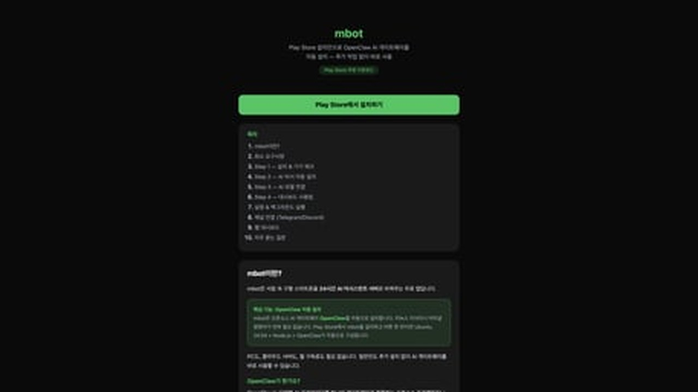
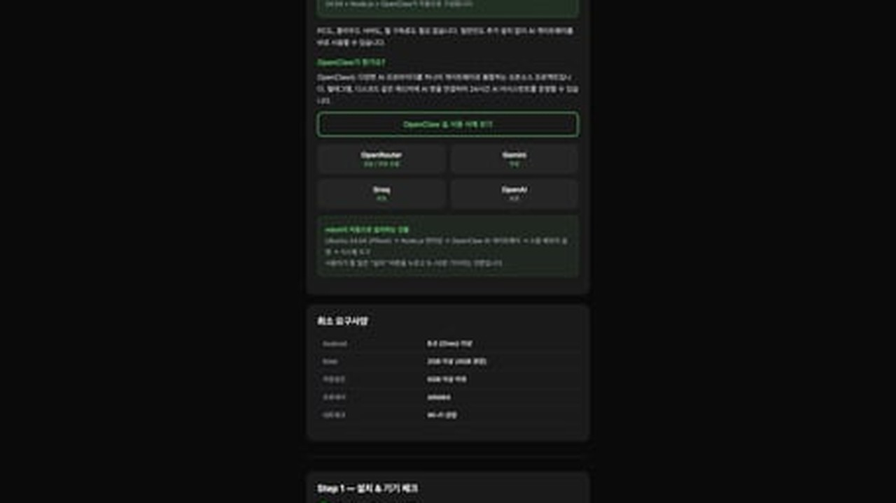
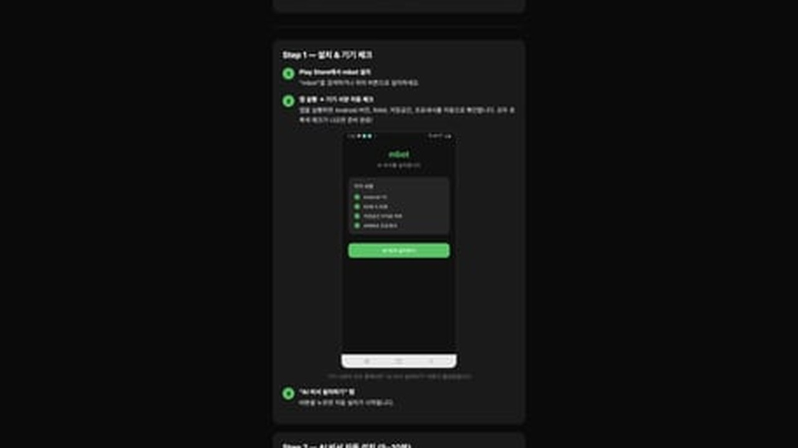
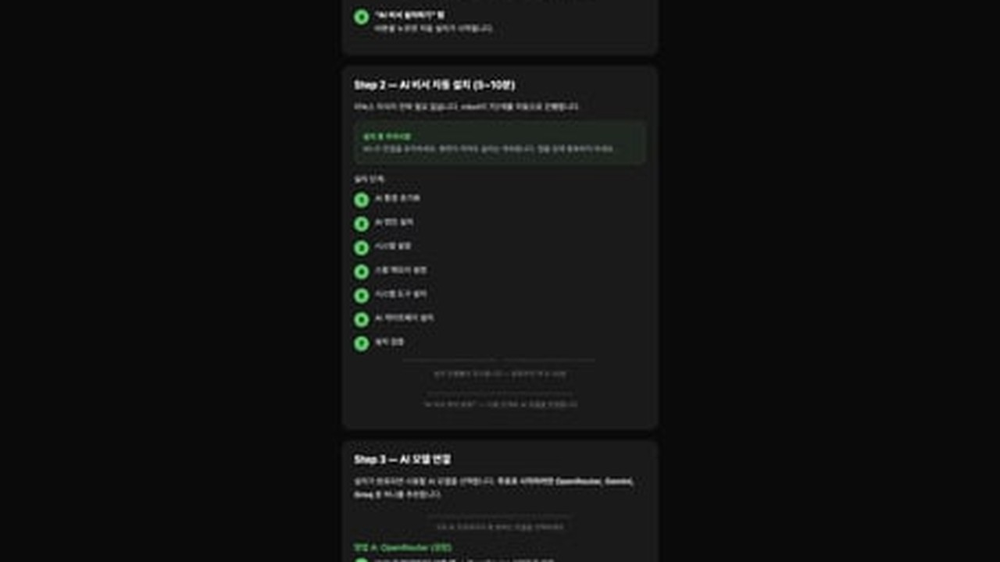
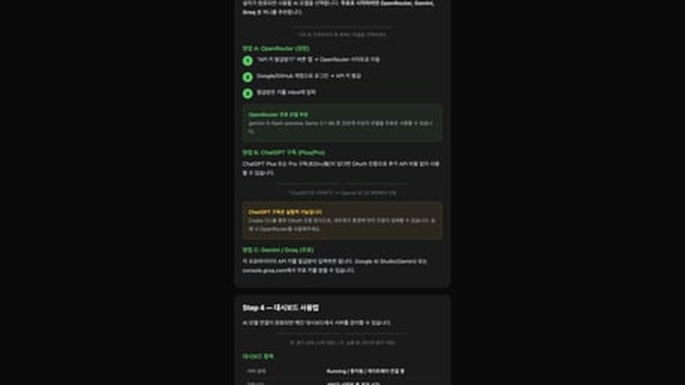
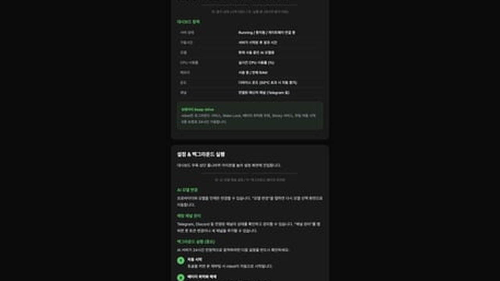
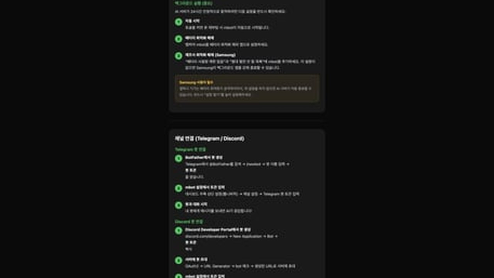
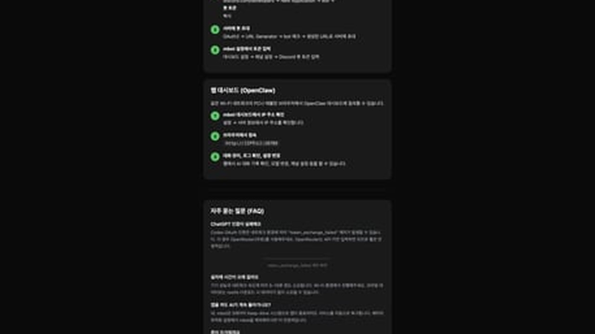

> 원문 가이드: https://pocket-server-palank.web.app/mbot-guide.html

mbot은 **서랍 속 안드로이드폰을 24시간 AI 어시스턴트 서버로 전환**하는 무료 앱입니다.  
핵심은 복잡한 터미널 작업 없이 **OpenClaw를 자동 설치**해 준다는 점입니다.

## mbot이 해결하는 문제

- 리눅스/서버 지식 없이도 AI 게이트웨이 운영 가능
- PC나 별도 클라우드 비용 없이 스마트폰으로 상시 가동
- Telegram/Discord 같은 메신저 봇 연결까지 한 흐름으로 구성

## 핵심 기능 요약

- Ubuntu 24.04(PRoot), Node.js, OpenClaw 자동 설치
- 스왑 메모리/시스템 도구 자동 구성
- 대시보드에서 상태/온도/메모리/가동시간 확인
- 5레이어 Keep-Alive로 백그라운드 안정성 강화

## 최소 요구사양

- Android 8.0+
- RAM 2GB 이상(4GB 권장)
- 저장공간 5GB 이상
- ARM64, Wi-Fi 권장

## 설치 플로우 (요약)

1. Play Store에서 mbot 설치
2. 앱 실행 후 기기 사양 자동 점검
3. "AI 비서 설치하기" 실행 (약 5~10분)
4. OpenRouter/Gemini/Groq/OpenAI 중 모델 연결
5. Telegram 또는 Discord 채널 연동

## 16:9 분할 썸네일 모음

긴 페이지를 한 장으로 넣으면 가독성이 떨어져서, **16:9 비율로 분할**한 이미지를 함께 정리했습니다.

## 이런 분께 추천

- 예전 안드로이드폰을 재활용하고 싶은 분
- OpenClaw를 빠르게 체험하고 싶은 분
- 메신저 기반 AI 어시스턴트(텔레그램/디스코드)를 개인용으로 운용하려는 분

## 한 줄 결론

**mbot은 “설치 난이도”를 크게 낮춘 OpenClaw 온보딩 앱**입니다.  
초기 진입장벽 때문에 미뤄왔던 분이라면, 가장 빠르게 시작할 수 있는 방법입니다.
